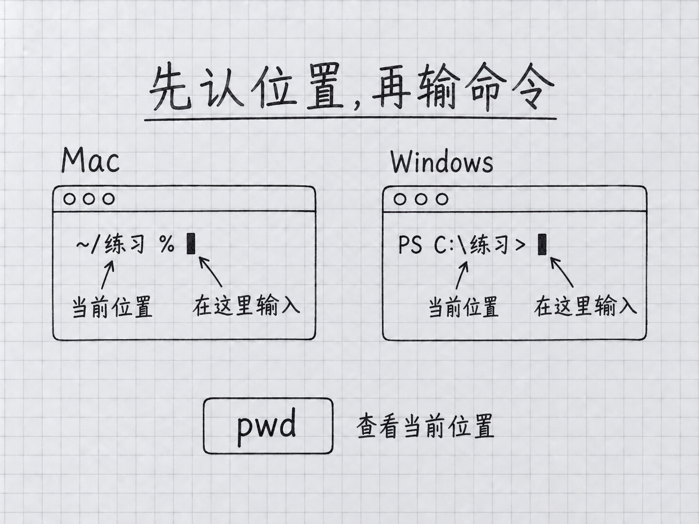

<a id="第-1-章先把电脑准备好"></a>
# 第 1 章：先把電腦準備好

> **本章在全書的位置**：第一部分 · 第 1 章 / 預估閱讀+動手時長：**主線 40-50 分鐘 + 支線 15-20 分鐘**
>
> **學完能做什麼（主線）**：獨立開啟終端、看懂提示符、用 `pwd` / `ls` / `cd` 在資料夾間穿梭、理解"路徑"、讀懂三個常見報錯。這些是後面所有章節的前提。

---

<a id="开场三问"></a>
## 開場三問

- **你會遇到什麼問題**：下一章就要用終端裝 Claude Code——連終端都沒開啟過的話，那一章會變噩夢。
- **不讀這章會踩什麼坑**：看到 `$` `%` `>` 這些符號不知道幹什麼；看到"請 cd 到你的工作資料夾"手足無措；看到 `command not found` 慌。
- **讀完你會多會什麼事**：像切換微信和瀏覽器那樣自然地在終端裡進出資料夾、看看裡面有啥。

⚠️ **本章適用"顆粒度最細"原則**——主線每一步都會寫出來，包括"按回車"這種級別。真零基礎請**逐字跟著做**。

<a id="本章地图一眼看全貌"></a>
### 本章地圖（一眼看全貌）

本章圖解：[先認位置，再輸命令](#13-第一次使用看懂提示符输入-pwd)。

---

> 🎯 **【主線】—— 本章必讀核心**
>
> 下面 6 節 + 動手任務，讓你從"沒見過終端"走到"能在終端裡自由行走"。預估 40-50 分鐘。

---

<a id="11-认识终端"></a>
## 1.1 認識終端

平時你用滑鼠點圖示、開啟微信、用 Word——這叫**圖形介面**。圖形介面很直觀，但有個缺點：**只能做軟體作者做好的功能**。

**終端**（terminal）是另一種和電腦打交道的方式——一個**只能打字的視窗**。你在裡面一行一行打命令，電腦一條一條回覆你。這樣你能讓電腦幹很多圖形介面裡做不到的事，比如"把這個資料夾裡所有 PDF 的檔名前加上今天的日期"、"統計這 30 個表格裡'已付款'的條數"——這些事圖形介面要麼做不了，要麼得點幾百下。

> 💡 **生活化比喻**：圖形介面像外賣 App（選單有什麼你點什麼），終端像直接跟後廚說話（你說啥他給你做啥）。Claude Code 就是後廚裡那位能聽懂你自然語言的大廚——**所以它只能住在終端裡**。不學會開啟終端，就沒法用 Claude Code。

**好訊息**：本書**只需要你學 5-6 個最基礎的命令**，就能走完所有章節。你不需要成為命令列專家。

**兩個平臺的終端叫什麼名字**：

| 平臺 | 名字 | 裡面跑什麼 |
|------|-----|----------|
| **Mac** | 終端（Terminal），系統自帶 | 新系統用 zsh，老系統用 bash（對使用者沒區別） |
| **Windows** | **Windows Terminal**（新版系統），或直接用 **PowerShell**（老版系統） | 都跑 PowerShell 命令語言 |

兩個平臺的終端外觀不同、少數命令有差異，但**概念完全一樣**。本書涉及平臺差異時會分段講。

<a id="12-打开你的终端"></a>
## 1.2 開啟你的終端

<a id="mac-用户"></a>
### Mac 使用者

**步驟 1**：按住 `Command` 鍵（⌘，空格鍵左邊），再按**空格鍵**。

**你會看到**：螢幕中央彈出一個搜尋框。這是 **聚焦搜尋**（Spotlight）——Mac 自帶的快速搜尋工具。

**步驟 2**：搜尋框裡打"**終端**"或英文 `Terminal`。

**步驟 3**：按**回車鍵**。

**你會看到**：彈出一個視窗——通常白色底黑色字（也可能反過來，看系統主題）。第一行類似：

```
Last login: Sat Apr 19 14:32:10 on ttys000
你的名字@你的电脑名字 ~ %
```

👆 **這就是終端**。末尾那個 `%` 符號（或 `$`，看系統版本）後面有一個閃爍的游標——它在等你打字。

💡 **還有別的開啟方式 / 想把圖示固定到 Dock**？見本章末尾 🌿 支線 1.A。

<a id="windows-用户"></a>
### Windows 使用者

Windows 要先分清自己的版本。按 `Windows 键 + R`，彈出"執行"小視窗，打 `winver` 回車——會彈窗告訴你 Windows 版本。

**步驟 1**：按鍵盤左下角的 **Windows 鍵**（有 Windows 圖示那個鍵），或點螢幕左下角的開始按鈕。

**步驟 2**：
- **Win11 / 新版 Win10**：打 `terminal` 或 `终端`
- **老版 Win10**（搜不到 terminal）：打 `powershell`

**步驟 3**：點選搜尋結果裡的 **Windows Terminal**（或 **Windows PowerShell**）。

**你會看到**：彈出一個深藍或黑色視窗，內容類似：

```
PS C:\Users\你的名字>
```

👆 前面 `PS` 是 **PowerShell** 的縮寫。末尾的 `>` 是提示符。

📌 **本書後面所有 Windows 操作都在 PowerShell 裡進行**（不管是 Windows Terminal 裡的 PowerShell 還是直接開啟的 PowerShell）。

⚠️ **千萬別用"命令提示符"（cmd.exe）**：Windows 還有一個更老的終端叫"命令提示符"，標題欄寫"命令提示符"或"cmd"。它的命令和 PowerShell 不一樣，**本書不覆蓋**。如果你不小心開了它，關掉重新開 PowerShell 或 Windows Terminal。

<a id="13-第一次使用看懂提示符输入-pwd"></a>
## 1.3 第一次使用：看懂提示符，輸入 `pwd`


<!-- diagram: FIG-003 -->


*圖：先認清當前目錄和輸入位置，再輸入命令；平臺提示符可能不同。*
<!-- /diagram: FIG-003 -->

<a id="认识提示符"></a>
### 認識提示符

開啟終端後，每一行末尾都有一段類似這樣的文字——**提示符**（prompt）：

- **Mac（新系統）**：`你的名字@你的电脑 ~ %`
- **Mac（老系統）**：`你的名字@你的电脑 ~ $`
- **Windows PowerShell**：`PS C:\Users\你的名字>`

提示符告訴你"**輪到你打字了**"。

📌 **關鍵就一條**：**末尾那個符號**（`%` 或 `$` 或 `>`）**後面的游標位置，就是你該打字的地方**。不要打到前面的文字裡去，也不要動前面已經顯示的內容。

💡 **想知道提示符每一段分別是什麼意思**？見 🌿 支線 1.C。

<a id="输入你的第一个命令pwd"></a>
### 輸入你的第一個命令：`pwd`

**步驟 1**：確認游標在提示符後面閃。
**步驟 2**：一個字一個字打 `pwd`（全小寫）。
**步驟 3**：按**回車鍵**。

**你會看到**：

- Mac 顯示：`/Users/你的名字`
- Windows 顯示：`C:\Users\你的名字`

<a id="这是什么意思"></a>
### 這是什麼意思

`pwd` 是 "**print working directory**" 的縮寫，意思是 **"列印當前所在資料夾"**。

終端剛開啟時預設把你放在 **家目錄**（home directory）裡——也就是 `/Users/你的名字`（Mac）或 `C:\Users\你的名字`（Windows）。你的桌面、下載、文件都在家目錄下面。

> 💡 **為什麼一上來就要知道"我在哪"**：你後面所有命令都是**相對於當前位置**起作用的。"列出這裡的檔案"的"這裡"就是 `pwd` 返回的那個地方。每次做事前打一下 `pwd` 確認位置，是個好習慣。

<a id="14-在文件夹间穿梭ls-和-cd"></a>
## 1.4 在資料夾間穿梭：`ls` 和 `cd`

這兩個命令一起用——`ls` 看當前資料夾裡有什麼，`cd` 進入/離開資料夾。

<a id="ls-列出当前文件夹里的东西"></a>
### `ls` ——列出當前資料夾裡的東西

打 `ls`，按回車。

**Mac 你會看到**（一行或幾行簡潔列表）：

```
Desktop    Documents    Downloads    Music    Pictures    ...
```

**Windows PowerShell 你會看到**（帶列的表格）：

```
Mode    LastWriteTime    Length    Name
d-----  2026/4/10 14:00            Desktop
d-----  2026/4/10 14:00            Documents
```

> 左邊 `Mode` 列裡有 `d` 就是**資料夾**，沒 `d` 就是檔案。

`ls` 是 "**list**"（列出）的縮寫。Windows 也可以用 `dir`（效果相同），但**本書統一用 `ls`**，兩平臺都認。

💡 **想看隱藏檔案？想看檔案大小？** 見 🌿 支線 1.B。

<a id="cd-进入--离开文件夹"></a>
### `cd` ——進入 / 離開資料夾

`cd` 是 "**change directory**"（切換資料夾）的縮寫。三種用法：

**① 進入某個子資料夾**

```
cd Desktop
```

（`cd` 和 `Desktop` 之間**必須有空格**；Mac 大小寫敏感，`desktop` 進不去桌面）

按回車後，提示符會變——末尾出現你剛進的資料夾名。再打 `ls` 就是桌面裡的東西了。

**② 退回上一層**

```
cd ..
```

（`cd` 和 `..` 之間**有空格**）

`..` 是 **"上一層資料夾"** 的符號，兩平臺都一樣。

**③ 一步回家**

```
cd ~
```

或直接 `cd` 什麼都不帶。**無論你在哪**，都能一步跳回家目錄。

💡 **一次跳好幾層 / 路徑裡有空格怎麼辦**？見 🌿 支線 1.B。

<a id="15-理解路径"></a>
## 1.5 理解"路徑"

`pwd` 返回的 `/Users/你的名字` 或 `C:\Users\你的名字`——這種東西叫 **路徑**（path）。

**路徑就是檔案或資料夾在電腦裡的地址寫法**。就像"北京市海淀區中關村大街 1 號"是一個地址，`/Users/小明/Desktop/笔记.txt` 也是一個地址，表示"**小明的家目錄裡、桌面裡、叫筆記.txt 的那個檔案**"。

<a id="绝对路径-vs-相对路径"></a>
### 絕對路徑 vs 相對路徑

路徑有兩種寫法：

| 型別 | 特徵 | 例子 | 什麼時候用 |
|------|-----|------|----------|
| **絕對路徑** | 從最頂層開始寫（Mac 以 `/` 開頭，Windows 以 `C:\`）；**不管當前在哪都能找到** | `/Users/小明/Desktop/笔记.txt`、`C:\Users\小明\Desktop\笔记.txt` | 告訴 Claude Code 在哪操作、寫自動化指令碼時——**更保險** |
| **相對路徑** | 從當前位置開始寫 | `Desktop/笔记.txt`（相對於家目錄）、`../其他` | 手打命令時——**更省力** |

<a id="三个必须认识的路径符号"></a>
### 三個必須認識的路徑符號

這三個符號在路徑裡經常出現，一定要認識：

| 符號 | 含義 | 例子 |
|-----|-----|-----|
| `~` | **家目錄** | `~/Desktop` = 你的桌面（不管當前在哪） |
| `.` | **當前資料夾** | `./笔记.txt` = 當前位置裡的筆記.txt |
| `..` | **上一層資料夾** | `../其他文件夹` |

💡 **Mac 和 Windows 路徑的所有細節差異 / `~/` 和 `./` 別混淆**——見 🌿 支線 1.C。

<a id="16-收尾退出终端--三个常见报错"></a>
## 1.6 收尾：退出終端 + 三個常見報錯

<a id="退出终端"></a>
### 退出終端

兩種方式都行：

1. 打 `exit` 回車 —— 乾淨退出
2. 直接關視窗（Mac `Cmd + Q` / Windows 點右上角 ×）

終端裡**沒有"未儲存的修改"**，關視窗不會丟東西。

<a id="三个最常见的报错读懂就不慌"></a>
### 三個最常見的報錯——讀懂就不慌

<a id="报错-1command-not-foundmac-不是内部或外部命令windows"></a>
#### 報錯 1：`command not found`（Mac）/ `不是内部或外部命令`（Windows）

```
zsh: command not found: lss
```

**意思**：你打的這個詞終端不認識。**99% 是打錯字**。

**怎麼辦**：對比原命令——少個字母、大小寫錯、多/少空格，都會這樣。

<a id="报错-2no-such-file-or-directorymac-cannot-find-pathwindows"></a>
#### 報錯 2：`no such file or directory`（Mac）/ `Cannot find path`（Windows）

```
cd: no such file or directory: Desktopp
```

**意思**：你想進的檔案/資料夾不存在。

**怎麼辦**：
1. 先 `pwd` 確認當前位置
2. 再 `ls` 看這裡實際有什麼
3. 對照拼寫——Mac 使用者特別檢查大小寫（`desktop` ≠ `Desktop`）

<a id="报错-3permission-denied"></a>
#### 報錯 3：`permission denied`

```
permission denied: /System/somefile
```

**意思**：這地方你沒許可權動。

**怎麼辦**：
- **不要急著用 `sudo`** 或其他提權命令——**很多時候是你本來就不該去那個地方**
- 確認你想動的是不是自己的檔案（家目錄 `~` 下通常都有許可權）
- 真遇到需要許可權的情況，第 7 章會講 Claude Code 的許可權機制

---

<a id="本章小结"></a>
## 本章小結

- **終端**是隻能打字的視窗，Claude Code 只能住在裡面
- Mac 叫"終端"、Windows 推薦"Windows Terminal + PowerShell"；**不要用 cmd.exe**
- **提示符**末尾符號（`%` / `$` / `>`）後面就是你打字的地方
- **三個基礎命令**：`pwd`（我在哪）/ `ls`（這裡有啥）/ `cd`（去/回）
- **路徑**是檔案的地址；絕對路徑從根開始、相對路徑從當前開始
- **三個符號**：`~`（家）/ `.`（當前）/ `..`（上一層）
- **三個報錯**：command not found（打錯字）/ no such file（不存在）/ permission denied（沒許可權）

---

<a id="动手任务"></a>
## 動手任務

<a id="任务-1打开终端并找到自己3-分钟"></a>
### 任務 1：開啟終端並找到自己（3 分鐘）

**步驟**：用你平臺的方法開啟終端 → `pwd` 回車 → 對照輸出。
**成功標誌**：終端顯示你的家目錄路徑（`/Users/你的名字` 或 `C:\Users\你的名字`）。
**失敗了怎麼辦**：報 `command not found` 檢查是不是打成大寫 `PWD` 或多打了空格。

<a id="任务-2进桌面看看有啥5-分钟"></a>
### 任務 2：進桌面看看有啥（5 分鐘）

**步驟**：
1. `cd ~/Desktop` 回車
2. 確認提示符變了（末尾出現 `Desktop`）
3. `ls` 回車
4. 在輸出裡找一個你認識的檔案或資料夾名

**成功標誌**：在 `ls` 輸出裡認出至少一個桌面上的東西。
**失敗了怎麼辦**：`cd ~/Desktop` 報 `no such file`，你的桌面可能有別的名字。`cd ~` 回家後 `ls` 看看實際叫什麼。

<a id="任务-3往下钻两层再回来5-分钟"></a>
### 任務 3：往下鑽兩層再回來（5 分鐘）

**步驟**：
1. 右鍵桌面 → 新建一個資料夾叫 `测试`（圖形操作沒問題）
2. 終端裡 `cd ~/Desktop/测试`
3. `pwd` 確認你在 `~/Desktop/测试`
4. `cd ..` 回到桌面
5. `cd ..` 再回到家目錄

**成功標誌**：提示符一步步變化，最後回到家。

---

<a id="如果你卡住了"></a>
## 如果你卡住了

**症狀 A：終端開啟後是亂碼或看不到提示符**
- 原因：主題或字型不對。
- 解決：Mac 點選單欄"終端 → 偏好設定"選預設主題；Windows Terminal 設定裡選 "Campbell" 或 "One Half Dark"。

**症狀 B：Windows 打 `ls` 報 `command not found`**
- 原因：極個別老版 PowerShell 不認 `ls`。
- 解決：改用 `dir`，或升級到 PowerShell 7+。

**症狀 C：中文資料夾名打不進去**
- 原因：輸入法問題。
- 解決：切英文輸入法再打；或先 `cd` 進父資料夾 `ls` 看真實名字後複製貼上。

**還是不行？** → 見附錄 G（常見報錯自救），或直接 Google 那條英文報錯，通常第一條結果就有答案。

---

主線到這裡結束。**你已經有了進入第 2 章的所有基礎**。下面是 3 條支線，挑你感興趣的看；第一遍讀完全可以跳過，直接去第 2 章。

---

> 🌿 **【支線】—— 可選深入（學有餘力再看）**
>
> 本章三條支線分別講：**開啟終端的另一種方式、命令用得更靈活、路徑的兩個細節坑**。
>
> **不讀不影響後續章節**。建議用熟了 Claude Code（比如第 2-5 章做完）再回頭。

---

<a id="-支线-1a打开终端的另一种方式以及把它固定到-dock--任务栏"></a>
## 🌿 支線 1.A：開啟終端的另一種方式，以及把它固定到 Dock / 工作列

> **這段講什麼**：除了聚焦搜尋和開始選單，還能從訪達/開始選單直接找到終端；以及把它釘在螢幕下方，下次一鍵開啟。
> **什麼時候回頭讀**：你發現自己經常要開啟終端、想省點事的時候。

<a id="mac从访达找终端"></a>
### Mac：從訪達找終端

1. 點螢幕頂部左上角**蘋果圖示** 🍎 → 選"**訪達**"
2. 選單欄點"**前往**" → 選"**應用程式**"
3. 在應用程式裡向下滾，找到"**實用工具**"資料夾雙擊進入
4. 找到"**終端**"，雙擊開啟

和聚焦搜尋開啟的是**同一個應用**，沒有區別。

<a id="mac把终端图标固定到-dock"></a>
### Mac：把終端圖示固定到 Dock

終端開啟後，圖示會出現在螢幕底部的 **Dock**（應用欄）上。**右鍵**這個圖示 → 選"**選項**" → 勾選"**在程式塢中保留**"。以後直接點 Dock 上的圖示就能開，不用每次搜尋。

<a id="windows把终端固定到任务栏"></a>
### Windows：把終端固定到工作列

Windows Terminal 開啟後，圖示會出現在螢幕底部的 **工作列** 上。**右鍵**這個圖示 → 選"**固定到工作列**"。以後直接點就能開。

---

<a id="-支线-1b命令用得更灵活"></a>
## 🌿 支線 1.B：命令用得更靈活

> **這段講什麼**：`ls` 看隱藏檔案、`cd` 一次跳多層、路徑裡帶空格怎麼辦。
> **什麼時候回頭讀**：裝 Claude Code 時看到 `.claude/` 這種以 `.` 開頭的資料夾；或遇到空格路徑報錯時。

<a id="看到隐藏文件ls--a--ls--force"></a>
### 看到隱藏檔案：`ls -a` / `ls -Force`

預設 `ls` 不顯示以 `.` 開頭的"隱藏檔案"——它們通常是系統或工具的配置檔案，平時不顯示避免干擾。

- **Mac**：`ls -a`（`-a` 是 "**all**"——全部）
- **Windows PowerShell**：`ls -Force`

會看到一些原來看不見的東西：`.zshrc`（Mac 終端配置）、`.claude/`（Claude Code 的專案配置目錄，**本書後面會用到**）、`.git/`（git 版本控制）等。

<a id="一次跳好几层cd-多层路径"></a>
### 一次跳好幾層：`cd 多层/路径`

不用一層一層 `cd`，可以寫一個多層路徑一步跳到：

```
cd Documents/工作/2026
```

等於先進 `Documents`、再進 `工作`、再進 `2026`，三步合一。

**絕對路徑也行**：

```
cd /Users/小明/Desktop/练习       # Mac
cd C:/Users/小明/Desktop/练习      # Windows（PowerShell 也认 `/`）
```

<a id="路径里有空格加双引号"></a>
### 路徑裡有空格：加雙引號

資料夾名有空格時，**必須用雙引號包起來**，不然空格會被當成命令分隔符報錯：

```
cd "My Documents/Work Stuff"
```

**錯誤示範**：`cd My Documents`——終端會以為你想進一個叫 `My` 的資料夾，然後報錯"no such file"。

---

<a id="-支线-1c路径的两个细节坑"></a>
## 🌿 支線 1.C：路徑的兩個細節坑

> **這段講什麼**：Mac vs Windows 路徑系統的完整差異，以及一個最常被混淆的寫法——`~/Desktop` 和 `./Desktop` 是完全不同的東西。
> **什麼時候回頭讀**：同時用兩種電腦時；或混用 `~/` 和 `./` 導致報錯時。

<a id="mac-和-windows-路径系统的完整对比"></a>
### Mac 和 Windows 路徑系統的完整對比

| 維度 | Mac | Windows |
|-----|-----|---------|
| 分隔符 | `/`（正斜槓） | `\`（反斜槓）**或** `/`（PowerShell 兩個都認） |
| 家目錄位置 | `/Users/你的名字` | `C:\Users\你的名字` |
| 家目錄縮寫 | `~` | `~` 或 `$HOME` |
| **路徑大小寫** | 常見預設不區分，也可配置區分 | 常見預設不區分，存在例外 |
| 磁碟機代號 | 沒有——所有東西在 `/` 下 | 有（`C:\`、`D:\`、`E:\`） |
| 根目錄 | `/`（唯一一個） | 每個磁碟機代號都有自己的根 |

⚠️ **大小寫規則取決於檔案系統設定**。Mac 常見預設磁碟不區分大小寫，也可以使用區分大小寫的格式；Windows 也有例外。練習時一律按實際檔名的大小寫輸入，避免跨機器後找不到路徑。

📌 **本書寫命令時統一用 `/`** 做分隔符——Mac 必須用、Windows PowerShell 也認，這樣一套命令兩平臺都能跑。

<a id="desktop-和-desktop-别混淆"></a>
### `~/Desktop` 和 `./Desktop` 別混淆

兩個路徑寫法看起來像，含義差遠了：

| 寫法 | 含義 | 找得到 |
|------|-----|-------|
| `~/Desktop` | **家目錄下**的 Desktop | 無論當前在哪都能找到 |
| `./Desktop` | **當前資料夾下**的 Desktop | 看當前資料夾裡是否真有 |

**舉例**：

```
# 你现在在 ~/Documents
pwd                  # 显示：/Users/你/Documents
cd ~/Desktop         # ✅ 成功——跳到 /Users/你/Desktop
cd ./Desktop         # ❌ 报错——Documents 里没有叫 Desktop 的子文件夹
```

📌 **記法**：`~` 是"**家**"，`.` 是"**這裡**"。"回家"和"去這裡"明顯不一樣。

---

好了，第 1 章到這裡。**進入第 2 章——裝 Claude Code**。
