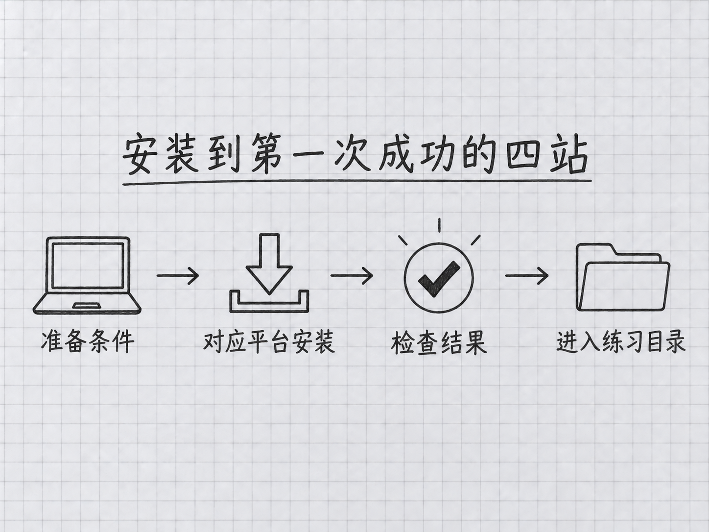

<a id="第-2-章安装-claude-code"></a>
# 第 2 章：安裝 Claude Code

> **本章在全書的位置**：第一部分 · 第 2 章 / 主線約 30 分鐘，支線約 10 分鐘。
>
> **前置章節**：第 0 章確認賬號路徑，第 1 章會開啟終端、進入資料夾。
>
> **學完能做什麼**：檢查電腦條件，安裝或升級 Claude Code，完成登入，分清安裝失敗與賬號不可用。

<a id="开场三问"></a>
## 開場三問

- 你會遇到什麼問題：網上的安裝命令好幾種，不知道該用哪一種。
- 不讀會踩什麼坑：照舊教程先裝一堆依賴，遇到錯誤又反覆用管理員許可權重灌。
- 讀完多會什麼事：知道自己裝的是哪一種版本，能檢查版本並按原來的安裝方式更新。

<a id="本章地图"></a>
### 本章地圖

本章圖解：[安裝到第一次成功的四站](#21-安装前先确认你准备好了什么)。

> 🎯 **【主線】—— 本章必讀核心**

<a id="21-安装前先确认你准备好了什么"></a>
## 2.1 安裝前，先確認你準備好了什麼

本書採用官方現在推薦的**原生安裝**：直接把 Claude Code 程式裝到電腦上。這裡的“原生”只是安裝方式的名字。你不必先學習程式設計，也不必先裝 Node.js——舊版教程把它列為必需品的步驟，已經不適用於這條路線。

<!-- diagram: FIG-004 -->


*圖：先核對準備條件，再按平臺安裝、檢查結果並進入練習目錄。*
<!-- /diagram: FIG-004 -->

先做三件事。第一，檢查系統版本：Mac 在左上角蘋果選單裡開啟“關於本機”；Windows 在“設定 → 系統 → 關於”看 Windows 規格。官方當前要求 macOS 13 或更新版本，Windows 10 1809 或更新版本，並至少有 4 GB 記憶體。系統太舊時先處理系統相容性，反覆執行安裝命令解決不了這個問題。

第二，瀏覽器開啟[官方安裝說明](https://code.claude.com/docs/en/setup)，確認能訪問官方服務。安裝包能下載，與賬號在所在地區可使用服務，是兩件事。地區限制以 [Anthropic 支援地區](https://www.anthropic.com/supported-countries)為準；公司電腦還要遵守公司的軟體和資料規定。

第三，確認第 0 章選好的賬號路徑。Claude 的免費聊天賬號不包含 Claude Code；個人訂閱與 Console 的 API 計費也不共用餘額。先看清自己的訪問資格與計費設定，再開始傳送訊息。如果你只有免費聊天賬號，可以先讀本書、準備練習檔案，別把登入受限當成安裝壞了。

如果電腦以前裝過，先在**普通終端**裡輸入 `claude --version`。能看到版本就不急著重灌，去本章末尾看升級方式。想跟著本書使用 Opus 5.5 和 Fable 5.1，統一以 **Claude Code 2.1.280 或更高版本**為起點；這不是“最新版永遠是 2.1.280”的意思。

<a id="22-mac在终端里安装然后检查结果"></a>
## 2.2 Mac：在終端裡安裝，然後檢查結果

**第一步，開啟終端。** 按 Command 和空格，輸入“終端”，按回車。出現能輸入命令的視窗後，把下面一行復制進去，再按回車。不要把程式碼框的邊框或章節文字一起復制。

```sh
curl -fsSL https://claude.ai/install.sh | bash
```

這行命令會從 `claude.ai` 下載官方安裝指令碼，並交給 Bash 執行。Bash 是電腦用來執行命令的程式。因為“下載後執行”有真實作用，先確認域名和整行命令一致；不要執行陌生網頁改過的版本。你可能看到下載進度、安裝位置和下一步提示。等安裝程式結束、終端重新出現輸入位置，再進行下一步。

**第二步，重新開啟終端。** 關閉當前視窗，再按 Command 和空格搜尋“終端”。這樣新設定的程式路徑才有機會生效。輸入：

```sh
claude --version
```

正常結果包含版本號和 `Claude Code`。具體小版本會隨更新變化，不必和書上一字不差。隨後輸入：

```sh
claude doctor
```

`doctor` 的意思是“診斷”。當前版本會做只讀的安裝與配置檢查，不會開始聊天。看有無安裝路徑、配置格式或更新警告；它也不能證明你的付費賬號一定可用。

如果看到 `command not found`，意思是終端還找不到程式。先看安裝器最後是否提示把 `~/.local/bin` 加入 PATH。PATH 是終端查詢程式的目錄清單，`~` 代表你的個人目錄。按照官方[安裝排錯](https://code.claude.com/docs/en/troubleshooting)對應步驟處理；不理解提示時，把去掉使用者名稱、金鑰後的錯誤原文留下再求助，不要直接在舊的 npm 命令前補 `sudo`。

<a id="23-windows用普通-powershell-完整走一遍"></a>
## 2.3 Windows：用普通 PowerShell 完整走一遍

**第一步，開啟 PowerShell。** 點開始選單，輸入“PowerShell”，開啟普通視窗，不選擇“以管理員身份執行”。提示符通常以 `PS` 開頭。如果你開啟的是命令提示符 CMD，先關掉並重新開啟 PowerShell，兩者的安裝命令不同。

**第二步，複製下面整行並按回車。**

```powershell
irm https://claude.ai/install.ps1 | iex
```

`irm` 負責取得官方指令碼，`iex` 執行它。和 Mac 路線一樣，先核對域名。等待安裝完成，留意最後的成功或錯誤提示。不要因為螢幕上有很多英文就關閉視窗，也不要在它仍執行時不斷貼上同一行。

**第三步，關閉視窗，再開一個普通 PowerShell。** 輸入下面一行，按回車：

```powershell
claude --version
```

正常時你會看到版本號。再輸入 `claude doctor`，檢查安裝和配置。若提示無法識別 `claude`，先確認安裝器是否要求把使用者目錄下的 `.local\bin` 加入 PATH，並對照官方排錯頁處理。若出現“無法識別 irm”，你很可能還在 CMD；若指令碼被公司策略阻止，請聯絡管理員，不要照不明教程關閉整臺電腦的指令碼安全策略。

**Git for Windows 現在是可選項。** 當前官方文件說明：沒有安裝它時，Claude Code 可使用 PowerShell 執行命令；安裝後還可以使用 Git Bash。Git 是後面儲存專案版本時會用到的工具，Git Bash 則提供另一種命令環境。第一次發訊息不必為了這個分支先學整套 Git。原生 Windows 與 WSL 也不是同一個環境；本書主線使用原生 Windows，不要求你先安裝 WSL。

<a id="24-在练习目录启动登录发一句话"></a>
## 2.4 在練習目錄啟動、登入、發一句話

先用第 1 章的方法準備一個沒有私人資料的練習資料夾。在 Mac 終端或 Windows PowerShell 裡進入它，用 `pwd` 看當前位置，確認後輸入：

```sh
claude
```

第一次啟動會有初始設定、賬號或目錄信任提示，順序可能隨版本變化。**只確認自己建立的練習目錄。** 登入時選你已經具備資格的賬號路徑；個人訂閱走 Claude 賬號，API 計費走 Console。瀏覽器開啟後，確認正在登入的是自己的賬號，按頁面提示完成，再回到終端。

如果沒有自動開啟瀏覽器，使用終端實際給出的登入連結；需要回填授權碼時，只按當前提示操作。不要把整條登入連結、授權碼或 API Key 發給別人。API Key 是能使用賬戶額度的金鑰，不是可公開的賬號名稱。如果環境中已有 `ANTHROPIC_API_KEY`，程式可能先要求確認該金鑰，而不是開啟瀏覽器；此時先弄清這把金鑰屬於哪個計費賬戶。

看到 Claude Code 的輸入區域後，先輸入 `/status` 檢視當前賬號和配置狀態，再輸入 `/model` 看實際可選模型。書裡提到一個模型，不代表你的套餐、組織或閘道器已經開放它。第一次練習選擇當前賬戶能使用的日常模型即可，不必先切到費用更高的 Fable。

為了讓後面的練習保留逐次稽核機會，用 Shift+Tab 檢視並切換許可權模式，選擇 **Manual（手動，對應 `default`）**；當前某些套餐會預設啟動為 Auto，不要假定剛裝好就會每一步詢問。模式說明見第 7 章。如果組織策略限制切換，先按組織要求操作。

最後輸入“你好，請用一句話說明你能怎樣幫我整理這個練習目錄”，按回車。收到回覆表示這次登入與模型請求都成功了；它還不能證明所有工具已經配置完成。輸入 `/exit` 退出，回到普通終端。

<a id="25-出问题时分清是哪一层"></a>
## 2.5 出問題時，分清是哪一層

把整個過程看成三道門：**程式是否存在、賬號能否使用、具體請求是否成功**。`claude --version` 都失敗，先查安裝與 PATH；能顯示版本卻登入不了，檢查賬號型別、支援地區與組織要求；進入會話後才報額度或模型錯誤，則檢查套餐、API 餘額、模型許可權，不必把程式刪掉重灌。

網路錯誤也需要看發生位置。下載安裝器失敗，與模型請求超時，連線的是不同步驟。先記下出錯命令與錯誤文字；在公司網路上把問題交給 IT。不要隨意更換下載站、關閉證書校驗，或把金鑰貼進公開求助截圖。

安裝器和登入介面的文字可能更新，本書不要求你找到一模一樣的按鈕。真正的成功標誌是：版本號可讀、診斷沒有未處理的阻斷項、確認賬號路徑、收到一次正常回復。沒有完成的步驟就停留在相應層排查，不用靠猜測連續改設定。

<a id="本章小结"></a>
## 本章小結

- 主線用原生安裝，Node.js 不是前置條件。
- Mac 與 PowerShell 使用各自的官方命令，不需要預設提權。
- `claude --version` 看程式版本；`claude doctor` 查安裝和配置。
- 登入資格、訂閱額度和 API 餘額要分開確認。
- 新模型示例以 2.1.280 或更高版本為起點，仍取決於賬戶開放情況。
- 在練習目錄啟動，確認模式，完成一次回覆後再開始處理真實檔案。

<a id="动手任务"></a>
## 動手任務

1. **檢查或安裝（約 10 分鐘）**：按你的平臺走完整條路線，執行版本和診斷命令。成功標誌是能讀出版本，並知道安裝方式。
2. **登入與首句對話（約 10 分鐘）**：進入練習目錄，確認賬號和許可權模式，發出一句無敏感資訊的請求。成功標誌是收到正常回復。
3. **留下自己的維護記錄（約 3 分鐘）**：在個人筆記寫下系統、安裝方式、當前版本和使用的賬號型別；不記金鑰。成功標誌是下次升級時知道該查本章哪一條路線。

<a id="如果你卡住了"></a>
## 如果你卡住了

- **提示找不到 claude**：重新開終端，核對安裝器給出的 PATH 提示，查[官方排錯](https://code.claude.com/docs/en/troubleshooting)。
- **有版本號但無法登入**：回第 0 章確認賬號資格；免費聊天賬號不是 Claude Code 的免費使用額度。
- **有模型列表卻沒有新模型**：先查客戶端版本與賬號開放範圍；不要靠反覆輸入不存在的名稱解決。

> 🌿 **【支線】—— 可選深入**

<a id="-支线-2a以后怎样升级怎样避免装出多个版本"></a>
## 🌿 支線 2.A：以後怎樣升級，怎樣避免裝出多個版本

當你已能正常使用，只需要決定日後由誰管理升級。原生安裝通常自動下載更新，並在下次啟動生效；想手動檢查可以退出會話後執行 `claude update`。更新後再用 `claude --version` 核對。`stable` 穩定通道通常比 `latest` 晚約一週，因此剛釋出的新模型有時需要等待更新，或按官方文件選擇合適通道。

如果你此前用 Homebrew 安裝，就繼續按它的方式維護。`brew install --cask claude-code` 使用穩定通道，`claude-code@latest` 使用最新通道；升級對應使用 `brew upgrade claude-code` 或 `brew upgrade claude-code@latest`。Windows 的 WinGet 使用 `winget install Anthropic.ClaudeCode` 安裝、`winget upgrade Anthropic.ClaudeCode` 升級。這些包管理器預設由你手動更新，不要把原生安裝的自動更新說明套過來。

npm 仍是備選安裝方式，但不再是本書主線。當前 npm 包要求 Node.js 22 或更新版本；已有 npm 安裝用 `npm install -g @anthropic-ai/claude-code@latest` 升級。官方明確不建議使用 `sudo npm install -g`。若你不清楚自己用了哪一種，先看 `claude doctor`，不要同時嘗試四條安裝路線。版本管理的完整說明見[官方安裝頁](https://code.claude.com/docs/en/setup)。

<a id="-支线-2b我只想用图形界面可以跳过终端安装吗"></a>
## 🌿 支線 2.B：我只想用圖形介面，可以跳過終端安裝嗎

可以選擇 Claude 桌面應用中的 Code 入口，按[桌面版官方指南](https://code.claude.com/docs/en/desktop)設定。桌面版帶有所需引擎，不以單獨安裝終端 CLI 為前提。CLI 是“命令列介面”的英文縮寫，也就是本章透過終端啟動的方式。

本書主線繼續使用終端，是為了把目錄、許可權、檔案改動講得清楚。如果選擇桌面版，可以先看附錄 H，再回來學習檔案稽核、記憶、任務拆分這些共通概念；不要期待選單、快捷鍵、計劃任務與命令列完全一樣。桌面版的安裝成功也不意味著免費賬號自動獲得了 Code 使用資格。
