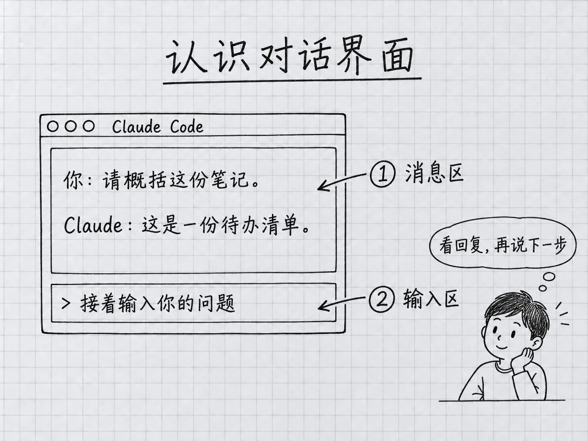

<a id="第-3-章你的第一次对话"></a>
# 第 3 章：你的第一次對話

> **本章在全書的位置**：第一部分 · 第 3 章 / 預估閱讀+動手時長：**主線 30-40 分鐘 + 支線 10-15 分鐘**
>
> **前置章節**：第 1 章（用終端）+ 第 2 章（裝 Claude Code）
>
> **學完能做什麼（主線）**：能進入一個工作資料夾啟動 Claude Code，看懂它的介面，發訊息、讓它讀檔案、乾淨退出，並在下次進同一個資料夾時繼續之前的對話。

---

<a id="开场三问"></a>
## 開場三問

- **你會遇到什麼問題**：裝好了 Claude Code，開啟它一臉懵——介面上每個東西是什麼、該怎麼開始說話。
- **不讀這章會踩什麼坑**：不知道要先 `cd` 到對應資料夾再啟動（結果 Claude 看不到你的檔案）；不知道怎麼讓它讀檔案；不知道怎麼退出或怎麼繼續之前的對話。
- **讀完你會多會什麼事**：能在任意資料夾啟動 Claude Code，順暢地和它對話、給它看檔案、乾淨退出；下次還能接著上次聊。

<a id="本章地图一眼看全貌"></a>
### 本章地圖（一眼看全貌）

本章圖解：[認識對話介面](#33-认识-claude-code-的界面)。

---

> 🎯 **【主線】—— 本章必讀核心**
>
> 5 節 + 動手任務，讓你從"啟動成功"走到"會用 Claude Code 處理真實任務"。預估 30-40 分鐘。

---

<a id="31-先准备一个练习文件夹"></a>
## 3.1 先準備一個"練習資料夾"

Claude Code 是**按專案資料夾組織工作的**。你在哪個目錄啟動，哪裡就是這次任務的起點。這個起點不是把電腦其他位置完全隔離的安全沙箱；檔案訪問還受到作業系統許可權、Claude Code 許可權規則及具體工具限制。

> 💡 先進入乾淨的練習目錄，能降低誤把私人檔案當成任務材料的機會。啟動時仍要核對目錄、信任提示與許可權模式；本章沿用第 2 章的 Manual（手動）練習方式。

<a id="动手建一个练习文件夹"></a>
### 動手建一個練習資料夾

我們先建一個專門用來跟著本書練習的資料夾——叫 `ccguide-练习` 放在桌面。

**步驟 1**：在桌面右鍵 → 新建資料夾 → 命名 `ccguide-练习`（用圖形介面就行）。

**步驟 2**：在這個資料夾裡建一個簡單的測試檔案。方法：
- **Mac**：開啟“文字編輯”，新建文稿；在“格式”選單選擇“製作純文字”。輸入下方內容，按 Command+S，在儲存視窗選擇桌面的 `ccguide-练习` 資料夾，檔名填 `笔记.txt`。Finder 通常沒有通用的“新建檔案”選單。儲存後回 Finder 確認檔案確實存在。
- **Windows**：在資源管理器先開啟“檢視 → 顯示 → 副檔名”（部分版本在“檢視”頁直接勾選）。進入練習資料夾，右鍵空白處 → 新建 → 文字文件，把完整檔名改成 `笔记.txt`。確認不是 `笔记.txt.txt`，雙擊用記事本開啟、輸入下方內容，再按 Ctrl+S 儲存。

檔案裡隨便寫幾句話，比如：
```
今天的待办：
- 买菜
- 给妈打电话
- 写周报
```

儲存。這個檔案等會兒讓 Claude 讀。

<a id="32-进入工作文件夹再启动"></a>
## 3.2 進入工作資料夾再啟動

**Mac 使用者**：開啟終端，先進入剛建的資料夾，再啟動 Claude Code。

```
cd ~/Desktop/ccguide-练习
claude
```

第一行把你“搬”進練習資料夾，第二行啟動 Claude Code。若第一行報找不到目錄，先在 Finder 確認資料夾位置，不要繼續啟動。

**Windows 使用者**：開啟普通 PowerShell，逐行輸入下面三行。第一行取得系統實際的桌面目錄，即使桌面被 OneDrive 重定向，也不必猜路徑。

```powershell
Set-Location ([Environment]::GetFolderPath('Desktop'))
Set-Location 'ccguide-练习'
claude
```

如果第二行報錯，回資源管理器確認資料夾名，改對後再啟動。兩種平臺都可在啟動前用 `pwd` 檢視當前目錄。

介面的位置說明見下一節的手繪示意。


📌 `cwd` 是 current working directory 的縮寫，意思是當前工作目錄。啟動前用 `pwd` 核對，啟動後可用 `/status` 檢視狀態；歡迎頁不一定顯示 `cwd:` 行，缺少這一行不代表安裝失敗。目錄錯了就 `/exit` 退出，進入正確目錄再啟動。

⚠️ **永遠先 `cd` 再 `claude`**。這是本書反覆強調的第一個好習慣。

<a id="33-认识-claude-code-的界面"></a>
## 3.3 認識 Claude Code 的介面

先認清兩個常用區域：訊息區顯示對話與結果，輸入區用來繼續提問。下面是手繪示意，實際主題與佈局可能不同。歡迎資訊和狀態提示再按各自版本理解。

<!-- diagram: FIG-005 -->


*圖：先看訊息，再從輸入區說出下一步。*
<!-- /diagram: FIG-005 -->

<a id="欢迎信息"></a>
### 歡迎資訊

啟動時可能出現歡迎資訊、版本或快捷提示，具體內容隨版本和主題變化；開始對話後可能被後續訊息滾出可見區域。

<a id="①-消息区"></a>
### ① 訊息區

所有的對話（你說的話、Claude 的回覆、許可權提示、工具呼叫提示）都在這裡按時間順序往下堆。

<a id="状态提示可能显示在输入区附近"></a>
### 狀態提示（可能顯示在輸入區附近）

狀態列可以自定義，不一定預設顯示模型、上下文和費用。更可靠的檢視方法是：`/model` 看模型選擇，`/context` 看當前上下文，`/usage` 看用量資訊。這三個概念在第 12、15 章細講，此時先記住它們各有入口。

<a id="②-输入区"></a>
### ② 輸入區

最下面那個 `>`，後面閃游標的地方——**這是你打字的地方**。
- 打字 + 回車 = 傳送
- **`/exit`** = 退出普通前臺會話；Ctrl+C 的效果取決於是否有任務或草稿
- **Shift+回車** 可在支援的終端中換行；不生效時看第 19 章的終端設定。不要反覆按回車把半句話發出去。

<a id="34-发第一条消息让它读一个文件"></a>
## 3.4 發第一條訊息，讓它讀一個檔案

<a id="发一条打招呼"></a>
### 發一條打招呼

在輸入框裡打：

```
你好，简单说一下你是什么、能做什么。
```

按回車。

**你會看到**：Claude 開始一行一行輸出回覆——一般是一段簡短介紹。**你不需要打斷它**，等它自己說完。說完後游標回到輸入框，等你下一句。

📌 **這種一來一回就叫"對話"**。你說一句、它回一次、然後等你下一句。有後臺任務時也可能收到任務通知；第一次練習先完成這一輪就好。

<a id="让它读你之前建的笔记文件"></a>
### 讓它讀你之前建的筆記檔案

在輸入框裡打：

```
@笔记.txt 这个文件里写了什么？用 3 句话概括。
```

按回車。

**關鍵符號**：`@`——這是 Claude Code 的"**引用檔案**"符號。打 `@` 後跟檔名，Claude 就會**把這個檔案讀進對話**。你不用自己複製貼上檔案內容。

> 💡 **生活化比喻**：`@笔记.txt` 就像給秘書遞過一頁紙說"看這張"。和你說"幫我看一下桌上那份檔案"不同——`@` 是精確指向。

**你會看到**：Claude 會先告訴你它讀了 `笔记.txt`（可能會簡短複述你寫的內容），然後給出三句話的概括。

<a id="让它改这个文件初尝权限机制"></a>
### 讓它改這個檔案（初嘗許可權機制）

再試一句：

```
@笔记.txt 把这份待办清单的每一条前面加上编号 1、2、3。
```

按回車。

在 Manual 模式且沒有預先允許相關編輯時，Claude 通常會顯示 **diff（修改對比）**並請求確認。diff 可能按刪除行、增加行顯示，不一定左右分欄。下面是許可權選項示意：

```
Do you want to apply this change?
❯ Yes
  Yes, and allow similar changes for the rest of this session
  No, tell Claude what to do differently
```

（選項用**↑↓方向鍵**選，**回車**確認）

📌 確認提示取決於許可權模式和已經儲存的規則。Auto 或自動接受編輯的模式可能直接執行允許的操作；這不代表程式失控，也不能由此認為每次都會有人替你把關。先核對模式和差異，再選擇是否允許。第 6、7 章會展開。

選 **Yes** 回車。Claude 會改完檔案，並告訴你改完了。

**去圖形介面開啟 `笔记.txt` 看一眼**——內容應該真的被編了號。這就是 Claude Code 在幹活的樣子。

<a id="35-退出并在下次继续"></a>
## 3.5 退出，並在下次繼續

<a id="干净退出"></a>
### 乾淨退出

兩種方式：

- 在普通前臺會話輸入 `/exit`，按回車退出。
- Ctrl+C 有任務時先中斷，空閒時可能先清除輸入；按螢幕提示操作，不把固定次數當成通用退出法。

你會回到你原來的終端提示符（`%` 或 `>`）。

<a id="下次怎么继续"></a>
### 下次怎麼繼續

下次你想接著用，只需要：

```
cd ~/Desktop/ccguide-练习
claude
```

**注意**：普通啟動通常開始新對話，沒有自動裝入上一次完整對話；專案說明和自動記憶仍可能載入。舊會話通常儲存在本機，可恢復，不是退出就被抹掉。Windows 回到桌面練習目錄的方法與 3.2 節相同。

如果你想**接著上次聊**（保留之前的對話上下文），啟動時加一個引數：

```
claude -c
```

或者：

```
claude --continue
```

`-c` / `--continue` 意思是 "continue the previous session"（繼續上次會話）。

💡 **選哪個？**
- **新任務、新話題** → 直接 `claude`（開新對話，也方便讓 Claude 輕裝上陣）
- **接著上次沒完的事** → `claude -c`

第 12 章會解釋為什麼新任務最好新開對話（涉及"上下文"管理）。現在先記住這兩種啟動方式。

💡 **還有 `claude --resume` 選特定歷史對話**——見 🌿 支線 3.A。

---

<a id="本章小结"></a>
## 本章小結

- Claude Code **按資料夾工作**——永遠**先 `cd` 到工作資料夾再 `claude`**
- 啟動後先找到訊息區與輸入框，再讀環境和模式提示；佈局會隨介面變化
- `@文件名` = 讓 Claude 讀這個檔案
- 許可權提示取決於模式和規則；練習採用 Manual，並親自檢視 diff 與檔案結果
- 退出普通前臺會話用 `/exit`；先檢查是否還有後臺任務
- 下次繼續上次對話：`claude -c`（新話題就直接 `claude`）

---

<a id="动手任务"></a>
## 動手任務

<a id="任务-1建练习文件夹并启动3-分钟"></a>
### 任務 1：建練習資料夾並啟動（3 分鐘）

**步驟**：
1. 桌面建資料夾 `ccguide-练习`（若已建跳過）
2. 裡面建檔案 `笔记.txt`，寫 3 條任意內容
3. 按 3.2 節對應平臺的步驟進入練習目錄
4. `claude` 啟動

**成功標誌**：啟動前 `pwd` 和會話狀態中的工作目錄都指向 `ccguide-练习`。

<a id="任务-2让它读并概括3-分钟"></a>
### 任務 2：讓它讀並概括（3 分鐘）

**步驟**：在輸入框打 `@笔记.txt 用一句话概括这份内容`，回車。
**成功標誌**：Claude 返回一句符合內容的概括。

<a id="任务-3让它改并审核5-分钟"></a>
### 任務 3：讓它改並稽核（5 分鐘）

**步驟**：
1. 輸入 `@笔记.txt 帮我在每行前加一个 ☐ 符号（作为待办框）`
2. 有確認選項時先稽核差異再允許；若已執行，檢查實際差異與當前允許規則，不要為尋找彈窗反覆執行
3. **切到圖形介面**開啟 `笔记.txt` 看結果

**成功標誌**：檔案裡每行前面真的多了 `☐`。

<a id="任务-4退出后再用--c-继续3-分钟"></a>
### 任務 4：退出後再用 -c 繼續（3 分鐘）

**步驟**：
1. 在普通前臺會話輸入 `/exit` 退出
2. 終端裡 `claude -c`（或 `claude --continue`）
3. 問它："**剛才我們做了什麼？**"

**成功標誌**：Claude 能回憶起剛才讀過 `笔记.txt` 並改過內容。

---

<a id="如果你卡住了"></a>
## 如果你卡住了

**症狀 A：啟動後 `cwd:` 不是你建的練習資料夾**
- 原因：忘了 `cd`，或 `cd` 路徑寫錯
- 解決：退出後用 `pwd` 確認位置，按 3.2 節對應平臺的方法重新進入練習目錄，再啟動並核對 Manual 模式

**症狀 B：打 `@笔记.txt` 後 Claude 說找不到這個檔案**
- 原因：檔名對不上（大小寫、副檔名、是否真在這個資料夾）
- 解決：退出 Claude Code，`ls` 看這個資料夾裡實際有什麼；對照檔名精確重新試

**症狀 C：Claude 改檔案後選了 Yes，但檔案內容沒變**
- 原因：極少見的檔案許可權問題，或圖形介面沒重新整理
- 解決：先核對實際修改的完整路徑與終端報錯，再關閉並重新開啟檔案；也可讓 Claude 只讀這份檔案確認內容。列目錄命令不能證明檔案是否被鎖

**症狀 D：`claude -c` 說沒有可繼續的對話**
- 原因：你從上次對話後換了資料夾——會話是按資料夾記錄的
- 解決：確認當前在上次同一個資料夾裡；或用 `claude --resume` 從列表裡選（見支線 3.A）

**還是不行？** → 見附錄 G。

---

主線結束。下面兩條支線講如何從歷史對話列表裡精確挑一個繼續，以及狀態列到底在告訴你什麼。

---

> 🌿 **【支線】—— 可選深入（學有餘力再看）**

---

<a id="-支线-3a用---resume-从历史对话里挑一个继续"></a>
## 🌿 支線 3.A：用 `--resume` 從歷史對話裡挑一個繼續

> **這段講什麼**：`claude -c` 是"接上最近那次"，但如果你上週、上上週有幾次對話都想回去看，需要另一個命令。
> **什麼時候回頭讀**：你用了一兩週發現自己在同一個資料夾有多次對話想翻出來的時候。

啟動時加 `--resume`（或簡寫 `-r`）：

```
claude --resume
```

Claude Code 會彈出一個**歷史對話列表**，按時間倒序列出你在當前資料夾的所有會話。用**↑↓方向鍵**選，**回車**進入。

每條列表項通常顯示：
- 開始時間
- 訊息數
- 第一條訊息的前幾個字（幫你認出是哪次聊的什麼）

**`-c` vs `--resume` 一句話**：
- `-c` = 接最近那次
- `--resume` = 挑一次

歷史選擇器通常先按當前目錄篩選；具體可見範圍與版本和篩選項有關。最省心的方法是回到原專案再用 `claude -c` 或 `claude --resume`。不要把目錄篩選當成資料隔離保證。

---

<a id="-支线-3b状态栏到底在告诉你什么"></a>
## 🌿 支線 3.B：狀態列到底在告訴你什麼

> **這段講什麼**：Claude Code 螢幕上那些數字（`Ctx: 12%`、`Sonnet`、成本）具體含義。
> **什麼時候回頭讀**：你發現狀態列在變數字、好奇那是啥。第 12 章會專門講上下文（context），15 章講模型和成本。

狀態列是可以自定義的一行資訊，不是人人都自帶同樣的儀表盤。第一次使用先掌握三個查詢入口就夠了。

<a id="①-model我在用哪个模型"></a>
### ① `/model`：我在用哪個模型

日常任務可從賬戶提供的 Opus 5.5 等模型開始；Fable 5.1 面向更困難的任務，費用和訪問條件另查第 15 章。不要把舊圖裡的 Sonnet 4.6 當成所有賬戶永遠的預設值。模型列表與組織設定也可能不同。

<a id="②-context这次对话装了多少材料"></a>
### ② `/context`：這次對話裝了多少材料

上下文是模型處理當前請求時可以看到的材料。佔用量能提醒你整理任務，卻不能按“50% 健康、90% 必然變傻”機械判斷。出現前後矛盾時，先重述目標、核對事實；長任務用 `/compact` 整理，換任務用 `/clear` 開新對話。不要為了減小一個百分比丟掉仍需使用的任務狀態。

<a id="③-usage这次使用与账户额度怎样"></a>
### ③ `/usage`：這次使用與賬戶額度怎樣

按當前賬號檢視能提供的使用資訊；`/cost` 現在是 `/usage` 的別名。用量估算不是所有計費平臺的最終賬單。訂閱視窗、額外付費用量與 API 支出也不是同一個數字，不應把看到的數值統稱為“本月配額”。先確定賬戶路徑，再去對應的設定頁或控制檯核對。

命令會隨版本調整，遇到不一樣的畫面可查[官方命令表](https://code.claude.com/docs/en/commands)與[互動說明](https://code.claude.com/docs/en/interactive-mode)。

---

你已經完成了"和 Claude Code 正常對話"的全流程。下一章講一個更重要的東西——**Claude Code 到底是什麼、你該用什麼心態對待它**。
