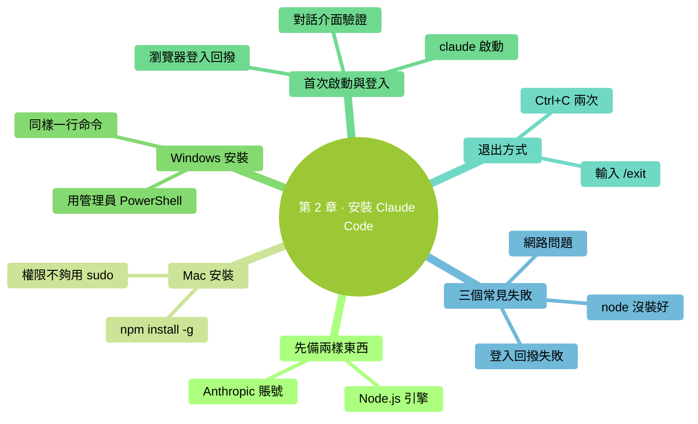

# 第 2 章：安裝 Claude Code

> **本章在全書的位置**：第一部分 · 第 2 章 / 預估閱讀+動手時長：**主線 30-40 分鐘 + 支線 10-15 分鐘**
>
> **前置章節**：**必須先完成第 1 章**——下面每一步都要在終端裡操作。
>
> **學完能做什麼（主線）**：你的電腦上已經裝好 Claude Code，能用 `claude` 命令啟動它，能登入自己的賬號並看到它回話。

---

## 開場三問

- **你會遇到什麼問題**：裝不上、裝上了但啟動失敗、賬號登入一直轉圈——這三類坑是新手裝 Claude Code 最常見的。
- **不讀這章會踩什麼坑**：直接按網上教程敲命令，遇到報錯不知道什麼原因；裝了一半放棄。
- **讀完你會多會什麼事**：能獨立走完安裝和登入的完整流程，遇到失敗能判斷是哪一步出問題。

### 本章地圖（一眼看全貌）

<!-- diagram: MM-09 -->


---

> 🎯 **【主線】—— 本章必讀核心**
>
> 下面 5 節 + 動手任務，走完你就能啟動 Claude Code 了。預估 30-40 分鐘。

---

## 2.1 裝之前：兩件事要先備好

裝 Claude Code 之前，你需要**兩樣東西**準備好。我們先解釋這兩樣是什麼、為什麼需要。

### ① 一個 Anthropic 賬號

Anthropic 是做 Claude 的公司。**Claude Code 需要登入 Anthropic 賬號才能用**——因為它每次對話都要把你說的話發到 Anthropic 的伺服器，伺服器處理完再返回，這就需要知道"是你在用"。

**註冊方式**：瀏覽器開啟 `https://claude.ai` → 點 "Sign up" → 用郵箱註冊。如果你之前用過 Claude 的網頁版、訂閱過 Claude Pro/Max，那個賬號就能直接用。

**付費問題的簡短版**：Claude Code 有免費額度（對輕度使用夠用），想用更多就訂閱或者按 API 計費。新手先用免費額度試，**不會產生扣費**。深入的成本問題第 15 章專講。

### ② Node.js（一個叫 "node" 的東西）

Claude Code 是一個**用 JavaScript 寫的命令列程式**——JavaScript 這種程式在電腦上跑起來，需要一個叫 **Node.js**（或簡稱 node）的"引擎"。就像 Word 文件要 Word 開啟、PDF 要 Acrobat 開啟一樣，JavaScript 程式要 Node.js 開啟。

> 💡 **不用搞懂 Node.js 是啥**，只要知道它是"Claude Code 執行所需的引擎"。裝一次就能一直用。

**怎麼知道自己電腦有沒有裝 Node.js**？

開啟終端（見第 1 章 1.2 節），輸入：

```
node -v
```

按回車。

- **已經裝了**：會顯示類似 `v20.11.0` 的版本號——**版本號 18 或更高都可以**，跳到 2.2 節
- **沒裝**：會報 `command not found`（Mac）或 `不是內部或外部命令`（Windows）——需要先裝 Node.js

**怎麼裝 Node.js**：瀏覽器開啟 [nodejs.org](https://nodejs.org)，點**左邊綠色的 "LTS" 按鈕**（LTS = "長期支援版"，最穩定）下載安裝包。下載完雙擊安裝，一路點"下一步/繼續"即可。

裝完**關掉終端重新開啟**（讓新裝的 node 生效），再打一次 `node -v`，看到版本號就說明成功了。

## 2.2 Mac 上安裝 Claude Code

準備好 Node.js 和賬號後，裝 Claude Code 本體就很簡單——**一行命令**。

### 安裝

開啟終端，輸入：

```
npm install -g @anthropic-ai/claude-code
```

按回車。

**這行命令在做什麼**：
- `npm` 是 Node.js 自帶的"應用商店"（Node Package Manager，節點包管理器）
- `install` = 安裝
- `-g` = global（全域性），意思是裝到全電腦都能用的位置，而不是隻裝到當前資料夾
- `@anthropic-ai/claude-code` = 要裝的東西的名字

**你會看到**：終端裡刷一串文字，可能會有一些黃色或綠色的進度條。這**正常**，說明它在下載。等它跑完——最後一行通常是 `added XXX packages in XXs` 之類。**時間約 30 秒到 2 分鐘**，看網速。

### 可能遇到的權限問題

如果跑完後看到 `permission denied`（權限被拒絕），說明 `-g` 全域性安裝需要管理員權限。改用：

```
sudo npm install -g @anthropic-ai/claude-code
```

`sudo` = super user do（以管理員身份做），會彈出讓你輸 Mac 登入密碼。**輸入時螢幕上不會顯示任何字元**（連 `*` 都不顯示），這是故意的，正常打完密碼回車就行。

## 2.3 Windows 上安裝 Claude Code

同樣一行命令，在 PowerShell 裡：

```
npm install -g @anthropic-ai/claude-code
```

按回車。

**你會看到**：和 Mac 一樣，終端裡會刷一串文字顯示下載進度。等跑完。

### 可能遇到的權限問題

Windows 上如果報權限錯誤，**不要用 sudo**（Windows 沒有這個命令）。改為：

1. 關掉當前 PowerShell 視窗
2. 找到 Windows Terminal 或 PowerShell 的圖示
3. **右鍵** → 選"**以管理員身份執行**"
4. 在新開啟的管理員窗口裡重新跑 `npm install -g @anthropic-ai/claude-code`

管理員 PowerShell 的標題欄會寫"**管理員**"字樣，辨認清楚。

## 2.4 登入並驗證

裝完後，Claude Code 已經在你電腦裡了。啟動它。

### 啟動

在終端（Mac）或 PowerShell（Windows）裡隨便哪個位置，輸入：

```
claude
```

按回車。

**第一次啟動時**：Claude Code 會引導你登入 Anthropic 賬號。會發生下面的事情：

1. 終端裡顯示一個歡迎資訊和一個**登入連結**（URL）
2. 你的預設瀏覽器**自動開啟**那個連結（或者終端提示你手動複製到瀏覽器）
3. 瀏覽器裡，登入你的 Anthropic 賬號
4. 登入成功後瀏覽器顯示"You can close this window"（可以關閉此視窗）
5. **切回終端**——Claude Code 應該已經顯示登入成功，進入對話介面

### Claude Code 介面長什麼樣

登入後，終端會變成 Claude Code 的對話介面，大致是這樣：

```
╭───────────────────────────────────────╮
│ ✻ Welcome to Claude Code              │
│                                       │
│ /help for help, /status for status   │
╰───────────────────────────────────────╯

>
```

最下面那個 `>` 是 Claude Code 的**輸入框**（和終端的提示符不是一回事）。游標在它後面閃，等你打話。

### 驗證它能工作

打一句話進去：

```
你好，告訴我你能做什麼
```

按回車。

**你會看到**：Claude 開始在你的終端裡一行一行吐出回覆，講它自己。這就說明**裝成功了、登入成功了、能正常用了**。

### 退出

按兩次 `Ctrl + C`（同時按 Ctrl 和 C，按兩次），或者輸入 `/exit` 回車。

> 💡 **之後每次用 Claude Code**，直接在終端裡 `cd` 到你的工作資料夾、`claude` 啟動就行，不用重新登入（登入資訊會儲存一段時間）。

## 2.5 裝不上？三個最常見的失敗

如果上面某一步掛了，大機率是下面三種情況之一。

### 失敗 1：`command not found: npm` 或 `command not found: node`

**意思**：Node.js 沒裝好，或裝了但終端沒找到。

**怎麼辦**：
- 確認你從 [nodejs.org](https://nodejs.org) 裝的是 **LTS 版本**
- 裝完後**徹底關掉終端視窗**（不是新開標籤頁，是關視窗），重新開終端
- 再試 `node -v` 和 `npm -v`，都應該顯示版本號

### 失敗 2：`npm install` 卡住不動或報 `network error`

**意思**：網路問題，連不上 npm 的伺服器。

**怎麼辦**：
- 檢查網路（能不能開啟別的網站）
- 如果在中國大陸，可能需要切換 npm 源到國內映象。PowerShell 或 Mac 終端裡跑：
  ```
  npm config set registry https://registry.npmmirror.com
  ```
  再重新 `npm install -g @anthropic-ai/claude-code`
- 公司網有防火牆的話，問 IT 同事

### 失敗 3：登入瀏覽器頁面跳轉失敗 / 登入完終端沒反應

**意思**：登入回撥沒成功關聯回終端。

**怎麼辦**：
1. 終端裡按 `Ctrl + C` 退出 Claude Code
2. 重新 `claude` 啟動
3. 登入頁面出現時，**注意看終端有沒有顯示"可以手動貼上"的選項**——把瀏覽器登入成功後 URL 裡的一段程式碼複製到終端

如果反覆不行，登入官網 [claude.ai](https://claude.ai) 確認網頁版自己能登進去（排除賬號問題）。

---

## 本章小結

- 裝 Claude Code 前要備好**兩樣**：**Anthropic 賬號** + **Node.js 引擎**
- 裝命令一行：`npm install -g @anthropic-ai/claude-code`（Mac 可能需要前面加 `sudo`）
- 啟動命令：`claude`
- **第一次啟動會自動引導瀏覽器登入**，登完切回終端
- 退出按 `Ctrl + C` 兩次或 `/exit`
- **三個最常見失敗**：Node.js 沒裝好、網路問題、登入回撥失敗

---

## 動手任務

### 任務 1：檢查或安裝 Node.js（5-10 分鐘）

**步驟**：
1. 開啟終端，輸入 `node -v`
2. 看到版本號（18+）→ 跳過本任務
3. 報錯 → 去 [nodejs.org](https://nodejs.org) 下 LTS 版本安裝
4. 裝完**關掉終端重開**，再 `node -v` 確認

**成功標誌**：`node -v` 顯示 `v18.x.x` 或更高。

### 任務 2：安裝 Claude Code（2-5 分鐘，看網速）

**步驟**：
1. 終端裡跑 `npm install -g @anthropic-ai/claude-code`（報權限錯誤就 Mac 加 `sudo`、Windows 用管理員視窗重跑）
2. 等它跑完，看到 `added ... packages`

**成功標誌**：無報錯、最後一行顯示成功安裝。

### 任務 3：啟動併發第一條訊息（3-5 分鐘）

**步驟**：
1. 終端裡 `claude` 回車
2. 按提示完成瀏覽器登入
3. 回到終端，在 `>` 後面打 `你好` 回車
4. 看 Claude 回你話

**成功標誌**：Claude 給出一段中文回覆。做到這一步，你已經**成功用上 Claude Code**了 🎉

### 任務 4：乾淨退出（1 分鐘）

**步驟**：按兩次 `Ctrl + C`，或打 `/exit` 回車。

**成功標誌**：回到你原來的終端提示符（`%` 或 `>`）。

---

## 如果你卡住了

**症狀 A：`npm install` 跑到一半紅字報一堆東西**
- 最可能原因：權限不夠（Mac）或網路（兩平臺都可能）
- 解決：參考 2.5 節對應的失敗 1 / 2

**症狀 B：瀏覽器開啟登入頁後點同意但終端一直轉圈**
- 最可能原因：登入回撥沒收到
- 解決：`Ctrl + C` 退出，重新 `claude`，看有沒有手動貼上程式碼的選項

**症狀 C：打 `claude` 報 `command not found`，但 `npm install` 明明跑成功了**
- 最可能原因：npm 的全域性安裝路徑沒加進終端的"搜尋路徑"
- 解決：關掉終端重開；如果還不行，Google 搜 "npm global path not in PATH" + 你的系統名字

**還是不行？** → 見附錄 G（常見報錯自救），或查官方安裝文件 [code.claude.com/docs](https://code.claude.com/docs)。

---

主線到這裡結束。你的電腦上已經裝好 Claude Code 了。下面兩條支線講計費/隱私的快問快答，以及除了 npm 之外的其他安裝方式，想了解可以看看。

---

> 🌿 **【支線】—— 可選深入（學有餘力再看）**

---

## 🌿 支線 2.A：計費和隱私——幾個最關心的問題（簡答版）

> **這段講什麼**：你現在最容易擔心的幾個問題的簡短回答。
> **什麼時候回頭讀**：裝完開始用時腦子裡冒出"這玩意兒會亂扣費嗎 / 我的檔案會不會被偷看"就回來看這段。深入的版本分別見第 11 章（隱私）和第 15 章（成本）。

**Q: 用 Claude Code 會不會亂扣我錢？**
A: 不會。免費額度用完它會提示你，不會偷偷扣。訂閱了 Claude Pro/Max 的按套餐扣，用 API key 的按 token 扣——兩種模式你都能看到明細。

**Q: 我打進去的話、讓它看的檔案，會被 Anthropic 偷看/用來訓練模型嗎？**
A: **不會用來訓練模型**（Anthropic 官方承諾）。**會短暫存在伺服器上用來響應你**，30 天后刪除。傳輸全程加密。

**Q: 那 Anthropic 員工理論上能看到嗎？**
A: 技術上有訪問控制，但不是絕對不可能（極少數 abuse 檢測場景）。**如果你的檔案特別敏感（含銀行卡、密碼、未公開的機密），不要用 Claude Code 處理**。

**Q: 公司電腦上能用嗎？**
A: 得看你公司政策。有些公司禁止用雲端 AI 工具處理公司程式碼/資料。用之前問一下 IT。

更深入的版本見**第 11 章**（資料流與隱私）和**第 15 章**（模型與成本）。

---

## 🌿 支線 2.B：除了 npm 還有別的裝法

> **這段講什麼**：Mac 的 Homebrew、Windows 的 winget、或者用 pnpm 等替代方式。
> **什麼時候回頭讀**：你已經在用 Homebrew / winget / pnpm 管理其他工具，想統一。

### Mac：用 Homebrew

如果你已經裝了 Homebrew（Mac 上的另一個"應用商店"），可以：

```
brew install anthropic/tap/claude-code
```

好處：Homebrew 會自動處理路徑、升級更方便（`brew upgrade`）。

### Windows：用 winget

Windows 11 自帶 winget（Windows 包管理器）：

```
winget install Anthropic.ClaudeCode
```

（命令名以官方最新為準，查 [code.claude.com/docs](https://code.claude.com/docs)）

### 其他 Node.js 包管理器

如果你用 `pnpm` 或 `yarn` 而不是 `npm`，對應命令：

```
pnpm install -g @anthropic-ai/claude-code
yarn global add @anthropic-ai/claude-code
```

效果一樣。

⚠️ **不要同時用多種方式裝**——會混亂。選一種堅持用。

---

裝好了。下一章開始用——**你的第一次對話**。


---

<!-- chapter-nav -->

📖  [← 第 1 章 · 先把電腦準備好](01-先把電腦準備好.md)  ·  [📑 返回目錄](../../README.md)  ·  [第 3 章 · 你的第一次對話 →](03-你的第一次對話.md)
