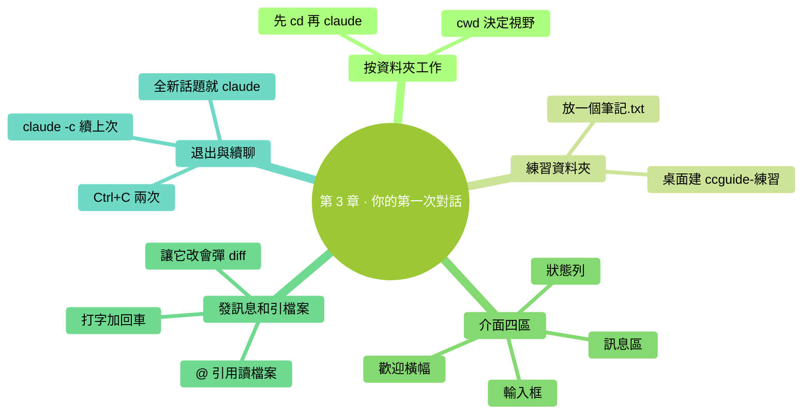

# 第 3 章：你的第一次對話

> **本章在全書的位置**：第一部分 · 第 3 章 / 預估閱讀+動手時長：**主線 30-40 分鐘 + 支線 10-15 分鐘**
>
> **前置章節**：第 1 章（用終端）+ 第 2 章（裝 Claude Code）
>
> **學完能做什麼（主線）**：能進入一個工作資料夾啟動 Claude Code，看懂它的介面，發訊息、讓它讀檔案、乾淨退出，並在下次進同一個資料夾時繼續之前的對話。

---

## 開場三問

- **你會遇到什麼問題**：裝好了 Claude Code，開啟它一臉懵——介面上每個東西是什麼、該怎麼開始說話。
- **不讀這章會踩什麼坑**：不知道要先 `cd` 到對應資料夾再啟動（結果 Claude 看不到你的檔案）；不知道怎麼讓它讀檔案；不知道怎麼退出或怎麼繼續之前的對話。
- **讀完你會多會什麼事**：能在任意資料夾啟動 Claude Code，順暢地和它對話、給它看檔案、乾淨退出；下次還能接著上次聊。

### 本章地圖（一眼看全貌）

<!-- diagram: MM-10 -->


---

> 🎯 **【主線】—— 本章必讀核心**
>
> 5 節 + 動手任務，讓你從"啟動成功"走到"會用 Claude Code 處理真實任務"。預估 30-40 分鐘。

---

## 3.1 先準備一個"練習資料夾"

Claude Code 是**按資料夾來工作的**——你在哪個資料夾啟動它，它的"視野"就限制在這個資料夾裡。它只能看見、只能改這個資料夾裡的東西（除非你明確告訴它去別處）。

> 💡 **為什麼這樣設計**：這是**一種安全保護**。避免你在"系統資料夾"裡一啟動 Claude Code，它就可能動到作業系統重要檔案。你先 `cd` 到你想讓它幹活的地方，它就只在那兒活動。

### 動手建一個練習資料夾

我們先建一個專門用來跟著本書練習的資料夾——叫 `ccguide-練習` 放在桌面。

**步驟 1**：在桌面右鍵 → 新建資料夾 → 命名 `ccguide-練習`（用圖形介面就行）。

**步驟 2**：在這個資料夾裡建一個簡單的測試檔案。方法：
- **Mac**：雙擊進入資料夾 → 右鍵空白處 → **新建檔案**（如果沒這項，可以用 Finder 的"新建文稿"或者下面用終端建）
- **Windows**：雙擊進入資料夾 → 右鍵空白處 → **新建 → 文本文件** → 起名 `筆記.txt`

檔案裡隨便寫幾句話，比如：
```
今天的待辦：
- 買菜
- 給媽打電話
- 寫週報
```

儲存。這個檔案等會兒讓 Claude 讀。

## 3.2 進入工作資料夾再啟動

開啟終端，**先 `cd` 到你剛建的資料夾**，再啟動 Claude Code。

```
cd ~/Desktop/ccguide-練習
claude
```

第一行把你"搬"進練習資料夾，第二行啟動 Claude Code。

**你會看到**：

```
╭───────────────────────────────────────╮
│ ✻ Welcome to Claude Code              │
│                                       │
│ /help for help, /status for status   │
│                                       │
│ cwd: /Users/你的名字/Desktop/ccguide-練習 │
╰───────────────────────────────────────╯

>
```

📌 **重點看那行 `cwd:`（current working directory = 當前工作目錄）**——它必須指向你剛建的 `ccguide-練習`。如果不是，說明你忘了 `cd`，按 `Ctrl+C` 退出，重新 `cd` 後再 `claude`。

⚠️ **永遠先 `cd` 再 `claude`**。這是本書反覆強調的第一個好習慣。

## 3.3 認識 Claude Code 的介面

Claude Code 啟動後，你的終端變成了下面幾個區域——熟悉它們能讓你少走彎路。

```
╭───────────────────────────────────────╮
│ ✻ Welcome to Claude Code              │  ← ① 歡迎橫幅
│ ...                                   │
│ cwd: /path/to/你的資料夾               │
╰───────────────────────────────────────╯

（對話歷史在這裡展開）                      ← ② 訊息區

                                          ← ③ 狀態列（可能有）

>                                         ← ④ 輸入框
```

### ① 歡迎橫幅

第一次啟動時出現，顯示版本號、工作目錄、可用的快捷提示。之後對話起來就會被滾上去看不到了。

### ② 訊息區

所有的對話（你說的話、Claude 的回覆、權限提示、工具呼叫提示）都在這裡按時間順序往下堆。

### ③ 狀態列（在一些版本里位於輸入框上方）

通常顯示：
- 當前用的是哪個模型（Sonnet / Opus / Haiku）
- 當前對話用了多少**上下文**（Context）——形如 `Ctx: 12%`，這個以後超級重要（第 12 章專講）
- 有時還有預估成本

💡 **狀態列的更多細節**——見 🌿 支線 3.B。

### ④ 輸入框

最下面那個 `>`，後面閃游標的地方——**這是你打字的地方**。
- 打字 + 回車 = 傳送
- **Ctrl+C** 按兩次 = 退出 Claude Code
- **Shift+回車** = 換行（訊息裡想打多行）

## 3.4 發第一條訊息，讓它讀一個檔案

### 發一條打招呼

在輸入框裡打：

```
你好，簡單說一下你是什麼、能做什麼。
```

按回車。

**你會看到**：Claude 開始一行一行輸出回覆——一般是一段簡短介紹。**你不需要打斷它**，等它自己說完。說完後游標回到輸入框，等你下一句。

📌 **這種一來一回就叫"對話"**。你說一句、它回一次、然後等你下一句。中間它不會主動說話。

### 讓它讀你之前建的筆記檔案

在輸入框裡打：

```
@筆記.txt 這個檔案裡寫了什麼？用 3 句話概括。
```

按回車。

**關鍵符號**：`@`——這是 Claude Code 的"**引用檔案**"符號。打 `@` 後跟檔名，Claude 就會**把這個檔案讀進對話**。你不用自己複製貼上檔案內容。

> 💡 **生活化比喻**：`@筆記.txt` 就像給秘書遞過一頁紙說"看這張"。和你說"幫我看一下桌上那份檔案"不同——`@` 是精確指向。

**你會看到**：Claude 會先告訴你它讀了 `筆記.txt`（可能會簡短複述你寫的內容），然後給出三句話的概括。

### 讓它改這個檔案（初嘗權限機制）

再試一句：

```
@筆記.txt 把這份待辦清單的每一條前面加上編號 1、2、3。
```

按回車。

**你會看到**：Claude **不會直接動檔案**。它會顯示一個 **diff**（修改對比）——左邊舊內容、右邊它想改成的樣子，然後彈出一個選項讓你選：

```
Do you want to apply this change?
❯ Yes
  Yes, and allow similar changes for the rest of this session
  No, tell Claude what to do differently
```

（選項用**↑↓方向鍵**選，**回車**確認）

📌 **這就是 Claude Code 最重要的安全機制**：改檔案、跑命令之前都會問你。你選 Yes 它才會真的改。第 6 章和第 7 章會把這套機制徹底講透；本章先體驗一下。

選 **Yes** 回車。Claude 會改完檔案，並告訴你改完了。

**去圖形介面開啟 `筆記.txt` 看一眼**——內容應該真的被編了號。這就是 Claude Code 在幹活的樣子。

## 3.5 退出，並在下次繼續

### 乾淨退出

兩種方式：

- 按 `Ctrl + C` **兩次**（按一下、鬆開、再按一下）——Claude Code 會確認並退出
- 或者在輸入框裡打 `/exit` 按回車

你會回到你原來的終端提示符（`%` 或 `>`）。

### 下次怎麼繼續

下次你想接著用，只需要：

```
cd ~/Desktop/ccguide-練習
claude
```

**注意**：直接 `claude` 啟動的是**全新對話**——之前的對話內容 Claude 不記得了。

如果你想**接著上次聊**（保留之前的對話上下文），啟動時加一個引數：

```
claude -c
```

或者：

```
claude --continue
```

`-c` / `--continue` 意思是 "continue the previous session"（繼續上次會話）。

💡 **選哪個？**
- **新任務、新話題** → 直接 `claude`（開新對話，也方便讓 Claude 輕裝上陣）
- **接著上次沒完的事** → `claude -c`

第 12 章會解釋為什麼新任務最好新開對話（涉及"上下文"管理）。現在先記住這兩種啟動方式。

💡 **還有 `claude --resume` 選特定歷史對話**——見 🌿 支線 3.A。

---

## 本章小結

- Claude Code **按資料夾工作**——永遠**先 `cd` 到工作資料夾再 `claude`**
- 啟動後介面有 4 塊：歡迎橫幅 / 訊息區 / 狀態列 / 輸入框
- `@檔名` = 讓 Claude 讀這個檔案
- **改檔案前 Claude 會顯示 diff 並問你，選 Yes 才真改**——這是核心安全機制
- 退出：`Ctrl+C` 兩次，或 `/exit`
- 下次繼續上次對話：`claude -c`（新話題就直接 `claude`）

---

## 動手任務

### 任務 1：建練習資料夾並啟動（3 分鐘）

**步驟**：
1. 桌面建資料夾 `ccguide-練習`（若已建跳過）
2. 裡面建檔案 `筆記.txt`，寫 3 條任意內容
3. 終端 `cd ~/Desktop/ccguide-練習`
4. `claude` 啟動

**成功標誌**：啟動畫面裡 `cwd:` 指向 `ccguide-練習`。

### 任務 2：讓它讀並概括（3 分鐘）

**步驟**：在輸入框打 `@筆記.txt 用一句話概括這份內容`，回車。
**成功標誌**：Claude 返回一句符合內容的概括。

### 任務 3：讓它改並稽核（5 分鐘）

**步驟**：
1. 輸入 `@筆記.txt 幫我在每行前加一個 ☐ 符號（作為待辦框）`
2. Claude 顯示 diff 和確認選項 → 選 **Yes** 回車
3. **切到圖形介面**開啟 `筆記.txt` 看結果

**成功標誌**：檔案裡每行前面真的多了 `☐`。

### 任務 4：退出後再用 -c 繼續（3 分鐘）

**步驟**：
1. `Ctrl+C` 兩次退出
2. 終端裡 `claude -c`（或 `claude --continue`）
3. 問它："**剛才我們做了什麼？**"

**成功標誌**：Claude 能回憶起剛才讀過 `筆記.txt` 並改過內容。

---

## 如果你卡住了

**症狀 A：啟動後 `cwd:` 不是你建的練習資料夾**
- 原因：忘了 `cd`，或 `cd` 路徑寫錯
- 解決：`Ctrl+C` 兩次退出 → `pwd` 確認在哪 → `cd ~/Desktop/ccguide-練習` 後重新 `claude`

**症狀 B：打 `@筆記.txt` 後 Claude 說找不到這個檔案**
- 原因：檔名對不上（大小寫、副檔名、是否真在這個資料夾）
- 解決：退出 Claude Code，`ls` 看這個資料夾裡實際有什麼；對照檔名精確重新試

**症狀 C：Claude 改檔案後選了 Yes，但檔案內容沒變**
- 原因：極少見的檔案權限問題，或圖形介面沒重新整理
- 解決：先在圖形介面關閉 `筆記.txt` 再重新開啟；還不行就 `ls -la`（Mac）/ `ls -Force`（Windows）看檔案有沒有被鎖

**症狀 D：`claude -c` 說沒有可繼續的對話**
- 原因：你從上次對話後換了資料夾——會話是按資料夾記錄的
- 解決：確認當前在上次同一個資料夾裡；或用 `claude --resume` 從列表裡選（見支線 3.A）

**還是不行？** → 見附錄 G。

---

主線結束。下面兩條支線講如何從歷史對話列表裡精確挑一個繼續，以及狀態列到底在告訴你什麼。

---

> 🌿 **【支線】—— 可選深入（學有餘力再看）**

---

## 🌿 支線 3.A：用 `--resume` 從歷史對話裡挑一個繼續

> **這段講什麼**：`claude -c` 是"接上最近那次"，但如果你上週、上上週有幾次對話都想回去看，需要另一個命令。
> **什麼時候回頭讀**：你用了一兩週發現自己在同一個資料夾有多次對話想翻出來的時候。

啟動時加 `--resume`（或簡寫 `-r`）：

```
claude --resume
```

Claude Code 會彈出一個**歷史對話列表**，按時間倒序列出你在當前資料夾的所有會話。用**↑↓方向鍵**選，**回車**進入。

每條列表項通常顯示：
- 開始時間
- 訊息數
- 第一條訊息的前幾個字（幫你認出是哪次聊的什麼）

**`-c` vs `--resume` 一句話**：
- `-c` = 接最近那次
- `--resume` = 挑一次

⚠️ **跨資料夾不通**：每個資料夾有自己的對話歷史。在 `練習A` 資料夾裡聊的，到 `練習B` 裡 `--resume` 是看不到的。

---

## 🌿 支線 3.B：狀態列到底在告訴你什麼

> **這段講什麼**：Claude Code 螢幕上那些數字（`Ctx: 12%`、`Sonnet`、成本）具體含義。
> **什麼時候回頭讀**：你發現狀態列在變數字、好奇那是啥。第 12 章會專門講上下文（context），15 章講模型和成本。

典型狀態列（隨版本略有差異）：

```
● Sonnet 4.6  |  Ctx: 23% used  |  $0.12
```

分三段：

### ① 當前用的模型

- **Sonnet**：預設，價效比最高，適合 80% 場景
- **Opus**：更聰明、更貴，適合複雜任務
- **Haiku**：最快最便宜，適合簡單任務

切換用 `/model` 命令（第 15 章詳解）。

### ② Ctx: XX% used（上下文佔用百分比）

這是**整本書最重要的一個數字**。它告訴你 Claude 這次對話的"短期記憶"用掉了多少。

- **50% 以下**：健康
- **70% 左右**：考慮用 `/compact` 壓一下（讓 Claude 把對話濃縮）
- **90%+**：必須 `/compact` 或 `/clear`，不然回覆質量會明顯下降

詳細機制第 12 章專講。**現在只需知道這個數字存在**，平時掃一眼。

### ③ 成本預估（`$` 數字）

當前這次對話累計花了多少錢（訂閱使用者顯示相對佔用、API 使用者顯示美元）。

- 免費額度使用者：通常看不到 `$`，會看到額度餘量
- API 使用者：看 `$` 實際金額
- Pro/Max 訂閱使用者：看佔你本月配額的比例

💡 **新手先不用操心這個數字**——預設 Sonnet 跑日常任務，一次對話通常幾分到一毛幾人民幣的量級。詳見第 15 章。

---

你已經完成了"和 Claude Code 正常對話"的全流程。下一章講一個更重要的東西——**Claude Code 到底是什麼、你該用什麼心態對待它**。


---

<!-- chapter-nav -->

📖  [← 第 2 章 · 安裝 Claude Code](02-安裝-Claude-Code.md)  ·  [📑 返回目錄](../../README.md)  ·  [第 4 章 · Claude Code 到底是什麼 →](04-Claude-Code到底是什麼.md)
