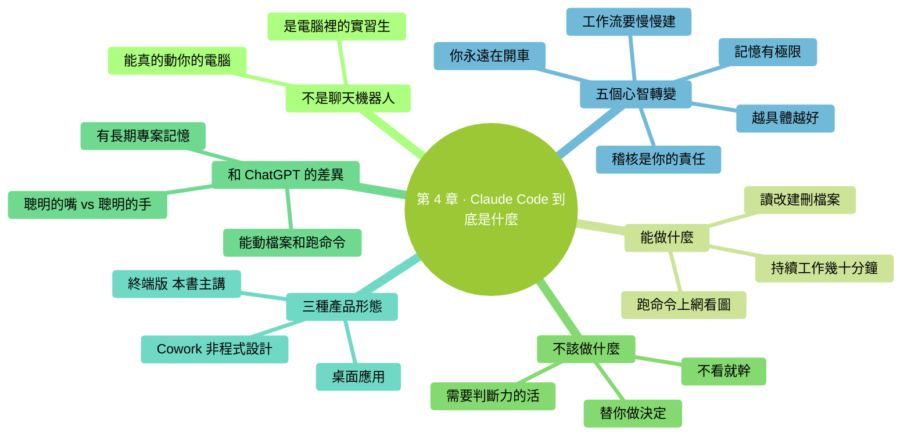

# 第 4 章：Claude Code 到底是什麼

> **本章在全書的位置**：第一部分 · 第 4 章 / 預估閱讀+動手時長：**主線 20-30 分鐘 + 支線 10-15 分鐘**
>
> **前置章節**：最好做完第 3 章（有過實際對話體驗）再讀這章——空談心智模型容易飄。
>
> **學完能做什麼（主線）**：建立起用 Claude Code 時的**正確心智模型**——它能做什麼、不能做什麼、和其他 AI 聊天工具的本質差異、你該對它抱什麼預期。沒有這個，後面學再多技巧都會跑偏。

---

## 開場三問

- **你會遇到什麼問題**：第一次用 Claude Code，很容易把它當成"更高階的 ChatGPT"——結果要麼預期過高（以為它能自動搞定一切），要麼預期過低（只當聊天用）。
- **不讀這章會踩什麼坑**：把它當聊天機器人每天閒聊；或者相反，把它當"AI 自動化機器"放任不管結果改壞檔案。這一章幫你建立正確預期。
- **讀完你會多會什麼事**：清楚它的能力邊界，什麼場景用它，什麼場景別用它，以及**你自己在整個流程裡該幹什麼**。

### 本章地圖（一眼看全貌）

<!-- diagram: MM-11 -->


---

> 🎯 **【主線】—— 本章必讀核心**
>
> 5 節，全章無需動手——這是一章**心智模型**章節。讀完你會對 Claude Code 有更清楚的直覺。預估 20-30 分鐘。

---

## 4.1 它不是聊天機器人——它是你電腦裡的"實習生"

這是理解 Claude Code 最重要的一句話：

> 📌 **Claude Code 不是聊天機器人，是一個住在你電腦裡的實習生**。

我們展開說。

### 聊天機器人（ChatGPT、Claude 網頁版）的模式

```
你打字 → AI 打字回 → 你打字 → AI 打字回 → ...
```

它只會**輸出文字**——除此之外什麼都做不了。它能幫你寫文案、解釋概念、想主意，但它碰不到你電腦上的任何檔案、裝不了任何軟體、跑不了任何命令。

### Claude Code 的模式

```
你打話 → Claude 決定要做什麼 →
  - 讀你的檔案？→ 讀
  - 改你的檔案？→ 問你要不要改，你說 Yes 才改
  - 跑個命令（比如統計、壓縮、重新命名）？→ 問你要不要跑，你說 Yes 才跑
→ 看結果，可能再決定下一步 →
→ 最後告訴你成果
```

它**真的在動你的電腦**。這是本質差異。

### 為什麼"實習生"這個比喻好

想象你招了個實習生：
- 他能做很多事（讀檔案、寫文件、跑程式）
- 但他**不知道你具體想要什麼**，需要你講清楚
- 他**每做一件可能影響重要東西的事前會問你**："這樣改可以嗎？"
- 他**不會完美**——會犯錯、會理解偏差，需要你稽核
- 他**沒有你的經驗**——同一件事你做了 10 年，他第一天來

用 Claude Code 時，你**不是在用一個 App**，你是**在帶一個實習生**。這個視角一建立，後面很多東西都通了：為什麼要稽核它的改動、為什麼要寫 CLAUDE.md（崗前培訓）、為什麼它偶爾會犯傻（經驗不夠）。

## 4.2 它能做什麼、不能做什麼

### ✅ 它能做的事

- **讀任何它能訪問的檔案**（當前工作資料夾內的，預設都能讀）
- **改檔案**（會先給你看 diff）
- **建新檔案、刪檔案、重新命名、移動**（都會先問）
- **跑命令**：整理檔案、壓縮圖片、統計資料、裝軟體、調 API……（會先問）
- **上網**（如果你允許）：搜資料、查文件、下載東西
- **看圖片**：你貼截圖、設計稿、流程圖進去它能理解
- **持續工作幾十分鐘**：給它一個複雜目標，它會分解、執行、回報

> 💡 **生活化例子**：
> - "把下載資料夾裡所有 PDF 按檔名裡的日期分類到子資料夾" ✅ 能做
> - "讀這份會議錄音轉錄文字，幫我整理成會議紀要" ✅ 能做（有合適工具的話）
> - "把這 50 個 Excel 的'已付款'列加起來" ✅ 能做
> - "幫我把我公眾號草稿改成知乎風格" ✅ 能做
> - "重構這個 React 專案的登入模組" ✅ 能做（如果你懂程式碼更好）

### ❌ 它不能做（或不該讓它做）的事

- **替你做決定**——它能給選項、講優劣，但**"選哪個"是你的事**
- **不看就幹**——它**永遠**先問你權限，你盲目選 Yes 出事它不負責
- **需要你本人創意和判斷的活**——比如"寫一篇打動我客戶的開場白"，它能起草，但最後的味道需要你改
- **跨越它視野的事**——你在 A 資料夾啟動它，它不能直接改 B 資料夾（除非你給絕對路徑）
- **即時的事**——它不知道今天什麼天氣、股價多少（除非你讓它上網查）

### ⚠️ 它能做但要小心的事

- **寫程式碼**（如果你不懂程式碼，它寫的程式碼你看不出對錯——風險高）
- **刪檔案 / 覆蓋現有檔案**（一旦 Yes，恢復不容易）
- **跑從網上下的指令碼**（可能有安全風險）
- **作業系統級設定**（能毀電腦）

這幾類第 7 章（權限機制）會專門講怎麼識別和應對。

## 4.3 和 ChatGPT / Claude 網頁版的本質區別

很多人第一次接觸 Claude Code 會問：**"我已經在用 ChatGPT 了，這個有什麼不一樣？"**

一張表說清楚：

| 維度 | ChatGPT / Claude 網頁版 | Claude Code |
|------|---------------------|-------------|
| **能不能動你的檔案** | 不能（只能輸出文字讓你複製） | 能（在你允許下） |
| **能不能跑命令** | 不能 | 能（在你允許下） |
| **持續工作** | 主要是一問一答 | 可以分解任務持續幹 |
| **長期記憶** | 部分（按賬號儲存） | 按專案儲存（`CLAUDE.md`、對話歷史） |
| **隱私** | 傳雲端 | 傳雲端（但可透過 API 或 Bedrock 等提升隔離） |
| **適合場景** | 想主意、寫草稿、解釋概念 | 真正動手的事：整檔案、做自動化、改專案 |
| **學習曲線** | 幾乎沒有 | 要先學點終端基礎 |

📌 **一句話**：**ChatGPT 是聰明的嘴，Claude Code 是聰明的手**。兩個互補，不替代。你問"這段怎麼最佳化"用 ChatGPT 都行；你說"幫我把這個資料夾裡 100 份 Excel 合併成一個總表"——必須用 Claude Code（或 Cowork）。

## 4.4 三種產品形態：你該用哪一個

第 0 章簡單提過，這裡系統講一遍——Anthropic 目前有**三種能"幹活"的產品**，你得知道自己該用哪個：

| 產品 | 介面 | 典型使用者 | 典型任務 |
|------|-----|---------|---------|
| **① Claude Code（終端版）** | 命令列 | 程式設計師 + 願意學點終端的零基礎人 | 改程式碼、重構專案、做自動化指令碼、深度檔案操作 |
| **② Claude Code 桌面應用**（2026-04 大改版） | 圖形介面：多會話側欄、拖拽面板、內嵌終端 | 上面一樣的人，但想要視覺化多工編排 | 同 ①，但一次搞 3-4 個並行任務 |
| **③ Claude Cowork** | 全圖形，不需要命令列 | **完全不寫程式碼的知識工作者**：研究員、分析師、運營、法務、財務 | 整理檔案、拆分下載、做結構化文件、資料清洗 |

### 對號入座

如果你的典型需求是：

- **"改程式碼 / 做專案" 類** → 用 **① 終端版**（本書）
- **"想要 ① 的能力但不愛切終端"** → 用 **② 桌面應用**（本書所有概念都通用，見附錄 H）
- **"整檔案、做表格、寫文件，完全不碰程式碼"** → 用 **③ Cowork**（`claude.com/cowork`），不用看本書

⚠️ **不是越複雜越好**——如果 Cowork 能滿足你，用 Cowork 反而更快上手。別為了"酷"而硬學終端。

## 4.5 調整你的預期：5 個心智轉變

很多零基礎使用者用了一兩天 Claude Code 就放棄，通常是**預期沒調整好**。下面 5 個心智轉變必須做——這是本章最值得畫線的一節。

### ① 它會犯錯——稽核是你的責任

AI 不是"絕對正確"，它生成的東西**可能有錯**。日常任務錯誤率不高，但一旦發生，**錯誤責任是你的**（你點的 Yes）。

**做法**：養成 **diff 稽核**習慣（第 6 章專講）——改檔案前那個對比圖，**掃一眼**有沒有意外改動。

### ② 你永遠在開車——它只是助手

它可以建議、可以執行，但**方向盤在你手上**。

**反模式**："Claude 你看著辦" → 它會瞎做；"Claude 這個怎麼樣" → 你讓它替你拿主意。

**正確姿勢**：你想清楚要什麼，告訴它 **WHAT / WHERE / HOW / VERIFY**（第 5 章講這個提問模板），它執行。

### ③ 描述越具體，結果越好

模糊的指令：`幫我整理一下筆記`——它會猜你要什麼，很可能猜錯。
具體的指令：`把 ~/Documents/2026會議筆記 裡所有 .md 檔案按主題分到三個子資料夾：產品 / 運營 / 技術，分類按每個檔案頭部的標題判斷`——一次就能搞定。

### ④ 它有"記憶極限"——聊太久會變糊塗

Claude Code 每次對話的記憶是有限的（這是**上下文**，第 12 章專講）。一次對話做太多不相關的事、或聊得太長，它會開始犯蠢。

**做法**：**一個任務做完就 `/clear` 開新對話**。不要把 10 個不相關的活塞一個對話裡。

### ⑤ 前兩週別指望"起飛"——先建工作流

新手前兩週通常是"先學會安全地用"——稽核、權限、退出。兩週後你開始**寫 CLAUDE.md**（第 14 章）、裝**第一個 Skill**（第 20 章），工作流才真正成型。

💡 **彆著急**。把實習生培養成骨幹員工，本來就需要時間。

---

## 本章小結

- Claude Code 是**電腦裡的實習生**，不是聊天機器人、不是自動化機器
- **它能動檔案、跑命令**（在你允許下），這是它和 ChatGPT 的本質區別
- **三種產品形態**：終端版（本書）、桌面應用（同引擎，圖形介面）、Cowork（非程式設計）
- **5 個心智轉變**：
  1. 它會犯錯，稽核是你的責任
  2. 你永遠在開車，它是助手
  3. 描述越具體，結果越好
  4. 它有記憶極限，聊久會糊塗
  5. 前兩週別指望起飛，先建工作流

---

## 動手任務

### 任務 1：心智自測——三道判斷題（2 分鐘）

對下面三句話做判斷（心裡答就行）：

1. 我讓 Claude Code 改一份檔案，它改錯了，這是誰的責任？
2. 我應該把每天所有雜活放到同一個 Claude Code 對話裡，這樣省事？
3. Claude Code 就是"能操作我電腦的 ChatGPT"，沒本質區別？

**正確答案**（建議自己先想一遍再對）：

1. **我的責任**——我點了 Yes
2. **不應該**——會導致上下文混亂、Claude 變糊塗；一事一對話
3. **有本質區別**——ChatGPT 只能輸出文字，Claude Code 能真正動電腦

### 任務 2：對號入座——你該用哪個產品（3 分鐘）

**場景**：假設你接下來有以下 3 個任務，各自適合用哪個？（① 終端 Claude Code / ② 桌面應用 / ③ Cowork）

A. "整理我去年的 500 張照片，按拍攝日期分到月份資料夾"
B. "重構我手裡那個半成品 Python 指令碼，讓它支援批次處理"
C. "同時跑 3 個並行任務，每個任務 Claude 都要做 20 分鐘"

**參考答案**：
- A → ③ Cowork（非程式設計、檔案整理）；也可以 ① 或 ②，但 Cowork 最直接
- B → ① 終端 或 ② 桌面應用
- C → ② 桌面應用（並行編排是它的強項）

---

## 如果你卡住了

**症狀：讀完這章仍然覺得"它和 ChatGPT 有啥區別"不是很明白**
- 原因：大機率是你還沒真正體驗到"它改檔案/跑命令"的場景。
- 解決：回到第 3 章任務 3（讓它改 `筆記.txt` 並稽核 diff）——親身做一次勝過讀十遍。

**症狀：不確定該用終端版還是 Cowork**
- 原因：你的使用場景還沒定。
- 解決：用一句話描述你**最想解決的問題**——如果裡面出現"程式碼、專案、指令碼"這類詞，用終端版；出現"整理、分類、合併、摘要"這類日常詞，用 Cowork。

---

主線結束。下面兩條支線講一些更深入的背景——好奇底層怎麼運作、想知道"agentic coding"到底是什麼的人可以看看。

---

> 🌿 **【支線】—— 可選深入（學有餘力再看）**

---

## 🌿 支線 4.A：Claude Code 底層是怎麼運作的（通俗版）

> **這段講什麼**：你在終端裡打字，到 Claude 改了檔案，中間到底發生了什麼。
> **什麼時候回頭讀**：用了一段時間，好奇"為什麼會是這樣"。

一個簡化流程：

```
你在終端打字
    ↓
Claude Code 把你的話 + 最近對話 + 當前資料夾結構 一起加密發到 Anthropic 伺服器
    ↓
伺服器上的 Claude 大模型"思考"，決定要做什麼：
    - "我需要先讀 X 檔案嗎？"
    - "我要改什麼檔案？怎麼改？"
    - "需要跑什麼命令？"
    ↓
它把行動計劃發回來
    ↓
Claude Code（在你電腦上）按計劃執行：
    - 要讀檔案 → 直接讀
    - 要改檔案 → 彈 diff 問你 → 你同意才改
    - 要跑命令 → 彈權限提示 → 你同意才跑
    ↓
執行結果發回伺服器，Claude 看結果再決定下一步
    ↓
迴圈直到完成，最後回覆你
```

**關鍵點**：
- "大腦"在雲端（Anthropic 伺服器）
- "手腳"在你電腦（Claude Code 本地程式）
- **兩邊透過加密通道通訊**
- **所有改動你都會看到、都需要你同意**（預設情況下）

這個架構叫 **agentic coding**（智慧體編碼）。下一條支線講。

---

## 🌿 支線 4.B：什麼是 "agentic coding"（智慧體編碼）

> **這段講什麼**：Claude Code 的這種工作方式有個專門名字，叫 agentic coding。
> **什麼時候回頭讀**：你在別人部落格/影片裡看到這個詞，不知道啥意思。

### 傳統 AI 聊天 vs agentic（智慧體）模式

**傳統聊天**：你問一句，AI 答一段，結束。AI 不記得你做了什麼、也不主動做事。

**Agentic 模式**：AI 是一個**能自主決定行動、反覆迭代直到達成目標**的實體——也就是"智慧體"（agent）。

一個 agentic 系統包括：

1. **目標**（你告訴它要什麼）
2. **感知**（讀環境：檔案、命令輸出、之前的對話）
3. **決策**（思考下一步）
4. **行動**（真的執行：改檔案、跑命令）
5. **觀察結果**（看自己行動之後發生了什麼）
6. **回到 2**，繼續迭代直到任務完成

**Claude Code 就是一個典型的 agentic 工具**。

### Agentic 的好處與坑

**好處**：
- 複雜任務一條命令搞定（你不用拆分）
- 能自我糾錯（發現錯了重來）
- 能長時間工作

**坑**：
- 可能"自作主張"做你沒想到的事（所以要稽核！）
- 可能誤入歧途浪費時間（需要你看著點）
- 複雜任務用的 token 多（成本高）

> 💡 **與 agentic 相關的其他工具**：Cursor、Aider、Devin 也都是 agentic 編碼工具，各有特色。Claude Code 的長處是**終端原生 + Anthropic 大模型 + 權限控制細緻**。

---

你已經完成第一部分（從零起步）的全部 5 章。**你現在的狀態**：能裝、能啟動、知道怎麼對話、知道它是什麼東西、建立了正確預期。

下一部分（**日常使用**）開始教你真正"用它幹活"——從讀檔案講起。

> 💡 **本書以 Claude Opus 4.7（2026-04-16 釋出）為基線寫作**。如果你想一次性瞭解 4.7 相對 4.6 的所有新變化和新手坑，可以直接讀 [附錄 J · Opus 4.7 新手指南](../附錄/J-Opus-4.7新手指南.md)——不過那是附錄，現在不讀不影響主線學習。


---

<!-- chapter-nav -->

📖  [← 第 3 章 · 你的第一次對話](03-你的第一次對話.md)  ·  [📑 返回目錄](../../README.md)  ·  [第 5 章 · 讓它讀檔案 →](../part2-日常使用/05-讓它讀檔案.md)
