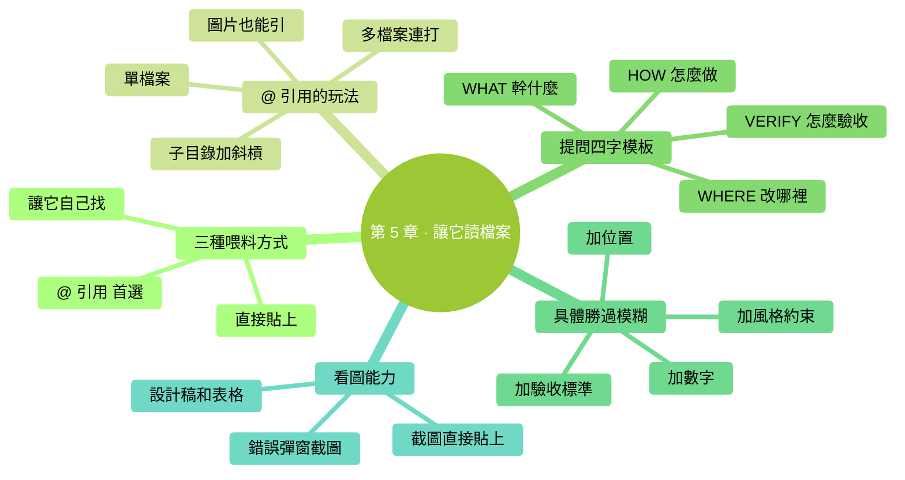

# 第 5 章：讓它讀檔案

> **本章在全書的位置**：第二部分 · 第 5 章 / 預估閱讀+動手時長：**主線 30-40 分鐘 + 支線 10-15 分鐘**
>
> **前置章節**：第 3 章（會啟動和對話）
>
> **學完能做什麼（主線）**：能用 `@` 引用讓 Claude 精準讀到你想讓它看的檔案、會用"WHAT/WHERE/HOW/VERIFY"模板提出清晰指令、讓它看懂截圖和多檔案。

---

## 開場三問

- **你會遇到什麼問題**：你讓 Claude 做事，它做出來的不是你要的——十有八九是**你沒讓它"看到"你真正想讓它處理的東西**。
- **不讀這章會踩什麼坑**：每次都要把檔案內容複製貼上到對話裡（上下文爆炸）；問得模糊，Claude 瞎猜、結果不對。
- **讀完你會多會什麼事**：能精準讓它讀指定檔案、用結構化模板問清楚需求、讓它看圖片和截圖。

### 本章地圖（一眼看全貌）

<!-- diagram: MM-12 -->


---

> 🎯 **【主線】—— 本章必讀核心**

---

## 5.1 讓 Claude "看到"內容的三種方式

要 Claude 處理什麼，它得先"看到"。有三種方式：

| 方式 | 怎麼用 | 適合什麼場景 |
|------|-------|-----------|
| **① `@` 引用** | 輸入框打 `@檔名` | 處理特定檔案——**首選** |
| **② 直接貼上** | Ctrl+V / Cmd+V 把內容貼進對話 | 短文本片段、從瀏覽器複製的一段話 |
| **③ 讓它自己找** | "看看當前資料夾裡有啥" | 你不確定要處理哪個檔案，讓它先探查 |

📌 **最重要的是掌握方式 ①**——它是 Claude Code 和 ChatGPT 的最大差異之一。

## 5.2 `@` 引用的具體用法

`@` 是 Claude Code 的"**精確指路**"符號。在輸入框裡打 `@`，會彈出一個**自動補全選單**列出當前資料夾裡的檔案，用方向鍵選或者繼續打字過濾。

### 單檔案

```
@筆記.txt 總結一下這份內容
```

Claude 會先讀 `筆記.txt`，再按你要求總結。

### 子資料夾裡的檔案

```
@Documents/週報.md 幫我改一下這份週報的語氣
```

路徑可以帶子目錄。

### 一個資料夾（讓它看這裡所有檔案）

```
@會議紀要/ 裡面每份筆記分別抓一個關鍵點
```

`@資料夾名/` 末尾帶斜槓，Claude 會把這個資料夾裡的檔案都掃一遍。

> ⚠️ **大資料夾慎用**：如果裡面有幾十上百個檔案，一次掃完**會消耗大量上下文**（下一章概念"上下文"詳講）。精準到具體檔案比"掃一個資料夾"更好。

### 多個檔案一起引

```
@第一章.md @第二章.md 把這兩章合併成一份摘要
```

連續打幾個 `@` 沒問題。

### 圖片（Mac 和 Windows 都行）

```
@設計稿.png 看這張圖，幫我把佈局描述成文字
```

Claude 能"看"截圖、設計稿、流程圖。這是個**很被低估**的能力。

💡 **讓它看當前資料夾結構而不讀具體內容** → 見 🌿 支線 5.A。

## 5.3 提問的"WHAT / WHERE / HOW / VERIFY"模板

新手最常見的毛病：**問得太籠統**。看兩個例子：

### 模糊版 ❌

```
你：@週報.md 幫我改一下這份週報
```

Claude 會猜：你想改語氣？改錯別字？加內容？刪內容？——猜中算你走運，猜偏你得反覆糾正。

### 清晰版 ✅

```
你：@週報.md 
- WHAT: 把這份週報的語氣從"嚴肅正式"改成"輕鬆簡潔"
- WHERE: 只改正文部分，不動標題和日期
- HOW: 長句拆短；去掉"茲此"、"特此"之類的官話
- VERIFY: 改完後字數不超過 500 字，看起來像朋友之間彙報進度
```

Claude 一次就能做對。

### 模板解釋

| 欄位 | 含義 | 作用 |
|-----|------|-----|
| **WHAT** | 要幹什麼 | 定義目標 |
| **WHERE** | 改哪裡 / 限制範圍 | 防止它亂動 |
| **HOW** | 具體做法、風格 | 統一審美 |
| **VERIFY** | 怎麼驗證做對了 | 給出可檢查的成果標準 |

> 💡 **不一定每次都要寫這四項**——簡單任務一句話就行（"把檔名裡的空格換成下劃線"）。但**任務越複雜，越要用這個模板**。

## 5.4 為什麼"具體"永遠比"模糊"好

再看兩組對比：

### 整理檔案

**模糊**：`幫我整理一下下載資料夾`
**具體**：`@Downloads/ 把裡面的 PDF 按檔名裡的年份分到 2024/、2025/、2026/ 三個子資料夾；沒有年份的放到"待分類/"`

### 寫東西

**模糊**：`幫我寫個文案`
**具體**：`寫一段 80 字朋友圈文案，宣傳明天下午 3 點的免費書法公開課。風格親切、口語化，帶一個 call-to-action（比如"掃碼預約"），不要用表情符號`

### 調程式碼

**模糊**：`幫我看看這程式碼哪裡不對`
**具體**：`@app.py 執行到第 42 行 toggle_dark_mode 函式時報 AttributeError。幫我定位原因，給修改建議，但先不改——我要先看方案`

**規律**：
- **加數字**（80 字、3 點）
- **加位置**（第 42 行、哪個資料夾）
- **加風格約束**（親切、不要表情）
- **加驗收標準**（帶 CTA、不要改動，先看方案）

每多一個具體限制，Claude 輸出的"中籤率"就高一截。

## 5.5 讓它看圖片：截圖是你的好朋友

Claude 能**看懂圖片**——截圖、設計稿、手繪流程圖、表格截圖、錯誤介面……這個能力特別適合：

- **貼個錯誤彈窗截圖**：`@error.png 這個報錯是什麼意思？怎麼解決？`
- **貼個設計稿讓它生成文字描述**：`@mockup.png 這個登入頁要什麼元素？給我列出來`
- **貼張手繪思維導圖**：`@腦圖.jpg 幫我把這張圖整理成結構化大綱`
- **貼 Excel 截圖讓它分析**：`@sales.png 這張銷售表裡哪個季度最好？`

### 怎麼把截圖放進去

**方式 A（推薦，最快）**：在對話裡**直接貼上**——截圖（Mac `Cmd+Shift+4` / Windows `Win+Shift+S`）截好後直接 `Cmd+V` / `Ctrl+V`，Claude Code 會把圖片貼進對話。

**方式 B**：把圖片檔案儲存到工作資料夾，然後 `@圖片名.png` 引用。

**方式 C**：拖拽圖片檔案到 Claude Code 的終端視窗（某些終端支援）。

> 💡 **對零基礎使用者特別有用**：很多場景"用文字描述好累"——**截個圖最快**。比如遇到奇怪的報錯、想讓它幫看看 Excel 某一列、想參考某個設計稿……

---

## 本章小結

- `@` 引用是**讓 Claude 精準看到內容**的最重要方式（單檔案、資料夾、圖片都能引）
- **WHAT / WHERE / HOW / VERIFY** 四字提問模板——任務越複雜越要用
- **具體**永遠比"模糊"好：加數字、加位置、加風格、加驗收
- 圖片截圖直接貼上進對話，Claude 能看懂——很多場景比文字描述快 10 倍

---

## 動手任務

### 任務 1：用 @ 引用讀並總結（5 分鐘）

**步驟**：
1. 進 `ccguide-練習` 資料夾，`claude` 啟動
2. 輸入 `@筆記.txt 用 3 條要點概括這份內容`，回車
3. 看結果

**成功標誌**：Claude 輸出的 3 條要點和檔案內容對得上。

### 任務 2：用 WHAT/WHERE/HOW/VERIFY 改一份檔案（10 分鐘）

**步驟**：
1. 桌面建一個新檔案 `草稿.md`，貼上任意一段你寫過的文字（週報、郵件、總結，200 字以上）
2. 把它複製到 `~/Desktop/ccguide-練習/` 裡
3. Claude Code 裡輸入：
   ```
   @草稿.md
   - WHAT: 改進這段文字的可讀性
   - WHERE: 只改正文，標題和簽名不動
   - HOW: 長句拆短、去重複、關鍵詞加粗
   - VERIFY: 改完看起來像適合手機閱讀的簡潔版
   ```
4. 稽核 diff，選 Yes 或 No

**成功標誌**：Claude 改出來的版本確實更好讀，你基本認可。

### 任務 3：讓它看截圖（5 分鐘）

**步驟**：
1. 截一張你電腦桌面的圖（Mac `Cmd+Shift+4` / Windows `Win+Shift+S`）
2. 切到 Claude Code 輸入框
3. 貼上（`Cmd+V` / `Ctrl+V`）
4. 問："**這張圖裡有什麼內容？**"

**成功標誌**：Claude 能說出截圖裡有的東西（應用、資料夾、大概幾個圖示等）。

---

## 如果你卡住了

**症狀 A：打 `@` 沒有彈出檔案列表**
- 原因：你不在一個有檔案的資料夾，或那個資料夾裡檔案太多被限制了。
- 解決：`Ctrl+C` 兩次退出 → `cd` 到目標資料夾 → 重新 `claude`

**症狀 B：Claude 說找不到你引用的檔案**
- 原因：檔名打錯、副檔名少了（`.txt` 和 `.md` 區分）、或檔案不在當前資料夾裡
- 解決：退出 → `ls` 看資料夾裡的準確名字 → 重新引

**症狀 C：貼上截圖沒反應**
- 原因：極少數老終端不支援。
- 解決：把截圖儲存成檔案（`Cmd+Shift+4`/`Win+Shift+S` 後選儲存到桌面），再 `@截圖名.png` 引用

---

主線結束。下面支線講讓 Claude 瀏覽整個資料夾、以及讓它讀網頁 URL 內容。

---

> 🌿 **【支線】—— 可選深入（學有餘力再看）**

---

## 🌿 支線 5.A：讓 Claude 瀏覽整個資料夾（不讀內容只看結構）

> **這段講什麼**：你不確定要處理哪個檔案，想讓 Claude 先"掃一眼"整個資料夾的結構（不讀內容）。
> **什麼時候回頭讀**：你要讓 Claude 處理一堆檔案，但不想讓它一次把內容全讀進來（上下文爆炸）。

### 場景

你有個資料夾 `~/Documents/工作` 下面 30 多個 Word 和 PDF，想讓 Claude 先告訴你每份檔案大概是啥主題，再決定讓它處理哪幾個。

### 做法

```
幫我列出 ~/Documents/工作/ 裡所有檔案的檔名和大小，不要讀內容。
```

Claude 會跑一個命令（比如 `ls -la`）列出來，不讀檔案內容，節省上下文。

然後你根據列表挑：

```
@季度報告Q1.pdf @季度報告Q2.pdf 把這兩份的要點放到一張對比表裡
```

> 💡 **原則**：**先瀏覽，再精讀**——尤其資料夾裡東西多時，這樣能省大量上下文。

---

## 🌿 支線 5.B：讓 Claude 讀網頁 / URL

> **這段講什麼**：Claude Code 能讀網址裡的內容（在你允許的情況下）。
> **什麼時候回頭讀**：你想讓 Claude 參考一篇部落格、查一個文件、看一個產品頁。

### 方式 A：直接貼 URL

```
讀一下 https://example.com/xxx 這篇部落格，幫我總結 5 個要點
```

Claude 會問你是否允許它上網，你選 Yes 它就會用內建工具去取內容。

### 方式 B：你自己用瀏覽器複製貼上

簡單粗暴但可靠——瀏覽器裡全選複製，貼到對話裡。適合：
- 頁面需要登入才能看
- 頁面有很多 JS 渲染（Claude 可能取不全）
- 你只想要某一段

### 注意

- **URL 取內容會消耗較多 token**（算在成本/上下文裡）
- **敏感資訊不要用 URL 方式**（會把 URL 傳到雲端）
- **區域網或需認證的網頁**通常 Claude 取不到——用方式 B

---

下一章講你已經初步體驗過的——**讓它改檔案**，但會把 diff 稽核、三檔習慣、挽回機制講透。


---

<!-- chapter-nav -->

📖  [← 第 4 章 · Claude Code 到底是什麼](../part1-從零起步/04-Claude-Code到底是什麼.md)  ·  [📑 返回目錄](../../README.md)  ·  [第 6 章 · 讓它改檔案 →](06-讓它改檔案.md)
