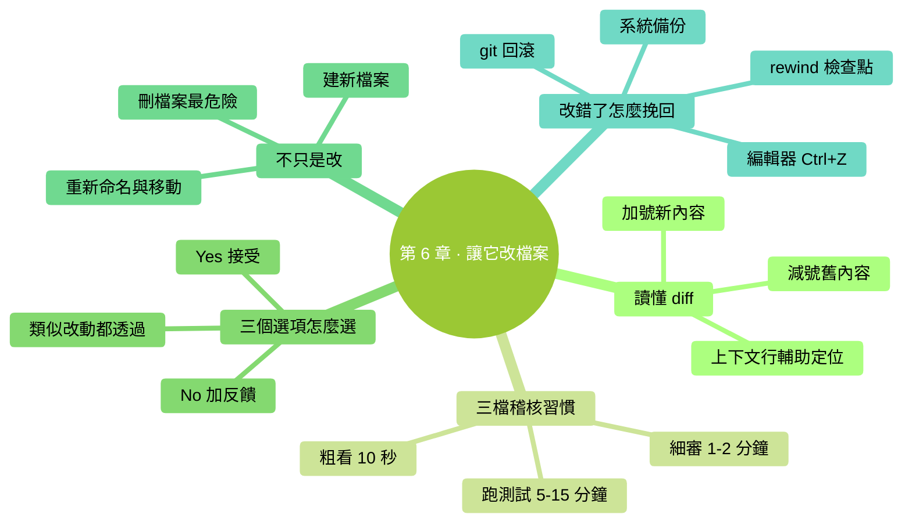

# 第 6 章：讓它改檔案

> **本章在全書的位置**：第二部分 · 第 6 章 / 預估閱讀+動手時長：**主線 30-40 分鐘 + 支線 10 分鐘**
>
> **前置章節**：Ch 3（體驗過一次改檔案）+ Ch 5（會用 @ 引用）
>
> **學完能做什麼（主線）**：看懂 diff（修改對比圖）、養成三檔稽核習慣、用熟 Accept/Reject/Edit 三個選項、讓它建/刪/重新命名檔案、改錯了知道怎麼挽回。

---

## 開場三問

- **你會遇到什麼問題**：Claude 彈出一堆紅綠對比文字，你不知道看哪裡、哪些是關鍵、哪些該警惕。
- **不讀這章會踩什麼坑**：不看 diff 直接 Yes——十次裡有一次你會發現它順便改了你不想改的地方。
- **讀完你會多會什麼事**：30 秒掃一個 diff 做出準確判斷；知道什麼時候必須細審、什麼時候可以粗看；改錯了不慌。

### 本章地圖（一眼看全貌）

<!-- diagram: MM-13 -->


---

> 🎯 **【主線】—— 本章必讀核心**

---

## 6.1 什麼是 diff（修改對比圖）

**diff** = difference 的縮寫，意思是"**修改前後的對比**"。每次 Claude 要改檔案，它都會先給你看 diff，讓你確認後再真改。

### 一個簡單 diff 長什麼樣

假設原檔案 `筆記.txt` 內容是：

```
買菜
寫週報
給媽打電話
```

你讓 Claude "每行前加編號"。它生成的 diff 是：

```
Edit: 筆記.txt

-  買菜
-  寫週報
-  給媽打電話
+  1. 買菜
+  2. 寫週報
+  3. 給媽打電話
```

### 怎麼讀

- **紅色 `-` 開頭**的行：這行被**刪除**或**替換**（舊內容）
- **綠色 `+` 開頭**的行：這行是**新增**或**替換後**（新內容）
- 沒 `-/+` 的行：沒變，不用看

> 💡 **一句話記法**：減號是舊的、加號是新的。**你看到的是"檔案即將變成的樣子"**——綠色留下、紅色消失。

### 複雜 diff 多一個上下文

檔案很大時，Claude 只會顯示改動附近的幾行（叫"上下文行"），省螢幕：

```
Edit: config.txt
   ...
   port: 8080
-  debug: false
+  debug: true
   timeout: 30
   ...
```

中間的 `port` 和 `timeout` 行沒動（沒 `-/+`），顯示是為了讓你看到改動**在檔案的什麼位置**。

## 6.2 三檔稽核習慣——別每次都細讀

不是所有 diff 都要逐字看。新手最常見的錯誤是兩極化：**要麼不看、要麼糾結到看不完**。正確做法是**分三檔**：

| 檔 | 什麼時候用 | 看什麼 | 時間 |
|---|----------|-------|-----|
| **粗看**（掃 10 秒） | 小改動、低風險檔案（筆記、草稿、自己寫的說明） | 只看改動範圍合不合理、有沒有"意外加/刪"的檔案 | 10 秒 |
| **細審**（讀 1-2 分鐘） | 中等改動、涉及關鍵內容（簡歷、合同、程式碼） | 逐行讀 `-/+`，確認每一處改動都是你要的 | 1-2 分鐘 |
| **跑測試**（5-15 分鐘） | 涉及正式資料、會被別人看到的內容、程式碼 | 接受後，**實際執行一遍**看效果；程式碼類的跑測試 | 5-15 分鐘 |

> 📌 **關鍵判斷**：**改壞了恢復成本多高**？恢復難的必須細審、要跑測試；恢復易的粗看就行。

### 三個典型例子

- **改草稿筆記**：粗看 → Yes
- **改你明天發給客戶的郵件**：細審每一句
- **改生產環境的配置檔案**：細審 + 跑測試 + 留備份

## 6.3 三個選項：Accept / Reject / Edit

每個 diff 彈出後，你有三個選項（方向鍵選、回車確認）：

```
Do you want to apply this change?
❯ Yes
  Yes, and allow similar changes for the rest of this session
  No, tell Claude what to do differently
```

### ① Yes（接受）

**選了就改**。檔案立刻被寫成新版本。適合你稽核透過、沒異議。

### ② Yes, and allow similar changes（這次對話裡類似改動都透過）

**本次對話結束前，類似的改動 Claude 直接改不用再問**。

⚠️ **新手謹慎用這個**——如果任務有幾十次類似改動（比如批次改所有檔案裡的一個詞），用這個省事；但如果你不確定"類似"會擴散到哪，選普通 Yes 更穩。

### ③ No（拒絕 + 告訴它怎麼改更好）

選了後 Claude 不會改，而是**等你說清楚**哪裡不對。

常見用法：
- "這個改動範圍太大了，只改 A 部分"
- "這種語氣不對，太正式了，口語化一點"
- "保留原來的結構，只替換關鍵詞"

Claude 會根據你的反饋**重新生成 diff** 給你看。不滿意再 No，直到滿意。

> 💡 **反覆 No 並不'煩 Claude'**——它不會生氣、不會累。反而比你將就接受然後再改回來**更省時間**。

### 有些版本還有 Edit 選項

一些 Claude Code 版本提供 `e` （Edit）——讓你**手動編輯這個 diff**，改成你想要的樣子，然後 Claude 按你的版本應用。適合你想**區域性微調**而不是整體重做。

## 6.4 不只是改——讓它建、刪、重新命名

Claude 能做的檔案操作遠不止改：

### 建新檔案

```
在當前資料夾建一個 todo.md，裡面寫今天的三件事：買菜、寫週報、打電話。
```

Claude 會顯示"即將建立"的內容，你 Yes 它就真建。

### 刪檔案

```
刪掉 ~/Downloads/ 裡所有超過一年沒動過的 .zip 檔案。
```

⚠️ **刪檔案是最危險的操作**——一旦 Yes，恢復可能很麻煩（圖形介面的"廢紙簍"有時能救、終端刪的**可能直接永久消失**）。

**做法**：
- **刪之前讓它先列出要刪的清單**（"先給我看要刪的檔名列表，別刪")
- **確認清單沒問題再讓它刪**
- 涉及重要檔案前**先備份一份到其他資料夾**

### 重新命名 / 移動

```
把這個資料夾裡所有 "2024-" 開頭的檔案，改名把字首去掉
```

改名也是先給 diff（新舊名對照），你 Yes 再執行。

## 6.5 改錯了怎麼挽回——四種路

改下去發現不對，有四種挽回方式，**按優先順序從簡單到麻煩**：

### 路 1：Ctrl + Z（如果檔案還在編輯器裡開啟）

如果這個檔案在 VS Code、Word、任何編輯器裡開啟著，**切到編輯器按撤銷**——很多時候直接就回去了。

### 路 2：Claude Code 的 /rewind

在 Claude Code 裡打：

```
/rewind
```

會列出對話中最近的幾個**檢查點**（checkpoints），你選一個回退到那個時刻——**對話歷史 + 檔案狀態**都會恢復。

還有**快捷鍵**：按**兩次 Esc 鍵**（Esc Esc），等於快速 `/rewind` 回到上一個檢查點。

> 💡 這是 Claude Code 一個超好用的救命功能。**第 9 章會專門講** `/rewind` 的細節。

### 路 3：用 git（如果你在用 git）

如果你的資料夾是一個 git 倉庫，改壞了：

```
# 看看改了啥
git diff

# 回滾到上次 commit
git checkout 檔名

# 或者回滾全部
git reset --hard
```

⚠️ 這些 git 命令**會永久丟棄未 commit 的改動**——確定要回滾再用。

> 💡 不懂 git？第 25 章會簡單講。**最基礎的做法：每次重要改動前 `git add . && git commit -m "備份"` 一下**，改壞了就 `git checkout .` 回滾。

### 路 4：從備份恢復

Mac 的 Time Machine、Windows 的檔案歷史記錄、iCloud/Dropbox 的版本歷史——這些都能恢復單個檔案的舊版本。適合改動發生了一段時間才發現問題。

---

## 本章小結

- **diff** = 修改前後對比；**紅色是舊**（消失）、**綠色是新**（留下）
- **三檔稽核**：粗看（10 秒）/ 細審（1-2 分鐘）/ 跑測試（5-15 分鐘）——**按恢復難度選檔**
- **三個選項**：Yes（接受）/ Yes 類似改動都透過（謹慎用）/ No 告訴它哪裡不對
- **刪檔案最危險**——先列清單確認再真刪
- **改錯了四種挽回**：Ctrl+Z（編輯器裡）→ `/rewind` → git → 備份

---

## 動手任務

### 任務 1：體驗完整改檔案流程（8 分鐘）

**步驟**：
1. 在 `ccguide-練習` 裡新建檔案 `日程.md`，寫 3 條安排（比如 "9 點 meeting、11 點寫稿、下午 review"）
2. 啟動 Claude Code，輸入：`@日程.md 把時間從 24 小時制改成 12 小時制並加 AM/PM`
3. 稽核 diff，選 Yes
4. 切圖形介面開啟 `日程.md`，確認變化

**成功標誌**：檔案內容按要求改了，且圖形介面能看到。

### 任務 2：主動用 No 糾正（8 分鐘）

**步驟**：
1. Claude Code 裡輸入：`@日程.md 大幅精簡一下，只保留核心關鍵詞，20 字以內`
2. Claude 會生成 diff——**看完後故意選 No**
3. 在反饋裡輸入："**保留原來的時間格式，但把描述換成更簡練的動詞開頭的短語**"
4. 看 Claude 重新給的 diff，這次 Yes

**成功標誌**：體驗到 No + 反饋是讓 Claude 調整的正常路徑。

### 任務 3：用 `/rewind` 回退（5 分鐘）

**步驟**：
1. Claude Code 裡輸入 `/rewind`
2. 看彈出的檢查點列表
3. 選"任務 2 開始之前"的那個檢查點，確認
4. 切圖形介面看 `日程.md` 是否回到任務 2 之前的狀態

**成功標誌**：檔案回到之前的樣子。

---

## 如果你卡住了

**症狀 A：diff 很長看著眼花**
- 原因：改動範圍大。
- 解決：先看有沒有你**不想動的檔案**出現在 diff 裡（比如你讓改 A，它順便改了 B）；有就 No 讓它只改 A。改動內容本身按三檔原則辦。

**症狀 B：選 Yes 後文件沒變**
- 原因：極少數檔案被其他程式鎖住（比如 Word 開啟著正在編輯）。
- 解決：關掉那個程式再試。

**症狀 C：想 /rewind 但說"沒有可回退的檢查點"**
- 原因：當前對話還沒有"寫檔案"這種動作產生檢查點，或上個檢查點已經過期。
- 解決：改用 git、編輯器 Ctrl+Z、或從備份恢復。

---

主線結束。下面支線講批次改多檔案、和讓它"改得更準"的技巧。

---

> 🌿 **【支線】—— 可選深入（學有餘力再看）**

---

## 🌿 支線 6.A：批次改多個檔案

> **這段講什麼**：一條命令改幾個、幾十個檔案。
> **什麼時候回頭讀**：你碰到"所有這些檔案都要做類似改動"的場景。

### 讓它同時改多檔案

```
@第一章.md @第二章.md @第三章.md 
把這三章開頭的"2024 年"都改成"2026 年"
```

Claude 會**依次對每個檔案生成 diff**，你一個個稽核。

### 三個 diff 都類似，簡化稽核

如果你已經看完第一個 diff 覺得很好、其餘兩個類似，選：

```
Yes, and allow similar changes for the rest of this session
```

就不會每個都彈。**但前提**：你真看清了模式，確信"類似改動都是安全的"。

### 更復雜：跑個指令碼批次改

```
把 ~/Documents/會議/ 下所有 .md 檔案的首行日期格式統一成 2026-04-19 這種
```

Claude 可能**不生成 50 個 diff**，而是跑一個指令碼遍歷改。這種情況下它會展示指令碼讓你審（變成 "權限-跑命令" 提示，見第 7 章）。

## 🌿 支線 6.B：讓它改得更準的三個技巧

> **這段講什麼**：提高 Claude 改對率的三個習慣。
> **什麼時候回頭讀**：你發現 Claude 經常改偏、需要反覆糾正。

### 技巧 1：給一兩個"期望的例子"

```
@章節列表.md 把每行末尾的字數統計格式從"(1200字)"改成"· 1.2k 字"
例子：原來 "第一章：開頭 (1200字)" 改成 "第一章：開頭 · 1.2k 字"
```

一個具體例子勝過十句解釋。

### 技巧 2：明確"不要做什麼"

```
幫我把這段英文翻譯成中文。
⚠️ 不要改變段落結構，不要合併句子，不要意譯——保持直譯的節奏。
```

告訴 Claude**別做什麼**和告訴它做什麼一樣重要。

### 技巧 3：要求它"先說計劃再動手"

```
@大檔案.md 我想把它拆成三個章節。
先告訴我你打算怎麼拆（在哪裡斷開、各章標題是什麼），我 OK 你再開始改。
```

Claude 會先說方案、等你同意後才生成 diff——省得方案錯了改一半發現問題。（這種做法和 `/plan` 計劃模式本質一樣，第 9 章會詳講）

---

下一章講 Claude Code 最重要的一個安全機制——**讓它跑命令 + 權限系統**。


---

<!-- chapter-nav -->

📖  [← 第 5 章 · 讓它讀檔案](05-讓它讀檔案.md)  ·  [📑 返回目錄](../../README.md)  ·  [第 7 章 · 跑命令與權限機制 →](07-讓它跑命令加權限機制.md)
