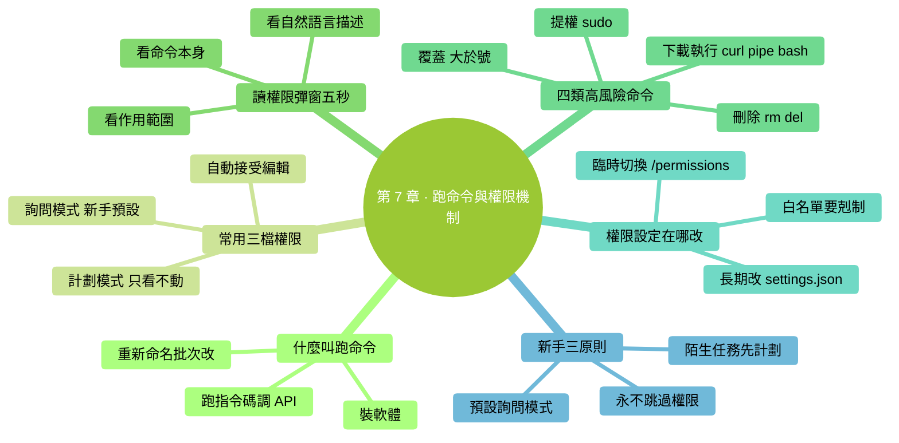
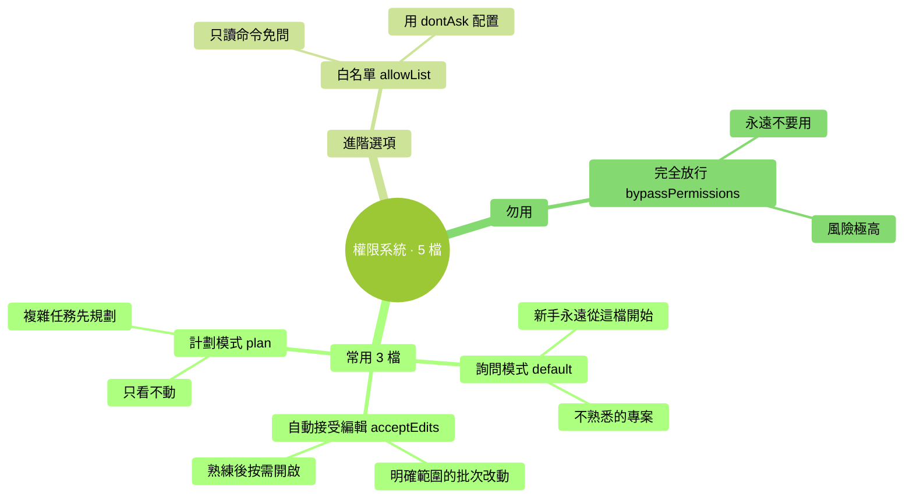

# 第 7 章：讓它跑命令 + 權限機制

> **本章在全書的位置**：第二部分 · 第 7 章 / 預估閱讀+動手時長：**主線 40-50 分鐘 + 支線 15 分鐘**
>
> **前置章節**：Ch 6（改檔案的權限/稽核概念已建立）
>
> **學完能做什麼（主線）**：理解 Claude Code 的三檔權限模式、看懂權限彈窗、識別危險命令、知道什麼時候該選允許、什麼時候該停下來。**這是 Claude Code 整個工具最重要的安全機制。**

---

## 開場三問

- **你會遇到什麼問題**：Claude 彈一個權限框問你允不允許跑一條命令——命令裡一堆英文單詞和符號，你一臉懵："這是什麼？我該點 Yes 嗎？"
- **不讀這章會踩什麼坑**：閉眼 Yes 跑到危險命令（刪檔案、裝奇怪的軟體、修改系統設定）；或反過來——啥都 No 導致 Claude 根本幹不了活。
- **讀完你會多會什麼事**：一眼識別命令類別和風險等級，該 Yes 果斷 Yes、該 No 果斷 No，還知道該用哪檔權限模式最適合你當前場景。

### 本章地圖（一眼看全貌）

<!-- diagram: MM-14 -->


---

> 🎯 **【主線】—— 本章必讀核心**

---

## 7.1 "讓它跑命令"是什麼意思

前面幾章 Claude 在乾的都是**讀檔案、改檔案**。但它還有一個更強的能力：**在你電腦上跑命令**。

"跑命令"就是讓終端執行一條指令——你在第 1 章學過的 `ls` / `cd` 是命令；裝軟體的 `npm install` 是命令；重新命名檔案的 `mv`、刪東西的 `rm`、下載的 `curl`、git 操作、跑 Python 指令碼……**全都是命令**。

### 典型場景

- "把 ~/Downloads 裡所有 PDF 重新命名，前面加今天的日期" → Claude 會跑 `mv` 迴圈
- "統計這 30 個 Excel 裡'已付款'多少條" → 跑 Python 指令碼
- "壓縮這張大圖到 500KB 以下" → 跑 `sips` 或 `imagemagick`
- "把這個專案裡的依賴都更新一下" → 跑 `npm update`
- "看看這個程序在佔資源嗎" → 跑 `ps` / `top`

**這個能力就是 Claude Code 和 ChatGPT 最大的區別之一**——但因為命令能真改動你電腦，**必須有權限機制**。

## 7.2 權限機制：5 檔簡化為 3 檔

Claude Code 提供五檔權限模式，但對零基礎使用者，**只需理解並用三檔**：

| 檔 | 官方名字 | 什麼感覺 | 什麼時候用 |
|---|---------|---------|----------|
| **1. 詢問模式** | default（預設） | 每次改檔案 / 跑命令都彈窗問你 | **新手永遠從這檔開始**；不熟悉的專案；重要檔案 |
| **2. 自動接受編輯模式** | acceptEdits | 改檔案不問（自動 Yes），跑命令仍問 | 你對這次任務很有把握，只是不想一直點 Yes |
| **3. 計劃模式** | plan | 只讀不寫——Claude 只能看和分析，**不能改檔案、不能跑命令** | 複雜任務想先讓它規劃，還沒準備好讓它動手 |

<!-- diagram: MM-03 -->


### 另外兩檔（簡單瞭解）

- **dontAsk / allowList**（白名單）：把特定命令（比如 `ls`、`git status`）標記為"以後不用問"
- **bypassPermissions**（完全放行）：⚠️ **永遠不要用**——所有權限都跳過，改檔案刪檔案跑任何命令都不問

### 怎麼切換權限模式

三種方式：

**方式 A：啟動時指定**

```
claude                           # 預設詢問模式
claude --permission-mode plan    # 計劃模式啟動（最安全的探索方式）
```

**方式 B：會話中切換**

在對話輸入框裡打：

```
/permissions
```

會彈出介面，讓你選當前會話用哪檔。

**方式 C：某次操作時臨時選**

每個權限彈窗的第二個選項"**Yes, and allow similar changes...**"（見第 6 章）就是**把這類操作的權限升到"本次會話內自動允許"**。

### 新手的三原則

1. **預設用詢問模式**——別圖快一上來就自動接受
2. **探索新專案 / 複雜任務用計劃模式**——先讓 Claude 看和分析、規劃好方案再改
3. **永遠不要用 `--dangerously-skip-permissions`**——這是 `bypassPermissions` 的命令列開關，僅限機器之間自動化場景用

## 7.3 怎麼讀權限彈窗

看到 Claude 彈出這樣的視窗時，你需要 3 秒做決定：

```
Claude wants to run:

    rm -rf ~/Downloads/*.zip

This will remove all .zip files in ~/Downloads.

❯ Allow once
  Allow always for this session
  Deny and tell Claude what to do differently
```

### 掃視順序（5 秒做決定）

**Step 1：看命令本身**——最關鍵那一行是什麼？
- `rm` = 刪
- `mv` = 移動 / 重新命名
- `cp` = 複製
- `curl` / `wget` = 下載
- `sudo ...` = 用管理員權限（**高度警惕**）
- `npm install` / `pip install` = 裝 Node.js / Python 包
- `git commit` / `git push` = 提交程式碼 / 推送程式碼

**Step 2：看命令作用範圍**——動的是你預期的檔案/位置嗎？
- `~/Downloads/*.zip` = 只動下載資料夾裡的 zip ✅ 預期
- `~/*` 或 `/*` = 整個家目錄/整個磁碟 ⚠️ 危險
- `.`（當前資料夾）= 當前位置 ✅ 通常安全

**Step 3：看描述**——Claude Code 通常會在命令下一行**用自然語言解釋這條命令在做什麼**，沒看懂命令就讀描述。

### 三個選項怎麼選

| 選項 | 含義 | 什麼時候 |
|------|-----|---------|
| **Allow once** | 允許一次，下次類似命令還會問 | 命令你看懂了、沒問題 |
| **Allow always for this session** | 本次對話裡**這類命令**以後不問 | 你確信這種命令接下來會反覆出現且都安全 |
| **Deny** | 不允許 + 讓 Claude 換個方法 | 看不懂、或這不是你想要的命令範圍 |

**新手心法**：90% 的場景選 "Allow once"——對每一次命令保留判斷權。

## 7.4 四類高風險命令——必須識別

有些命令**一旦跑錯幾乎救不回來**，必須學會一眼識別。

### 危險類 1：刪除類

```
rm -rf 路徑       # 強制遞迴刪除（刪資料夾和裡面所有東西）
rm 檔案           # 刪單個檔案
del 檔案          # Windows 刪
```

⚠️ **關鍵字**：`rm`、`del`、`-rf`（強制遞迴）

**看到就要思考**：**刪的範圍對嗎？刪錯了能恢復嗎？**

### 危險類 2：覆蓋類

```
mv A B            # 如果 B 已存在，會被 A 覆蓋
cp A B            # 同上（某些場景）
> 檔案            # 把內容寫到檔案，會覆蓋原內容
```

⚠️ **關鍵字**：`>` 單箭頭（覆蓋） vs `>>` 雙箭頭（追加）

### 危險類 3：提權類

```
sudo ...          # 用管理員權限跑（Mac）
Run as Admin ...  # Windows 提權
```

⚠️ `sudo` 開頭的任何命令都要**高度警惕**——影響範圍可能是整個作業系統。

### 危險類 4：下載 + 執行

```
curl https://xxx.com/script.sh | bash
wget xxx | sh
```

⚠️ 這種模式：**從網上下一段指令碼直接執行**。風險極高——你不知道腳本里寫了什麼。

**原則**：看到 `curl ... | bash` 或 `wget ... | sh` **先 Deny**，要求 Claude 先把內容下下來讓你看一遍再決定。

### 一個不完全清單（安全感參考）

| 命令 | 大致安全度 | 說明 |
|------|----------|-----|
| `ls` / `pwd` / `cat` / `head` / `tail` | ✅ 只讀 | 看東西，不改 |
| `mkdir` / `touch` | ✅ 新建 | 新建資料夾/空檔案 |
| `cd` | ✅ 切換 | 只改"當前位置" |
| `cp 到新位置` | 🟡 一般安全 | 複製通常無害，但目標存在會覆蓋 |
| `mv` 到新位置 | 🟡 一般 | 移動，覆蓋風險 |
| `git add` / `git commit` | 🟡 版本控制 | 改 git 狀態但不丟資料 |
| `rm` / `del` | ⚠️ 高風險 | 永久刪除 |
| `sudo` 開頭 | ⚠️ 高風險 | 提權 |
| `curl xxx \| bash` | 🔴 極高風險 | 從網下載執行 |

## 7.5 權限設定在哪改

### 臨時改（本次會話）

在 Claude Code 輸入框打 `/permissions`，按指引選。

### 永久改（所有會話）

設定檔案在 `~/.claude/settings.json`（Mac）或 `C:\Users\你的名字\.claude\settings.json`（Windows）。**不熟悉 JSON 格式就別手改**——容易寫錯一個逗號整個檔案失效。

> 💡 **更安全的做法**：讓 Claude 自己幫你改這個檔案。你跟 Claude 說："幫我把 `ls` 命令加進自動允許的白名單"，它會按格式幫你改。

具體配置項第 18 章和第 25 章會講。

### 常用白名單項

剛開始用時**可以**把這些命令加白名單省去不停確認：

- `ls`、`pwd`、`cat`、`head`、`tail`（只讀）
- `git status`、`git diff`、`git log`（只讀 git 操作）

**不要加白名單**：
- `rm`、`mv`、`cp` 等改動類
- `sudo` 開頭任何
- `curl`、`wget` 下載類
- `git push`、`git reset`（影響版本歷史或遠端）

---

## 本章小結

- Claude Code 的"跑命令"能力是它和 ChatGPT 最大的差異之一，但**必須透過權限系統**
- **新手用三檔**：詢問模式（預設）/ 自動接受編輯模式 / 計劃模式
- **永遠不要用** `--dangerously-skip-permissions` / `bypassPermissions`
- 讀權限彈窗：**命令 → 範圍 → 描述**，5 秒做決定
- **四類高風險命令**：刪除（`rm`）/ 覆蓋（`>`）/ 提權（`sudo`）/ 下載執行（`curl | bash`）
- 新手心法：**90% 的場景選 "Allow once"**

---

## 動手任務

### 任務 1：體驗詢問模式的權限彈窗（5 分鐘）

**步驟**：
1. `cd ~/Desktop/ccguide-練習`，`claude` 啟動（預設詢問模式）
2. 輸入：`列出當前資料夾所有檔案的大小，按大到小排`
3. Claude 會彈出權限框（它要跑 `ls -lS` 或類似命令）
4. 看清命令 → 選 **Allow once**
5. 看輸出

**成功標誌**：你成功決定了一次權限、看到了結果。

### 任務 2：切到計劃模式探索（10 分鐘）

**步驟**：
1. 退出當前 Claude Code（Ctrl+C 兩次）
2. 重新啟動：`claude --permission-mode plan`
3. 輸入：`幫我整理一下當前資料夾——給出整理方案`
4. Claude 會分析並**用文字輸出方案**，但**不會真的改任何東西**
5. 看方案 OK 後，`/permissions` 切回預設模式，讓它執行

**成功標誌**：計劃模式下 Claude 不會動任何檔案，只輸出建議。

### 任務 3：故意 Deny 一次（5 分鐘）

**步驟**：
1. 預設模式下，輸入：`幫我清空下載資料夾，刪掉所有內容`
2. Claude 彈出 `rm` 類命令的權限框
3. **看清命令 → 選 Deny** → 告訴它："**先列出要刪的檔案清單，別刪**"
4. Claude 改為只跑 `ls` 列表

**成功標誌**：你熟悉了 Deny + 反饋的流程；學會"先看清單、再決定刪不刪"的好習慣。

---

## 如果你卡住了

**症狀 A：權限彈窗太頻繁，每點幾下就彈一次**
- 原因：詢問模式對每個檔案/命令獨立問。
- 解決：
  - 如果這次任務確信都安全 → 選 `Yes, and allow similar for this session`
  - 任務結束後**不要保留**這種寬鬆模式進入下一個任務

**症狀 B：命令看不懂，不知道選 Yes 還是 No**
- 原因：命令太長或不熟悉。
- 解決：選 **Deny**，告訴 Claude："**用自然語言描述一下你想做什麼**"；它說人話解釋後你再決定

**症狀 C：不小心 Yes 了危險命令**
- 原因：手快或沒看清。
- 解決：
  - **立即 Ctrl+C** 中斷（來得及就能中斷）
  - 中斷後立刻檢查：被改動的檔案是否還在、git 能否回滾、備份能否恢復
  - 下次刻意放慢節奏

---

主線結束。下面支線講自動接受模式的使用場景，和白名單的建立。

---

> 🌿 **【支線】—— 可選深入（學有餘力再看）**

---

## 🌿 支線 7.A：什麼時候值得用自動接受模式（acceptEdits）

> **這段講什麼**：`acceptEdits` 權限模式的合理使用場景——不是越早開越好，但確實有合適的時機。
> **什麼時候回頭讀**：用熟了一兩週、開始覺得反覆點 Yes 很煩、能識別風險了。

### 開啟方式

啟動時：`claude --permission-mode acceptEdits`
會話中切換：`/permissions` → 選 accept edits

### 它做什麼、不做什麼

| 操作 | 預設模式 | 自動接受模式 |
|------|---------|----------|
| 改檔案（Edit/Write） | 彈 diff 問 | **自動透過，不問** |
| 跑命令（Bash） | 彈權限框問 | **仍然問** |
| 建檔案 / 刪檔案 | 彈權限框問 | **仍然問**（因為刪是不可逆風險操作） |

### 適合的場景

- **重構 / 批次改文件**——你已經給了清晰指令，Claude 會改幾十處，都是預期內的
- **明確範圍的迭代**——"把這個檔案裡所有 'foo' 改成 'bar'"這類
- **你已經做了 git commit / 備份**——改壞了能快速回滾

### 不適合的場景

- ❌ **第一次用 Claude Code**——你不熟悉它的行為
- ❌ **重要專案第一次碰**——風險過高
- ❌ **你累了 / 分心了**——稽核能力下降

⚠️ **切回預設模式的時機**：任務結束時**立刻切回**，別讓 acceptEdits 跨會話存活。

---

## 🌿 支線 7.B：建一個私人白名單

> **這段講什麼**：把常用的只讀命令加進"以後不問"的白名單，減少打斷。
> **什麼時候回頭讀**：你已經用了至少 1-2 周、識別命令風險有了直覺。

### 思路

`~/.claude/settings.json` 裡有一個 `permissions` 塊，可以定義"以後自動允許"的命令模式（叫 allowList）。

格式（示例，以 Claude Code 當前版本為準，查官方文件）：

```
"permissions": {
  "allow": [
    "Bash(ls:*)",
    "Bash(pwd)",
    "Bash(cat:*)",
    "Bash(git status)",
    "Bash(git diff:*)",
    "Bash(git log:*)"
  ]
}
```

`Bash(命令:引數模式)` 表示允許這條命令 + 引數匹配時自動透過。

### 我推薦的最小白名單（零基礎版）

只加這 6 條，都是隻讀：

```
Bash(ls:*)
Bash(pwd)
Bash(cat:*)
Bash(head:*)
Bash(tail:*)
Bash(git status)
```

### 我強烈建議**不要**加入白名單的：

- ❌ `rm` / `del`（刪）
- ❌ `mv` / `cp`（移動/複製——可能覆蓋）
- ❌ 任何 `sudo` 開頭
- ❌ `curl` / `wget`（下載）
- ❌ `npm install` / `pip install`（裝包）
- ❌ `git push` / `git reset` / `git rebase`（影響歷史或遠端）

### 怎麼改

**推薦方式**：讓 Claude 幫你改。對 Claude 說：

```
幫我在 ~/.claude/settings.json 里加一個最小白名單，包括：
ls / pwd / cat / head / tail / git status。
加之前給我看改動 diff。
```

這樣不會自己手改出 JSON 語法錯誤。

### 寫在最後

**白名單省事但要剋制**——哪怕每天少 20 次確認，一年也就少 7000 次確認；但只要有 1 次本來該 Deny 的你沒看到，損失可能抵消一年的省時。**預設模式的"累"是一種保護**。

---

至此第 7 章完成。下一章講**整個對話的工作節奏——互動迴圈七步法**，幫你把單點操作串成穩定的工作流。


---

<!-- chapter-nav -->

📖  [← 第 6 章 · 讓它改檔案](06-讓它改檔案.md)  ·  [📑 返回目錄](../../README.md)  ·  [第 8 章 · 互動迴圈七步法 →](08-互動迴圈七步法.md)
