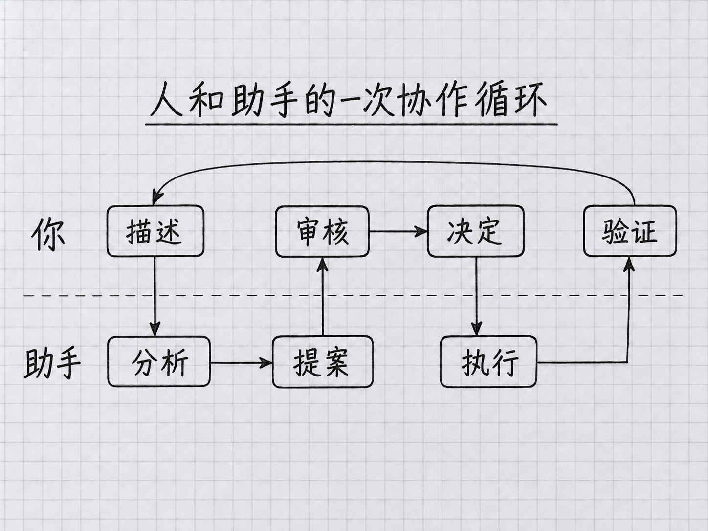

<a id="第-8-章交互循环七步法"></a>
# 第 8 章：互動迴圈七步法

> **本章在全書的位置**：第二部分 · 第 8 章 / 預估閱讀+動手時長：**主線 25-30 分鐘 + 支線 10 分鐘**
>
> **前置章節**：Ch 5（讀檔案）+ Ch 6（改檔案）+ Ch 7（許可權）
>
> **學完能做什麼（主線）**：你會知道一次"和 Claude Code 對話"不是一次簡單問答，而是一個 **7 步迴圈**。每一步你都有該做的事，做對了任務就順；做錯了哪一步、結果就跑偏在哪。

---

<a id="开场三问"></a>
## 開場三問

- **你會遇到什麼問題**：和 Claude 聊得好好的，但做出來的結果離你想要的總差那麼一點——不知道是哪一步出問題了。
- **不讀這章會踩什麼坑**：盲目問、盲目 Yes，結果反覆修、反覆改、一個任務拖一小時才做完。
- **讀完你會多會什麼事**：把一次任務當成一個清晰的七步迴圈來走——你在每步都清楚自己該做什麼、Claude 該做什麼，效率翻倍。

<a id="本章地图一眼看全貌"></a>
### 本章地圖（一眼看全貌）

本章圖解：[人和助手的一次協作迴圈](#82-七步走一遍完整流程)。

---

> 🎯 **【主線】—— 本章必讀核心**

---

<a id="81-为什么要讲交互循环"></a>
## 8.1 為什麼要講"互動迴圈"

你可能覺得用 Claude Code 就是"問一句答一句"——那是 ChatGPT 的模型。**Claude Code 不一樣，它是一個迴圈**：

- 你不只是在問問題
- 它不只是在回答
- 它會**分析、行動、觀察結果、再決定下一步**

這是教學用的分步模型。真實執行可以連續分析和執行多步，是否逐次停下取決於授權與模式；你仍需交代目標和驗收結果。理解清楚迴圈的 7 個步驟，你會明白：
- 為什麼有時候 Claude 做得很準，有時候很偏
- 你在對話裡的作用不是"問問題的人"，而是**司機 + 稽核員**
- 問題出在哪步，修哪步

<a id="82-七步走一遍完整流程"></a>
## 8.2 七步走一遍完整流程

先看一次完整的流程圖：

<!-- diagram: FIG-010 -->


*圖：七步法是一種工作習慣；實際介面不保證每輪出現七次確認。*
<!-- /diagram: FIG-010 -->

下圖按人和助手的分工串起七步。它是教學流程，實際操作按任務和許可權設定調整。

展開講，每一步名字和發生的事：

| 步驟 | 名字 | 誰在做 | 做什麼 |
|------|------|-------|-------|
| **1** | Describe 描述 | **你** | 告訴 Claude 你要什麼（用 WHAT/WHERE/HOW/VERIFY 模板更好） |
| **2** | Analyze 分析 | Claude | 讀相關檔案、理解上下文、思考方案 |
| **3** | Propose 提案 | Claude | 給出 diff（要改的檔案）或命令（要跑的事） |
| **4** | Review 稽核 | **你** | 看 diff / 看命令，判斷合不合理 |
| **5** | Decide 決定 | **你** | 接受、拒絕並反饋，或調整方案 |
| **6** | Execute 執行 | Claude | 按決定真正改檔案 / 跑命令 |
| **7** | Verify 驗證 | **你** | 看結果對不對（開啟檔案看、跑測試、檢查效果） |

**重點**：7 步裡**你佔 4 步**（描述、稽核、決定、驗證）。Claude 只佔 3 步（分析、提案、執行）。

> 💡 **這就是"你永遠在開車"的意思**——方向盤（決定權）始終在你手上。

<a id="83-每一步你的职责"></a>
## 8.3 每一步你的職責

<a id="步-1describe描述"></a>
### 步 1：Describe（描述）

**你的任務**：把想要的說清楚。

**好的描述**：具體、結構化、有成功標準
**壞的描述**："幫我搞一下"、"最佳化一下"、"修復一下"

用第 5 章的 **WHAT / WHERE / HOW / VERIFY** 模板。

<a id="步-2analyze分析-claude-自己做但你要观察"></a>
### 步 2：Analyze（分析）—— Claude 自己做，但你要觀察

Claude 可能會：
- 讀幾個檔案確認當前狀態
- 告訴你它理解到了什麼
- 問你澄清問題（"你是指 X 還是 Y？"）

**你的觀察重點**：**它理解對了嗎？** 如果它複述出來的需求和你想的不一樣，**立刻打斷**（先按 Esc 或 Ctrl+C 停止，再補充“不對，我要的是……”），別等它跑完才發現方向錯了。

<a id="步-3propose提案-claude-给方案"></a>
### 步 3：Propose（提案）—— Claude 給方案

本章以 Manual 模式下需要確認的一次修改為例。Claude 可能給出 diff 或請求許可權；已有允許規則或其他模式下可能直接執行。七步法是一種工作習慣，不是介面保證每輪依次出現七個視窗。

<a id="步-4review审核-你的主场"></a>
### 步 4：Review（稽核）—— 你的主場

用第 6 章的**三檔稽核**：粗看 / 細審 / 跑測試。

**常見的審錯**：
- 只看"改了什麼"不看"還改了什麼不該改的"
- 相信 Claude 說的"只改了 A"——它可能順手動了 B
- 沒看範圍，結果動到了你不想動的檔案

<a id="步-5decide决定"></a>
### 步 5：Decide（決定）

如果出現確認選單，按實際選項決定；下面是三種處理意圖的示意：
- **Yes**：全盤接受
- **No + 反饋**：告訴它哪裡不對
- **Edit**（如果版本支援）：手動調整它的方案

⚠️ **最容易犯的錯**：**看完 diff 覺得哪裡彆扭但說不清，懶得挑毛病直接 Yes**——這往往是後面出坑的起點。**不確定就 No**，沒壞處。

<a id="步-6execute执行-claude-真做"></a>
### 步 6：Execute（執行）—— Claude 真做

Claude 按你的決定改檔案 / 跑命令。這一步你**不需要做什麼**，等它報結果。

<a id="步-7verify验证-最容易被跳过的一步"></a>
### 步 7：Verify（驗證）—— 最容易被跳過的一步

**Claude 說"改完了" ≠ 改對了**。你必須自己確認：

- **改了檔案** → 切圖形介面開啟看一眼，或讓 Claude 再 `@文件名` 讀出來對比
- **跑了命令** → 看輸出有沒有報錯；看預期的效果真發生了嗎
- **改了多檔案** → 挑幾個看，不要 100% 相信它的"全部改完"報告

**驗證不透過怎麼辦**：直接進入下一輪迴圈——從步 1（描述什麼不對）開始。

<a id="84-三种常见跑偏--怎么拉回来"></a>
## 8.4 三種常見跑偏 + 怎麼拉回來

<a id="跑偏-a步-1-描述模糊步-3-提案离谱"></a>
### 跑偏 A：步 1 描述模糊，步 3 提案離譜

**症狀**：你讓"幫我整理一下"，Claude 整理出來的東西完全不是你要的。
**拉回**：回到步 1——**補充具體要求**：範圍、方式、成功標準。不要讓 Claude 繼續猜。

<a id="跑偏-b步-4-审核不仔细步-7-才发现问题"></a>
### 跑偏 B：步 4 稽核不仔細，步 7 才發現問題

**症狀**：diff 時沒細看，接受後開啟檔案才發現"咦，這段怎麼沒了？"
**拉回**：
1. 先停止當前動作，再用 `/rewind` 或空輸入時 Esc Esc 檢視檢查點、確認可恢復範圍（第 9 章詳講）
2. 下次同類任務**升級稽核檔位**——從粗看升到細審

<a id="跑偏-c没走步-7跳过验证"></a>
### 跑偏 C：沒走步 7（跳過驗證）

**症狀**：Claude 說"已完成"，你信了，過兩天用那個檔案發現不對。
**拉回**：養成"**每次 Yes 後掃一眼結果**"的肌肉記憶。及時核對關鍵結果，可以更早發現偏差，所需時間隨任務而變。

<a id="85-把循环刻进肌肉一个完整演示"></a>
## 8.5 把迴圈刻進肌肉——一個完整演示

一次"整理會議筆記"任務的完整七步：

| 步 | 誰做 | 內容 |
|----|------|-----|
| 1 | 你 | "@會議筆記/ 把裡面的 5 份筆記合併成一份摘要，每份筆記保留 3 條要點，按日期倒序。放到 `~/Desktop/摘要.md`" |
| 2 | Claude | 讀 5 份筆記，告訴你："讀完了，我看到日期分別是 ...，我打算這樣合併 ..." |
| 3 | Claude | 生成 diff：新建 `摘要.md` + 展示內容大綱 |
| 4 | 你 | 粗看：大綱結構對、日期順序對 ✅；想了想某份筆記想保留 4 條不是 3 條 |
| 5 | 你 | **選 No**："第三份筆記'2026 年戰略'保留 4 條要點" |
| — | — | 回到步 3，Claude 重出 diff |
| 4' | 你 | 看新 diff——OK |
| 5' | 你 | Yes |
| 6 | Claude | 真建立 `摘要.md` |
| 7 | 你 | 圖形介面開啟 `摘要.md` 瀏覽一遍——確認 OK |

這是一段教學示意，實際用時和回覆會隨材料變化。如果跳過步 4 的稽核、步 5 的 No 修正、步 7 的驗證——你可能得到一份格式不對或內容錯漏的檔案，後面再修反而更花時間。

---

<a id="本章小结"></a>
## 本章小結

- Claude Code 的一次任務是**七步迴圈**，不是簡單問答
- 你佔 4 步（描述 / 稽核 / 決定 / 驗證），Claude 佔 3 步（分析 / 提案 / 執行）
- **你永遠在開車**——方向盤一直在你手上
- 三種跑偏：描述模糊 / 稽核不仔細 / 跳過驗證——按步驟回頭修
- **驗證容易被跳過**——按風險檢查實際結果，不僅看完成提示

---

<a id="动手任务"></a>
## 動手任務

以下使用練習目錄與 Manual 模式。有確認框就稽核後決定；已有允許規則導致直接執行時，檢視實際差異再反饋，不必重複觸發。

<a id="任务-1用七步法完成一次小任务15-分钟"></a>
### 任務 1：用七步法完成一次小任務（15 分鐘）

找個你真實想做的小任務（300 字內能描述完），按七步走一遍：

**步驟**：
1. 寫下你的描述（至少三行，符合 WHAT/WHERE/HOW/VERIFY）
2. 啟動 Claude Code，把描述丟進去
3. 觀察它分析階段說了什麼——理解對了嗎？
4. 看它的 diff / 命令
5. 做決定（Yes / No / 先 No 後 Yes）
6. 讓它執行
7. **驗證**——開啟結果看或跑一下

**成功標誌**：你走完七步、每步都有意識地停頓確認了一下。

<a id="任务-2故意让它跑偏然后拉回10-分钟"></a>
### 任務 2：故意讓它跑偏，然後拉回（10 分鐘）

**步驟**：
1. 故意給一個模糊指令，比如："幫我改一下 `@笔记.txt`"
2. 看 Claude 生成的 diff——十有八九不是你想要的
3. **識別**這是"跑偏 A"（描述不夠具體）
4. **選 No**，補充具體要求（"我要改的是：把時間格式統一成 24 小時制，其他別動"）
5. 看新 diff，Yes

**成功標誌**：你體驗到"模糊描述的代價"以及"No + 反饋"的修復路徑。

---

<a id="如果你卡住了"></a>
## 如果你卡住了

**症狀 A：每次都要走完 7 步好累**
- 原因：簡單任務確實不用那麼正式。
- 解決：簡單任務（改錯字、加個標點）可以壓縮到 3-4 步（描述→稽核→Yes→瞄一眼結果）。**複雜任務才需要完整 7 步**。

**症狀 B：步 2 Claude 分析時我看不懂它在幹啥**
- 原因：分析階段 Claude 可能在讀檔案、查資料，會刷一堆"工具呼叫"資訊。
- 解決：不必每條都看，**等它輸出總結**再深入看。總結不對勁就打斷。

**症狀 C：步 7 驗證時發現不對，不知道怎麼回到步 1**
- 原因：你不知道怎麼回退。
- 解決：`/rewind` 或 Esc Esc（第 9 章講）。也可以先讓 Claude 列出本輪改動與建議的恢復範圍，確認後再做；不要在未核對副作用時要求全部回滾。

---

主線結束。下面兩條支線講"為什麼叫迴圈"、以及多輪迭代的小技巧。

---

> 🌿 **【支線】—— 可選深入（學有餘力再看）**

---

<a id="-支线-8a为什么叫循环不是流程"></a>
## 🌿 支線 8.A：為什麼叫"迴圈"，不是"流程"

> **這段講什麼**：為什麼強調是 loop（迴圈）而不是 pipeline（流水線）。
> **什麼時候回頭讀**：你好奇這個設計選擇的背後思想。

**流水線**：A→B→C→D，從頭走到尾，一次過，結束。
**迴圈**：走到某一步發現不對，**退回任意前面步驟**，繼續迭代。

Claude Code 設計成迴圈是因為：

- **現實複雜**：一次性描述清楚一個需求幾乎做不到
- **人會改主意**：走到一半發現"其實我要另一個方向"
- **AI 會犯錯**：它的第一個方案不一定是最好的

**迴圈的意義**：**不要追求一次做對，追求幾次迭代後做對**。

這也是為什麼 `/rewind` / Esc Esc / No + 反饋 這些"回退"機制存在——它們幫助你重新選擇方向，但不會逆轉任意命令或外部系統的副作用。

---

<a id="-支线-8b多轮迭代的小技巧"></a>
## 🌿 支線 8.B：多輪迭代的小技巧

> **這段講什麼**：當一個任務需要多輪調整時，怎麼讓對話保持效率。
> **什麼時候回頭讀**：你在跟 Claude 打磨一個東西（文件、程式碼、設計）需要反覆修改時。

<a id="技巧-1每轮迭代说保留-x改-y"></a>
### 技巧 1：每輪迭代說"保留 X，改 Y"

不要每次都重新描述全部需求。每輪反饋只說增量：

```
保留上一版的结构不变，只改第二段的语气——更直白一点。
```

<a id="技巧-2按任务需要整理上下文"></a>
### 技巧 2：按任務需要整理上下文

仍在同一任務且資訊有用就繼續，不按五六輪對話機械清空。目標混雜或舊方案干擾時，先儲存已確定要求、當前檔案和待辦，再選擇 `/compact`。轉入不相關任務時再用 `/clear`，並重新提供新任務需要的材料。

<a id="技巧-3让-claude-记录已确定的约定"></a>
### 技巧 3：讓 Claude 記錄"已確定的約定"

對大任務：

```
到目前为止我们已经确定了：
1. 文档用 Markdown 格式
2. 每章不超过 2000 字
3. 每章末尾加摘要

请记住这些。下面继续写第三章。
```

把已達成共識顯式列出來，避免 Claude 在迭代中漂移。

<a id="技巧-4中间阶段保存"></a>
### 技巧 4：中間階段儲存

多輪迭代中，**滿意的中間版本可以提前 git commit**（或複製一份到備份資料夾）。後面改壞了能回到任意中間點。

---

下一章講 Claude Code 的"**安全網**"——`/plan`（先規劃不動手）+ Esc Esc（開啟檢查點）+ `/rewind`（精確回退）。先了解各自邊界，再保留合適備份。
