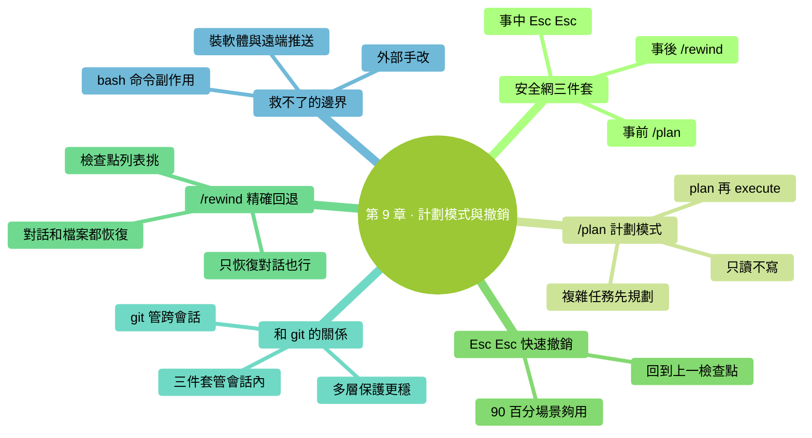

# 第 9 章：計劃模式與撤銷——Claude Code 的安全網三件套

> **本章在全書的位置**：第二部分 · 第 9 章 / 預估閱讀+動手時長：**主線 25-30 分鐘 + 支線 10 分鐘**
>
> **前置章節**：Ch 7（權限）+ Ch 8（互動迴圈）
>
> **學完能做什麼（主線）**：熟練使用 Claude Code 的三個"救命"機制——`/plan`（只規劃不動手）、Esc Esc（一鍵撤銷單步）、`/rewind`（精確回到歷史檢查點）。改錯了不慌，還能讓複雜任務有計劃地推進。

---

## 開場三問

- **你會遇到什麼問題**：複雜任務不知道怎麼下手——直接讓 Claude 改怕改錯；改到一半發現方向錯了不知道怎麼回到起點。
- **不讀這章會踩什麼坑**：走一步算一步，踩坑回不去——只能從頭重做；或者害怕踩坑所以啥都不敢讓它做。
- **讀完你會多會什麼事**：對任何複雜任務先 `/plan` 規劃、出事 Esc Esc 一鍵回退、想精確回到歷史某個時刻用 `/rewind`。這三個連用，你的"改錯焦慮"基本消除。

### 本章地圖（一眼看全貌）

<!-- diagram: MM-16 -->


---

> 🎯 **【主線】—— 本章必讀核心**

---

## 9.1 安全網三件套——先認一下

Claude Code 給了你三個層級的保護：

| 工具 | 什麼時候用 | 保護範圍 |
|------|----------|---------|
| **`/plan`（計劃模式）** | 任務開始前 | 讓 Claude 只規劃不動手——**根本不給它出錯的機會** |
| **Esc Esc（兩次 Esc）** | 剛做完一步發現不對 | 一鍵撤銷**最近一個操作** |
| **`/rewind`（精確回退）** | 想回到更早的某個時刻 | 按檢查點列表挑一個時間點回退（對話 + 檔案都恢復） |

**三層保護的關係**：

```
最前面：/plan       → 儘量不讓出事
中間：  Esc Esc     → 剛出事立刻救
事後：  /rewind     → 已經過了幾步也能救
```

下面一個個講清楚。

## 9.2 /plan 計劃模式——讓 Claude 只看不動

### 是什麼

`/plan` 是一種**權限模式**（第 7 章提過）——在這個模式下：

- ✅ Claude 可以**讀檔案**、**分析**、**思考方案**、**給你方案**
- ❌ Claude **不能改任何檔案**、**不能跑會改東西的命令**

它只能**說話**，不能**動手**。

### 什麼時候值得先 `/plan`

- **複雜任務**：涉及多檔案、多步驟、你沒有把握
- **陌生專案**：你自己都沒看過的程式碼/資料夾，先讓它探查
- **高風險改動**：改生產配置、動重要資料前
- **你拿不準方案**：不知道是方案 A 好還是方案 B 好，讓它兩個都分析

> 💡 **反面**：簡單明確的改動（"把這個檔案裡'foo'全換成'bar'"）**不用 `/plan`**，直接做就行。

### 怎麼用

**方式 A：啟動時進入**

```
claude --permission-mode plan
```

整個會話都是計劃模式。

**方式 B：會話中切換**

對話裡打：

```
/plan
```

切進計劃模式。

**方式 C：切回來做事**

計劃結束、方案定了後：

```
/permissions
```

切回預設模式（acceptEdits 也行），讓 Claude 執行方案。

### 一個典型的 plan → execute 流程

```
（計劃模式下）
你：@src/ 幫我看這個專案整體架構，分析一下如果我想加一個"使用者反饋"功能，要改哪些檔案
Claude：（讀檔案、分析）我看到這個專案是 ... 要加"使用者反饋"，建議改以下檔案：
  - A.tsx（新增表單）
  - B.ts（API 介面）
  - C.md（文件更新）
  步驟：...

你：方案看起來可行。把 A 和 B 按這個方案先做，C 我自己來。

（切回預設模式）
/permissions → 選預設

你：按剛才的方案開始改 A 和 B
Claude：（生成 diff，正常稽核迴圈）
```

這種"**先規劃後執行**"的流程叫 **plan → execute**，本書後面多處推薦。

## 9.3 Esc Esc——快速撤銷最近一步

### 是什麼

連按**兩次 Esc 鍵**（鍵盤左上角 Escape）——一次、鬆開、再一次——觸發**快速撤銷**。

作用：**回到上一個檢查點**（通常是你做最近一次改動之前的狀態）。

### 什麼時候用

- 剛讓 Claude 改了個檔案，開啟看發現改壞了
- 剛跑了個命令，效果不對
- 你剛發了條訊息但想反悔（退回到發之前）

### 一個典型場景

```
你：@config.json 把 port 從 8080 改成 9090
Claude：[生成 diff] ...
你：Yes
Claude：改好了。
你：（開啟檔案看）哦不，我意思是 port 不動，改的是 host——趕緊撤銷

→ 按兩次 Esc

你：回到改之前了。重新說：@config.json 把 host 從 localhost 改成 127.0.0.1
```

一次 Esc Esc 省了你手動恢復的麻煩。

### 和 `/rewind` 的區別

**Esc Esc** = "回到上一步"（快）
**/rewind** = "從歷史檢查點列表裡挑一個"（靈活）

日常 90% 場景 Esc Esc 就夠了。

## 9.4 /rewind——精確回到歷史檢查點

### 是什麼

在對話裡打：

```
/rewind
```

會彈出一個**檢查點列表**——Claude Code 在對話過程中自動記錄的"狀態快照"。每個檢查點通常對應：

- 你發出了一條訊息
- Claude 完成了一次工具呼叫（讀檔案、改檔案、跑命令）

你用方向鍵選一個檢查點，回車確認。

### 你能恢復什麼

`/rewind` 回退的是 **Claude Code 會話狀態**：
- ✅ 對話歷史（訊息會被回退到那個時刻）
- ✅ Claude 在**本次會話中**改過的檔案（**恢復到檢查點時的內容**）
- ❌ **不會**影響你手動（在圖形介面或其他終端）改過的檔案
- ❌ **不會**影響 Claude 跑命令改過的系統設定（比如裝的軟體）

### 選"恢復程式碼 + 對話"還是"只恢復對話"

有些版本的 `/rewind` 允許你選：

| 選項 | 效果 |
|------|------|
| **恢復對話 + 檔案** | 對話和 Claude 改過的檔案都回到檢查點 |
| **只恢復對話** | 檔案不動，只把對話歷史回退（適合你想"保留改動但換個思路重來"） |

新手預設選"恢復對話 + 檔案"。

### 一個典型場景

```
[30 分鐘前] 你讓 Claude 改了 A、B、C 三個檔案
[15 分鐘前] 你又改了 D、E、F
[現在] 你發現從改 D 開始方向就不對了，想退回到只改 A/B/C 的狀態

→ /rewind
→ 列表裡找到"改 D 之前"的那個檢查點
→ 回車確認

現在：A/B/C 的改動保留、D/E/F 的改動消失、對話回到改 D 前的瞬間。
```

你可以**基於那個時刻重新決定**怎麼繼續。

## 9.5 三件套和 git 的關係

如果你已經在用 git（程式碼版本控制），可能會問：**"有 git 了還要這三個嗎？"**

答案：**都要。它們是不同層級的保護**。

| 工具 | 作用範圍 | 粒度 |
|------|---------|-----|
| **Claude Code 安全網** | 一次 Claude Code 會話內 | 按"訊息級"——細到每一條你發的訊息 |
| **git** | 你整個專案的版本歷史 | 按"提交級"——你 commit 一次就是一個節點 |
| **編輯器 Ctrl+Z** | 單個檔案在單次編輯中的修改 | 字元級——最細 |
| **系統備份**（Time Machine / 檔案歷史） | 全盤 | 按天/小時的快照 |

**搭配建議**：

1. **開始任務前 `git commit` 一下** → 有個"乾淨基線"
2. **任務中用 `/plan` / Esc Esc / `/rewind`** → 在 Claude Code 會話內快速回退
3. **任務完成後 `git commit`** → 新的"乾淨基線"
4. **過幾天回頭看發現有問題** → `git revert` 或從備份恢復

這樣你有**四層保護**，幾乎不可能"永久改壞"一個檔案。

> 💡 **不懂 git 也沒關係**——Ch 25（團隊協作基礎）會從零講 git 基礎。**現在記住**：Claude Code 的三件套是"會話內的即時回退"，git 是"跨會話的長期版本管理"。

---

## 本章小結

- **安全網三件套**：`/plan`（不讓出事）+ Esc Esc（立刻救）+ `/rewind`（事後救）
- **`/plan` 計劃模式**：只讀不寫，適合複雜 / 陌生 / 高風險任務；plan → execute 是推薦流程
- **Esc Esc**：回退最近一步，90% 日常場景夠用
- **`/rewind`**：按檢查點列表挑時間點回退，對話 + 檔案都恢復
- **和 git 配合**：三件套管會話內、git 管跨會話，多層保護

---

## 動手任務

### 任務 1：用 plan 模式規劃一個任務（10 分鐘）

**步驟**：
1. 進 `ccguide-練習`，`claude --permission-mode plan` 啟動
2. 輸入：`@筆記.txt 我想把這份筆記改造成 GTD（Getting Things Done）風格的任務管理——規劃一下改造方案，不要改檔案`
3. Claude 會給你一個方案（只說不做）
4. 看方案：`/permissions` 切回預設
5. 說"OK，按方案開始"
6. 正常稽核 diff

**成功標誌**：你體驗了"先規劃再執行"的流程，並且計劃模式下確實沒動檔案。

### 任務 2：體驗 Esc Esc（5 分鐘）

**步驟**：
1. 預設模式下，讓 Claude 隨便改一下 `筆記.txt`（比如"把標題改成大寫"）
2. 稽核 → Yes → 改完
3. 按兩次 Esc（一次、鬆開、再一次）
4. 看提示：回退成功
5. 切圖形介面開啟 `筆記.txt` 確認回到了改之前

**成功標誌**：Esc Esc 撤銷成功，檔案回到未改狀態。

### 任務 3：用 /rewind 選一個更早的檢查點（5 分鐘）

**步驟**：
1. 在 Claude Code 裡做 3-4 次改動（不用複雜，就是讓它改幾次檔案）
2. 打 `/rewind`
3. 看彈出的檢查點列表（應該有 3-4 條）
4. 選一個比"最近一次"更早的檢查點（比如第 2 次改動之前的）
5. 確認

**成功標誌**：檔案狀態和對話都回到了你選的那個時刻。

---

## 如果你卡住了

**症狀 A：`/plan` 模式下讓它改東西它拒絕了**
- 原因：這是計劃模式的預期行為，它就是"不給改"。
- 解決：`/permissions` 切到預設或 acceptEdits 模式

**症狀 B：Esc Esc 按了沒反應**
- 原因：按太慢（中間間隔太長會被認為是兩次獨立按鍵）、或當前沒有可回退的操作
- 解決：連續按快一點；或用 `/rewind` 從列表選

**症狀 C：`/rewind` 恢復後文件還是錯的**
- 原因：那個檔案被你**在 Claude Code 外面**（圖形介面、其他程式）改過——`/rewind` 不管外面的修改
- 解決：手動恢復，或從 git / 備份拿

**症狀 D：`/rewind` 說沒有檢查點**
- 原因：剛開始對話沒幾步，還沒生成足夠多的檢查點
- 解決：這個會話暫時沒救，用 git / Ctrl+Z / 備份

---

主線結束。下面支線講 plan → execute 當預設工作流、以及 `/rewind` 的邊界。

---

> 🌿 **【支線】—— 可選深入（學有餘力再看）**

---

## 🌿 支線 9.A：把 plan → execute 當預設工作流

> **這段講什麼**：一個值得養成的習慣——幾乎所有不那麼簡單的任務都先 `/plan`。
> **什麼時候回頭讀**：你用了幾周、開始做更復雜任務時。

### 我推薦的"預設升級"

早期（前 1-2 周）：大多數任務直接做，踩坑後學習。

中期（2-4 周）：**稍複雜任務（3 步以上、涉及多檔案）預設先 `/plan`**：

```
（啟動就進 plan 模式）
claude --permission-mode plan

然後：
@目標檔案/資料夾 分析一下，告訴我要做 X 該怎麼做

看 Claude 方案 → 不滿意就讓它調整方案 → 滿意後：
/permissions → 切回 default
開始做
```

### 好處

- **避免"做一半發現方案錯了"的浪費**
- **你有機會中途糾偏**（用嘴改方案比用 diff 改實際檔案快 10 倍）
- **複雜任務的"整體感"更強**

### 代價

- 多花 3-5 分鐘討論方案
- 簡單任務走這一圈顯冗餘

> 💡 **判斷標準**：任務預計需要 Claude 做 **3 步以上**（多次改檔案或跑命令），先 `/plan`。1-2 步的直接做。

---

## 🌿 支線 9.B：`/rewind` 的邊界——它能和不能救什麼

> **這段講什麼**：`/rewind` 具體能恢復什麼、不能恢復什麼。
> **什麼時候回頭讀**：你試圖 `/rewind` 但發現沒救回來想搞清楚原因。

### `/rewind` 能救的

- ✅ Claude Code 本次會話中**發出的訊息**（回退到那個時刻）
- ✅ 本次會話中 **Claude 用 Edit/Write 工具改過的檔案**（恢復到檢查點的內容）
- ✅ 本次會話中 Claude **新建的檔案**（會被刪除，回到"未建"狀態）

### `/rewind` 救不了的

- ❌ 你**在圖形介面 / 其他終端** 改過的檔案
- ❌ Claude **透過 `bash` 命令**改過的東西（因為 bash 命令的結果 Claude Code 不知道該怎麼回退）——比如它跑了 `rm file.txt`，`/rewind` 不會把檔案變回來
- ❌ Claude 安裝的軟體 / 改的系統設定
- ❌ 已經**被 git commit / push** 的東西（那是 git 的事）
- ❌ **已經關閉會話後**再開啟——之前的檢查點不一定還在

### 邊界清楚了怎麼辦

**高風險操作的保護策略**：

| 操作型別 | 保護方式 |
|---------|---------|
| Claude 改檔案（Edit/Write） | `/rewind` 就能救 |
| Claude 跑 `rm`、`mv` 等命令 | **`/rewind` 救不了** → **操作前手動備份 / git commit** |
| 裝軟體、改系統設定 | 手動記錄可逆的步驟 |
| 遠端操作（git push、調 API） | **操作前就要特別小心**——發出去的不一定收得回 |

### 心法

`/rewind` 是**便利工具**而非**終極保險**。重要場景的終極保險永遠是：

1. **預防**：`/plan` 模式先規劃
2. **備份**：git commit / 手動複製一份
3. **分步小心**：一步一步做、每步驗證——而不是一口氣 10 步然後指望回退

---

下一章講這一部分的最後一個話題——**信任校準**：什麼時候該相信 Claude、什麼時候必須深度稽核。


---

<!-- chapter-nav -->

📖  [← 第 8 章 · 互動迴圈七步法](08-互動迴圈七步法.md)  ·  [📑 返回目錄](../../README.md)  ·  [第 10 章 · 信任校準 →](10-信任校準.md)
