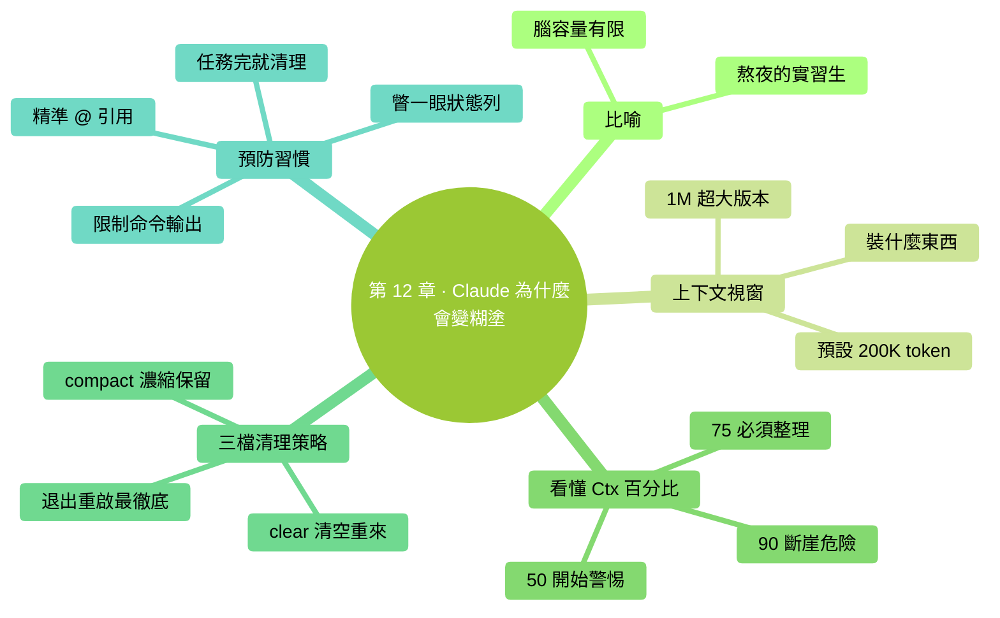

# 第 12 章：Claude 為什麼會變糊塗——上下文原理

> **本章在全書的位置**：第三部分 · 第 12 章 / 預估閱讀+動手時長：**主線 30-40 分鐘 + 支線 15 分鐘**
>
> **前置章節**：Ch 3（第一次對話）+ Ch 8（互動迴圈）
>
> **學完能做什麼（主線）**：搞清楚"**上下文**（context）"是什麼、為什麼聊久了 Claude 會開始糊塗；學會讀狀態列裡的 **Ctx%**；掌握 `/compact`、`/clear`、新開一個會話的三檔策略，把 Claude 的"腦容量"管理起來。

---

## 開場三問

- **你會遇到什麼問題**：聊到後面 Claude 開始答非所問、忘掉你前面說的設定、反覆改錯同一個地方——感覺它"變笨了"。
- **不讀這章會踩什麼坑**：**硬往一個會話裡塞東西**，越用越糟；或**亂 `/clear`**，把還需要的上下文也清掉了。
- **讀完你會多會什麼事**：看一眼狀態列就知道該不該整理記憶；知道什麼時候用 `/compact`、什麼時候 `/clear`、什麼時候直接退出開新會話。

### 本章地圖（一眼看全貌）

<!-- diagram: MM-19 -->


---

> 🎯 **【主線】—— 本章必讀核心**

---

## 12.1 比喻先行：一個熬夜的人

想象你身邊有一個很聰明的實習生，叫 Claude。他**腦容量有限**（就像人的短期記憶），能同時記住的事情大概相當於**一本小冊子的內容**。

一天開始時（對話剛開啟），他頭腦清晰，讀什麼都記得。

你不停和他對話、讓他讀檔案、讓他跑命令——這些內容一條一條**堆進他腦子裡**。小冊子越寫越滿。

滿了之後會發生什麼：
- **想不清楚**：前面講過的細節想不起來
- **答非所問**：問 A 回答 B，因為"B"剛好在記憶裡更靠前
- **重複犯錯**：你前面糾正過的事，他又犯一遍
- **任務漂移**：原本讓他做 X，結果他做著做著變成做 Y

這**不是 Bug，不是 Claude 變蠢了**——是"腦容量"這個客觀限制到頭了。

學會管理這個容量，你就解鎖了 Claude Code 的大半。

## 12.2 用技術名詞說：上下文視窗（context window）

上面那本小冊子，技術上叫**上下文視窗**。所有大模型都有這個限制，Claude 也不例外。

### 窗口裡裝了什麼

- 你說的每一句話
- Claude 的每一句回覆
- 你 `@` 引用的檔案的**全部內容**（不是摘要，是原文）
- 你讓它跑的命令的**完整輸出**（`git log` 如果幾千行，全都進去）
- CLAUDE.md 的內容（每次啟動都載入）
- Claude 自己的"系統提示"（Anthropic 給它的內部指令）
- 工具描述（能用哪些工具）

### 這個視窗多大

Claude 各模型的上下文視窗（以 **token** 為單位，1 token ≈ 0.7 個漢字或 1 個英文單詞）：

| 模型 | 視窗大小 | 大致相當於 |
|------|---------|---------|
| Sonnet 4.6 | 200,000 token | 約 15 萬漢字 / 一本中篇小說 |
| Opus 4.7（預設） | 200,000 token | 同上 |
| Opus 4.7（1M 上下文版） | 1,000,000 token | 約 75 萬漢字 / 一部長篇鉅著 |
| Haiku 4.5 | 200,000 token | 約 15 萬漢字 |

聽起來好像很多？**別高興太早**——

- 你 `@` 一個 50 萬字的 PDF，**直接爆**
- 讓它跑 `find / -name "*.md"`，幾千個檔案路徑塞滿
- 對話 3 小時不清理，來回幾十條訊息也滿了

**容量限制是客觀物理限制，不是 Anthropic 摳門**。

## 12.3 Claude Code 的狀態列：看懂 Ctx%

Claude Code 會在介面底下顯示當前**上下文使用率**（簡稱 Ctx%）。

開啟 Claude Code，注意看視窗底部狀態列（不同版本位置略有差異，但都能找到一個像 `Ctx: 34%` 或 `34%` 的數字）：

```
● Claude Opus 4.7    Ctx: 34%    ~/projects/...
```

這 34% 就是"小冊子已經寫了 34%，還剩 66% 空間"。

### 三檔訊號

| Ctx 範圍 | 狀態 | 建議動作 |
|---------|-----|--------|
| **0-50%** | 清醒 | 繼續用，不用管 |
| **50-75%** | 開始滿 | **準備整理思路**（`/compact` 或轉折點收尾） |
| **75-90%** | 明顯糊塗 | **立刻 /compact 或 /clear**——再往上效能斷崖 |
| **90%+** | 危險區 | 模型開始"遺忘早期訊息"、"答非所問"；**馬上 /clear 或新開會話** |

### 不同任務消耗速度不同

- **純對話**（只打字不讀檔案）：消耗最慢，可能聊幾小時才到 50%
- **大量讀檔案** (`@` 多個大檔案)：**消耗極快**，`@` 一個幾萬字的 PDF 就可能瞬間從 10% 跳到 60%
- **跑命令輸出很長** (`git log -n 200`、`npm install` 的日誌)：同樣快速吃容量
- **上下文裡存在一個長 diff**：持續佔位

## 12.4 三種清理策略：/compact、/clear、新會話

當 Ctx 逼近警戒線，你有三個工具：

### 策略 A：`/compact`——讓 Claude 自己整理思路

**做什麼**：Claude 把當前對話**濃縮成關鍵要點**（去掉冗長的中間步驟和廢話），然後用這個摘要替換掉原始對話。

**效果**：Ctx 大幅下降（比如 70% → 20%），**但保留核心共識和決策**。

**什麼時候用**：
- 任務還在進行中，**你不想從頭開始講**
- 對話裡有你反覆糾正的設定、達成的共識——這些要保留

**怎麼用**：
```
你：/compact
（Claude 花幾秒生成摘要，你會看到一段"已壓縮對話"的提示）
你：繼續我們剛才的活
```

**注意**：
- `/compact` 是**有失真壓縮**——細節會丟。如果某個具體變數名、具體數字後面還要用，**最好自己在壓縮前記下來**。
- 緊急情況下，`/compact` **只救你一次**。第二次又漲到 70% 時，建議直接 `/clear`。

### 策略 B：`/clear`——清空全部，從頭開始

**做什麼**：把當前對話**完全抹掉**，Claude 像剛啟動一樣。

**效果**：Ctx 回到接近 0%（只剩 CLAUDE.md 和系統提示）。

**什麼時候用**：
- **任務已經做完**，開始下一個任務
- 對話已經嚴重跑偏，整理也救不回來
- 做的事和前面完全沒關係

**怎麼用**：
```
你：/clear
（Claude 重置，下一條訊息開始就是全新對話）
```

**注意**：清掉就**拿不回來了**。如果對話裡有重要的"不想重新討論"的決策，要麼先 `/compact`，要麼在 CLAUDE.md 裡記下來。

### 策略 C：退出 + 新會話

**做什麼**：完全退出 Claude Code（Ctrl+C 兩次 或 `/exit`），重新 `claude` 啟動。

**效果**：比 `/clear` 更徹底——連臨時檔案、工具狀態都重置。

**什麼時候用**：
- 換了一個**完全不同的專案**（跨 workspace）
- Claude 出現詭異行為，`/clear` 也救不回來
- 一天結束，收工

### 三檔速查表

| 情況 | 用哪個 |
|------|-------|
| 任務正幹著，只是嫌 Ctx 高 | `/compact` |
| 任務告一段落，開始做下一件 | `/clear` |
| 換專案 / Claude 卡住了 | 退出 + 重啟 |

## 12.5 預防比清理更重要：省 Ctx 的 5 個習慣

清理是"病了再治"。**預防**才能讓你更久保持清爽狀態。

### 習慣 1：@ 引用時用具體路徑，不 `@` 整個資料夾

❌ `@整個專案/` → 可能上傳幾百個檔案
✅ `@src/components/Button.tsx` → 只傳你需要的

### 習慣 2：大檔案先問"摘要"再決定要不要細看

對於可能很長的檔案：

```
你：給我 @長文件.md 的 5 點摘要
Claude：（生成摘要）
你：第 3 點讓我看看原文對應段落
```

比直接 `@長文件.md 幫我改某段` 省 Ctx。

### 習慣 3：跑命令限制輸出

- `git log -n 10`（不是 `git log`，不設限制就全輸出）
- `ls src/` （不是 `ls -R /` 遞迴列出整個目錄）
- `cat 短檔案.txt`（不是 `cat 一個 10MB 的日誌`）

### 習慣 4：每個任務完成就 `/clear`

養成習慣：完成一件任務 → `/clear` → 開始下一件。**不要一個會話跨三天做十件事**。

### 習慣 5：定期檢查 Ctx 數字

每幾輪對話瞥一眼狀態列。**看到 > 50% 就開始想"這個任務還有多遠"**，提前規劃是 `/compact` 還是做完就 `/clear`。

---

## 本章小結

- 上下文 = Claude 的"短期工作記憶"，所有對話 / 檔案 / 命令輸出都佔用它，滿了會變糊塗
- Claude Code 狀態列的 **Ctx%** 即時顯示使用率；**50%** 警惕、**75%** 必須整理、**90%** 斷崖危險
- 三檔清理：**`/compact`（濃縮保留）→ `/clear`（全清重來）→ 退出重啟（最徹底）**
- 清理策略不對 → 要麼還是糊塗（該清沒清）、要麼丟了重要共識（清過頭）
- **預防 > 清理**：精準 `@`、限制命令輸出、每個任務完成就 `/clear`

---

## 動手任務

### 任務 1：觀察 Ctx 變化（10 分鐘）

**步驟**：

1. 啟動 Claude Code，記下啟動時的 Ctx 值（通常 1-5%）
2. `@` 引用一個你手頭的 Markdown 或 txt 檔案（越長越好）→ 記下新的 Ctx
3. 讓它跑一個 `!ls -la ~/Desktop` → 記下 Ctx
4. 來回聊 5-10 輪普通對話 → 記下 Ctx
5. 執行 `/compact` → 記下 Ctx
6. 執行 `/clear` → 記下 Ctx

**成功標誌**：你現在直觀感受到"什麼操作消耗多、什麼消耗少"。

### 任務 2：實戰一次"長任務 + 主動壓縮"（15 分鐘）

**步驟**：

1. 找一個你真實想做的稍長任務（讀 3-4 個檔案 + 寫一份報告）
2. 做到一半瞥一眼 Ctx——估計在 40%-60%？
3. **主動執行** `/compact`，觀察 Claude 生成的摘要
4. 繼續做完剩下的部分
5. 結束後 `/clear`

**成功標誌**：你體驗了"任務中段主動整理"的節奏，不再等到 90% 斷崖才慌。

### 任務 3：建立你自己的 Ctx 紀律（5 分鐘）

在你的**個人 Claude Code 使用筆記**（沒有就建一個 `~/Desktop/ccguide-練習/我的使用筆記.md`）裡寫下：

```markdown
# 我的 Ctx 紀律

- [ ] 每次啟動後先看一眼狀態列
- [ ] 做大於 3 個檔案的任務前，估計是否要 /compact
- [ ] Ctx > 50% 開始"收尾"思考
- [ ] Ctx > 75% 強制 /compact 或 /clear
- [ ] 每完成一個獨立任務就 /clear
```

**成功標誌**：你有了一份能貼在工作流裡的個人約定。

---

## 如果你卡住了

**症狀 A：狀態列找不到 Ctx 數字**
- 原因：不同版本位置不同；或你的終端太窄，狀態列被截斷。
- 解決：**把終端視窗拉寬**；或執行 `/status` 命令直接檢視（會顯示當前模型、Ctx、其他狀態）。

**症狀 B：/compact 後它忘了關鍵事情**
- 原因：壓縮是有損的，關鍵細節可能沒保留。
- 解決：**壓縮前自己記下"絕不能丟的 3 件事"**（比如具體的路徑、數字、約定），壓縮後再把這 3 條貼回去告訴它。

**症狀 C：對話沒多久 Ctx 就到 70% 了**
- 原因：你 @ 了大檔案或跑了長輸出命令。
- 解決：**別讓 Claude 讀整個大檔案**。改成：讓它先看目錄，你再 @ 具體哪一部分；命令加 `-n 20` 之類限量引數。

---

主線結束。下面支線講"上下文的內部機制細節"和"長上下文模型（1M 視窗）的適用場景"。

---

> 🌿 **【支線】—— 可選深入（學有餘力再看）**

---

## 🌿 支線 12.A：Token 是什麼——再深一層

> **這段講什麼**：上文多次提到 token，這裡說清楚 token 到底是什麼、為什麼不是"字元數"。
> **什麼時候回頭讀**：好奇為什麼一個漢字不等於一個字元、或想估算自己檔案要多少 token 時。

### 什麼是 token

Token 是模型處理文本的**最小單位**，但它不等於字元，也不等於單詞。

大致規律：
- **英文**：約 1 個單詞 = 1 token；`hello world` ≈ 2 token
- **漢字**：約 1 個漢字 = 1.5-2 token（Claude 的中文分詞偏高）
- **程式碼 / 特殊符號**：變化很大，一段 JSON 常見的 `"key":` 可能佔 3-4 token

### 實用估算

給你一個**拍腦袋公式**：

- 1,000 漢字 ≈ 1,500-2,000 token
- 10,000 英文單詞 ≈ 12,000-14,000 token
- 一份 1 萬字的 Markdown ≈ 15,000-20,000 token

所以 200K token 視窗：
- 純中文——大概能塞 **10-12 萬漢字**
- 純英文——大概能塞 **14-16 萬單詞**

### 為什麼在意 token

- **Ctx% 用的就是 token 比例**
- **Anthropic 按 token 計費**（見第 15 章）
- **`/compact` 的本質**：把原始幾萬 token 的對話**壓縮成幾千 token 的摘要**

### 怎麼查一段文字多少 token

- Anthropic 有官方 [Token Counter](https://www.anthropic.com/pricing)
- 大多數情況不用精確算——**拍腦袋估就夠**

---

## 🌿 支線 12.B：長上下文模型（1M 版本）什麼時候值得用

> **這段講什麼**：Claude Opus 4.7 有一個**1M 上下文視窗**版本——5 倍於預設的 200K。什麼時候值得切過去？
> **什麼時候回頭讀**：你發現 200K 總不夠用，在做超大任務時。

### 預設 200K 夠不夠用

對**大部分日常任務**：

- 改幾個檔案、讀幾個 PDF、寫幾篇文件——**200K 遠超需求**
- 一箇中等專案的全部程式碼——基本能塞進 200K

### 什麼場景 200K 真不夠

- **讀整本書 / 整套財報**分析——一本 30 萬字小說 = 約 50 萬 token
- **跨整個大程式碼庫**做重構分析（幾百檔案 + 歷史日誌）
- **長對話連續幾小時**不想分段

這時 1M 版本有價值。

### 1M 版本的代價

- **慢**：上下文越長，每輪迴復越慢
- **貴**：按 token 計費，用滿 1M 一次對話的成本是預設版本的 5-10 倍（見 Ch 15）
- **注意力分佈**：上下文太長時，模型**對中間部分的關注度會下降**——這叫 "lost in the middle"——所以 1M 不意味著"塞進去它就全記得"

### 切換辦法

在 Claude Code 裡執行：

```
/model
```

會彈出可選模型列表，其中有"Opus 4.7（1M context）"選項。點選切換。

**經驗法則**：
- 日常任務用 **預設 Opus 或 Sonnet**（200K 夠用、快、便宜）
- 偶爾遇到"就這一次需要特別大"的任務再**臨時切 1M**，做完切回去

---

## 🌿 支線 12.C：/compact 的工作原理

> **這段講什麼**：`/compact` 到底是怎麼壓縮的？
> **什麼時候回頭讀**：你想搞清楚它保留什麼、丟什麼時。

### 壓縮過程

1. Claude 讀完整個當前對話
2. 生成一個**結構化摘要**，大致包括：
   - 總目標是什麼
   - 已完成的關鍵步驟
   - 重要的決策和約定
   - 還未完成的子任務
   - 關鍵檔案路徑和符號名
3. 用這個摘要**替換掉原始對話歷史**
4. 上下文從"幾萬 token 長對話" → "幾千 token 摘要" → Ctx% 大幅下降

### 保留什麼、丟什麼

✅ 通常**保留**：
- 最終決策和約定
- 你反覆強調的要求
- 還沒做完的事

❌ 通常**會丟**：
- 你糾正過程中的曲折細節
- 早期被否決的方案
- 冗長的命令輸出
- 程式碼的完整內容（會變成"已讀過 XX 檔案"的記號）

### 怎麼讓壓縮更聰明

壓縮前對 Claude 說：

```
你：在 /compact 之前，請先列出你打算保留的 5 個關鍵點，
    讓我確認有沒有遺漏。
Claude：好的，我打算保留：
    1. ...
    2. ...
    ...
你：（檢查） 2 點裡別漏了 X 的決定。（確認後）OK，/compact
```

這樣壓縮質量高很多。

---

**下一章**：第 13 章"三層記憶"——會話記憶 / 自動記憶 / 專案記憶（CLAUDE.md），什麼資訊放哪層，怎麼搭建一個讓 Claude 越用越懂你的系統。


---

<!-- chapter-nav -->

📖  [← 第 11 章 · 你的資料去哪了](11-你的資料去哪了.md)  ·  [📑 返回目錄](../../README.md)  ·  [第 13 章 · 三層記憶 →](13-三層記憶.md)
