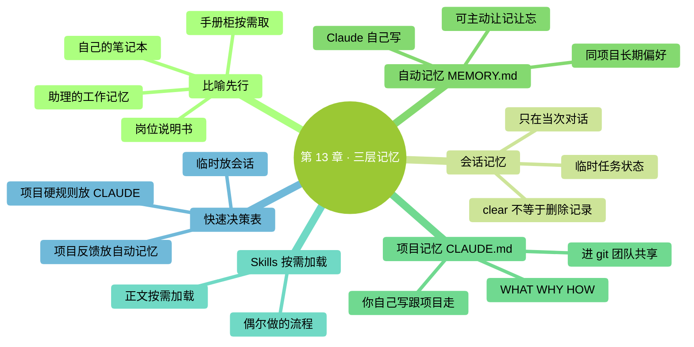
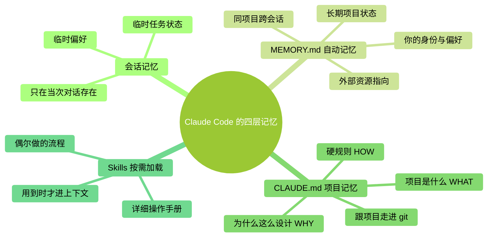

<a id="第-13-章三层记忆会话--自动记忆--claudemd"></a>
# 第 13 章：三層記憶——會話 / 自動記憶 / CLAUDE.md

> **本章在全書的位置**：第三部分 · 第 13 章 / 預估閱讀+動手時長：**主線 25-30 分鐘 + 支線 10 分鐘**
>
> **前置章節**：Ch 12（上下文原理）
>
> **學完能做什麼（主線）**：搞清楚 Claude Code 有**三層記憶系統**——當前任務（會話）/ 自動筆記（自動記憶）/ 固定說明（CLAUDE.md），以及 Skills 的"按需載入"是第四種機制。知道**什麼資訊放哪層**，不混用、不浪費、不丟失。

> **核驗日期：2026-09-24。** 本章對話和介面文字均為教學示意；請以你的版本、賬號和實際介面為準。

---

<a id="开场三问"></a>
## 開場三問

- **你會遇到什麼問題**：你告訴過 Claude 一件事，過幾天新對話它又不知道；或者把所有東西都塞進 CLAUDE.md，結果越寫越長、每次啟動慢。
- **不讀這章會踩什麼坑**：資訊"放錯層"——臨時的放到永久裡（CLAUDE.md 膨脹）、長期的只放會話裡（下次就忘）。
- **讀完你會多會什麼事**：三層各有專用場景，你能一眼判斷"這個資訊該放哪裡"，讓 Claude 越用越懂你。

<a id="本章地图一眼看全貌"></a>
### 本章地圖（一眼看全貌）

<!-- diagram: MM-20 -->


---

> 🎯 **【主線】—— 本章必讀核心**

---

<a id="131-三层记忆是什么先看比喻"></a>
## 13.1 三層記憶是什麼——先看比喻

想象你有一個助理實習生：

- **短期工作記憶**：今天上班期間你交代的事、他看過的文件。**換一張工作桌就不會自動帶上全部材料，但儲存的工作記錄可以再開啟**（會話與恢復記錄）
- **他的工作筆記本**：他自己決定記下來的要點，明天還能翻（**自動記憶 / MEMORY.md**）
- **你貼在他桌面的崗位說明書**：每天上班第一眼就看，關於這份工作的鐵規矩（**CLAUDE.md**）

再加一個**按需取用的專業手冊櫃**：工位旁邊櫃子裡放了一排手冊，平時不佔桌面，有特定任務時他才取出來翻（**Skills 技能包**）。

這個比喻幫助你分工，不代表產品內部真的有四層“大腦”。具體區別看錶：

| 層 | Claude Code 裡叫什麼 | 儲存時長 | 每次啟動自動載入？ |
|---|------------------|--------|----------------|
| 1 | **會話上下文** | 當前工作所需的資訊；會話可另存並恢復 | 新會話不自動載入另一段完整歷史 |
| 2 | **自動記憶（MEMORY.md）** | 在本機的專案記憶目錄持續儲存 | 載入簡短索引，詳情按需讀取 |
| 3 | **專案說明（CLAUDE.md）** | 檔案保留多久，說明就存在多久 | 按檔案位置和當前配置載入 |
| 4 | **Skills（技能包）** | 儲存在技能檔案中 | 描述可能先載入，完整流程按需載入 |

<!-- diagram: MM-02 -->



<a id="132-第一层会话上下文与保存的对话"></a>
## 13.2 第一層：會話上下文與儲存的對話

當前上下文，就是 Claude 此刻正在參考的材料：你的任務、它的回覆、已經讀取的檔案與工具結果。和第 12 章的“工作桌”一樣，它的空間有限，長任務可能經過壓縮。

但**換一張工作桌，不等於把檔案室燒掉**。Claude Code 會儲存會話，退出程式或執行 `/clear` 後，通常仍能繼續：

| 你想做什麼 | 入口 |
|---|---|
| 在當前目錄繼續最近一段會話 | 終端執行 `claude --continue` |
| 從儲存的會話中挑選 | 終端執行 `claude --resume` |
| 已在 Claude Code 裡，想切到另一段會話 | 輸入 `/resume` |

這些是繼續歷史的入口，不是檔案備份。之前尚未完成的命令，不會因為你恢復會話就保證自動完成；先看最後發生了什麼，再決定下一步。[會話管理說明](https://code.claude.com/docs/en/sessions)

<a id="会话里适合放什么"></a>
### 會話裡適合放什麼

當前任務做到了哪一步、這次輸出用什麼格式、你正在比較的兩種方案，都可以先放在對話裡。它們可能很重要，卻未必值得讓每個未來專案都讀一遍。

如果一條結論會在後面反覆使用，把它儲存成任務筆記或專案文件。比如“這次報告採用哪份資料、哪些問題還沒查完”，放在可閱讀的檔案裡，比指望以後翻長對話更方便。讓 Claude 繼續時，給它這份筆記，它就有明確的接力入口。

<a id="新会话为什么还可能知道一点旧事"></a>
### 新會話為什麼還可能知道一點舊事

它可能讀取了 CLAUDE.md、自動記憶或你提供的檔案，也可能是你恢復了舊會話。判斷“它記住了什麼”，先看來源，不把一次猜對當成所有歷史都已儲存。

<a id="133-第二层自动记忆memorymd"></a>
## 13.3 第二層：自動記憶（MEMORY.md）

**是什麼**：Claude Code 新版引入的**跨會話持久記憶**。Claude 在對話中**自動判斷**什麼值得記下來，儲存在當前專案的記憶目錄裡，`MEMORY.md` 主要作索引，詳細內容可能另放檔案。


<a id="放在哪"></a>
### 放在哪

預設路徑形如：

```
~/.claude/projects/<项目标识>/memory/
```

Mac 中 `~` 指你的個人目錄；Windows 是使用者配置目錄下的對應 `.claude` 資料夾。**不要自己猜專案標識**：輸入 `/memory`，從介面開啟自動記憶目錄更直接。

同一 Git 倉庫的子目錄與 worktree 通常共用一份自動記憶。它預設儲存在本機、按專案組織，不自動變成所有專案或所有電腦共享的個人資料庫。索引啟動時只載入前 200 行或 25KB，以先到的限制為準，細節按需讀。[自動記憶說明](https://code.claude.com/docs/en/memory#auto-memory)

<a id="claude-会自动记什么"></a>
### Claude 會自動記什麼

四種常見型別：

1. **使用者資訊**（user）——你是誰、做什麼工作、用什麼語言、有什麼偏好
2. **反饋 / 規矩**（feedback）——你糾正過它的地方、你明確表達過的偏好
3. **專案狀態**（project）——專案現在在做什麼階段、下週截止
4. **外部引用**（reference）——"相關內容在 Linear 的 XXX 看板"

<a id="自动记忆适合放什么"></a>
### 自動記憶適合放什麼

- **當前專案相關的身份 / 職業 / 工作場景**：有助於在這個專案裡合作
- **反覆糾正 Claude 的偏好**：不記下它下次還會犯同樣錯
- **當下的專案狀態**：你手頭的專案階段、暫停點
- **外部資源指向**：資訊的準確原始來源在哪

<a id="你可以主动操作它"></a>
### 你可以主動操作它

- **讓它記**：直接說“在這個專案裡記住：我喜歡結果用 Markdown 表格”，然後從 `/memory` 核對實際儲存的條目
- **讓它忘**：說"忘掉之前記的我喜歡咖啡"——Claude 會刪對應條目
- **手動編輯**：開啟 MEMORY.md 直接改、刪

<a id="一个关键差异"></a>
### 一個關鍵差異

**自動記憶是 Claude 留下的合作筆記，CLAUDE.md 是你維護的常駐說明。** 兩者都可能包含偏好，但目的和維護方式不同。

| 維度 | MEMORY.md | CLAUDE.md |
|-----|-----------|-----------|
| 誰寫 | **Claude 自己寫**（你也能編輯） | **你自己寫** |
| 記的是 | 在當前專案中值得複用的反饋與資訊 | 你希望持續提供的工作說明 |
| 範圍 | 預設按倉庫，在本機跨會話複用 | 可以是專案、個人全域性或組織級 |
| 更新頻率 | 日常自動更新 | 偶爾手動維護 |

<a id="134-第三层项目记忆claudemd"></a>
## 13.4 第三層：專案記憶（CLAUDE.md）

**是什麼**：一份持續提供給 Claude 的工作說明。最容易理解的用法，是在專案根目錄放 `CLAUDE.md`；全域性說明和目錄級說明見本章支線。

**存在哪裡**：`项目根目录/CLAUDE.md`，你自己建立、自己維護、和程式碼一起進 git。

**誰能看到**：團隊所有人（跟專案走），不是隻給你看。

<a id="claudemd-适合放什么"></a>
### CLAUDE.md 適合放什麼

- **專案是什麼**（WHAT）：這個倉庫做什麼、核心概念
- **為什麼這麼設計**（WHY）：關鍵決策背景——這個檔案的靈魂
- **硬規則**（HOW）：測試怎麼跑、提交前必做什麼、哪些不能碰
- **路徑地圖**：哪類程式碼在哪個目錄、重要檔案在哪

<a id="不适合放什么重要反模式"></a>
### 不適合放什麼（重要反模式）

❌ **完整的程式碼風格指南** → 讓 Claude 讀程式碼就知道了
❌ **資料庫 schema 全文** → 放在單獨文件，需要時指引它去看
❌ **10 條程式碼片段 "供參考"** → 這不是說明書，是程式碼——放程式碼裡
❌ **命令堆砌**（"可以用 A 也可以 B 也可以 C"） → 給**一個推薦**就夠
❌ **未經核對就使用自動生成的說明** → `/init` 可以起草，但你需要檢查和補充；第 14 章具體講

<a id="一个关键原则pointers--copies"></a>
### 一個關鍵原則：Pointers > Copies

**Pointers（指路）**：告訴 Claude "這個資訊在哪裡可以找到"——比如"測試策略見 `docs/testing.md`"
**Copies（複製）**：把 docs/testing.md 的全部內容**複製到 CLAUDE.md**裡

**永遠優先 Pointers**。因為：
- CLAUDE.md 每次啟動都載入（**佔 Ctx 名額**）
- 內容在兩個地方容易**不同步**
- 維護麻煩

詳見第 14 章。

<a id="135-第四层特殊skills按需加载"></a>
## 13.5 第四層（特殊）：Skills——按需載入

**是什麼**：預先寫好的任務流程。描述可能先載入，完整正文通常在你主動呼叫或 Claude 判斷需要時再讀入。

**存在哪裡**：
- **全域性 Skills**：`~/.claude/skills/<skill-name>/`
- **專案 Skills**：`.claude/skills/<skill-name>/`

<a id="和-claudemd-的关键分工"></a>
### 和 CLAUDE.md 的關鍵分工

| 維度 | CLAUDE.md | Skills |
|-----|-----------|-------|
| 載入時機 | **每次啟動都載入** | **被呼叫時才載入** |
| 佔 Ctx 預算 | 已載入說明持續佔用 | 描述可能常駐，正文使用時佔用 |
| 內容性質 | 全域性規則、硬約束 | 特定任務的操作手冊 |
| 怎麼觸發 | 自動（啟動就讀） | 使用者說"用 XX 技能"、或 Claude 判斷需要 |

<a id="例子对比"></a>
### 例子對比

- **CLAUDE.md 合適**：
  - "這個專案用 Python 3.11"
  - "測試必須 100% 透過才能 push"
  - "所有新 API 放在 `src/api/v2/`"

- **Skills 合適**：
  - "如何做一次資料庫遷移"（只有偶爾用到）
  - "如何釋出新版本到 npm"（釋出時才用）
  - "特定格式的報告模板"（寫某類報告時用）

<a id="为什么这个分工重要"></a>
### 為什麼這個分工重要

CLAUDE.md **每次啟動都載入**意味著：
- 每條字都佔用你的 Ctx 視窗
- 越大越讓 Claude 每次啟動變慢
- 內容越雜，Claude 越可能抓不住重點

而 Skills **正文主要在需要時載入**：
- 避免無關流程正文一直佔用上下文
- 可以很長、很詳細
- 不同任務用不同 skill，互不干擾

**經驗法則**：CLAUDE.md 要**短而精**，一次性多 / 偶爾性的流程放 Skills。

<a id="skills-具体怎么用"></a>
### Skills 具體怎麼用

第 20 章會完整講 Skills 入門。這裡你只需要知道**它存在、而且和 CLAUDE.md 是分工關係**。

<a id="136-快速决策表这条信息放哪层"></a>
## 13.6 快速決策表：這條資訊放哪層

面對一條新資訊，過下面這張表：

| 這條資訊的性質 | 放哪層 |
|-------------|------|
| 只是當前任務臨時要用的 | **會話**；重要階段結果另存任務筆記 |
| 當前專案裡反覆出現的反饋與偏好 | **自動記憶**（讓 Claude 記並核對） |
| 每個專案都需要的個人約定 | **個人 CLAUDE.md**（見支線 13.B） |
| 專案的硬規則，團隊每個人都要知道 | **CLAUDE.md**（寫進去，進 git） |
| 一個複雜但只偶爾做的操作流程 | **Skills**（建一個技能包） |
| 一段別人已經寫好的長文件 | **Pointer**（CLAUDE.md 寫"詳見 XXX"，不復制） |

---

<a id="本章小结"></a>
## 本章小結

- Claude Code 有**三種資訊去處 + 按需技能**：會話 → MEMORY.md → CLAUDE.md + Skills
- **會話**處理當前任務，歷史可恢復；**自動記憶**預設按專案留在本機；**CLAUDE.md**儲存固定說明；**Skills**儲存可複用流程
- **放錯層的代價**：臨時的放永久層→膨脹；長期的只放會話→每次重頭講
- **MEMORY vs CLAUDE**：一個記錄合作中值得複用的資訊，一個提供你維護的固定說明
- **Skills vs CLAUDE.md**：前者按需載入、後者每次載入——偶爾用的流程放 Skills，常駐規則放 CLAUDE.md

---

<a id="动手任务"></a>
## 動手任務


<a id="任务-1看看当前项目保存了什么5-分钟"></a>
### 任務 1：看看當前專案儲存了什麼（5 分鐘）

1. 在你常用的專案裡啟動 Claude Code。
2. 輸入 `/memory`，檢視自動記憶是否開啟，開啟對應目錄。
3. 如果存在 `MEMORY.md`，區分索引和它指向的詳細條目；沒有檔案也可能只是還沒儲存過。
4. 用 `/context` 檢查當前載入了哪些說明檔案。

**成功標誌**：你能找到當前專案的資訊來源，不再只問它“你還記得我嗎”。

<a id="任务-2主动让-claude-记一条5-分钟"></a>
### 任務 2：主動讓 Claude 記一條（5 分鐘）

**步驟**：

1. 啟動 Claude Code（找一個你經常用的專案）
2. 輸入：`记住：我喜欢回答先给结论再给步骤，不要长篇大论。`
3. 請它說明儲存在哪個條目裡
4. 從 `/memory` 開啟索引及詳細檔案，核對實際內容

**成功標誌**：你在當前專案的記憶索引或詳細條目裡找到了這條偏好。

<a id="任务-3分辨三层的练习10-分钟"></a>
### 任務 3：分辨三層的練習（10 分鐘）

下面 8 條資訊，每條判斷應該放哪層：

1. "這次對話請用英文回覆"
2. "我是一名醫生，寫的文件是臨床相關，請避免太技術的術語"
3. "本專案用 Python 3.11，測試框架是 pytest"
4. "這個倉庫的所有提交訊息必須以 `feat:` `fix:` 等字首開頭"
5. "我正在除錯的那個登入 bug 暫時擱置了，下週再看"
6. "如何給這個專案做版本釋出：7 步流程"（偶爾做）
7. "我更喜歡看圖表而不是純文字描述"
8. "這段程式碼：`function add(a,b) { return a+b }`"

把你的答案寫成 `~/Desktop/ccguide-练习/记忆分层练习.md`。

**參考答案**（做完再看）：

1. 會話 — 臨時性偏好
2. 當前專案自動記憶；若確實每個專案都需要，則寫個人 CLAUDE.md
3. CLAUDE.md — 專案硬規則
4. CLAUDE.md — 專案硬規則
5. MEMORY.md — 專案狀態（你的任務狀態）
6. **Skills** — 偶爾做的複雜流程
7. 當前專案偏好可放自動記憶；全域性約定放個人 CLAUDE.md
8. **哪一層都不應該放** —— 程式碼寫進程式碼檔案，不是記憶裡

**成功標誌**：8 題答對 6 題以上——你已經建立了分層直覺。

---

<a id="如果你卡住了"></a>
## 如果你卡住了

**症狀 A：找不到 MEMORY.md 檔案**
- 原因：自動記憶被關閉、還沒有值得儲存的內容，或當前配置使用了別的位置。並非每次會話都一定寫記憶。
- 解決：先檢查 `/memory` 的開關和目錄，再用一條非敏感的專案偏好做練習。

**症狀 B：MEMORY.md 裡記的東西不對 / 過時**
- 原因：Claude 判斷失誤，或者你的偏好變了。
- 解決：**直接開啟這個檔案手動編輯**——刪掉錯的條目、改掉過時的。MEMORY.md 就是一個普通 markdown 檔案。

**症狀 C：下次開啟新會話還是記不住**
- 原因：(a) 你在**不同專案目錄**開啟，MEMORY.md 是按專案存的；(b) 你可能用的是不帶自動記憶的老版本。
- 解決：(a) 確認在同一個工作目錄啟動；(b) 升級 Claude Code。

---

主線結束。下面支線講"MEMORY.md 的高階管理"和"全域性 vs 專案 CLAUDE.md"。

---

> 🌿 **【支線】—— 可選深入（學有餘力再看）**

---

<a id="-支线-13a高效管理你的-memorymd"></a>
## 🌿 支線 13.A：高效管理你的 MEMORY.md

> **這段講什麼**：MEMORY.md 怎麼保持乾淨、不讓它越記越亂。
> **什麼時候回頭讀**：用了幾個月後，發現記憶裡塞了一堆過時的東西。

<a id="常见问题"></a>
### 常見問題

- 舊專案狀態沒更新（還寫著"上週在做 X"，實際早完成了）
- 重複條目（同一個偏好記了三次）
- 臨時情境被當作永久偏好（某次生氣說"別再給我 emoji"，被永久記成"禁用 emoji"）

<a id="维护节奏"></a>
### 維護節奏

**每 1-2 個月**：開啟 MEMORY.md 掃一遍，做三件事：
1. 刪過時的（專案已結束 / 你已經不那麼偏好）
2. 合併重複的
3. 更新專案狀態

<a id="手动编辑的注意"></a>
### 手動編輯的注意

- Claude Code 新版本使用**兩層結構**：`MEMORY.md` 是**索引**，詳情分拆到各自小檔案
- 所以編輯時：**改索引**（MEMORY.md）和**改詳細內容**（對應的小檔案）都要做
- 具體結構開啟看一眼就懂——就是標準 markdown

<a id="让-claude-帮你整理"></a>
### 讓 Claude 幫你整理

你可以直接讓 Claude：

```
你：帮我检查 MEMORY.md，找出过时或重复的条目，给出删减建议。
Claude：（扫描后列出）
你：（确认）OK 按这个建议改
```

Claude 會用 `Edit` 工具幫你清理。

---

<a id="-支线-13b全局-claudemd-vs-项目-claudemd"></a>
## 🌿 支線 13.B：全域性 CLAUDE.md vs 專案 CLAUDE.md

> **這段講什麼**：CLAUDE.md 其實可以放在多個位置，每個位置作用不同。
> **什麼時候回頭讀**：想建立"跨所有專案"的個人程式設計規範時。

<a id="两种-claudemd"></a>
### 兩種 CLAUDE.md

1. **專案 CLAUDE.md**：`<项目根>/CLAUDE.md`——跟專案走、進 git、團隊共享
2. **全域性 CLAUDE.md**：`~/.claude/CLAUDE.md`——**你所有專案都生效**

<a id="加载顺序"></a>
### 載入順序

Claude Code 啟動時**兩者都讀**，專案說明與個人說明都可能進入上下文。避免靠相互矛盾的自然語言爭優先順序；用 `/context` 檢查載入情況，主動消除衝突。說明檔案也不能越過組織強制設定和工具許可權。

<a id="什么放全局"></a>
### 什麼放全域性

- 你**跨所有專案**的硬偏好："我寫程式碼習慣短變數名"、"解釋程式碼前先說大概思路"
- 你**不希望每個專案都要重寫一遍**的約定

<a id="什么放项目"></a>
### 什麼放專案

- **只這個專案有**的規則：技術棧、測試規範、目錄結構
- **團隊共享**的約定：程式碼風格、提交規範

<a id="两个层次的例子"></a>
### 兩個層次的例子

```markdown
# ~/.claude/CLAUDE.md （全局，只给你看）

## 我的偏好
- 回答先结论后细节
- 写代码加类型标注（Python 用 type hints、TypeScript 用 type）
- 不给我 emoji
```

```markdown
# 项目根/CLAUDE.md （项目，团队共享）

## 项目：XXX 后端

## 技术栈
- Python 3.11 + FastAPI
- 测试：pytest，必须 100% 通过才能 push

## 硬规则
- 所有 API 在 src/api/v2/ 下
- 数据库迁移用 alembic
```

兩者疊加後，Claude **同時**知道你的個人偏好 + 專案規則——互不衝突。

<a id="小陷阱"></a>
### 小陷阱

- **全域性 CLAUDE.md 不進 git**——它是你本地的，別把它跟專案混在一起
- **跟別人 pair programming 時**，注意你的全域性設定可能讓 Claude 給出"只你習慣"的答案——關鍵決策時互相確認

---

**下一章**：第 14 章"寫好你的 CLAUDE.md"——這是**全書槓桿最高的一章**。可以手寫起步，也可以讓 `/init` 幫忙。下一章講如何核對、刪減，以及在已有 AGENTS.md 的專案裡避免維護重複規則。
