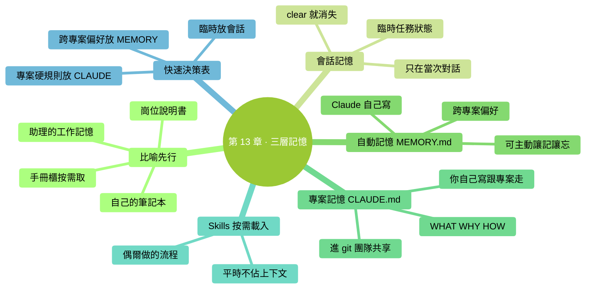
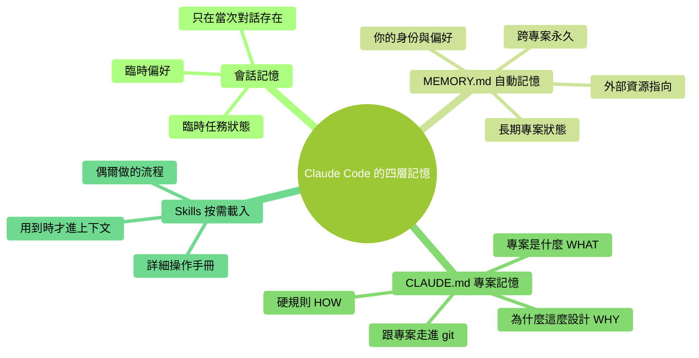

# 第 13 章：三層記憶——會話 / 自動記憶 / CLAUDE.md

> **本章在全書的位置**：第三部分 · 第 13 章 / 預估閱讀+動手時長：**主線 25-30 分鐘 + 支線 10 分鐘**
>
> **前置章節**：Ch 12（上下文原理）
>
> **學完能做什麼（主線）**：搞清楚 Claude Code 有**三層記憶系統**——短期（會話）/ 中期（自動記憶）/ 長期（CLAUDE.md），以及 Skills 的"按需載入"是第四種機制。知道**什麼資訊放哪層**，不混用、不浪費、不丟失。

---

## 開場三問

- **你會遇到什麼問題**：你告訴過 Claude 一件事，過幾天新對話它又不知道；或者把所有東西都塞進 CLAUDE.md，結果越寫越長、每次啟動慢。
- **不讀這章會踩什麼坑**：資訊"放錯層"——臨時的放到永久裡（CLAUDE.md 膨脹）、長期的只放會話裡（下次就忘）。
- **讀完你會多會什麼事**：三層各有專用場景，你能一眼判斷"這個資訊該放哪裡"，讓 Claude 越用越懂你。

### 本章地圖（一眼看全貌）

<!-- diagram: MM-20 -->


---

> 🎯 **【主線】—— 本章必讀核心**

---

## 13.1 三層記憶是什麼——先看比喻

想象你有一個助理實習生：

- **短期工作記憶**：今天上班期間你交代的事、他看過的文件。**下班回家就全忘**（會話記憶）
- **他的工作筆記本**：他自己決定記下來的要點，明天還能翻（**自動記憶 / MEMORY.md**）
- **你貼在他桌面的崗位說明書**：每天上班第一眼就看，關於這份工作的鐵規矩（**CLAUDE.md**）

再加一個**按需取用的專業手冊櫃**：工位旁邊櫃子裡放了一排手冊，平時不佔桌面，有特定任務時他才取出來翻（**Skills 技能包**）。

Claude Code 對應得**一模一樣**：

| 層 | Claude Code 裡叫什麼 | 儲存時長 | 每次啟動自動載入？ |
|---|------------------|--------|----------------|
| 1 | **會話記憶** | 當前會話內 | — |
| 2 | **自動記憶（MEMORY.md）** | 跨會話永久 | ✅ 每次啟動載入 |
| 3 | **專案記憶（CLAUDE.md）** | 跨會話永久 | ✅ 每次啟動載入 |
| 4 | **Skills（技能包）** | 跨會話永久 | ❌ 按需載入（觸發時才進上下文） |

<!-- diagram: MM-02 -->


## 13.2 第一層：會話記憶

**是什麼**：一次 `claude` 啟動到 `/exit` 或 `/clear` 之間的所有內容——你說的話、Claude 的回答、讀過的檔案、命令輸出、形成的共識。

**存在哪裡**：存在 Claude 的**短期工作記憶**裡，也就是第 12 章講的**上下文視窗**。

**什麼時候消失**：
- 執行 `/clear`
- 退出 Claude Code
- 電腦關機、程式崩潰
- Ctx% 爆了之後自動丟棄最早的內容（模型開始"遺忘"前面的）

### 會話記憶適合放什麼

- **當前任務的中間狀態**——正在改哪個檔案、已經走到哪一步
- **剛臨時說的偏好**——"這次結果用 JSON 格式"
- **探索性的對話**——你在和 Claude 一起思考，還沒定型

### 不適合放什麼

- **以後多次會用的約定**——"我的程式碼風格偏好是 XX"這種說一次、以後都適用的事
- **專案的硬規定**——"這個專案測試必須過、不能用某某庫"
- **你自己的長期身份資訊**——"我是做產品運營的"這種每次都適用的

這些**放錯地方就會在下次 `/clear` 後全消失**。

### 一個常見誤會

很多人以為"Claude 聊過的事以後都會記得"——**完全不是**。預設情況下，每次新會話它**完全重置**，只知道 CLAUDE.md 和 MEMORY.md 裡的內容。

## 13.3 第二層：自動記憶（MEMORY.md）

**是什麼**：Claude Code 新版引入的**跨會話持久記憶**。Claude 在對話中**自動判斷**什麼值得記下來，寫進一個 `MEMORY.md` 檔案裡。下次啟動時自動讀回來。

### 放在哪

不同系統路徑略有不同，但大致：

```
Mac/Linux: ~/.claude/projects/<專案路徑hash>/memory/MEMORY.md
Windows: %USERPROFILE%\.claude\projects\<專案路徑hash>\memory\MEMORY.md
```

你可以直接開啟這個檔案**看 Claude 給你記了什麼**。

### Claude 會自動記什麼

四種常見型別：

1. **使用者資訊**（user）——你是誰、做什麼工作、用什麼語言、有什麼偏好
2. **反饋 / 規矩**（feedback）——你糾正過它的地方、你明確表達過的偏好
3. **專案狀態**（project）——專案現在在做什麼階段、下週截止
4. **外部引用**（reference）——"相關內容在 Linear 的 XXX 看板"

### 自動記憶適合放什麼

- **你的身份 / 職業 / 工作場景**：跨專案都適用
- **反覆糾正 Claude 的偏好**：不記下它下次還會犯同樣錯
- **當下的專案狀態**：你手頭的專案階段、暫停點
- **外部資源指向**：資訊的準確原始來源在哪

### 你可以主動操作它

- **讓它記**：直接說"記住：我喜歡結果用 markdown 表格"——Claude 會寫進 MEMORY.md
- **讓它忘**：說"忘掉之前記的我喜歡咖啡"——Claude 會刪對應條目
- **手動編輯**：開啟 MEMORY.md 直接改、刪

### 一個關鍵差異

**MEMORY.md 是"Claude 對你的記憶"，CLAUDE.md 是"你對 Claude 的指令"**——方向相反。

| 維度 | MEMORY.md | CLAUDE.md |
|-----|-----------|-----------|
| 誰寫 | **Claude 自己寫**（你也能編輯） | **你自己寫** |
| 記的是 | 關於**你**的事實 | 關於**專案 / 團隊**的規則 |
| 範圍 | 通常**跨專案**（在 ~/.claude 下） | **繫結某個專案**（在專案根目錄） |
| 更新頻率 | 日常自動更新 | 偶爾手動維護 |

## 13.4 第三層：專案記憶（CLAUDE.md）

**是什麼**：一個放在**專案根目錄**的 `CLAUDE.md` 檔案，Claude Code 每次在這個專案裡啟動時**都讀一遍**。

**存在哪裡**：`專案根目錄/CLAUDE.md`，你自己建立、自己維護、和程式碼一起進 git。

**誰能看到**：團隊所有人（跟專案走），不是隻給你看。

### CLAUDE.md 適合放什麼

- **專案是什麼**（WHAT）：這個倉庫做什麼、核心概念
- **為什麼這麼設計**（WHY）：關鍵決策背景——這個檔案的靈魂
- **硬規則**（HOW）：測試怎麼跑、提交前必做什麼、哪些不能碰
- **路徑地圖**：哪類程式碼在哪個目錄、重要檔案在哪

### 不適合放什麼（重要反模式）

❌ **完整的程式碼風格指南** → 讓 Claude 讀程式碼就知道了
❌ **資料庫 schema 全文** → 放在單獨文件，需要時指引它去看
❌ **10 條程式碼片段 "供參考"** → 這不是說明書，是程式碼——放程式碼裡
❌ **命令堆砌**（"可以用 A 也可以 B 也可以 C"） → 給**一個推薦**就夠
❌ **用 `/init` 一鍵生成的一大坨** → 第 14 章專門講為什麼這是反模式

### 一個關鍵原則：Pointers > Copies

**Pointers（指路）**：告訴 Claude "這個資訊在哪裡可以找到"——比如"測試策略見 `docs/testing.md`"
**Copies（複製）**：把 docs/testing.md 的全部內容**複製到 CLAUDE.md**裡

**永遠優先 Pointers**。因為：
- CLAUDE.md 每次啟動都載入（**佔 Ctx 名額**）
- 內容在兩個地方容易**不同步**
- 維護麻煩

詳見第 14 章。

## 13.5 第四層（特殊）：Skills——按需載入

**是什麼**：預先寫好的一整套操作流程，**平時不佔上下文**，只在你呼叫它時才載入。

**存在哪裡**：
- **全域性 Skills**：`~/.claude/skills/<skill-name>/`
- **專案 Skills**：`.claude/skills/<skill-name>/`

### 和 CLAUDE.md 的關鍵分工

| 維度 | CLAUDE.md | Skills |
|-----|-----------|-------|
| 載入時機 | **每次啟動都載入** | **被呼叫時才載入** |
| 佔 Ctx 預算 | **每次都佔** | **只在用到時佔** |
| 內容性質 | 全域性規則、硬約束 | 特定任務的操作手冊 |
| 怎麼觸發 | 自動（啟動就讀） | 使用者說"用 XX 技能"、或 Claude 判斷需要 |

### 例子對比

- **CLAUDE.md 合適**：
  - "這個專案用 Python 3.11"
  - "測試必須 100% 透過才能 push"
  - "所有新 API 放在 `src/api/v2/`"

- **Skills 合適**：
  - "如何做一次資料庫遷移"（只有偶爾用到）
  - "如何釋出新版本到 npm"（釋出時才用）
  - "特定格式的報告模板"（寫某類報告時用）

### 為什麼這個分工重要

CLAUDE.md **每次啟動都載入**意味著：
- 每條字都佔用你的 Ctx 視窗
- 越大越讓 Claude 每次啟動變慢
- 內容越雜，Claude 越可能抓不住重點

而 Skills **只在需要時載入**：
- 不用時 0 成本
- 可以很長、很詳細
- 不同任務用不同 skill，互不干擾

**經驗法則**：CLAUDE.md 要**短而精**，一次性多 / 偶爾性的流程放 Skills。

### Skills 具體怎麼用

第 20 章會完整講 Skills 入門。這裡你只需要知道**它存在、而且和 CLAUDE.md 是分工關係**。

## 13.6 快速決策表：這條資訊放哪層

面對一條新資訊，過下面這張表：

| 這條資訊的性質 | 放哪層 |
|-------------|------|
| 只是這次對話臨時要用的 | **會話**（說一下就行，不存） |
| 關於"我是誰、我喜歡什麼"的跨專案偏好 | **MEMORY.md**（讓 Claude 記） |
| 專案的硬規則，團隊每個人都要知道 | **CLAUDE.md**（寫進去，進 git） |
| 一個複雜但只偶爾做的操作流程 | **Skills**（建一個技能包） |
| 一段別人已經寫好的長文件 | **Pointer**（CLAUDE.md 寫"詳見 XXX"，不復制） |

---

## 本章小結

- Claude Code 有**三層常駐記憶 + 一層按需記憶**：會話 → MEMORY.md → CLAUDE.md + Skills
- **會話**（只在當次對話裡存在）、**MEMORY.md**（Claude 自動記你的偏好，跨專案）、**CLAUDE.md**（你手動寫專案規則，跟專案走）、**Skills**（按需載入的完整操作手冊）
- **放錯層的代價**：臨時的放永久層→膨脹；長期的只放會話→每次重頭講
- **MEMORY vs CLAUDE**：一個是"Claude 記你"，一個是"你指令 Claude"
- **Skills vs CLAUDE.md**：前者按需載入、後者每次載入——偶爾用的流程放 Skills，常駐規則放 CLAUDE.md

---

## 動手任務

### 任務 1：看看 Claude 給你記了什麼（5 分鐘）

**步驟**：

1. Mac 開啟終端，執行：

```
open ~/.claude/projects/
```

2. 進去能看到以"專案路徑 hash"命名的子資料夾，找一個最近用過的
3. 進去找 `memory/MEMORY.md`，開啟看

**成功標誌**：你看到了 Claude 給你記的條目——或者什麼都沒有（如果你一直沒讓它記過什麼）。

### 任務 2：主動讓 Claude 記一條（5 分鐘）

**步驟**：

1. 啟動 Claude Code（找一個你經常用的專案）
2. 輸入：`記住：我喜歡回答先給結論再給步驟，不要長篇大論。`
3. Claude 會確認已記錄
4. 開啟 MEMORY.md 驗證——應該出現一條新條目

**成功標誌**：MEMORY.md 裡**出現**了這條偏好。

### 任務 3：分辨三層的練習（10 分鐘）

下面 8 條資訊，每條判斷應該放哪層：

1. "這次對話請用英文回覆"
2. "我是一名醫生，寫的文件是臨床相關，請避免太技術的術語"
3. "本專案用 Python 3.11，測試框架是 pytest"
4. "這個倉庫的所有提交訊息必須以 `feat:` `fix:` 等字首開頭"
5. "我正在除錯的那個登入 bug 暫時擱置了，下週再看"
6. "如何給這個專案做版本釋出：7 步流程"（偶爾做）
7. "我更喜歡看圖表而不是純文字描述"
8. "這段程式碼：`function add(a,b) { return a+b }`"

把你的答案寫成 `~/Desktop/ccguide-練習/記憶分層練習.md`。

**參考答案**（做完再看）：

1. 會話 — 臨時性偏好
2. MEMORY.md — 跨專案、關於"你"的
3. CLAUDE.md — 專案硬規則
4. CLAUDE.md — 專案硬規則
5. MEMORY.md — 專案狀態（你的任務狀態）
6. **Skills** — 偶爾做的複雜流程
7. MEMORY.md — 跨專案偏好
8. **哪一層都不應該放** —— 程式碼寫進程式碼檔案，不是記憶裡

**成功標誌**：8 題答對 6 題以上——你已經建立了分層直覺。

---

## 如果你卡住了

**症狀 A：找不到 MEMORY.md 檔案**
- 原因：Claude 還沒寫過 —— 需要你對話中說過"記住..."之類的觸發語；或者你的 Claude Code 版本太舊不支援。
- 解決：升級到最新版；主動讓它記一次（任務 2）再看。

**症狀 B：MEMORY.md 裡記的東西不對 / 過時**
- 原因：Claude 判斷失誤，或者你的偏好變了。
- 解決：**直接開啟這個檔案手動編輯**——刪掉錯的條目、改掉過時的。MEMORY.md 就是一個普通 markdown 檔案。

**症狀 C：下次開啟新會話還是記不住**
- 原因：(a) 你在**不同專案目錄**開啟，MEMORY.md 是按專案存的；(b) 你可能用的是不帶自動記憶的老版本。
- 解決：(a) 確認在同一個工作目錄啟動；(b) 升級 Claude Code。

---

主線結束。下面支線講"MEMORY.md 的高階管理"和"全域性 vs 專案 CLAUDE.md"。

---

> 🌿 **【支線】—— 可選深入（學有餘力再看）**

---

## 🌿 支線 13.A：高效管理你的 MEMORY.md

> **這段講什麼**：MEMORY.md 怎麼保持乾淨、不讓它越記越亂。
> **什麼時候回頭讀**：用了幾個月後，發現記憶裡塞了一堆過時的東西。

### 常見問題

- 舊專案狀態沒更新（還寫著"上週在做 X"，實際早完成了）
- 重複條目（同一個偏好記了三次）
- 臨時情境被當作永久偏好（某次生氣說"別再給我 emoji"，被永久記成"停用 emoji"）

### 維護節奏

**每 1-2 個月**：開啟 MEMORY.md 掃一遍，做三件事：
1. 刪過時的（專案已結束 / 你已經不那麼偏好）
2. 合併重複的
3. 更新專案狀態

### 手動編輯的注意

- Claude Code 新版本使用**兩層結構**：`MEMORY.md` 是**索引**，詳情分拆到各自小檔案
- 所以編輯時：**改索引**（MEMORY.md）和**改詳細內容**（對應的小檔案）都要做
- 具體結構開啟看一眼就懂——就是標準 markdown

### 讓 Claude 幫你整理

你可以直接讓 Claude：

```
你：幫我檢查 MEMORY.md，找出過時或重複的條目，給出刪減建議。
Claude：（掃描後列出）
你：（確認）OK 按這個建議改
```

Claude 會用 `Edit` 工具幫你清理。

---

## 🌿 支線 13.B：全域性 CLAUDE.md vs 專案 CLAUDE.md

> **這段講什麼**：CLAUDE.md 其實可以放在多個位置，每個位置作用不同。
> **什麼時候回頭讀**：想建立"跨所有專案"的個人程式設計規範時。

### 兩種 CLAUDE.md

1. **專案 CLAUDE.md**：`<專案根>/CLAUDE.md`——跟專案走、進 git、團隊共享
2. **全域性 CLAUDE.md**：`~/.claude/CLAUDE.md`——**你所有專案都生效**

### 載入順序

Claude Code 啟動時**兩者都讀**，專案的疊加在全域性之上（如有衝突以專案為準）。

### 什麼放全域性

- 你**跨所有專案**的硬偏好："我寫程式碼習慣短變數名"、"解釋程式碼前先說大概思路"
- 你**不希望每個專案都要重寫一遍**的約定

### 什麼放專案

- **只這個專案有**的規則：技術棧、測試規範、目錄結構
- **團隊共享**的約定：程式碼風格、提交規範

### 兩個層次的例子

```markdown
# ~/.claude/CLAUDE.md （全域性，只給你看）

## 我的偏好
- 回答先結論後細節
- 寫程式碼加型別標註（Python 用 type hints、TypeScript 用 type）
- 不給我 emoji
```

```markdown
# 專案根/CLAUDE.md （專案，團隊共享）

## 專案：XXX 後端

## 技術棧
- Python 3.11 + FastAPI
- 測試：pytest，必須 100% 透過才能 push

## 硬規則
- 所有 API 在 src/api/v2/ 下
- 資料庫遷移用 alembic
```

兩者疊加後，Claude **同時**知道你的個人偏好 + 專案規則——互不衝突。

### 小陷阱

- **全域性 CLAUDE.md 不進 git**——它是你本地的，別把它跟專案混在一起
- **跟別人 pair programming 時**，注意你的全域性設定可能讓 Claude 給出"只你習慣"的答案——關鍵決策時互相確認

---

**下一章**：第 14 章"寫好你的 CLAUDE.md"——這是**全書槓桿最高的一章**。很多老手建議"一裝好就跑 `/init`"——**這是反模式**。下一章講為什麼，以及該怎麼寫。


---

<!-- chapter-nav -->

📖  [← 第 12 章 · Claude 為什麼會變糊塗](12-Claude為什麼會變糊塗.md)  ·  [📑 返回目錄](../../README.md)  ·  [第 14 章 · 寫好你的 CLAUDE.md →](14-寫好你的CLAUDE.md.md)
