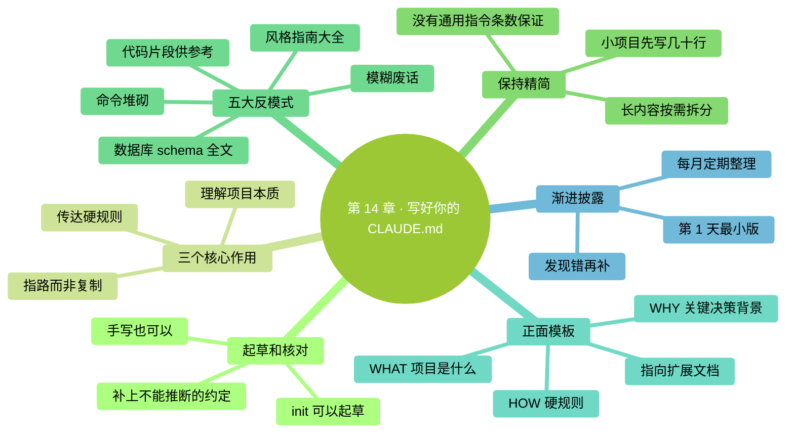

<a id="第-14-章写好你的-claudemd全书最高杠杆的一章"></a>
# 第 14 章：寫好你的 CLAUDE.md——全書最高槓杆的一章

> **本章在全書的位置**：第三部分 · 第 14 章 / 預估閱讀+動手時長：**主線 35-45 分鐘 + 支線 15 分鐘**
>
> **前置章節**：Ch 12（上下文原理）+ Ch 13（三層記憶）
>
> **學完能做什麼（主線）**：學會寫一份**精準有效的 CLAUDE.md**——不堆砌資料，也不把 `/init` 生成的草稿當成定稿。會挑內容、懂取捨、懂維護節奏。寫出來的 CLAUDE.md 能讓 Claude 在你的專案裡**真的越用越準**。

> **核驗日期：2026-09-24。** 本章對話和介面文字均為教學示意；請以你的版本、賬號和實際介面為準。

---

<a id="开场三问"></a>
## 開場三問

- **你會遇到什麼問題**：Claude 每次在你的專案裡回答都像"第一次聽說"——同樣的約定要反覆講。
- **不讀這章會踩什麼坑**：要麼**根本不寫 CLAUDE.md**（長期遭受重複回答折磨）；要麼**亂寫 CLAUDE.md**（寫成 500 行巨型文件、實際效果反而下降）。
- **讀完你會多會什麼事**：能判斷"哪條資訊值得進 CLAUDE.md、哪條不值"；能寫出 < 60 行就讓 Claude 懂專案的說明書；能維護它不讓它膨脹。

<a id="本章地图一眼看全貌"></a>
### 本章地圖（一眼看全貌）

<!-- diagram: MM-21 -->


---

> 🎯 **【主線】—— 本章必讀核心**

---


<a id="141-init-可以起草规则仍要由你把关"></a>
## 14.1 /init 可以起草，規則仍要由你把關

剛建專案時，你可能不知道 CLAUDE.md 應該怎麼寫。這時可以用 `/init`：它會檢視專案，整理能發現的執行方式、測試方法和約定；已經有說明檔案時，會提出改進建議。

舊版把“執行 /init”一概寫成反模式，這不準確。真正的問題是：**沒有核對，就把自動生成的內容當成長期規則。** Claude 能從現有檔案看出許多東西，但不知道你沒寫下來的決定。例如，原始訪談不能覆蓋、舊客戶命名暫時不能改、釋出必須先給誰看，這些需要你補充。

<a id="两种起步方式都可以"></a>
### 兩種起步方式都可以

- 專案只有幾個檔案：自己寫二三十行，通常已經夠用。
- 專案資料較多：讓 `/init` 先起草，再逐條檢查。

檢查時按三個問題讀：**這條真實嗎？以後會反覆用嗎？從現有檔案就能查到，還需要放在入口嗎？** 刪除過時命令，補上“為什麼”，把偶爾才用的操作步驟移到單獨文件。

例如，你在整理口述材料。自動生成的說明可能只寫“有原始稿和成稿兩個資料夾”。你補上“原始稿保留原話，只在成稿裡潤色，引用必須能指回來源”，這才讓合作方式變清楚。

`/init` 的具體流程會隨版本和配置變化。先檢查生成內容，再決定保留；不要為了和示例相同去刪除已有的專案說明。[官方起草建議](https://code.claude.com/docs/en/memory#set-up-a-project-claude-md)

<a id="142-claudemd-的三个核心作用"></a>
## 14.2 CLAUDE.md 的三個核心作用

先搞清楚這份文件到底要幹什麼：

<a id="作用-1让-claude-理解项目本质what--why"></a>
### 作用 1：讓 Claude 理解專案本質（WHAT + WHY）

**WHAT**：這個倉庫做什麼？核心概念是什麼？
**WHY**：為什麼這麼設計？關鍵決策的背景是什麼？

讀完 CLAUDE.md，Claude 應該能**一句話說出"這個專案是什麼"**。

<a id="作用-2传达硬规则how-的一部分"></a>
### 作用 2：傳達硬規則（HOW 的一部分）

**不可違反的硬約定**：
- 測試必須 100% 過才能 push
- 所有 API 必須有文件
- 不能直接改 main 分支

這些是你要求遵守的工作約定。但 CLAUDE.md 仍是給模型的說明，**不會自動變成技術上的訪問控制**。必須強制執行的限制，還要依靠許可權、檢查程式或倉庫設定。

<a id="作用-3路径地图where-to-look"></a>
### 作用 3：路徑地圖（where to look）

**告訴 Claude 哪裡去找更詳細的資訊**：
- "測試策略的完整規範見 `docs/testing.md`"
- "資料庫 schema 在 `db/schema.sql`"

**不復制內容，只給指標**（Pointers > Copies）。


<a id="143-保持精简但别把行数当成魔法"></a>
## 14.3 保持精簡，但別把行數當成魔法

說明太長，會增加查詢重點和維護的負擔。但“少一行一定更好”也不成立：刪掉重要約定，讓 Claude 每次都猜，同樣浪費時間。

<a id="一个适合初学者的目标"></a>
### 一個適合初學者的目標

小專案先寫幾十行，讓自己能在幾分鐘內讀完。之後每次增加一條，都說明它解決了什麼反覆發生的問題。當前官方建議每份 CLAUDE.md 儘量控制在 200 行以內；這是寫作建議，**不是超過後程式立即失效的硬限制**。[說明檔案寫法](https://code.claude.com/docs/en/memory#write-effective-instructions)

舊稿裡的“絕對不超過 300 行”“模型最多服從 150–200 條指令”，不能當通用產品規格。更有用的判斷是：有沒有重複、衝突、過期內容？有哪些只在特定任務出現時才需要？

<a id="拆文件之前先分清加载方式"></a>
### 拆檔案之前，先分清載入方式

把全文搬到另一份檔案，再用 `@文件路径` 匯入，只是換個位置組織，匯入內容仍會載入。寫“需要釋出時，請檢視釋出流程”，則是提示它按任務取閱。兩者不是同一種省空間方法。

長流程可以放 Skill；只對一類檔案生效的說明，可以考慮 `.claude/rules/` 的路徑規則。還沒遇到這些需要時，一份清楚的專案說明就夠，不必先建立複雜目錄體系。

<a id="144-反模式清单这些东西不要写进-claudemd"></a>
## 14.4 反模式清單：這些東西**不要**寫進 CLAUDE.md

下面這些是常見的冗餘寫法。重點是刪掉重複資料和含糊指令，而不是禁止任何風格約定、命令或例子。

<a id="反模式-1完整的代码风格指南"></a>
### 反模式 1：完整的程式碼風格指南

❌ 不要寫：

```markdown
## 代码风格
- 变量名用 camelCase
- 函数名用动词开头
- 每个函数必须有 JSDoc
- 缩进用 2 空格
- 分号必须有
- 字符串用单引号
...（还有 30 条）
```

**為什麼不好**：
- Claude 讀程式碼就能看出風格
- 真正想強制，用 ESLint / Prettier 等工具
- 30 條風格規則會把重要指令淹沒

✅ 改成：

```markdown
## 代码风格
- 跟项目现有风格（跑 `npm run lint` 自检）
- ESLint 配置在 `.eslintrc`
```

<a id="反模式-2数据库-schema-全文"></a>
### 反模式 2：資料庫 schema 全文

❌ 不要寫：

```markdown
## 数据库表结构
users 表：
  id INTEGER PRIMARY KEY
  email VARCHAR(255) NOT NULL UNIQUE
  name VARCHAR(100)
  created_at TIMESTAMP
  updated_at TIMESTAMP
  ...（30 张表、500 行）
```

**為什麼不好**：
- schema 會變，兩個地方保持同步很難
- 這是**程式碼類資料**，應該從程式碼裡讀

✅ 改成：

```markdown
## 数据库
- schema 定义见 `db/schema.sql`
- 迁移用 alembic，迁移文件在 `alembic/versions/`
```

<a id="反模式-3代码片段仅供参考"></a>
### 反模式 3：程式碼片段"僅供參考"

❌ 不要寫：

````markdown
## 示例：创建用户

```python
def create_user(email, name):
    user = User(email=email, name=name)
    db.add(user)
    db.commit()
    return user
```

当你要创建时请照此风格。
````

**為什麼不好**：
- 這**就是程式碼**——應該進程式碼，不是文件
- 程式碼改了，CLAUDE.md 還留著舊的

✅ 改成：

```markdown
## 创建新用户
- 参考 `src/services/user.py` 里现有的 create_user 函数
```

<a id="反模式-4命令堆砌"></a>
### 反模式 4：命令堆砌

❌ 不要寫：

```markdown
## 常用命令
- 启动：npm run dev 或 npm start 或 yarn dev 或 yarn start
- 测试：npm test 或 npm run test 或 jest 或 jest --watch
- 构建：npm run build 或 npm run prod 或 webpack
```

**為什麼不好**：
- 多個"或"讓 Claude 猜——**給它一個推薦**
- 這些命令 Claude 看 `package.json` 就知道

✅ 改成：

```markdown
## 常用命令
- 启动开发：`npm run dev`
- 跑测试：`npm test`
- 构建生产版：`npm run build`
```

<a id="反模式-5写进去谁也不看的规矩"></a>
### 反模式 5：寫進去誰也不看的規矩

❌ 不要寫：

```markdown
## 提交规范
- 每次提交必须写清楚
- 要有意义
- 不要提交无关的内容
- 要检查代码质量
- 测试要跑过
```

**為什麼不好**：
- 太模糊，Claude 根本無法判斷"有意義"
- 是**給人看的廢話**，不是給 AI 的指令

✅ 改成：

```markdown
## 提交规范
- 提交消息以 `feat:` `fix:` `docs:` `refactor:` `test:` 之一开头
- 单次提交改动 < 400 行（大改拆成多个）
```

**要點**：寫出可以檢查的要求。示例中的 400 行只是某個團隊自己的約定，不是通用質量標準；你的專案也可以要求“一個提交只處理一個問題，並說明驗證方式”。

<a id="145-正面模板一个好的-claudemd-长什么样"></a>
## 14.5 正面模板：一個好的 CLAUDE.md 長什麼樣


下面用“整理會議資料”的專案演示。它不要求你會程式設計；路徑只是教學樣例，要改成你實際的資料夾。

```markdown
# 项目：会议资料整理

## WHAT（这是什么）
把原始会议记录整理成可查阅的纪要和待办。
读者是参加项目的同事。

## WHY（为什么这样做）
- 保留原始记录，方便核对结论是谁提出的。
- 待办单独保存，避免淹没在长纪要里。
- 不确定的姓名和日期标成待确认，不能补猜。

## HOW（怎样合作）
- 原始材料在 originals/，不要覆盖。
- 成稿放 drafts/，文件名使用日期和会议主题。
- 先列出准备修改的文件，再整理正文。
- 引用决定时注明对应原始记录位置。
- 完成后检查：日期、负责人、截止时间是否有来源。
- 对外发送或发布前，先把完整结果给我看。

## 资料位置
- 纪要样例：examples/纪要样例.md
- 格式要求：docs/格式要求.md
- 当前待确认事项：tasks/待确认.md
```

<a id="为什么这份模板有效"></a>
### 為什麼這份模板有效

它說明了產物、讀者與依據，也講了為什麼保留原始材料。Claude 不必從資料夾名字猜“這個目錄能不能覆蓋”。

這些規則仍需要用結果來驗證。挑一份練習材料試做，檢查它是否儲存原件、是否把不確定內容標出。沒達到要求時，先查規則是否載入、任務是否清楚，再決定怎樣改說明。不要僅憑它回答“我會遵守”判斷已經生效。

<a id="146-渐进披露原则慢慢加不要一次堆"></a>
## 14.6 漸進披露原則：慢慢加、不要一次堆

**你的 CLAUDE.md 不是一次寫完的**。正確節奏：

<a id="第-1-天写最小版本"></a>
### 第 1 天：寫最小版本

只寫：
- 專案是什麼（1-2 句）
- 3-5 條最硬的規矩
- 目錄結構提要

總共 20-30 行。

<a id="第-1-周补你观察到的"></a>
### 第 1 周：補你觀察到的

每次發現 Claude 犯錯——**問自己**："這是不是因為我沒告訴它？"

- 是 → 加一條到 CLAUDE.md
- 不是（它就是不懂 / 它粗心） → 不要加

<a id="第-1-个月定期整理"></a>
### 第 1 個月：定期整理

- 掃一遍：有沒有過時的條目？
- 掃一遍：有沒有因專案演進變得錯的條目？
- 掃一遍：能不能合併相似條目？

<a id="原则每加一条要能说清楚它解决了什么问题"></a>
### 原則：**每加一條要能說清楚它解決了什麼問題**

不能說清就不要加。很多 CLAUDE.md 越寫越長，就是因為每條"萬一有用"的都加進去。

---

<a id="本章小结"></a>
## 本章小結

- `/init` 可以起草，也可以手寫；保留前核對，補上它無法從檔案推斷的約定。
- **CLAUDE.md = WHAT + WHY + HOW + Pointers**（專案本質 + 關鍵決策 + 硬規則 + 指路）
- 從幾十行起步，按需要整理；行數是維護參考，不是模型質量保證。
- **五大反模式**：程式碼風格大全 / schema 全文 / 程式碼片段 / 命令堆砌 / 模糊廢話——避免重複、過期與含糊，保留實際有用的要求
- **漸進披露**：從小版本開始，發現 Claude 犯錯才補條目；每月整理；每條都要能說清解決了什麼問題

---

<a id="动手任务"></a>
## 動手任務

<a id="任务-1评估一份-claudemd可选找一个公开项目10-分钟"></a>
### 任務 1：評估一份 CLAUDE.md（可選找一個公開專案，10 分鐘）

**步驟**：

1. 在 GitHub 隨便搜 `filename:CLAUDE.md`，隨便找一個看起來像模像樣的專案
2. 開啟它的 CLAUDE.md，用本章 14.4 的反模式清單對照掃一遍
3. 看它是否容易讀完，有沒有過時內容、明確約定和 WHY；不單憑行數判斷質量。

**成功標誌**：你能準確指出這份 CLAUDE.md 的 3 個優點和 3 個可改進點。

<a id="任务-2给你当前一个项目写-claudemd-v0130-分钟"></a>
### 任務 2：給你當前一個專案寫 CLAUDE.md v0.1（30 分鐘）

**步驟**：

1. 選一個你手頭的專案（即使是"整理照片"這種非程式碼專案也行）
2. 手寫或用 `/init` 起草。已有 CLAUDE.md 時先閱讀，不直接覆蓋；可參考 14.5 的非程式設計模板
3. 填進你的專案資訊：
   - WHAT：1-2 句
   - WHY：3 個關鍵決策 + 原因
   - HOW：5 條硬規則
   - Pointers：至少 2 個指路
4. 先以幾十行清楚說明為目標，不為湊行數刪掉重要資訊
5. 儲存，在新會話用 `/context` 檢查載入的檔案，再完成一個能驗證規則的小任務

**成功標誌**：你有了一份**真正自己懂的** CLAUDE.md，Claude 的回答比之前更準。

<a id="任务-3用-5-天养成发现问题就改-claudemd的习惯跨天持续-5-天"></a>
### 任務 3：用 5 天養成"發現問題就改 CLAUDE.md"的習慣（跨天，持續 5 天）

**步驟**：

1. 連續 5 天，每天用 Claude Code 處理你的專案至少 15 分鐘
2. 每次 Claude 犯錯或讓你重複解釋時，**立刻**問自己："這是不是該進 CLAUDE.md？"
3. 是 → 立刻加一條（加完儲存）
4. 5 天后回看 CLAUDE.md，看增加了多少條

**成功標誌**：你能解釋留下的規則解決了哪些問題；增加、刪減或沒有變化都可以，不以條目數量作為成績。

---

<a id="如果你卡住了"></a>
## 如果你卡住了

**症狀 A：不知道專案的"WHY"該寫什麼**
- 原因：這是設計決策背景——你做專案時的考慮。
- 解決：問自己 3 個問題——"為什麼選這個技術棧？為什麼這麼分目錄？為什麼有這些硬規則？"——答案就是 WHY。

**症狀 B：我的專案是非程式設計專案（整理檔案、寫文件）**
- 原因：把“專案”誤以為只有軟體開發。會議資料、照片和書稿也可以是專案。
- 解決：WHAT = "這是什麼專案、整理什麼內容"、WHY = "為什麼這麼分類"、HOW = "命名規則、儲存位置、不能碰的檔案"。原理完全一樣。

**症狀 C：寫完 CLAUDE.md，Claude 的表現沒明顯變好**
- 原因：要麼條目太模糊 Claude 用不上，要麼寫的東西本來它就知道（讀程式碼就懂）。
- 解決：先用 `/context` 檢查是否載入，再挑一條明確規則做小任務驗證。若多個說明檔案相互矛盾，先消除衝突，不必機械地刪一半。

---

主線結束。下面支線講"團隊場景的 CLAUDE.md"和"專案 CLAUDE.md 版本管理"。

---

> 🌿 **【支線】—— 可選深入（學有餘力再看）**

---

<a id="-支线-14a团队场景下的-claudemd"></a>
## 🌿 支線 14.A：團隊場景下的 CLAUDE.md

> **這段講什麼**：多人協作時 CLAUDE.md 的組織方式。
> **什麼時候回頭讀**：你的專案開始有多個人用 Claude Code 時。

<a id="问题不同人的习惯冲突"></a>
### 問題：不同人的習慣衝突

馬力加一條"函式必須有文件字串"，小紅覺得"短函式沒必要"。兩個人來回改 CLAUDE.md 就打架了。

<a id="解决方案-1claudemd-作为团队共识"></a>
### 解決方案 1：CLAUDE.md 作為**團隊共識**

把 CLAUDE.md **當作程式碼一樣進 git**，改動走 PR review：

- 每次改 CLAUDE.md 都提 PR
- 至少 1 人 review + 討論
- merge 之後**所有人 pull 下來就同步了**

這樣 CLAUDE.md 成了團隊**正式約定**，不是某個人的偏好。

<a id="解决方案-2分层全局--项目"></a>
### 解決方案 2：分層——全域性 + 專案

- **專案 CLAUDE.md**（共享、進 git）：所有人必須遵守的硬規則
- **`~/.claude/CLAUDE.md`**（個人、不進 git）：每個人自己的偏好

這樣個人偏好不汙染團隊約定。

<a id="解决方案-3放在-claudemd-里的团队规范文件夹"></a>
### 解決方案 3：放在 CLAUDE.md 裡的"團隊規範"資料夾

有的專案會把 CLAUDE.md 拆成主檔案 + 多個子檔案（**當專案很複雜時才用**）：

```
CLAUDE.md                    # 入口，指向子文件
.claude/
  testing.md               # 测试规范
  api-design.md            # API 设计规范
  deployment.md            # 部署规范
```

CLAUDE.md 裡寫：

```markdown
## 深入话题（按需看）

- 测试规范：`.claude/testing.md`
- API 设计：`.claude/api-design.md`
```

這些普通路徑提示只是告訴 Claude 需要時去哪裡找，並不會自動變成 Skill。若寫成 `@文件路径` 匯入，則會隨入口載入；若要規範任務流程，再專門建立 Skill。

<a id="一个经验"></a>
### 一個經驗

先保持能被自己讀完和維護的規模。只有不同檔案確實需要不同規則，或某個流程明顯太長時，再拆出去。

---


<a id="-支线-14b与-agentsmd-共用规则再管理版本"></a>
## 🌿 支線 14.B：與 AGENTS.md 共用規則，再管理版本

> **這段講什麼**：專案已經給其他 AI 工具寫了 AGENTS.md 時，怎樣避免兩份說明互相打架。
> **什麼時候回頭讀**：同一專案使用多種 AI 工具，或需要跟同事共享規則時。

<a id="现在能不能直接读-agentsmd"></a>
### 現在能不能直接讀 AGENTS.md

從 Claude Code **v2.1.277** 起，預設在當前目錄及上級沒有 CLAUDE.md 一類說明時，可以讀取 AGENTS.md；兩者同時存在時，不要假設都會載入。部分舊版會話還有支援差異，可升級並檢查 `/config` 的 Project instructions 設定。

需要相容不同版本時，可以在 CLAUDE.md 中用 `@AGENTS.md` 匯入共同說明，再補 Claude 專用內容。用 `/context` 核對實際載入情況，而不是因為檔案“已經放在目錄裡”就認定生效。[AGENTS.md 官方說明](https://code.claude.com/docs/en/memory#agentsmd)

對新手最有用的原則是**共同約定維護一份**。例如“原始稿不可覆蓋”同時寫在兩處，以後只改了一處，就會產生衝突。先決定誰是共同來源，再用明確匯入或當前支援的載入方式連線它。

<a id="把-claudemd-当作代码"></a>
### 把 CLAUDE.md 當作程式碼

- 進 git，提交時**附帶說明**：
  ```
  git commit -m "CLAUDE.md: add rule against direct SQL migrations after incident with prod schema drift"
  ```
- 未來想改動時，看 `git log CLAUDE.md`——所有演化一目瞭然

<a id="删-vs-标记过时"></a>
### 刪 vs 標記過時

有一條舊規則不再適用——直接刪好，還是標記"已廢除"好？

**一般直接刪**——CLAUDE.md 是 Claude 的指令，**留著會讓它混淆**。刪除歷史留在 git 裡就好，不放到當前版本。

<a id="每条规则的诞生故事"></a>
### 每條規則的"誕生故事"

理想情況下，每加一條規則都在 git 提交訊息裡寫一句：**這條解決了什麼具體事故或問題**。

半年後回來看，你一眼能想起"**哦，這條是當年 XX 事故後加的**"——還**有效就保留，已經不必要就刪**。

<a id="和渐进披露原则配合"></a>
### 和"漸進披露"原則配合

- 主線 14.6 講"漸進加"——從小到大、按需增長
- 本支線講"怎麼追蹤演化"——讓每次增長都**可追溯、可回退**

兩者結合：**CLAUDE.md 是一份活的、跟專案一起長的、可審計的團隊共識**。

---

**下一章**：第 15 章"模型與成本"——講當前模型怎樣選、用量和費用到哪裡查、大致要花多少錢、怎麼省——給你一份**可控的預算預期**。
