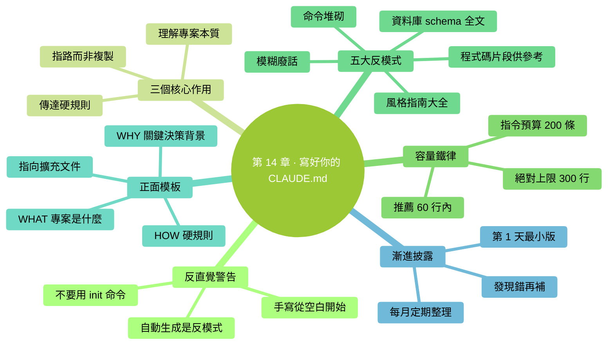

# 第 14 章：寫好你的 CLAUDE.md——全書最高槓杆的一章

> **本章在全書的位置**：第三部分 · 第 14 章 / 預估閱讀+動手時長：**主線 35-45 分鐘 + 支線 15 分鐘**
>
> **前置章節**：Ch 12（上下文原理）+ Ch 13（三層記憶）
>
> **學完能做什麼（主線）**：學會寫一份**精準有效的 CLAUDE.md**——不是越長越好、不是堆砌命令、不是 `/init` 一鍵生成。會挑內容、懂取捨、懂維護節奏。寫出來的 CLAUDE.md 能讓 Claude 在你的專案裡**真的越用越準**。

---

## 開場三問

- **你會遇到什麼問題**：Claude 每次在你的專案裡回答都像"第一次聽說"——同樣的約定要反覆講。
- **不讀這章會踩什麼坑**：要麼**根本不寫 CLAUDE.md**（長期遭受重複回答折磨）；要麼**亂寫 CLAUDE.md**（寫成 500 行巨型文件、實際效果反而下降）。
- **讀完你會多會什麼事**：能判斷"哪條資訊值得進 CLAUDE.md、哪條不值"；能寫出 < 60 行就讓 Claude 懂專案的說明書；能維護它不讓它膨脹。

### 本章地圖（一眼看全貌）

<!-- diagram: MM-21 -->


---

> 🎯 **【主線】—— 本章必讀核心**

---

## 14.1 第一反直覺警告：**不要**用 `/init` 一鍵生成

Claude Code 自帶一個命令：`/init`。

你在專案目錄裡跑 `/init`，Claude 會**自動掃描程式碼**，生成一份**巨型 CLAUDE.md**——列出所有檔案、所有技術棧、所有命令、甚至一些無關的註釋。

**聽起來很方便**。99% 的部落格、影片教程告訴你"裝好 Claude Code 第一件事就跑 `/init`"。

**本書告訴你：別這麼做。**

### 為什麼 `/init` 是反模式

1. **膨脹**：自動生成的 CLAUDE.md 通常 300-1000 行——太長，Claude 注意力會分散
2. **堆垃圾**：它會把 `node_modules` 目錄下的一些奇怪內容也寫進去；把幾十條可以用但沒用的命令都列一遍
3. **沒有"為什麼"**：只有"是什麼"——Claude 知道"專案用 Express"，但不知道"**為什麼選 Express 而不是 Fastify**"——這才是判斷力所在
4. **你不理解就不能維護**：自動生成的你自己都沒通讀過，之後更新怎麼辦？誰都不會改的 CLAUDE.md 幾個月後就過時

### 正確做法

**手寫**。從**一個幾乎空白的 CLAUDE.md 開始**，**隨著專案進展、隨著你發現 Claude 反覆犯同一錯誤**，再往裡補內容。

每一條都是你**自己**覺得值得記的。這份文件是**活的**，跟著專案長大。

> 📌 **本書口號**："CLAUDE.md 是寫出來的，不是生出來的。"

## 14.2 CLAUDE.md 的三個核心作用

先搞清楚這份文件到底要幹什麼：

### 作用 1：讓 Claude 理解專案本質（WHAT + WHY）

**WHAT**：這個倉庫做什麼？核心概念是什麼？
**WHY**：為什麼這麼設計？關鍵決策的背景是什麼？

讀完 CLAUDE.md，Claude 應該能**一句話說出"這個專案是什麼"**。

### 作用 2：傳達硬規則（HOW 的一部分）

**不可違反的硬約定**：
- 測試必須 100% 過才能 push
- 所有 API 必須有文件
- 不能直接改 main 分支

這些**不是建議，是紅線**。

### 作用 3：路徑地圖（where to look）

**告訴 Claude 哪裡去找更詳細的資訊**：
- "測試策略的完整規範見 `docs/testing.md`"
- "資料庫 schema 在 `db/schema.sql`"

**不復制內容，只給指標**（Pointers > Copies）。

## 14.3 **容量鐵律**：越短越好

容量越大 ≠ 效果越好。**反過來：容量越大，效果越差**。

### 為什麼

- CLAUDE.md **每次啟動都全量載入進上下文**（見 Ch 12）
- 越長，Claude 越難**抓住重點**
- 指令之間可能**互相沖突**或語義重疊，Claude 判斷不出該聽哪個
- 維護負擔指數上升

### 三條硬線

- **絕對上限**：300 行。超過 300 行，**必然存在可以砍的**，本章教你怎麼砍。
- **推薦上限**：60 行。小專案、個人專案，60 行能表達清楚。
- **指令預算**：150-200 個**指令性語句**（"必須..."、"不要..."、"優先..."）。超過這個數量，Claude 記不住，自己就會"取捨遺忘"。

### 這是反直覺的

很多人覺得"我把所有規矩都寫進去才放心"。實際效果相反——**Claude 面對一份 500 行的文件，會抓住表面幾條、忽略中間大部分**。

**寫少 = 讓重要的被看見**。

## 14.4 反模式清單：這些東西**不要**寫進 CLAUDE.md

下面這些是最常見的"錯誤內容"。你的 CLAUDE.md 裡**一條都不應該有**：

### 反模式 1：完整的程式碼風格指南

❌ 不要寫：

```markdown
## 程式碼風格
- 變數名用 camelCase
- 函式名用動詞開頭
- 每個函式必須有 JSDoc
- 縮排用 2 空格
- 分號必須有
- 字串用單引號
...（還有 30 條）
```

**為什麼不好**：
- Claude 讀程式碼就能看出風格
- 真正想強制，用 ESLint / Prettier 等工具
- 30 條風格規則會把重要指令淹沒

✅ 改成：

```markdown
## 程式碼風格
- 跟專案現有風格（跑 `npm run lint` 自檢）
- ESLint 配置在 `.eslintrc`
```

### 反模式 2：資料庫 schema 全文

❌ 不要寫：

```markdown
## 資料庫表結構
users 表：
  id INTEGER PRIMARY KEY
  email VARCHAR(255) NOT NULL UNIQUE
  name VARCHAR(100)
  created_at TIMESTAMP
  updated_at TIMESTAMP
  ...（30 張表、500 行）
```

**為什麼不好**：
- schema 會變，兩個地方保持同步很難
- 這是**程式碼類資料**，應該從程式碼裡讀

✅ 改成：

```markdown
## 資料庫
- schema 定義見 `db/schema.sql`
- 遷移用 alembic，遷移檔案在 `alembic/versions/`
```

### 反模式 3：程式碼片段"僅供參考"

❌ 不要寫：

```markdown
## 示例：建立使用者

```python
def create_user(email, name):
    user = User(email=email, name=name)
    db.add(user)
    db.commit()
    return user
```

當你要建立時請照此風格。
```

**為什麼不好**：
- 這**就是程式碼**——應該進程式碼，不是文件
- 程式碼改了，CLAUDE.md 還留著舊的

✅ 改成：

```markdown
## 建立新使用者
- 參考 `src/services/user.py` 裡現有的 create_user 函式
```

### 反模式 4：命令堆砌

❌ 不要寫：

```markdown
## 常用命令
- 啟動：npm run dev 或 npm start 或 yarn dev 或 yarn start
- 測試：npm test 或 npm run test 或 jest 或 jest --watch
- 構建：npm run build 或 npm run prod 或 webpack
```

**為什麼不好**：
- 多個"或"讓 Claude 猜——**給它一個推薦**
- 這些命令 Claude 看 `package.json` 就知道

✅ 改成：

```markdown
## 常用命令
- 啟動開發：`npm run dev`
- 跑測試：`npm test`
- 構建生產版：`npm run build`
```

### 反模式 5：寫進去誰也不看的規矩

❌ 不要寫：

```markdown
## 提交規範
- 每次提交必須寫清楚
- 要有意義
- 不要提交無關的內容
- 要檢查程式碼質量
- 測試要跑過
```

**為什麼不好**：
- 太模糊，Claude 根本無法判斷"有意義"
- 是**給人看的廢話**，不是給 AI 的指令

✅ 改成：

```markdown
## 提交規範
- 提交訊息以 `feat:` `fix:` `docs:` `refactor:` `test:` 之一開頭
- 單次提交改動 < 400 行（大改拆成多個）
```

**要點**：CLAUDE.md 裡每一條都要**足夠具體、機器可執行**——"< 400 行"是機器能檢查的，"要有意義"不是。

## 14.5 正面模板：一個好的 CLAUDE.md 長什麼樣

下面是一份**真實能用**的 CLAUDE.md 模板（55 行）：

```markdown
# 專案：XXX 後端 API

## WHAT（這是什麼）

一個為 XXX 產品的移動端提供資料的後端 API。Python 3.11 + FastAPI + PostgreSQL。
目前服務 10 萬 DAU，核心模組是訂單和推送。

## WHY（關鍵決策背景）

- **選 FastAPI 不選 Django**：團隊偏好非同步 IO；Django 的 ORM 對現有遺留 schema 不友好
- **暫不拆微服務**：規模沒到，單體夠用
- **用 Redis 不用 Memcached**：已經用 Redis 做佇列，不想引入第二個快取

## HOW（協作時的硬規則）

### 不能違反
- 任何改動必須跑 `pytest tests/` 全綠才能 push
- 資料庫改動必須用 alembic 遷移，**禁止直接 SQL 改表**
- 新 API 必須放在 `src/api/v2/`，**不碰** `src/api/v1/`（遺留相容）
- 涉及錢的邏輯（訂單金額、退款）**必須寫測試且讓另一個人 review**

### 目錄地圖
- API 路由：`src/api/v2/`
- 業務邏輯：`src/services/`
- 資料模型：`src/models/`
- 測試：`tests/`，跟原始碼同結構

### 常用命令
- 起服務：`uvicorn src.main:app --reload`
- 跑測試：`pytest tests/ -v`
- 遷移生成：`alembic revision --autogenerate -m "xxx"`

## 擴充資訊的位置（不復制在這裡）

- 詳細測試策略：`docs/testing.md`
- 部署流程：`docs/deployment.md`
- 資料庫 schema：`db/schema.sql`
- API 介面文件：啟動服務後訪問 `/docs`

## 正在進行的階段

**2026-04-19**：重構訂單模組的併發處理，禁止對 `src/services/order.py`
做大重構（會有衝突）。小 bugfix 可以。
```

### 為什麼這份模板有效

- **55 行，遠低於 300 行上限**
- **WHAT / WHY / HOW 三段骨架**——清晰
- **WHY 講"為什麼這麼選"**——Claude 能據此做判斷，不只是"按規則做事"
- **硬規則用明確語言**（"必須"、"禁止"）——不給 Claude 解釋空間
- **Pointers 指向詳細文件**，不復制內容進來
- **"正在進行的階段"告訴 Claude 當下的警戒線**——隨專案更新

## 14.6 漸進披露原則：慢慢加、不要一次堆

**你的 CLAUDE.md 不是一次寫完的**。正確節奏：

### 第 1 天：寫最小版本

只寫：
- 專案是什麼（1-2 句）
- 3-5 條最硬的規矩
- 目錄結構提要

總共 20-30 行。

### 第 1 周：補你觀察到的

每次發現 Claude 犯錯——**問自己**："這是不是因為我沒告訴它？"

- 是 → 加一條到 CLAUDE.md
- 不是（它就是不懂 / 它粗心） → 不要加

### 第 1 個月：定期整理

- 掃一遍：有沒有過時的條目？
- 掃一遍：有沒有因專案演進變得錯的條目？
- 掃一遍：能不能合併相似條目？

### 原則：**每加一條要能說清楚它解決了什麼問題**

不能說清就不要加。很多 CLAUDE.md 越寫越長，就是因為每條"萬一有用"的都加進去。

---

## 本章小結

- **不要用 `/init`**——那會生成一份 300+ 行的垃圾文件。手寫、從空白開始。
- **CLAUDE.md = WHAT + WHY + HOW + Pointers**（專案本質 + 關鍵決策 + 硬規則 + 指路）
- **容量鐵律**：推薦 < 60 行，絕對不超過 300 行；< 200 條指令
- **五大反模式**：程式碼風格大全 / schema 全文 / 程式碼片段 / 命令堆砌 / 模糊廢話——**一條都別寫**
- **漸進披露**：從小版本開始，發現 Claude 犯錯才補條目；每月整理；每條都要能說清解決了什麼問題

---

## 動手任務

### 任務 1：評估一份 CLAUDE.md（可選找一個公開專案，10 分鐘）

**步驟**：

1. 在 GitHub 隨便搜 `filename:CLAUDE.md`，隨便找一個看起來像模像樣的專案
2. 開啟它的 CLAUDE.md，用本章 14.4 的反模式清單對照掃一遍
3. 數：多少行？是否 < 300？有沒有硬規則？有沒有 WHY？

**成功標誌**：你能準確指出這份 CLAUDE.md 的 3 個優點和 3 個可改進點。

### 任務 2：給你當前一個專案寫 CLAUDE.md v0.1（30 分鐘）

**步驟**：

1. 選一個你手頭的專案（即使是"整理照片"這種非程式碼專案也行）
2. **不要用 `/init`**。新建 `CLAUDE.md`，複製 14.5 的模板
3. 填進你的專案資訊：
   - WHAT：1-2 句
   - WHY：3 個關鍵決策 + 原因
   - HOW：5 條硬規則
   - Pointers：至少 2 個指路
4. **控制在 60 行內**
5. 儲存、啟動 Claude Code、問它一個專案相關的問題，看回答質量

**成功標誌**：你有了一份**真正自己懂的** CLAUDE.md，Claude 的回答比之前更準。

### 任務 3：用 5 天養成"發現問題就改 CLAUDE.md"的習慣（跨天，持續 5 天）

**步驟**：

1. 連續 5 天，每天用 Claude Code 處理你的專案至少 15 分鐘
2. 每次 Claude 犯錯或讓你重複解釋時，**立刻**問自己："這是不是該進 CLAUDE.md？"
3. 是 → 立刻加一條（加完儲存）
4. 5 天后回看 CLAUDE.md，看增加了多少條

**成功標誌**：你的 CLAUDE.md **比 5 天前多了 3-8 條**——**每條都能說清當初為什麼加**。這是 CLAUDE.md 正確的成長方式。

---

## 如果你卡住了

**症狀 A：不知道專案的"WHY"該寫什麼**
- 原因：這是設計決策背景——你做專案時的考慮。
- 解決：問自己 3 個問題——"為什麼選這個技術棧？為什麼這麼分目錄？為什麼有這些硬規則？"——答案就是 WHY。

**症狀 B：我的專案是非程式設計專案（整理檔案、寫文件）**
- 原因：本章示例偏程式碼專案，但 CLAUDE.md 同樣適用。
- 解決：WHAT = "這是什麼專案、整理什麼內容"、WHY = "為什麼這麼分類"、HOW = "命名規則、儲存位置、不能碰的檔案"。原理完全一樣。

**症狀 C：寫完 CLAUDE.md，Claude 的表現沒明顯變好**
- 原因：要麼條目太模糊 Claude 用不上，要麼寫的東西本來它就知道（讀程式碼就懂）。
- 解決：**刪一半**——只留 5 條最特殊、最違反直覺的規則。觀察效果。**少而精 > 多而雜**。

---

主線結束。下面支線講"團隊場景的 CLAUDE.md"和"專案 CLAUDE.md 版本管理"。

---

> 🌿 **【支線】—— 可選深入（學有餘力再看）**

---

## 🌿 支線 14.A：團隊場景下的 CLAUDE.md

> **這段講什麼**：多人協作時 CLAUDE.md 的組織方式。
> **什麼時候回頭讀**：你的專案開始有多個人用 Claude Code 時。

### 問題：不同人的習慣衝突

馬力加一條"函式必須有文件字串"，小紅覺得"短函式沒必要"。兩個人來回改 CLAUDE.md 就打架了。

### 解決方案 1：CLAUDE.md 作為**團隊共識**

把 CLAUDE.md **當作程式碼一樣進 git**，改動走 PR review：

- 每次改 CLAUDE.md 都提 PR
- 至少 1 人 review + 討論
- merge 之後**所有人 pull 下來就同步了**

這樣 CLAUDE.md 成了團隊**正式約定**，不是某個人的偏好。

### 解決方案 2：分層——全域性 + 專案

- **專案 CLAUDE.md**（共享、進 git）：所有人必須遵守的硬規則
- **`~/.claude/CLAUDE.md`**（個人、不進 git）：每個人自己的偏好

這樣個人偏好不汙染團隊約定。

### 解決方案 3：放在 CLAUDE.md 裡的"團隊規範"資料夾

有的專案會把 CLAUDE.md 拆成主檔案 + 多個子檔案（**當專案很複雜時才用**）：

```
CLAUDE.md                    # 入口，指向子檔案
.claude/
  testing.md               # 測試規範
  api-design.md            # API 設計規範
  deployment.md            # 部署規範
```

CLAUDE.md 裡寫：

```markdown
## 深入話題（按需看）

- 測試規範：`.claude/testing.md`
- API 設計：`.claude/api-design.md`
```

Claude 會在需要時去讀那些檔案——但**不會一啟動就全載入**（靠 Skills 機制實現按需載入）。

### 一個經驗

**90% 的專案不需要分層**。一份 60-150 行的 CLAUDE.md 走完全程。只在**大型團隊 + 複雜專案**才需要拆檔案。

---

## 🌿 支線 14.B：CLAUDE.md 的版本管理

> **這段講什麼**：CLAUDE.md 作為"活文件"的演化怎麼追蹤。
> **什麼時候回頭讀**：你想了解"這條規則是什麼時候加的、當時為什麼加"時。

### 把 CLAUDE.md 當作程式碼

- 進 git，提交時**附帶說明**：
  ```
  git commit -m "CLAUDE.md: add rule against direct SQL migrations after incident with prod schema drift"
  ```
- 未來想改動時，看 `git log CLAUDE.md`——所有演化一目瞭然

### 刪 vs 標記過時

有一條舊規則不再適用——直接刪好，還是標記"已廢除"好？

**一般直接刪**——CLAUDE.md 是 Claude 的指令，**留著會讓它混淆**。刪除歷史留在 git 裡就好，不放到當前版本。

### 每條規則的"誕生故事"

理想情況下，每加一條規則都在 git 提交訊息裡寫一句：**這條解決了什麼具體事故或問題**。

半年後回來看，你一眼能想起"**哦，這條是當年 XX 事故後加的**"——還**有效就保留，已經不必要就刪**。

### 和"漸進披露"原則配合

- 主線 14.6 講"漸進加"——從小到大、按需增長
- 本支線講"怎麼追蹤演化"——讓每次增長都**可追溯、可回退**

兩者結合：**CLAUDE.md 是一份活的、跟專案一起長的、可審計的團隊共識**。

---

**下一章**：第 15 章"模型與成本"——講 Sonnet / Opus / Haiku 怎麼選、`/status` 怎麼讀、大致要花多少錢、怎麼省——給你一份**可控的預算預期**。


---

<!-- chapter-nav -->

📖  [← 第 13 章 · 三層記憶](13-三層記憶.md)  ·  [📑 返回目錄](../../README.md)  ·  [第 15 章 · 模型與成本 →](15-模型與成本.md)
