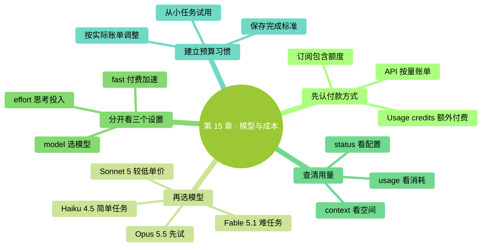
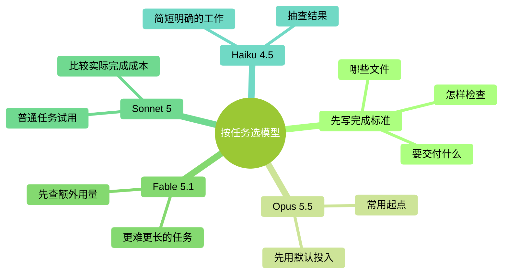

<a id="第-15-章模型与成本怎么选怎么算怎么省"></a>
# 第 15 章：模型與成本——怎麼選、怎麼算、怎麼省

> **本章在全書的位置**：第三部分 · 第 15 章 / 預估閱讀與動手時長：主線 30 分鐘，支線 10 分鐘。
>
> **前置章節**：第 12 章（上下文——Claude 的短期工作記憶）。
>
> **學完能做什麼**：選對模型，分清套餐額度與額外收費，查到自己的實際用量，給一個任務設定合理的開支邊界。
>
> **核對日期：2026-09-24。** 本章按 Claude Code 命令列版本 2.1.280 或更新版本說明；模型、價格和套餐可能繼續變化，購買前以賬戶頁面為準。

---

<a id="开场三问"></a>
## 開場三問

- **你會遇到什麼問題**：選單裡多了 Fable 5.1 和 Opus 5.5。名字越新是不是越值得用？已經交了月費，為什麼還會出現額外付費提示？
- **不讀這章會踩什麼坑**：把模型視窗當成免費額度，把介面的費用估算當成賬單，或者為了省一點單價反覆重做同一任務。
- **讀完你會多會什麼事**：先確認錢從哪裡扣，再選模型；遇到限額時知道該查哪一項，而不是盲目升級。

<a id="本章地图一眼看全貌"></a>
### 本章地圖（一眼看全貌）

<!-- diagram: MM-22 -->


---

> 🎯 **【主線】—— 本章必讀核心**
> 讀完這部分並完成章末任務，就能進入下一章。

<a id="151-先看钱从哪里扣再看模型叫什么"></a>
## 15.1 先看錢從哪裡扣，再看模型叫什麼

假設你買了一個月的 Claude Pro，然後開啟 Claude Code。日常任務用了套餐中的額度；過一會兒，你選擇 Fable，介面卻提示需要 usage credits。這個英文指的是**額外付費用量**，不能理解成月費裡又送了一份額度。

Claude Code 可以連線不同賬戶。對新手，先分清下面三種情況就夠了。

| 當前付款方式 | 你付的是什麼 | 應該去哪裡核對 |
|---|---|---|
| Claude Pro、Max 等訂閱 | 月費及套餐包含的使用額度 | Claude 網頁賬戶的 Usage（用量）頁面 |
| 訂閱加 usage credits | 月費之外、按實際使用另付的錢 | 同一用量頁面裡的額外用量與支出上限 |
| Claude API 或雲服務賬戶 | 按模型實際消耗計費；API 是程式連線模型的介面 | 對應服務的控制檯賬單 |

個人網頁訂閱目前是：Pro 月付 **20 美元**，年付 **200 美元**；Max 有 **100 美元/月**和 **200 美元/月**兩檔。這些不是“無限使用”的價格。稅費、購買渠道及後續調整也會影響實付金額。[官方套餐頁](https://claude.com/pricing)、[Max 方案說明](https://support.claude.com/en/articles/11049741-what-is-the-max-plan)

Fable 5.1 的區別尤其值得記住：**Pro 從開始使用 Fable 時就需要額外用量；Max 可在現有周額度中，拿出最多 50% 用於 Fable。** 它沒有讓周額度憑空增加一半，其他模型也會消耗同一份額度。Team 標準席位與高階席位也有區別，支線再說。[Fable 套餐說明](https://support.claude.com/en/articles/15424964-claude-fable-models-on-your-plan)

因此，“我有 Pro，所以模型選單裡所有選項都已包含”這個判斷不成立。看到額外收費提示，先讀清金額來源；你也可以取消，繼續用已包含的模型。購買更貴的套餐同樣不是本章動手任務的前提。

<a id="152-四个名字先从自己的任务出发"></a>
## 15.2 四個名字，先從自己的任務出發

**模型**是 Claude Code 用來理解、判斷和生成內容的部分。它與能否讀取檔案、執行命令是兩回事：換模型不會自動擴大操作許可權。

截至核對日，當前常用系列可以這樣認識。表裡的“適合”是嘗試方向，不是保證每次都能完成。

| 模型 | 你可以先拿什麼任務試它 | 選擇時留意什麼 |
|---|---|---|
| **Opus 5.5** | 比較幾份方案、修改跨多個檔案的專案、整理有矛盾的資料 | 當前多數官方賬戶的預設起點；先用預設思考檔位 |
| **Fable 5.1** | 較長、較難、需要持續調查和核驗的任務 | 單價更高；先核對你的套餐是否包含 |
| **Sonnet 5** | 要求明確的日常處理、普通文件與程式碼修改 | 標準 API 單價低於 Opus；仍要檢查結果 |
| **Haiku 4.5** | 短文字分類、格式轉換、簡單解釋 | 任務若有複雜判斷，不要只看速度和單價 |

官方模型總覽建議，大多數工作先從 Opus 5.5 開始；對它仍完成不好的複雜推理和長任務，再考慮 Fable 5.1。舊版“日常一律 Sonnet、Opus 永遠最貴最慢”的口訣已經不適合直接沿用。[當前模型總覽](https://platform.claude.com/docs/en/models/overview)

<!-- diagram: MM-04 -->


比如整理一份會議記錄，成功標準是“找出決定、負責人、日期，並把沒有說清的地方標出來”。先拿一個模型做一份，看看有沒有漏項。如果換成更貴的模型只是多寫了幾段話，卻沒有減少錯誤，就沒有必要為這項任務升級。

反過來，便宜模型反覆漏掉關鍵約束，需要你來回糾正，也會消耗時間和用量。比較的是**把事情做對的總代價**，不只是價目表上的單價。也不要把一次成功當成模型能包辦所有工作的證據。

<a id="153-学会选模型别把三个开关混成一个"></a>
## 15.3 學會選模型，別把三個開關混成一個

本章裡的斜槓命令都輸入在 **Claude Code 的對話方塊**，不是退出後那個普通終端提示符後面。先輸入 `/model`，開啟模型選擇器，看清當前版本和是否有額外收費提示。

如果你直接使用 Anthropic 服務，並希望確定選中本章介紹的版本，可以輸入：

```text
/model claude-opus-5-5
```

需要 Fable 且已經確認付款方式時，再輸入 `/model claude-fable-5-1`。這種完整名稱比只記 `opus` 或 `fable` 更適合復現一次練習；簡寫會隨著軟體版本或服務提供方變化。升級和不同服務的差別見[附錄 J](../%E9%99%84%E5%BD%95/J-Opus-4.7%E6%96%B0%E6%89%8B%E6%8C%87%E5%8D%97.md)。

在當前版本里，直接用 `/model 名称` 切換會儲存為以後會話的預設選擇。只想試一次，就開啟 `/model`，用上下方向鍵移到模型那一行，按字母 **s**，表示僅用於這次會話。按 Enter（回車鍵）則會儲存選擇。[模型配置說明](https://code.claude.com/docs/en/model-config)

第二個開關是 **effort（思考投入檔位）**。用 `/effort` 可以檢視和調整。Opus 5.5 預設是 `medium`，Fable 5.1 預設是 `high`；這不代表前者“只有中等智力”。檔位表示同一模型如何安排思考投入，不是跨模型的分數。先保留預設值，發現任務確實需要更深入的判斷時再比較其他檔位。[effort 說明](https://platform.claude.com/docs/en/build-with-claude/effort)

第三個是 `/fast`，即快速模式。它改變響應速度和計費，不是更換成“小模型”。**Opus 5.5 的 fast 輸入/輸出價格為每百萬 token 8/40 美元；訂閱使用者透過額外用量付費。** 初次練習不需要開啟它。[快速模式說明](https://code.claude.com/docs/en/fast-mode)

<a id="154-空间额度费用要到不同地方看"></a>
## 15.4 空間、額度、費用，要到不同地方看

第 12 章說過，**上下文**是這次對話正在使用的工作記憶；**token**是模型處理文字的單位，不等於固定數量的漢字。你現在要再區分三個問題：

| 你想知道什麼 | 先用什麼檢視 | 這個數字不代表什麼 |
|---|---|---|
| 當前版本、模型、賬戶和配置是什麼 | `/status` | 不是最終賬單 |
| 本次消耗、套餐使用情況怎麼樣 | `/usage` | 其中的美元估算不等於訂閱額外扣款 |
| 什麼內容佔著這次對話的空間 | `/context` | 不是本週還剩多少額度 |

這三個命令都可以直接在會話裡輸入，讀完按 Esc（鍵盤左上角的退出鍵）關掉面板。具體顯示專案隨賬戶與版本而變，不必找一張與教程逐字一致的截圖。[命令參考](https://code.claude.com/docs/en/commands)

新模型有 1M，也就是一百萬 token 的模型上下文上限。它說明單次工作可處理的範圍，**沒有承諾送你一百萬 token，也沒有承諾永遠記得對話中的每個細節**。實際會話還受部署方式與自動壓縮設定影響。某次任務的上下文只佔一小部分，你仍可能已經用完本週套餐額度；換個新會話也不會把周額度重置。

另外，`/usage` 的會話美元數是按 token 和價格計算的估算。對使用套餐內額度的 Pro、Max 使用者，它不是一張待付款單；按量賬戶也應以對應控制檯的記錄核賬。`/clear` 開始新會話後，螢幕上的會話累計數會重新計算，但已經發生的用量不會從賬單裡消失。[用量與費用說明](https://code.claude.com/docs/en/costs)

讀面板的目的，是弄清“現在受什麼限制”。不能把上下文變滿、周額度用完、額外支出到上限，統一理解成“Claude 不夠聰明，換一個模型試試”。

<a id="155-算一笔能核对的账不猜每月要花多少钱"></a>
## 15.5 算一筆能核對的賬，不猜每月要花多少錢

同樣使用半小時，有人只改了三段文字，有人讓多個任務反覆讀取上百份檔案。兩者不能用一個“每天幾分鐘對應多少美元”的表準確換算。因此，本書不再按使用時長給出月費預測。

下面是 **2026-09-24 核對的標準 API 美元單價**。1M token 代表一百萬個處理單位；輸入是交給模型處理的內容，輸出是模型生成的內容。快取讀取指重複內容命中快取後的讀取，支線會解釋。

| 模型 | 普通輸入 / 1M token | 輸出 / 1M token | 快取讀取 / 1M token |
|---|---:|---:|---:|
| Haiku 4.5 | $1 | $5 | $0.10 |
| Sonnet 5 | $2 | $10 | $0.20 |
| Opus 5.5 | $4 | $20 | $0.20 |
| Fable 5.1 | $10 | $50 | $0.25 |

快取寫入、快速模式、特定地域及供應商計費可能另有費率。這裡不能拿“總輸入數”全部乘快取價，也不能把這張表當作訂閱額度換算表。[官方詳細價目表](https://platform.claude.com/docs/en/about-claude/pricing)

做一個**純算術示例，不是真實測試賬單**：假設某項任務恰好有 10 萬個普通輸入 token、1 萬個輸出 token，全部按標準費率，沒有快取寫入等其他專案。那麼 Opus 5.5 費用是 `0.1 × 4 + 0.01 × 20 = 0.60` 美元；Fable 5.1 是 `0.1 × 10 + 0.01 × 50 = 1.50` 美元。真實執行時，兩個模型的消耗量也可能不同，不能據此斷言 Fable 做任何事都貴 2.5 倍。

你更需要的是一份自己的小記錄：任務是什麼、用了哪個模型、有沒有完成、花了多久、賬戶用量如何變化。先記錄幾次代表性任務，再決定是否升套餐或改用按量付款，比照著別人的“一個月只要幾美元”下注可靠。

<a id="156-省钱从少返工开始不从删掉所有上下文开始"></a>
## 15.6 省錢從少返工開始，不從刪掉所有上下文開始

第一件事是把交付物講清楚。與其連續傳送“再詳細些”“不是這個意思”“你把原稿弄丟了”，不如一開始說明檔案、保留內容和檢查標準。

下面是**練習用輸入示例，不是實測對話記錄**：

> **你**：把 `@会议记录.md` 整理成行動清單，另存為新檔案，保留原稿。每項包含負責人和截止日期；原文沒寫的填“待確認”，不要猜。完成後列出你找不到依據的專案。

其中 `@会议记录.md` 是在輸入框提及檔案，幫助 Claude 找到材料。實際練習時要換成你自己的檔名。這段輸入不是因為字少才省錢，而是把“做好是什麼樣”提前講明白了。

第二件事是隻帶上有關材料。整理會議記錄，不必順便把整個下載資料夾都交給它。任務完成後開始完全無關的新工作，可以另開會話；還在處理同一個任務時，保留有用決定往往比反覆清空、重新解釋更合適。`/compact` 是總結壓縮舊對話，`/clear` 是開始新會話，二者都不是“退還額度”。

第三件事是一次改變一個變數。覺得慢，先看看是否設定了高 effort；覺得貴，先看看是否開了 fast 或額外用量；覺得答案差，先檢查材料和要求。不要同時換模型、換檔位、換提示詞，否則你不知道哪項改變起了作用。

最後，把額外支出控制放到賬戶設定裡。用自然語言說“別超過 10 美元”可以表達你的期望，卻不能代替服務實際提供的支出控制。訂閱使用者可以從 `/usage-credits` 進入相關頁面，核對是否開啟、可用餘額和月支出限制。[額外用量說明](https://support.claude.com/en/articles/12429409-manage-usage-credits-for-paid-claude-plans)

---

<a id="本章小结"></a>
## 本章小結

- 先確認用的是套餐額度、額外用量，還是 API 賬單。
- Opus 5.5 是當前常用起點；Fable 5.1 適合另行評估較難、較長的任務。
- `/model` 選模型，`/effort` 調思考投入，`/fast` 是單獨計費的加速。
- `/status` 查配置，`/usage` 查用量，`/context` 查空間。
- 1M 上下文不等於免費額度；清空會話也不會清空賬單。
- 看完成一個任務的總消耗和返工情況，再決定怎樣省錢。

<a id="动手任务"></a>
## 動手任務

<a id="任务-1找到自己的三个数字约-5-分钟"></a>
### 任務 1：找到自己的三個數字（約 5 分鐘）

1. 在當前 Claude Code 會話分別執行 `/status`、`/usage`、`/context`。
2. 記下當前模型、用量面板對應的賬戶型別，以及上下文佔用情況。
3. 開啟賬戶用量頁面，確認有沒有開啟額外用量。只檢視，不必開通。

**成功標誌**：你能說清“我現在用誰、扣哪份額度、哪裡看真正賬單”。沒有許可權檢視組織賬單時，知道應找哪位管理員也算完成。

<a id="任务-2做一个有上限的小比较约-10-分钟可选"></a>
### 任務 2：做一個有上限的小比較（約 10 分鐘，可選）

1. 選一段沒有隱私的短會議記錄，寫明三項檢查標準，例如“負責人不漏、日期不猜、原文保留”。
2. 用你已經可用的模型完成一次，儲存結果；若想比較另一個模型，在新會話中給出同樣材料和要求。
3. 核對兩份結果，記錄遺漏及用量。遇到額外付款提示可以取消，不為完成練習升級套餐。

**成功標誌**：你能指出哪個結果更符合要求，而不只是哪個回覆更長。只完成一輪並核驗結果，也有價值。

<a id="如果你卡住了"></a>
## 如果你卡住了

**問題 A：選不到書裡的模型。** 先核對 Claude Code 是否為 2.1.280 或更新版本，再看賬戶、組織和服務提供方是否開放該模型。參照[附錄 J](../%E9%99%84%E5%BD%95/J-Opus-4.7%E6%96%B0%E6%89%8B%E6%8C%87%E5%8D%97.md)排查；不要把換 API 賬戶當成一定可用的捷徑。

**問題 B：`/usage` 顯示美元，但我已經交了月費。** 先區分會話估算與 usage credits 的實際支出。去賬戶的用量和賬單頁核對；無法解釋的扣費向官方支援提交日期、模型和賬單專案，別公開賬號金鑰。

**問題 C：提示達到限制，換模型也沒用。** 讀清是本週額度、某模型額度、額外支出上限，還是請求太頻繁。總額度用完不能靠換模型恢復，按介面顯示的重置時間處理；不要照舊教程一律“等五分鐘”。

---

> 🌿 **【支線】—— 可選深入**
> 下面解釋快取和團隊賬戶。第一遍可以直接進入下一章。

<a id="-支线-15a长上下文为什么不能按普通输入价直接相乘"></a>
## 🌿 支線 15.A：長上下文為什麼不能按普通輸入價直接相乘

**這段講什麼、什麼時候讀**：你看著很長的對話擔心“每輪都要重新付一次原價”，或者賬單與手算不一致時，回來讀這一節。

**快取**可以理解成服務對重複內容做的暫存。再次遇到相同、仍有效的一部分輸入，可能按快取讀取價格處理；首次寫入快取又有自己的價格。有沒有命中，不由你在提示詞裡說“快取一下”決定，應該看服務返回的實際統計。[快取原理與計費](https://platform.claude.com/docs/en/build-with-claude/prompt-caching)

所以，“這次對話有 18 萬 token”不足以算出下一輪賬單。你還需要知道新增多少輸入、多少命中快取、多少重新寫入，以及模型生成多少輸出。工具結果和模型的多步工作也會繼續改變這些數。前面那道 0.60 美元的算術題，只適用於它明確給定的假設。

同樣，頻繁清空並不必然更便宜。若你每次清空後都讓它重讀同一批材料、重新總結已經做過的決定，可能增加準備工作。真正該清理的是與新任務無關的舊材料；真正該保留的是幫助完成當前任務的依據。把重要決定寫進專案檔案，再按任務邊界安排會話，比盯著一個上下文百分比反覆清空更有用。

<a id="-支线-15b团队统一付钱也要知道谁能使用什么"></a>
## 🌿 支線 15.B：團隊統一付錢，也要知道誰能使用什麼

**這段講什麼、什麼時候讀**：你替團隊採購，或發現自己的模型選單與同事不同時，再看這一節。

同一組織裡的“席位”就是分配給成員的賬戶名額，可能有不同檔位。以 Fable 為例，Team Premium（高階席位）包含一定的 Fable 使用額度，Team Standard（標準席位）使用它需要額外用量。舊版按席位收費的 Enterprise 也區分標準與高階席位；按用量收費的 Enterprise 則按相應費率結算。套餐名稱相同，並不能證明每個人都享有相同範圍。[Fable 各類套餐說明](https://support.claude.com/en/articles/15424964-claude-fable-models-on-your-plan)

採購前，可以把四件事問清楚：每人分到什麼席位，哪些模型可選，誰能批准額外開支，在哪裡檢視費用歸屬。管理員還可能限制可選模型；書中能執行的模型命令，在公司電腦上被拒絕，不一定是安裝出錯。

本書建議每位成員用自己的賬戶，再由組織管理結算，方便收回離職成員許可權和追蹤用量。不要為了“大家方便”，把一串 API 金鑰發到群裡。金鑰相當於能代表賬戶發起請求的憑證，應該由組織的金鑰管理方式處理。你也不需要為了讀懂這一章配置企業系統：個人使用時，把付款賬戶和支出邊界記清楚，就已經完成了最重要的一步。

---

第三部分到這裡結束。你已經從“讓 Claude 做事”，走到了“理解它用什麼材料、怎樣記憶、怎樣消耗額度”。下一部分開始練習判斷：什麼時候可以繼續，什麼時候需要先檢查結果。

> 想專門瞭解新模型的升級方法、effort 和長任務用法，讀[附錄 J · Fable 5.1 與 Opus 5.5 新手指南](../%E9%99%84%E5%BD%95/J-Opus-4.7%E6%96%B0%E6%89%8B%E6%8C%87%E5%8D%97.md)。使用第三方服務前，則先看[附錄 K](../%E9%99%84%E5%BD%95/K-%E7%AC%AC%E4%B8%89%E6%96%B9%E6%A8%A1%E5%9E%8B%E6%8E%A5%E5%85%A5.md)，單獨核對相容範圍和收費方式。
