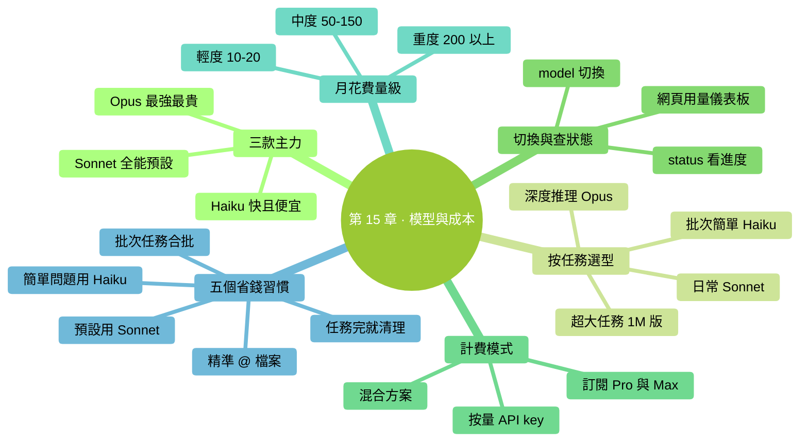
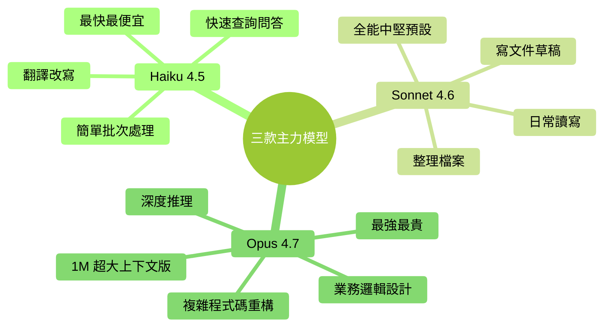

# 第 15 章：模型與成本——怎麼選、怎麼算、怎麼省

> **本章在全書的位置**：第三部分 · 第 15 章 / 預估閱讀+動手時長：**主線 25-30 分鐘 + 支線 10 分鐘**
>
> **前置章節**：Ch 12（上下文原理，搞懂 token）
>
> **學完能做什麼（主線）**：知道 Claude 有**幾款模型**（Haiku / Sonnet / Opus），各自擅長什麼、貴多少；會讀 `/status` 和使用量；知道**大致一個月要花多少錢**；掌握 5 個省錢的小習慣。

---

## 開場三問

- **你會遇到什麼問題**：聽說用 AI 會花不少錢，擔心用著用著月底收到大賬單；不知道什麼場景該用貴模型、什麼場景便宜的就夠。
- **不讀這章會踩什麼坑**：一律用最貴的模型（浪費）；或一律用最便宜的（關鍵任務翻車）。
- **讀完你會多會什麼事**：對每個任務能快速判斷"這個用哪款模型合適"；心裡有一份月度預算預期，不會被賬單嚇到。

### 本章地圖（一眼看全貌）

<!-- diagram: MM-22 -->


---

> 🎯 **【主線】—— 本章必讀核心**

---

## 15.1 三款模型——一句話對比

Anthropic 目前主力三款模型，像三個不同崗位的實習生：

| 模型 | 比喻 | 速度 | 智力 | 價格 |
|------|------|-----|-----|------|
| **Haiku 4.5** | 幹活很快的助理 | **最快** | 入門 | **最便宜** |
| **Sonnet 4.6** | 全能中堅 | 中等 | 強 | 中等 |
| **Opus 4.7** | 頂尖思考者 | **最慢** | **最強** | **最貴** |

<!-- diagram: MM-04 -->


**記住規律**：

> 🔑 **越智慧 = 越慢 = 越貴**——三者是繫結的，沒有"又聰明又便宜又快"的模型。

### Opus 4.7 和 Opus 4.7（1M 上下文版）

Opus 有兩個版本：
- **預設 Opus 4.7**：200K 上下文視窗
- **Opus 4.7（1M）**：1M 上下文視窗（5 倍大），更貴

除非你真的在做超大專案（見 Ch 12 支線 B），**日常用預設版就夠**。

## 15.2 怎麼選——按任務型別

### 場景 A：日常讀寫、整理檔案、寫文件草稿

→ **Sonnet 4.6**

理由：夠聰明 + 不慢 + 不貴。**大部分日常任務它就是最優解**。

### 場景 B：需要深度推理的複雜任務

例子：
- 大段程式碼重構，要一次性想清楚多檔案的影響
- 複雜的業務邏輯設計
- 分析長文件、生成深度洞察

→ **Opus 4.7**

理由：這是它的強項。用 Sonnet 可能**似是而非**，用 Opus 能**真的理解**。

### 場景 C：簡單批次處理、快速查詢

例子：
- 批次改幾十個檔案的格式
- 簡單的問答（"這個命令什麼意思"）
- 翻譯、簡單改寫

→ **Haiku 4.5**

理由：任務對智力要求不高，**選快的 + 便宜的**，體驗更好。

### 場景 D：長文件 / 大專案

→ **Opus 4.7 (1M)**（僅在預設 200K 不夠時）

### 新手最簡經驗

如果你不想記這麼多：

- **預設用 Sonnet 4.6**——覆蓋 80% 場景
- **遇到卡住或深度推理用 Opus 4.7**
- **簡單速查用 Haiku**

## 15.3 怎麼切換——`/model` 命令

在 Claude Code 裡隨時可以換模型：

```
/model
```

會彈出一個列表，顯示可用模型（大致如下）：

```
Select a model:
  1. Claude Sonnet 4.6 (預設)
  2. Claude Opus 4.7
  3. Claude Opus 4.7 (1M context)
  4. Claude Haiku 4.5
```

選一個，後續對話就用新模型。

### 切換是**即時生效**的

- 不需要重啟
- 不影響已有上下文——當前對話繼續，只是"處理這句話的大腦"換了
- **可以中途切換**——任務前期用 Opus 想清楚策略，後期執行細節換 Sonnet

### 一個實用技巧：Opus 規劃 → Sonnet 執行

```
（啟動，預設 Sonnet）
/model → 選 Opus
你：分析 @這個專案/ 的程式碼結構，規劃一個模組拆分方案
Opus：（給深度方案）
你：OK，方案我同意。

/model → 選 Sonnet
你：按剛才方案一步步執行，先改 src/foo.py
Sonnet：（執行）
```

**規劃用 Opus**（深度思考，值回票價），**執行用 Sonnet**（快且便宜）。

## 15.4 怎麼查用了多少——`/status` 和賬單頁

### 在 Claude Code 裡查

```
/status
```

會顯示：
- 當前模型
- 當前會話用了多少 token
- 當前 Ctx%
- 其他狀態資訊

這是**單次會話**的即時情況。

### 在網頁後臺查歷史

Anthropic 官網 [console.anthropic.com](https://console.anthropic.com)（或 Claude.ai 賬戶設定）有**用量儀表板**：

- 按天的 token 消耗
- 按模型分的費用
- 訂閱計劃剩餘額度

### 兩種付費模式

Claude Code 目前有兩種：

| 模式 | 怎麼計費 | 適合誰 |
|-----|---------|------|
| **Claude Pro / Max 訂閱** | **月費**，有每日用量上限 | 重度個人使用者（20-200 美金/月級別） |
| **API Key 按量付費** | 按**每 1M token** 計價 | 輕度使用者 / 公司 / 和別的工具共用 |

### 大致價格（2026 年水平，可能隨時調整）

> 下面是按 API 算的大致單價，供參考。訂閱制等於把這些用量打包成月費。

| 模型 | 輸入（每 1M token） | 輸出（每 1M token） |
|------|------------------|------------------|
| Haiku 4.5 | ~$1 | ~$5 |
| Sonnet 4.6 | ~$3 | ~$15 |
| Opus 4.7 | ~$15 | ~$75 |
| Opus 4.7 (1M) | ~$30 | ~$150 |

**官方最新價格請查**：[anthropic.com/pricing](https://www.anthropic.com/pricing)——本書出版後價格會變。

## 15.5 一個月大概要花多少——量級感

沒做過 AI 工具的人對"一個月多少錢"沒概念。給你三類參考：

### 輕度使用者：每天 10-30 分鐘

例子：偶爾整理檔案、寫幾段文字

- 月均 token 消耗：**3-5M**（約 500 萬 token）
- 費用：**$10-20 / 月**
- **建議方案**：Claude Pro（$20/月）或按量 API

### 中度使用者：每天 1-2 小時

例子：日常工作裡頻繁用它整資料、改文件、做小指令碼

- 月均 token 消耗：**30-50M**
- 費用：**$50-150 / 月**
- **建議方案**：Claude Max（更高限額，$100-200/月）或按量

### 重度使用者：每天 3+ 小時的專業開發

例子：全職寫程式碼、大量用 Opus 做複雜重構

- 月均 token 消耗：**100-300M**
- 費用：**$200-800 / 月**
- **建議方案**：Max 訂閱 + 按量混用；或公司報銷

### **注意：Ctx 爆滿情況下費用翻倍**

上下文越長，每輪對話的"輸入"部分越大。一個 180K 上下文的對話，每輪輸入就**燒 18 萬 token**，Opus 按 15 美元/1M 算——**每輪光輸入就 2.7 美元**。

所以**管好上下文（/clear、/compact）直接就是省錢**。

## 15.6 五個省錢習慣

### 習慣 1：**預設 Sonnet，不預設 Opus**

很多新手一上來就切 Opus——**10 倍貴**，大部分任務沒必要。

**規則**：用 Sonnet 試，**卡住了再切 Opus**。

### 習慣 2：**任務完成 `/clear`**

（Ch 12 已講）每多一輪對話，之前的積累都要重新發一次。**清完重來比一直續著便宜**。

### 習慣 3：**精準 `@`，不 `@` 整目錄**

- `@src/Button.tsx` → 可能 2K token
- `@src/` → 可能幾十 K 甚至 100K+ token

**每次花 5 秒想清楚"真需要的是哪個檔案"**。

### 習慣 4：**簡單問題用 Haiku**

- "這個命令什麼意思" → Haiku 夠用
- "這段錯誤是什麼原因" → Haiku 夠用
- "翻譯這段" → Haiku 夠用

這類任務用 Sonnet 或 Opus 是浪費。

### 習慣 5：**批次任務合批**

不要一次性發 10 條"改一下這個檔案的這段"。**合併成一次任務**：

❌ 差：
```
你：改 a.py 的 X
（Claude 回答）
你：改 b.py 的 Y
（Claude 回答）
你：改 c.py 的 Z
...
```

✅ 好：
```
你：我有三個改動要做，一次說完。@a.py 改 X；@b.py 改 Y；@c.py 改 Z。
```

第二種只用一次"大腦迴圈"，前者用三次，後者更便宜也更快。

---

## 本章小結

- Claude 有三款主力：**Haiku（快便宜）、Sonnet（中堅，日常預設）、Opus（最強最貴）**——越強越慢越貴
- **選擇原則**：日常 Sonnet；深度推理或卡殼切 Opus；簡單批次用 Haiku；超大任務 Opus (1M)
- `/model` 切換模型；`/status` 看當前會話；網頁後臺看歷史用量
- 月花費量級：輕度 $10-20、中度 $50-150、重度 $200+——**訂閱或按量二選一**
- **五個省錢習慣**：預設 Sonnet / 任務完成 /clear / 精準 @ / 簡單問題用 Haiku / 合批

---

## 動手任務

### 任務 1：跑一次 `/status` 熟悉介面（3 分鐘）

**步驟**：
1. 啟動 Claude Code
2. 執行 `/status`
3. 記下你看到的所有資訊——模型、Ctx%、本次用量

**成功標誌**：你現在知道隨時用 `/status` 查進度。

### 任務 2：用同一個問題對比 Sonnet 和 Opus（10 分鐘）

**步驟**：
1. 準備一個**稍有深度**的問題（例："給我的 `@一個專案/` 提三個可以重構的點"）
2. 先用 Sonnet 問一遍，記錄回答
3. `/model` 切 Opus，同一個問題再問一遍
4. 對比：Opus 的回答是不是**真的深一層**？速度慢了多少？

**成功標誌**：你對"什麼時候 Opus 值錢、什麼時候不值"有了直覺。

### 任務 3：查你過去 30 天的用量（5 分鐘，需要已用過幾天）

**步驟**：
1. 開啟 [console.anthropic.com](https://console.anthropic.com) 或 Claude.ai 賬戶頁
2. 找到 "Usage" / "用量" 頁
3. 看上月總花費

**成功標誌**：你對自己的實際花費水平有了數字，不再憑感覺。

---

## 如果你卡住了

**症狀 A：`/model` 列表裡看不到 Opus 或 Haiku**
- 原因：(a) 賬戶沒開對應權限；(b) Pro 使用者某些高階模型要 Max 訂閱。
- 解決：查賬戶訂閱等級；或用 API key 用量付費模式（通常所有模型都可用）。

**症狀 B：錢花得比預期快很多**
- 原因：(a) 一直用 Opus；(b) 上下文總是滿的；(c) `@` 了大檔案 / 大目錄。
- 解決：(a) 切 Sonnet；(b) 養成 `/clear` 習慣；(c) 精準 `@`。

**症狀 C：遇到 "rate limit" 報錯**
- 原因：短時間內用太多——達到每分鐘 / 每小時額度上限。
- 解決：等 1-5 分鐘；或暫時切到 Haiku；或升訂閱等級。

---

主線結束。下面支線講"按量 vs 訂閱怎麼選"和"公司報銷的一點建議"。

---

> 🌿 **【支線】—— 可選深入（學有餘力再看）**

---

## 🌿 支線 15.A：按量付費 vs 訂閱——怎麼選

> **這段講什麼**：Claude Pro/Max 訂閱 vs 自備 API key 按量計費，哪種更划算。
> **什麼時候回頭讀**：你第一個月賬單出來後想最佳化時。

### 訂閱（Claude Pro / Max）

**優點**：
- **月費固定**，不擔心突然大賬單
- 額度用不完也不退，但心理負擔小
- 升級模型選擇方便（Max 能用最高檔的）

**缺點**：
- **有每日額度**——用多了會被限速
- 額度用不完當月清零，**波動大的使用者不划算**

**適合**：穩定高頻使用者（每天都用 1 小時以上）

### API key 按量

**優點**：
- **真正按量算錢**——用多少付多少
- 可以用第三方工具共享同一個 key
- 公司場景便於報銷（拿到發票）

**缺點**：
- 有**月底大賬單**的風險
- 每個模型的價格要自己比

**適合**：
- 用量波動大的使用者（有時一天幾小時，有時一週不用）
- 小團隊共享
- 公司場景

### 混合方案

**高階玩法**：**訂閱 + API key 兩份**，視情況切換：
- 日常用訂閱（用額度）
- 訂閱額度用完 / 特殊場景用 API key

這種配置複雜，一般人不需要。**先訂閱一個月看看自己的模式**再決定。

---

## 🌿 支線 15.B：團隊 / 公司場景的一點建議

> **這段講什麼**：打算給團隊用、或公司報銷時的幾個注意點。
> **什麼時候回頭讀**：你要為團隊採購 Claude 時。

### 建議 1：查清楚公司 AI 政策

（Ch 11 講過）很多公司對 AI 工具有**採購流程**，別自己買了之後報銷碰釘子。

### 建議 2：選擇 Claude for Work / Enterprise

如果規模大（10 人以上）：
- 支援 SSO 登入
- 可配置資料保留策略（0 天、30 天等）
- 團隊統一計費
- 更嚴的合規約定

比每個員工自己買訂閱規整得多。

### 建議 3：團隊共享不共享？

**共享一個 API key**給所有人用：
- ✅ 省管理成本
- ❌ 用量監控困難，誰花多了看不清

**每人一個 key / 賬號**：
- ✅ 用量清晰
- ✅ 方便審計
- ❌ 管理複雜

**推薦**：**每人一個賬號**，但**統一結算**到公司（Anthropic 企業版就是這麼設計的）。

### 建議 4：預算控制

- Anthropic 有**每月支出上限**可以設——防止爆單
- 建議公司級賬戶設 $X/月 上限，超了自動停
- 個人賬戶也可以設 $50 / $100 這種保護線

---

**第三部分（深度概念）到此完成**。

你現在已經掌握了：
- Claude Code 的資料去哪了、什麼能發什麼不能（Ch 11）
- 上下文為什麼會滿、三種清理策略（Ch 12）
- 三層記憶系統，每層放什麼（Ch 13）
- 怎麼寫一份讓 Claude 真的變準的 CLAUDE.md（Ch 14）
- 怎麼選模型、怎麼算成本、怎麼省（Ch 15）

**下一部分（第四部分：避坑與判斷力）**開始：10 大常見錯誤、什麼時候該停下來、常用命令速覽、輸入技巧——**把你從"會用"推到"用得不踩坑"**。

---

> 💡 **想專門瞭解 Opus 4.7 相對 4.6 的變化、新的 effort 檔位、分詞器變化、prompt 微調建議、5 個新手坑**——直接讀 [附錄 J · Claude Opus 4.7 新手指南](../附錄/J-Opus-4.7新手指南.md)。本書以 4.7 為基線寫作，附錄 J 把 4.7 的所有差異集中講了一遍。

> 💰 **想省 80%+ 的模型成本**：Claude Code 並不強制繫結 Claude 模型，它的 `ANTHROPIC_BASE_URL` 可以指向國產主流大模型（智譜 GLM、通義千問、Kimi、MiniMax 都已官方相容 Anthropic 協議）。日常任務切到國產能省非常多，複雜任務再切回 Claude。詳細接入和切換方案見 [附錄 K · 接入第三方模型](../附錄/K-第三方模型接入.md)。


---

<!-- chapter-nav -->

📖  [← 第 14 章 · 寫好你的 CLAUDE.md](14-寫好你的CLAUDE.md.md)  ·  [📑 返回目錄](../../README.md)  ·  [第 16 章 · 新手 10 大錯誤 →](../part4-避坑與判斷力/16-新手10大錯誤.md)
