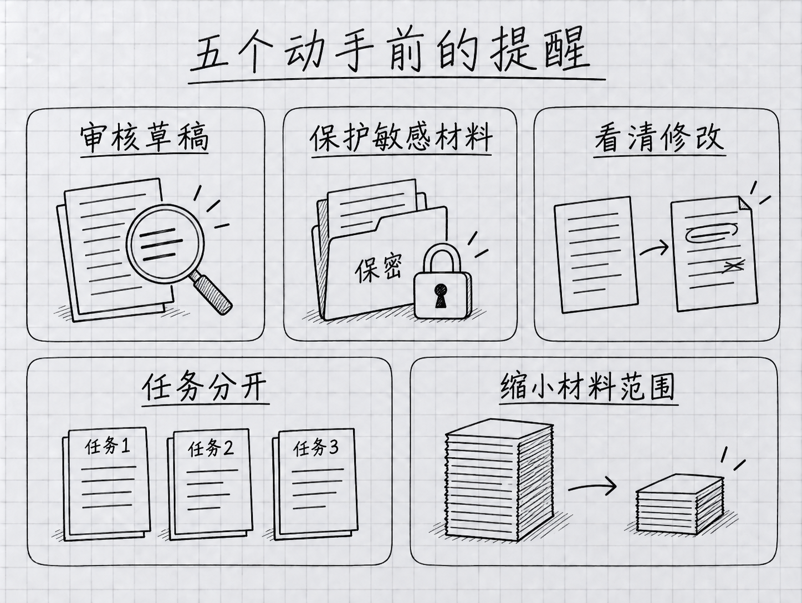

<a id="第-16-章新手-10-大错误看完能避开的坑"></a>
# 第 16 章：新手 10 大錯誤——看完能避開的坑

> **本章在全書的位置**：第四部分 · 第 16 章 / 預估閱讀+動手時長：**主線 25-30 分鐘 + 支線 10 分鐘**
>
> **前置章節**：讀過 Part 1-3 再看，代入感最強
>
> **學完能做什麼（主線）**：對零基礎使用者最常犯的 10 個錯誤有免疫力。看見每個錯就能聯想起"本章講過"——在踩之前先繞開。

> **核驗日期：2026-09-24。** 本章對話和介面文字均為教學示意；請以你的版本、賬號和實際介面為準。

---

<a id="开场三问"></a>
## 開場三問

- **你會遇到什麼問題**：按說該會用了，但總在同一些地方栽跟頭；踩一次印象深，但下次又沒防住同類。
- **不讀這章會踩什麼坑**：被動踩坑——只有事故發生後才學到。
- **讀完你會多會什麼事**：看到這 10 類情境就條件反射警覺——**踩過沒踩過都能繞過去**。

<a id="本章地图一眼看全貌"></a>
### 本章地圖（一眼看全貌）

本章圖解：[五個動手前的提醒](#161-错误-1把-init-的草稿直接当成项目规则)、[五個合作時的提醒](#166-错误-6让-claude-干完全不懂的活然后全盘信)。

---

> 🎯 **【主線】—— 本章必讀核心**

---


<a id="161-错误-1把-init-的草稿直接当成项目规则"></a>
## 16.1 錯誤 1：把 /init 的草稿直接當成專案規則

**場景**：第一次開啟 Claude Code，用 `/init` 生成說明後，自己沒有通讀，就讓它成為以後每次工作的依據。

<!-- diagram: FIG-018 -->


*圖：開工前先縮小任務、補齊背景、確認範圍與材料。*
<!-- /diagram: FIG-018 -->

**問題不在執行命令本身。** 它可以幫助起草，但生成內容也可能漏掉你沒寫在檔案裡的約定。例如，原始素材必須保留、舊檔名暫時不能改、哪些資訊需要人工確認，這些未必能從目錄裡猜出來。

**正確做法**（詳見 Ch 14）：

- 可以手寫，也可以自動起草；儲存前逐條核對事實。
- 補上專案為什麼這樣組織，以及真正需要反覆提醒的要求。
- 刪除重複和過期內容，長流程另存；不要只為了達到某個行數機械刪減。

<a id="162-错误-2把-env-或密钥文件--进来"></a>
## 16.2 錯誤 2：把 `.env` 或金鑰檔案 `@` 進來

**場景**：想讓 Claude 幫你加一個環境變數配置，直接 `@.env 帮我加一个 REDIS_URL`。

**翻車**：
- 若敏感值被讀取並進入請求，它們就可能被髮送到你當前連線的模型服務
- 能否用於訓練、保留多久由賬號、設定和服務商決定；**不能把這些政策當作傳送金鑰的理由**
- 補救：立刻去每個服務 **revoke** 那些金鑰，重新簽發

**正確做法**（詳見 Ch 11）：
- `.env` 裡放敏感值的檔案**永遠不 `@`**
- 想讓它改，**複製一份脫敏版**（值改成 `<REDACTED>`），改完再把真值填回去
- 或**只告訴 Claude 欄位名**，不給值

<a id="163-错误-3不看-diff-就无脑-yes"></a>
## 16.3 錯誤 3：不看 diff 就無腦 Yes

**場景**：讓 Claude 改一個檔案，它說"改好了"，你 Enter Enter 下去沒細看。

**翻車**：
- 它**"順手"多改了幾個你沒讓它改的地方**——常見
- 新增了一段你不需要的"防禦性程式碼"
- 刪掉了你原來有意保留的註釋

**正確做法**（詳見 Ch 6、Ch 10）：
- 即使 vibe review，也要**掃一眼 diff 檔案數 + 改動範圍**
- 看到"順手改了 X"立刻 No，讓它只做你要求的事
- 高風險場景（auth / 支付 / 資料庫）**強制細審**

<a id="164-错误-4在一个会话里做-10-件不相关的事"></a>
## 16.4 錯誤 4：在一個會話裡做 10 件不相關的事

**場景**：早上 9 點起一個 Claude Code 會話，整理照片；10 點改部落格；11 點看程式碼；12 點寫週報……全在同一個會話裡。

**翻車**：
- Ctx 越來越高，到下午 Claude 答非所問
- 不同任務的上下文**互相干擾**（改部落格時它還在聊早上的照片檔名）
- 你糾正一次、它好一會，**漂移不止**

**正確做法**（詳見 Ch 12）：
- 儲存這件事的結果，再用 `/clear` 開始另一件事；舊會話通常可用 `/resume` 找回
- 關係近的連貫任務可以續著，**跨主題就清**
- 一個會話**聚焦一件事**

<a id="165-错误-5文件太大--目录太大直接-"></a>
## 16.5 錯誤 5：檔案太大 / 目錄太大直接 @

**場景**：`@整个项目/ 帮我看看哪里可以优化`——整個專案幾百個檔案。

**翻車**：
- 載入了很多無關資料，增加處理和核對負擔；實際佔用用 `/context` 檢視
- Claude 看得太雜，回答泛泛而談
- **比你自己開啟 IDE 看還低效**

**正確做法**（詳見 Ch 5、Ch 12）：
- 先**讓 Claude 看目錄結構**（`ls` / `tree`），**再由你指定**具體哪個檔案細看
- 先明確要比較或修改的部分，再逐步讀取相關檔案
- 大檔案先查目錄、標題或關鍵詞，再讀相關段落；先載入全文再摘要，不會撤回已經發生的讀取

<a id="166-错误-6让-claude-干完全不懂的活然后全盘信"></a>
## 16.6 錯誤 6：讓 Claude 幹完全不懂的活然後全盤信

**場景**：你是 Python 開發者，讓 Claude 寫一段 Bash / SQL / 正則——從沒學過，看它寫完就直接拿去用。

<!-- diagram: FIG-019 -->


*圖：執行後仍要驗證、儲存和回看，別跳過結果檢查。*
<!-- /diagram: FIG-019 -->

**翻車**：
- Claude 寫這些領域**容易翻車**（尤其正則和 SQL）
- **你不懂 = 你檢查不了** —— 出錯了你都看不出
- 搞壞資料庫 / 刪錯檔案，事後才發現

**正確做法**（詳見 Ch 10）：
- 跨自己不熟的領域 → **強制 L4 稽核**
- 讓 Claude **附帶測試 / 樣例驗證**（正則給 3 個能匹配 + 3 個不能匹配的字串）
- 或找一個懂的人 review
- **不要在"不熟 + 不可逆"的交集上讓 Claude 出手**（例：直接改生產庫）

<a id="167-错误-7用模糊语言给任务"></a>
## 16.7 錯誤 7：用模糊語言給任務

**場景**：`帮我优化一下这段代码`。什麼叫最佳化？速度？可讀性？記憶體？

**翻車**：
- Claude 猜一個方向去做，**通常不是你想要的**
- 它做完你說"不是這個意思"，重做一遍——**Ctx 雙倍消耗，你也煩**

**正確做法**（詳見 Ch 5 WHAT/WHERE/HOW/VERIFY）：
- **WHAT**：具體改什麼
- **WHERE**：哪個檔案哪段
- **HOW**：怎麼改（如果能想到）
- **VERIFY**：怎麼驗證改對了

例：❌ "最佳化 `@util.py`" → ✅ "`@util.py` 裡的 `parseDate` 函式太慢（測過 500ms），請改成不用正則的實現，改完我會跑 `pytest tests/test_util.py` 驗證"


<a id="168-错误-8不知道当前模型模式和费用路径"></a>
## 16.8 錯誤 8：不知道當前模型、模式和費用路徑

**場景**：照著幾個月前的帖子切換模型，或者點了一次“以後不再問”，之後就沒再看過當前狀態。

**翻車**：

- 以為是在 Manual，實際已切到自動模式，檔案修改不再逐次詢問。
- 以為正在使用訂閱內額度，實際啟用了另行計費的服務或加速選項。
- 看到上下文佔用增加，機械清空會話，把仍需要的任務條件丟在舊記錄裡。

**正確做法**（詳見 Ch 7、Ch 12、Ch 15）：

- `/model` 看模型，輸入區附近看許可權模式。
- `/context` 看上下文；不要把固定百分比當成質量分界。
- 訂閱用量查 `/usage` 和賬號用量頁；API 花費查賬單和當前支援的費用統計。
- 本版日常起步優先考慮 Opus 5.5；更難的任務再評估 Fable 5.1。可用性、額外額度和實際開銷以你的賬號為準，別隻憑“模型更新”就升檔。

<a id="169-错误-9对-claude-的错误愤怒升级"></a>
## 16.9 錯誤 9：對 Claude 的錯誤憤怒升級

**場景**：Claude 改錯了，你生氣："**我都說過多少次了**！"下一句 Claude 繼續錯。你更生氣、措辭更重、加大寫加感嘆號。

**翻車**：
- 憤怒的提示詞裡**反而資訊更少、更模糊**
- 你在和"一個沒人格的語言模型"對話——它不會"改正態度"，只會繼續按猜測做
- **越煩躁越出錯**，掉進死迴圈

**正確做法**（詳見 Ch 17）：
- 感覺到"第三次糾正同一個錯"時——**停**
- 先儲存仍有價值的結果，再 `/clear` 另起討論；或在 `/rewind` 選單選擇可跟蹤的檢查點。命令和外部副作用不能靠回退對話撤銷
- 用更**具體 + 冷靜**的語言重講一遍："X 的要求是……，不是你理解的那樣"
- **實在不行，自己動手**——AI 不是萬能

<a id="1610-错误-10把-claudemd-当通灵板"></a>
## 16.10 錯誤 10：把 CLAUDE.md 當"通靈板"

**場景**：CLAUDE.md 裡寫"Claude 必須像資深工程師一樣思考"、"優雅地處理所有邊緣情況"、"寫出高質量程式碼"。

**翻車**：
- 這些**對 Claude 沒有任何意義**——它不知道"資深"、"優雅"、"高質量"具體什麼標準
- 條目佔位置但不 actionable
- 真正該寫的具體規則被淹沒

**正確做法**（詳見 Ch 14）：
- 讓重要規則有可以檢查的成功標準
- ❌ “整理得專業一點” → ✅ “保留原始資料，輸出按日期排序，缺失日期單列待確認”
- ❌ “不要出錯” → ✅ “完成後列出修改檔案，並抽查三條結果與原文是否一致”

---

<a id="本章小结"></a>
## 本章小結

10 個錯誤歸起來就 3 種模式：

本章圖解：[五個動手前的提醒](#161-错误-1把-init-的草稿直接当成项目规则)、[五個合作時的提醒](#166-错误-6让-claude-干完全不懂的活然后全盘信)。

- **認知偏差**：以為 AI 比實際更聰明 / 更可靠（錯誤 3、6、10）
- **工作流失當**：沒管好上下文、沒精準提問（錯誤 1、4、5、7、8）
- **情緒與安全**：憤怒重試 / 敏感資訊上傳 / 在不熟領域踩雷（錯誤 2、6、9）

治理這三類就用三個手段：
- **建立校準習慣**（Ch 10 信任檔案 + L1-L4 稽核）
- **紀律化工作流**（`/clear` / 精準 @ / WHAT-WHERE-HOW-VERIFY）
- **懂得停下**（下一章）

---

<a id="动手任务"></a>
## 動手任務

<a id="任务-1对号入座10-分钟"></a>
### 任務 1：對號入座（10 分鐘）

回想過去 1-2 周你用 Claude Code 踩過的坑。對照本章 10 條，**打勾你踩過的**。

**成功標誌**：能認出適用於自己的情境；沒有實際踩過也可以用虛構練習判斷，不必湊夠錯誤數量。

<a id="任务-2建立避坑自检清单15-分钟"></a>
### 任務 2：建立"避坑自檢清單"（15 分鐘）

新建 `~/Desktop/ccguide-练习/避坑清单.md`：

```markdown
# 我的 Claude Code 避坑清单

## 动手前问自己
- [ ] 这个任务涉及敏感信息吗？需要脱敏吗？（错误 2）
- [ ] 我要 @ 的文件是精准的吗？（错误 5）
- [ ] 我的任务描述有 WHAT/WHERE/HOW/VERIFY 吗？（错误 7）
- [ ] 这是我熟悉的领域吗？不熟要升级审核档位（错误 6）

## 动手中警觉
- [ ] 当前模型、权限模式和费用路径清楚吗？必要时查看 /context（错误 8）
- [ ] diff 改了哪些文件，和我预期一致吗？（错误 3）
- [ ] 跨任务了吗？该 /clear 了吗？（错误 4）

## 情绪信号
- [ ] 第三次纠正同一个错 → 停下来，/clear 或亲自动手（错误 9）
```

**成功標誌**：這份清單貼你桌面 / 貼輸入法候選 / 貼 CLAUDE.md 邊上都行——**肉眼能看見**。

<a id="任务-3给一个现成-claudemd-找错误-105-分钟"></a>
### 任務 3：給一個現成 CLAUDE.md 找錯誤 10（5 分鐘）

開啟你自己寫過的或公開找的一份 CLAUDE.md，**找出所有"通靈板式"措辭**（"高質量"、"優雅"、"像專家"這類）。

**成功標誌**：至少識別 3 條——把它們改成 actionable 的具體規則。

---

<a id="如果你卡住了"></a>
## 如果你卡住了

**症狀 A：一條都沒踩過，覺得本章沒用**
- 原因：要麼你用得還不夠多、要麼你已經很謹慎。
- 解決：**當作備忘留著**——用到 10 小時以上大機率會踩其中幾條。

**症狀 B：10 條都踩過，覺得自己是笨蛋**
- 原因：正常人的學習曲線就是這樣。
- 解決：**踩過不代表永遠踩**——踩過而能命名的錯誤，下次會本能警覺。

**症狀 C：不確定自己踩了哪一條**
- 原因：錯誤之間有時重疊（錯誤 4 + 5 常一起發生）。
- 解決：**不用精確歸類**——重要的是**認出型別**，能對照到本章的建議即可。

---

主線結束。下面支線講"兩個進階錯誤（錯誤 11-12）"和"如何把這份清單當專案持續迭代"。

---

> 🌿 **【支線】—— 可選深入（學有餘力再看）**

---

<a id="-支线-16a两个进阶错误"></a>
## 🌿 支線 16.A：兩個進階錯誤

> **這段講什麼**：不在主線 10 條裡，但用一陣子後容易遇到的兩個坑。
> **什麼時候回頭讀**：你已經用 Claude Code 超過一個月時。

<a id="错误-11工具链成瘾什么都想-skill-化"></a>
### 錯誤 11：工具鏈成癮——什麼都想 Skill 化

用熟了之後開始瘋狂寫 custom Skills、Hooks、Subagents——每件小事都做一個工具。

**翻車**：
- 時間都花在建工具上，反而**真正的工作沒做**
- 工具之間打架（Hook 觸發了 Skill，Skill 又調 Subagent……）
- 維護負擔指數上升

**正確做法**：
- **一個任務做過 5 次以上**再考慮工具化
- 工具鏈**先求少**，每個工具獨立可驗證
- 定期砍掉不常用的工具

<a id="错误-12迷信长-claudemd"></a>
### 錯誤 12：迷信長 CLAUDE.md

做了一陣開始**覺得 CLAUDE.md 越全越好**——加到 500 行、1000 行，覺得這樣 Claude 就肯定懂專案了。

**翻車**：
- Ch 14 講過——長 CLAUDE.md **效果反而變差**
- 注意力分散、規則衝突
- 每次啟動慢

**正確做法**：
- 以自己能讀完和維護為標準；官方寫作建議與產品硬限制要分開
- 長了就**砍**：砍可 pointer 化的、砍含糊的、砍早已預設的
- CLAUDE.md 不是"保險"——**不是條數越多越保險**

---

<a id="-支线-16b把错误清单当项目迭代"></a>
## 🌿 支線 16.B：把錯誤清單當專案迭代

> **這段講什麼**：本章 10 條是通用清單，但你有**個人化的錯誤模式**。
> **什麼時候回頭讀**：踩過本章 10 條的大部分後。

<a id="建立我的个人错误日志"></a>
### 建立"我的個人錯誤日誌"

新建 `~/Desktop/ccguide-练习/个人错误日志.md`。下面兩條為虛構示例，請換成你的真實記錄：

```markdown
# 我在 Claude Code 上犯过的错

## 2026-04-15：周报被 Claude "优化"掉了关键数据
- 原因：无脑 Yes，没审 diff
- 教训：vibe review 时至少扫一遍数字字段有没有动
- 类型：错误 3（无脑 Yes）

## 2026-04-18：老板问我 Claude 花了多少钱，答不上来
- 原因：从没查过用量页
- 教训：每月 1 号看一次 console
- 类型：错误 8（忽视状态）
```

<a id="每月回顾"></a>
### 每月回顧

- **本月犯過哪些錯**
- **哪幾類重複發生**（對應本章哪一條）
- **針對高頻錯誤加一條硬規矩到 CLAUDE.md 或避坑清單**

<a id="这份日志的两个好处"></a>
### 這份日誌的兩個好處

1. **給自己留記憶**——錯過的不再錯第二次
2. **如果團隊用 Claude Code**——彙總大家日誌，形成團隊規範

---

**下一章**：第 17 章"什麼時候該停下來"——最務實的判斷力訓練。AI 不是什麼都能做，不是多給幾次提示就能解決。**知道什麼時候停、改用別的方法，才是真正的熟手**。
