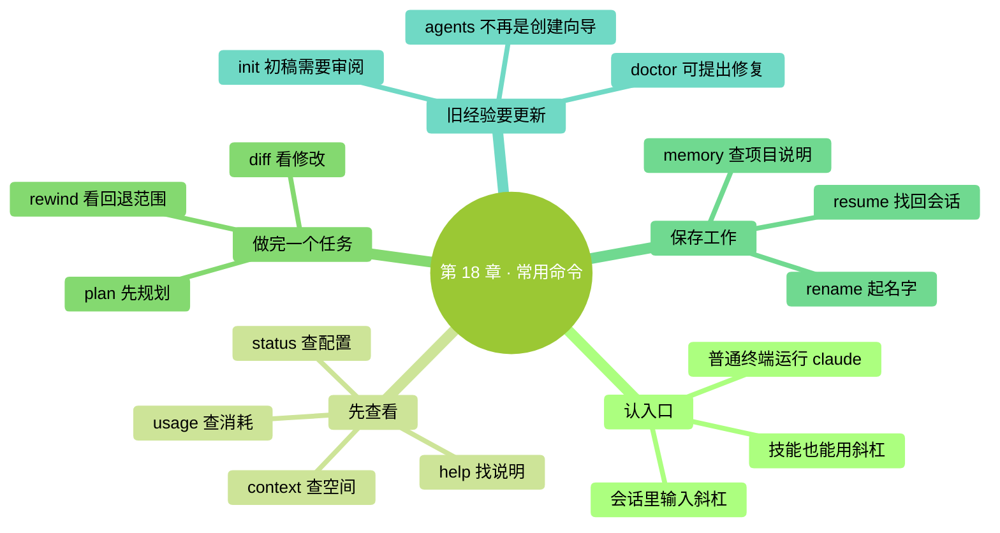
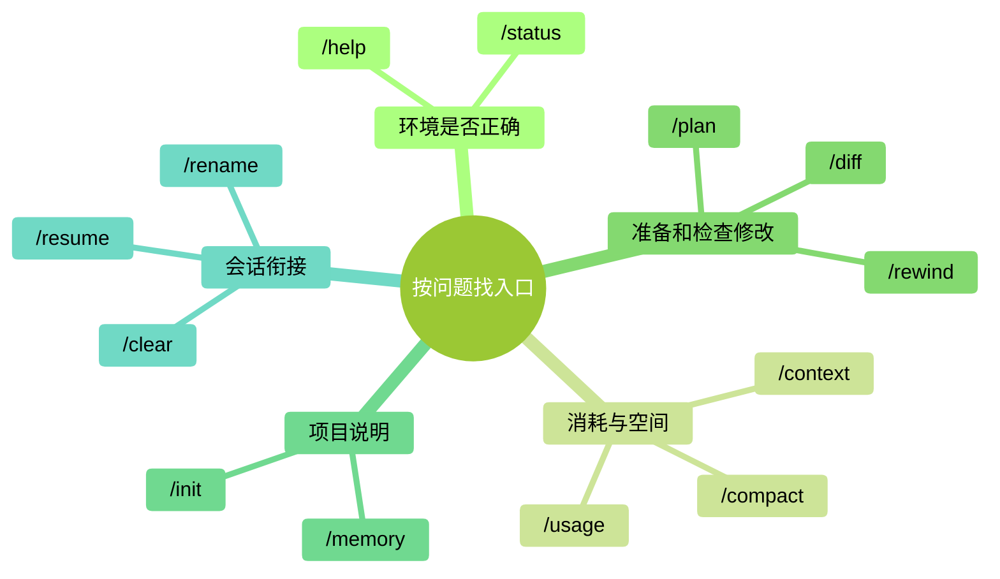

# 第 18 章：常用快捷命令全覽——按場景找到入口

> **本章在全書的位置**：第四部分 · 第 18 章 / 預估閱讀與動手時長：主線 25 分鐘，支線 10 分鐘。
>
> **前置章節**：前面學過的會話、許可權、記憶和模型操作，在這裡串起來。
>
> **學完能做什麼**：知道命令該輸在哪裡，分清檢視、改設定和讓 Claude 開工三類入口，遇到問題時找到合適操作。
>
> **核對日期：2026-09-24；操作基線：Claude Code 2.1.280 或更新版本。** 這是一份常用入口指南，實際選單會隨賬戶、平臺和已安裝能力變化。

---

## 開場三問

- **你會遇到什麼問題**：記得有一個斜槓命令能解決眼前的問題，卻想不起名字；或者按舊教程操作，發現入口變了。
- **不讀這章會踩什麼坑**：以為所有斜槓命令都只是檢視；為了熟悉選單，把會改檔案、改設定的專案也逐個執行。
- **讀完你會多會什麼事**：從“我現在要做什麼”反推命令，先確認作用，再執行。

### 本章地圖（一眼看全貌）

<!-- diagram: MM-25 -->

---

> 🎯 **【主線】—— 本章必讀核心**

## 18.1 同一個斜槓，後面可能是不同的工作

在 **Claude Code 的輸入框**裡，以 `/` 開頭輸入命令。先打一個斜槓，選單會列出當前可見的選項；繼續打字，就會篩選。用上下方向鍵選中，再按 Enter（回車鍵）執行。想取消時，按 Esc（鍵盤左上角的退出鍵）。

這裡有一個需要更新的認識：**不能把所有斜槓命令都理解成“不經過模型、不會做事”的本地按鈕。** 有些命令顯示面板，有些修改設定，還有些啟動 Skill（技能，一組讓 Claude 按特定方法工作的說明）。技能可能讀取檔案、生成內容、執行工具，也會使用模型額度。[命令入口說明](https://code.claude.com/docs/en/commands)、[技能說明](https://code.claude.com/docs/en/skills)

先用三個例子體會區別：

| 輸入 | 你應把它當成什麼 |
|---|---|
| `/status` | 開啟狀態面板，檢視當前環境 |
| `/model` | 開啟模型選擇器；確認選擇可能影響以後會話 |
| `/doctor` | 讓 Claude 做一輪設定體檢，可能提出修復方案 |

不知道某項會做什麼，就看說明，不要用“執行看看”代替理解。尤其不要為了練習，把生成檔案、修改配置、安裝擴充套件的命令一次跑完。`/help` 是常用幫助入口，`/` 選單適合尋找當前可見選項；它們也不意味著能列出所有隱藏入口和所有賬戶才有的功能。

另外，`claude --version` 這一類命令要輸在**普通終端**，不是 Claude Code 對話裡。反過來，在普通終端輸入 `/model`，也不會開啟模型選單。命令名稱記得不全，通常不如“現在在哪個輸入框”重要。

## 18.2 先查清：我在哪、用了多少、什麼佔著空間

學過第 12、15 章後，你已經見過幾種面板。這裡把它們並排放一次，避免發生“想查餘額，卻盯著上下文百分比”的混淆。

| 當前問題 | 入口 | 看什麼 |
|---|---|---|
| 軟體和賬戶是否是預期的 | `/status` | 版本、模型、賬戶、連線狀態 |
| 本次和套餐消耗怎樣 | `/usage` | 會話估算、套餐使用情況與活動統計 |
| 這次對話帶了哪些材料 | `/context` | 上下文空間及佔用組成 |
| 記不清入口叫什麼 | `/help` | 可用幫助與命令說明 |

當前 `/cost` 是 `/usage` 的另一個名字，叫做**別名**；不必把它們當成兩套賬單。`/stats` 也通向用量介面，只是開啟統計頁。費用估算與實際扣款的關係，仍按[第 15 章](../part3-%E6%B7%B1%E5%BA%A6%E6%A6%82%E5%BF%B5/15-%E6%A8%A1%E5%9E%8B%E4%B8%8E%E6%88%90%E6%9C%AC.md)核對。[用量官方說明](https://code.claude.com/docs/en/costs)

例如，你讓 Claude 整理一份檔案，它提示額度不足。先看 `/usage` 和提示裡的限制型別；不要因為 `/context` 還有空位，就認定系統出了錯。上下文是工作空間，套餐額度是可用消耗，兩者不是同一個量。

再比如，它開始忘記前面確定的格式。先看看重要要求是不是還在材料裡，是否需要重申；對話很長時，可以考慮 `/compact` 總結已有內容。**本章不把 50%、75% 這類數字設成固定操作開關。** 要不要整理，取決於任務、材料與當前提示，不是見到某個百分比就必須執行一個命令。

<!-- diagram: MM-06 -->

## 18.3 把一次修改走完整，比背下命令表更有用

你準備修改幾份檔案，又想先確定範圍。這時 `/plan` 可以切到計劃模式；它的用途是先了解和規劃，具體許可權邊界見[第 9 章](../part2-%E6%97%A5%E5%B8%B8%E4%BD%BF%E7%94%A8/09-%E8%AE%A1%E5%88%92%E6%A8%A1%E5%BC%8F%E4%B8%8E%E6%92%A4%E9%94%80.md)。不要把“先規劃”理解成“後面的任何執行都已授權”。

下面是**練習步驟示意，不是一次真實執行記錄**：

1. 在會話輸入 `/plan`，說明：“請先列出把兩份活動安排合成清單的方案，保留原檔案。”
2. 閱讀方案，確認輸入材料、輸出檔案和檢查方法。
3. 透過介面的模式切換離開計劃模式，明確讓它按確認的範圍執行。
4. 檢查生成的檔案；如果專案使用 Git（儲存檔案版本的工具），可以用 `/diff` 檢視修改前後的對比。

**diff** 就是前後差異。它能幫助你看見增刪，但“看見差異”還不是“證明正確”。一行數字從 20 變成 30，你仍要對照原材料確認該不該變。[檢視修改的官方說明](https://code.claude.com/docs/en/interactive-mode#review-changes-with-diff)

改錯之後可以輸入 `/rewind`，檢視能恢復到哪些檢查點——程式記錄的先前狀態。先讀清恢復的是對話、檔案，還是兩者。它不能撤銷所有外部行為，也不記錄透過 shell（終端命令）造成的全部檔案變化；已傳送訊息、已釋出內容也不是靠回退對話就能收回的。[檢查點與限制](https://code.claude.com/docs/en/checkpointing)

因此，不存在“Claude 一做錯，就無條件 rewind”的規則。一個錯別字可以直接改；修改方向走偏且存在合適檢查點時，回退可能更方便。找不到恢復點時，先保留當前檔案並確認影響範圍，**不要再用 `/clear` 試圖撤銷修改**。清空會話只會讓繼續說明問題更費勁。

## 18.4 留住工作進度，也留住你真正想長期保留的規則

一次任務可能跨幾天。收工前，用 `/rename 活动安排核对` 給當前會話起個名字，之後透過 `/resume` 的選擇器找到它。比起記住“前天第三個視窗”，清楚的名字更方便。恢復會話不表示電腦裡的檔案會自動回到當時版本，繼續前仍要檢查現在的檔案。

如果下一項工作與當前任務無關，可以用 `/clear` 開始新會話；如果只是想停止普通前臺會話，可以用 `/exit`。已經被你移到後臺、還在執行的任務是另一種情況，支線會解釋。別把關閉當前輸入視窗等同於“所有工作都停止”。

另一些資訊不該只留在聊天記錄裡。例如，團隊約定的輸出資料夾、保留原稿的要求，可以寫進 `CLAUDE.md`——專案給 Claude 的工作說明。`/memory` 能幫助你檢視和編輯說明檔案、檢視自動記憶及相關開關；它不是一個只管理單獨 `MEMORY.md` 檔案的入口。[專案記憶說明](https://code.claude.com/docs/en/memory)

新專案也可以執行 `/init`，讓 Claude 先生成說明初稿，再由你審閱。已有 `CLAUDE.md` 時，它會提出改進建議，不是要求你先刪掉。你要核對檔案裡寫的事實與操作是否真的適用，刪去猜測和不需要的規則。自動生成是一個起點，手寫也是一個起點，關鍵都在內容是否準確。

本章不會要求你“把所有命令跑一遍，再刪掉產物”。你只需要在真的想建立專案說明時使用初始化，並保留有價值的結果。

## 18.5 調整設定之前，弄清它會影響多久

你可能只是想試一個模型，卻發現明天啟動也換了。這不是程式隨意改變習慣：當前 `/model` 的正常確認會儲存預設選擇。如果只想在本次會話使用，在選擇器移到相應模型行，按字母 **s**；按 Enter 則儲存。模型與思考投入的詳細關係見[第 15 章](../part3-%E6%B7%B1%E5%BA%A6%E6%A6%82%E5%BF%B5/15-%E6%A8%A1%E5%9E%8B%E4%B8%8E%E6%88%90%E6%9C%AC.md)。

`/config` 開啟設定；`/permissions` 管理操作的允許、詢問和拒絕規則，不能只把它當“白名單”。改規則會影響 Claude 後面的行動，所以先弄清它屬於當前專案、個人還是組織。僅想知道為什麼某一步被攔住時，先檢視，不必為了減少提示把規則全部放開。[許可權規則說明](https://code.claude.com/docs/en/permissions)

排查問題時，還有一個很容易混淆的名稱：

| 輸入位置 | 命令 | 作用邊界 |
|---|---|---|
| 普通終端 | `claude doctor` | 輸出只讀安裝診斷，不啟動一輪會話修復 |
| Claude Code 會話 | `/doctor` | 體檢技能：分析問題，並在你確認後實施提出的修復 |

當前 `/doctor` 可能建議整理說明檔案、修改配置等，不再只是舊版的只讀面板。把它當成“請 Claude 診斷”，讀清修復計劃後再決定；若 Claude Code 根本啟動不了，就從終端的 `claude doctor` 開始。[故障排查說明](https://code.claude.com/docs/en/troubleshooting)

最後，舊教程中用 `/agents` 開啟建立嚮導的步驟已經過時。當前應讓 Claude 建立或編輯子代理定義，詳見[第 22 章](../part5-%E6%89%A9%E5%B1%95%E8%83%BD%E5%8A%9B/22-Subagents%E5%85%A5%E9%97%A8.md)。這類改變也提醒我們：記住用途，遇到入口變化查當前說明，比死記選單順序有效。

---

## 本章小結

- 斜槓命令輸入在 Claude Code 會話裡，普通終端命令在會話外。
- 有些入口只是檢視，有些改設定，有些啟動會工作的技能。
- `/status`、`/usage`、`/context` 分別看環境、消耗、空間。
- 修改前規劃，修改後檢查；`/rewind` 有恢復範圍，`/clear` 不能撤銷檔案。
- `/init` 可以生成說明初稿，`/memory` 幫助管理說明與記憶。
- 不需要把所有命令逐個執行，先用與當前問題有關的入口。

## 動手任務

### 任務 1：做一張自己的檢視卡（約 5 分鐘）

1. 在會話裡依次開啟 `/help`、`/status`、`/usage`、`/context`，看完一個再關閉。
2. 每項記一句話：“我以後遇到什麼問題會用它。”
3. 對未顯示的資訊記“當前賬戶未顯示”，不要照書編造數值。

**成功標誌**：你能區分配置、消耗和空間，不需要修改任何檔案或付費設定。

### 任務 2：給練習會話起名字，再找回來（約 5 分鐘）

1. 在沒有後臺任務的練習會話裡執行 `/rename 命令入门练习`。
2. 用 `/exit` 退出，再在普通終端執行 `claude`。
3. 輸入 `/resume`，從選擇器找到剛才的名字並恢復。

**成功標誌**：你能認出同一段練習記錄。檔案是否保持原樣，另外在資料夾中檢查，不把恢復會話當成恢復檔案。

## 如果你卡住了

**問題 A：輸入斜槓後沒有選單。** 先確認你在 Claude Code 的輸入框裡。使用英文半形 `/`，不要用全形 `／`；普通終端不會因為輸入斜槓就變成 Claude 選單。

**問題 B：書裡寫的命令找不到。** 核對版本、平臺、賬戶和是否安裝相關技能；看 `/help` 與官方說明。沒有出現不一定是安裝失敗，某些命令只在特定會話或賬戶上可用。

**問題 C：回退後還有檔案變化。** 先停止繼續修改，確認變化來自哪種工具或外部程式。檢查點不能覆蓋所有終端操作和外部變化，詳見[第 9 章](../part2-%E6%97%A5%E5%B8%B8%E4%BD%BF%E7%94%A8/09-%E8%AE%A1%E5%88%92%E6%A8%A1%E5%BC%8F%E4%B8%8E%E6%92%A4%E9%94%80.md)。不要再清空會話來碰運氣。

---

> 🌿 **【支線】—— 可選深入**
> 下面介紹輸入字首與後臺工作。第一遍可繼續第 19 章。

## 🌿 支線 18.A：感嘆號、檔案提及和自己的快捷入口

**這段講什麼、什麼時候讀**：你已經會基本對話，想少重複輸入時，再讀這一節。

`@` 用來提及檔案。輸入 `@` 後開始寫檔名，從候選項裡選中，可以減少路徑輸錯。例如，練習輸入“比較 `@方案一.md` 和 `@方案二.md` 的日期安排”，比只說“看那兩個檔案”更明確。這裡只展示你可以傳送的要求，沒有預設 Claude 一定會給出什麼答案。

`!` 則表示直接執行 shell 命令，並把輸出帶進對話。例如 `!git status` 是讓 Git 報告檔案版本狀態，前提是你已經安裝 Git 且當前資料夾是 Git 專案。你直接輸入的命令不需要模型替你判斷後再選擇是否執行；所以不要把不理解的刪除、下載執行命令加上感嘆號就照做。當前版本通常還會讓 Claude 對命令輸出作出響應，可能使用模型額度。[特殊輸入說明](https://code.claude.com/docs/en/interactive-mode)

重複使用的工作說明可以做成技能，再透過斜槓主動觸發。技能既可能由你選擇，也可能按配置由 Claude 判斷使用；“技能只自動呼叫、命令隻手動呼叫”的舊區分已經不準確。怎樣建立和控制觸發範圍，留到[第 20 章](../part5-%E6%89%A9%E5%B1%95%E8%83%BD%E5%8A%9B/20-Skills%E5%85%A5%E9%97%A8.md)與[第 21 章](../part5-%E6%89%A9%E5%B1%95%E8%83%BD%E5%8A%9B/21-%E8%87%AA%E5%AE%9A%E4%B9%89Slash%E5%91%BD%E4%BB%A4.md)，不需要現在一次配置完。

## 🌿 支線 18.B：看見後臺任務後，退出不一定代表停止

**這段講什麼、什麼時候讀**：你開始使用子代理或後臺會話，想確認哪些工作還在執行時，再看這一節。

子代理是分擔一部分工作的助手，後臺會話則是可以獨立繼續的一場工作。它們在介面上可能都表現為“別處還有任務”，但不是同一個東西。`/tasks` 用於檢視當前會話的後臺工作；不要因為主對話已經說完，就預設派出的任務都結束了。

當前 `/agents` 已不再開啟舊的子代理建立嚮導。想建立助手，可以向 Claude 說明它負責什麼、能用什麼工具，再檢查生成的定義；建立步驟見[官方子代理說明](https://code.claude.com/docs/en/sub-agents)。普通終端裡的 `claude agents` 則是另一個入口，用於觀察後臺會話，不要因為單詞相似就混用。

後臺會話中，`/exit` 可能只是斷開當前連線，工作仍繼續；停止與斷開應按後臺介面和命令提示區分。你暫時不使用後臺工作，就不需要為此增加操作。開始使用時，先拿小任務練習一次“啟動、檢視、停止”，確認沒有遺留執行任務，再交給它更長的工作。

更完整的後臺和並行用法見[第 26 章](../part6-%E8%9E%8D%E5%85%A5%E6%97%A5%E5%B8%B8/26-%E8%BF%9B%E9%98%B6%E8%83%BD%E5%8A%9B%E9%80%9F%E8%A7%88.md)。日常需要查命令時，直接開啟[附錄 C · 常用 Slash 命令速查](../%E9%99%84%E5%BD%95/C-Slash%E5%91%BD%E4%BB%A4%E5%85%A8%E8%A1%A8.md)。
