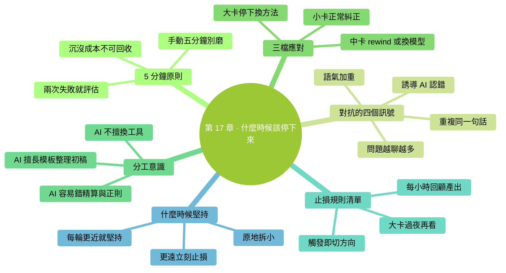

# 第 17 章：什麼時候該停下來——不要和 AI 對抗

> **本章在全書的位置**：第四部分 · 第 17 章 / 預估閱讀+動手時長：**主線 20-25 分鐘 + 支線 8 分鐘**
>
> **前置章節**：Ch 10（信任校準）+ Ch 16（10 大錯誤）
>
> **學完能做什麼（主線）**：掌握**"停"的判斷力**——知道什麼時候該放棄當前嘗試、換方向、甚至放下 Claude 自己動手。這是區分"新手"和"熟手"的核心能力。

---

## 開場三問

- **你會遇到什麼問題**：陷入"再提示一次就行"的死迴圈——花 40 分鐘修一個本來手動 5 分鐘能完成的事。
- **不讀這章會踩什麼坑**：沉沒成本陷阱——已經和 Claude 來回 10 輪，不甘心放棄，繼續下去更慢更貴。
- **讀完你會多會什麼事**：給自己設"止損規則"，過線就**強制切方向**——該手動就手動、該重啟就重啟、該放下就放下。

### 本章地圖（一眼看全貌）

<!-- diagram: MM-24 -->


---

> 🎯 **【主線】—— 本章必讀核心**

---

## 17.1 核心原則：5 分鐘原則

這是從老手社群裡總結出來的一條鐵律：

> 🔑 **一個任務原以為 AI 能搞定，結果花了 30 分鐘還沒對——比你手動做慢**。

具體規則：

### 5 分鐘原則

- **第 1 次嘗試**不成功 → 調整提示詞，再來 1 次
- **第 2 次**還不成功 → **停下來**：問自己"手動做要多久？"
- 手動 < 5 分鐘 → **關掉 Claude 自己做**
- 手動 > 20 分鐘 → 繼續用 AI 但**換方向**（換模型 / `/clear` / `/plan` / 拆小）

### 為什麼是 5 分鐘

- 手動做 5 分鐘以內的事，你自己做**確定可控**——不會像 Claude 那樣"順手錯改"
- **機會成本**：再和 Claude 磨 10 分鐘 = 你已經手動做了 2 次

### 一個真實場景

```
（任務：把 20 張截圖按時間重新命名）

第 1 次：你：給 ~/Desktop/截圖/ 的檔案按修改時間排序重新命名為 01-20
        Claude：（生成一個指令碼，跑錯，部分檔名亂了）
        你：回退

第 2 次：你：@截圖/ 列出來，然後按順序重新命名
        Claude：（這次命名對了，但漏了 3 個隱藏檔案）
        你：…… 還是不對

【5 分鐘原則觸發】
手動做要多久？我自己用 Finder 點一下排序、右鍵批次重新命名，2 分鐘。

→ 關掉 Claude，自己做，2 分鐘搞定。
```

## 17.2 "和 AI 對抗"的四個訊號

你正在和 AI 對抗時，會出現以下訊號。看到**任何一個**就要警覺：

### 訊號 1：你開始用加重語氣

"**不是**那樣"、"**我已經說了**"、"**為什麼**還錯"——語氣升級但資訊沒升級。

**背後**：你以為 AI 會因為你"生氣"而改正。**它不會**——它只是個語言模型，沒有"被罵會認真"的反射。

**對策**：深呼吸。**換冷靜+具體的語言重說一遍**，或者直接 `/clear` 重新開。

### 訊號 2：你在第 N 次說同樣的話

"再說一次——X 需要..."。你意識到自己在重複，Claude 沒吸收。

**背後**：
- 可能 Ctx 爆了（Ch 12）——前幾輪已被"擠掉"
- 可能提示詞本身模糊——它每次理解都不同
- 可能是領域 Claude 處理不好（參見 10.A 錯誤熱點）

**對策**：
- Ctx 高 → `/compact` 或 `/clear`
- 提示詞模糊 → **把關鍵要求寫進 CLAUDE.md 或提示詞最前面的加粗段**
- 領域困難 → **換方法**（換模型 / 分解任務 / 人工介入）

### 訊號 3：問題越聊越多

原來是 1 個 bug，修到第 5 輪變成 3 個 bug。Claude 在"修"的過程中**引入了新問題**。

**背後**：
- 它改了你沒讓它改的地方（常見）
- Ctx 裡前後要求衝突，它"把舊要求忘了"

**對策**：
- **`/rewind`** 回到最早那個狀態
- 重新開始，這次**只讓它做一件事**
- 或者 `/clear` + 重新描述需求

### 訊號 4：你在"誘導" AI 說出你想要的

"你**確定**這段沒問題？"、"這樣真的對嗎？"——你希望它自己發現錯誤。

**背後**：你其實心裡已經覺得有問題，但不想自己分析。

**對策**：
- **你自己審一遍程式碼/結果**——比讓 AI 自省更準
- 或直接描述你擔心的點："這段併發安全嗎？如果兩個請求同時 ... 會怎樣"——**具體質疑，不是籠統懷疑**

## 17.3 卡住時的三檔應對

不同程度的"卡住"用不同招。

### 第 1 檔：小卡（< 3 輪重試解決）

**表現**：Claude 小錯一下，你糾正一下就對。

**對策**：
- 正常糾正、繼續
- 不用動任何"大招"

### 第 2 檔：中卡（3-5 輪還在同一個坎）

**表現**：反覆錯在同一個點，你感覺"繞不過去"。

**對策**（按順序試）：

1. **/rewind** 回到錯之前，換種提示方式重做
2. `/compact` 壓一下——有時是 Ctx 滿了讓它糊塗
3. **換模型**：用 Opus 重新想一次（可能是 Sonnet 這種特殊任務確實吃力）
4. **拆小任務**：大步改小步——"先只做 A"、"做完再做 B"
5. **切 /plan 模式**：讓它先出方案你審，審過了再動手

### 第 3 檔：大卡（5 輪以上沒有進展）

**表現**：你已經調整了好幾次提示詞、換了模型，還是不對。

**對策**：

1. **停下 Claude Code**——不要再試
2. **問自己 3 個問題**：
   - 這個任務真的適合 AI 做嗎？（有沒有碰到 Claude 薄弱環節）
   - 我自己手動要多久？
   - 如果換一個不用 AI 的工具 / 方法，會不會更簡單？
3. **給出三選一**：
   - **親自動手**（如果手動 < 30 分鐘）
   - **分階段：AI 輔助 + 人工把關**（AI 做大體，關鍵步驟人工親自做）
   - **先放下，明天再說**（有時睡一覺換個角度就解了）

## 17.4 人和 AI 各自擅長什麼

搞清楚分工，才不會在 AI 短板上死磕。

### AI 擅長（放手讓它幹）

- **模板化的大量工作**：改 50 個檔案的 import 語句、批次改變數名、統一格式
- **資訊整理**：整理筆記、提取要點、做摘要
- **寫初稿**：部落格草稿、郵件草稿、文件大綱
- **翻譯、改寫、潤色**
- **你懂大意但懶得動手的小指令碼**
- **語法 / 語言錯誤檢查**

### AI 容易出錯（要嚴審）

- **精確數字 / 日期 / 貨幣計算**（參見 10.A 錯誤熱點 1-2）
- **正則表示式**
- **併發 / 競態條件**
- **安全 / 加密**
- **長文件前後一致性**（第 100 頁忘了第 1 頁的設定）
- **極新的技術棧**（訓練資料裡沒見過的新版本）

### AI 不擅長（換工具）

- **精確數值計算** → 用 Excel / Python 計算
- **大批次檔案操作** → 直接用 Finder / 命令
- **即時資料 / 網路查詢** → 用瀏覽器 / API
- **圖片深度編輯** → 用 Photoshop / 專業工具
- **複雜的 GUI 操作** → 自己動手
- **需要物理世界反饋的任務** → 親自來

記住：**Claude 是你的助手，不是你的替身**。助手幹不了的事，你接回來幹。

## 17.5 建立你自己的"止損規則"

把"什麼時候停"變成一張清單，**減少現場判斷的負擔**。

### 推薦起始版（新建 `~/Desktop/ccguide-練習/止損規則.md`）：

```markdown
# 我的 Claude Code 止損規則

## 必須停的時刻（任何一條觸發都停）
- 同一個錯被糾正超過 3 次 → /clear 或親自動手
- 第 2 次嘗試仍失敗 → 評估"手動多久"
- 手動 < 5 分鐘的任務 → 根本別上 AI
- Ctx > 85% → 強制整理或 /clear
- 自己開始用加重語氣 → 深呼吸 + 切方向
- 做到一半出現新 bug → /rewind 回去

## 每小時給自己一個"回顧點"
- 這小時實際產出了什麼？
- 花在 AI 上的時間值得嗎？
- 要不要換方法？

## 兜底招
- 大卡超過 15 分鐘 → 今天不做了，明天再說
```

把這份規則**列印貼在電腦旁**，或用一個貼紙提醒自己。

---

## 本章小結

- **5 分鐘原則**：手動 < 5 分鐘的事別磨 AI；AI 嘗試 > 2 次不成功就評估
- **對抗訊號**：加重語氣 / 重複說同話 / 問題越聊越多 / 誘導回答——任一齣現就警覺
- **三檔應對**：小卡（糾正繼續）→ 中卡（rewind / compact / 換模型 / 拆小 / plan）→ 大卡（停下評估換方法）
- **分工意識**：AI 擅長模板化、整理、初稿；不擅長精算、併發、安全、即時資料
- **建一份止損規則**：讓"什麼時候停"變成自動觸發，不靠現場判斷

---

## 動手任務

### 任務 1：回顧過去一週最浪費時間的一次對話（10 分鐘）

找出你最近一次"花了很久沒搞定"的 Claude Code 嘗試。覆盤：

- 我在第幾輪時應該停？
- 停了之後該換什麼方法？（親自動手 / 換模型 / /plan ...）
- 這次總共浪費了多少時間？
- 如果當時知道本章內容，會省多少？

**成功標誌**：你找到了自己的"典型浪費模式"——下次能認出來。

### 任務 2：建立你的止損規則（10 分鐘）

按 17.5 的模板建 `~/Desktop/ccguide-練習/止損規則.md`。**照抄也行**，但要加**至少 1 條你自己的個性化規則**（根據任務 1 的覆盤）。

**成功標誌**：你有了一份屬於你自己的止損清單。

### 任務 3：在下一個任務裡真的執行"5 分鐘原則"（下次做任務時）

**步驟**：
1. 下次用 Claude Code 時，**出聲念一遍**：5 分鐘原則
2. 第 2 次失敗時，**強制**問自己"手動多久"
3. 真的手動做（哪怕你覺得"再來一次能行"）
4. 事後對比：手動 vs 繼續磨，哪個更快

**成功標誌**：你親身體驗一次"停下來自己做"更划算——把這個體驗印進肌肉記憶。

---

## 如果你卡住了

**症狀 A：每次都想"再來一次就行"，停不下來**
- 原因：沉沒成本偏見——已經投入 10 分鐘，不想白費。
- 解決：**沉沒成本是不可回收的**——和"再花多久"無關。**默唸：已經花的錢不會因為再花一些就回來**。

**症狀 B：不知道怎麼判斷"手動要多久"**
- 原因：對手動流程不熟。
- 解決：估不準就**強制試 1 分鐘**——如果 1 分鐘內自己能跑出一半，說明手動快；跑不出來再回 AI。

**症狀 C：止損規則寫了但沒執行**
- 原因：規則沒有"可見性"——寫完放資料夾裡就忘了。
- 解決：**貼在顯示器邊上**；或用手機定 30 分鐘倒計時鬧鐘——響了就回顧進度。

---

主線結束。下面支線講"什麼時候堅持"（反面教材避免誤殺）和"多人場景的止損"。

---

> 🌿 **【支線】—— 可選深入（學有餘力再看）**

---

## 🌿 支線 17.A：什麼時候堅持——避免過度止損

> **這段講什麼**：主線講的是"什麼時候停"，但也有"該堅持"的場景——不然會誤殺好任務。
> **什麼時候回頭讀**：你感覺"我是不是太快放棄了"時。

### 值得多試幾次的場景

1. **第一次嘗試**——沒有充分嘗試前別下結論
2. **你自己描述不夠具體**——換一個精準提示詞還沒試過
3. **任務本身複雜** —— 5-10 輪迴圈本來就正常
4. **Claude 給的方向有希望**——只是細節沒對準
5. **你確實不會手動**——止損成本為負（比 AI 還慢或根本不會做）

### 區別"堅持"和"對抗"

- **堅持**：方向對、細節調、進度有（每輪離目標更近一點）
- **對抗**：方向錯 / 細節反覆錯 / 每次都"前進兩步退三步"

**判斷標準**：**每輪過後離目標更近還是更遠**？

- 更近 → 堅持
- 原地 → 拆小 / 換方法
- 更遠 → 立刻 `/rewind` 或 `/clear`

### 一個簡單計時器

做任務時心裡默數"進展感覺"：
- 第 1 輪：基線
- 第 3 輪：比第 1 輪近了嗎？
- 第 5 輪：比第 3 輪近了嗎？

**如果第 5 輪比第 3 輪還遠——止損訊號確認，不是錯覺**。

---

## 🌿 支線 17.B：團隊 / pair programming 場景

> **這段講什麼**：兩個人一起用 Claude Code 時，"停"的判斷要怎麼協作。
> **什麼時候回頭讀**：你和同事一起用 Claude Code 時。

### 兩個人一起更容易陷入"對抗"

- 兩人都不想先喊停，以免顯得"沒耐心"
- 輪流提示，各自都有"這一次應該行"的樂觀預期
- 時間不知不覺更長

### 建議規則

**約定止損訊號**：

- 明確的止損觸發器——比如"兩人加起來嘗試 3 次還不對就停"
- **一個人開啟計時器**——15 分鐘鬧鐘
- 響了就**強制**討論"繼續還是換方法"

### 分工也要明

不要兩個人都搶著敲提示詞。約定：

- A 負責提示（主筆）
- B 負責稽核 + 判斷止損（旁觀者視角）

**旁觀者更容易看出**"我們陷進去了"——A 沉浸在提示詞裡，看不出整體。

---

**下一章**：第 18 章"常用快捷命令全覽"——整本書出現過的各種斜槓命令（`/clear` `/compact` `/model` `/status` `/plan` `/rewind`...）一次梳理，帶使用場景。**速查手冊級別**。


---

<!-- chapter-nav -->

📖  [← 第 16 章 · 新手 10 大錯誤](16-新手10大錯誤.md)  ·  [📑 返回目錄](../../README.md)  ·  [第 18 章 · 常用快捷命令全覽 →](18-常用快捷命令全覽.md)
