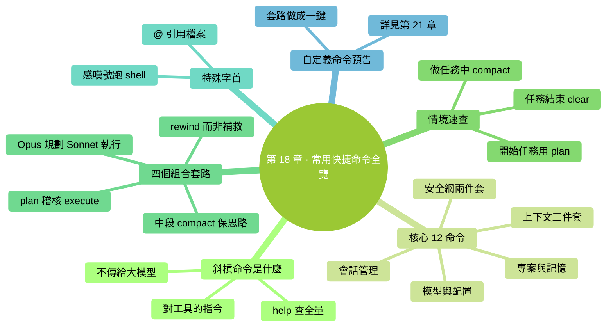
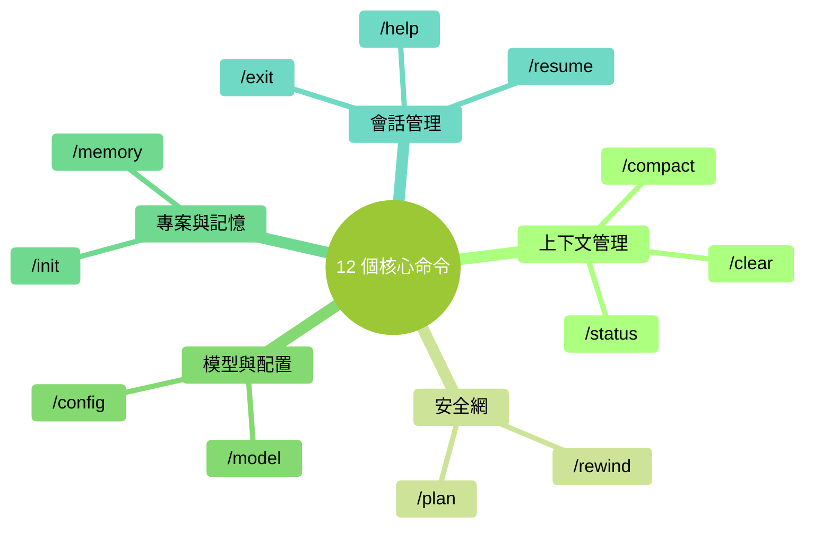

# 第 18 章：常用快捷命令全覽——斜槓命令速查

> **本章在全書的位置**：第四部分 · 第 18 章 / 預估閱讀+動手時長：**主線 20-25 分鐘 + 支線 5 分鐘**
>
> **前置章節**：前面章節已出現的命令在這裡統一整理
>
> **學完能做什麼（主線）**：一張圖 + 一張表記住所有常用斜槓命令，**按場景**知道該用哪個。以後遇到新情境能直接反應出合適命令。

---

## 開場三問

- **你會遇到什麼問題**：命令散落在各章，記不全；遇到情境不知道有沒有現成命令對應。
- **不讀這章會踩什麼坑**：不知道工具箱裡有什麼工具 → 硬湊 → 費時。
- **讀完你會多會什麼事**：看到情境能條件反射想到命令——效率翻倍的關鍵。

### 本章地圖（一眼看全貌）

<!-- diagram: MM-25 -->


---

> 🎯 **【主線】—— 本章必讀核心**

---

## 18.1 斜槓命令是什麼

在 Claude Code 裡，**以 `/` 開頭**的一行就是斜槓命令（slash command）——不是提示詞、不傳給大模型，而是**直接對 Claude Code 這個工具**的指令。

### 怎麼用

1. 在 prompt 提示符處直接敲 `/`
2. 會出現候選列表，打字篩選
3. 回車執行

### 怎麼查全量

任何時候跑 `/help`，能看到當前版本**所有可用命令**（含自定義命令）。

## 18.2 核心 12 個命令——按場景分組

所有命令按用途分成 5 組。**這 12 個覆蓋 95% 的日常需要**。

<!-- diagram: MM-06 -->



### 組 1：上下文管理（Ch 12）

| 命令 | 作用 | 什麼時候用 |
|-----|------|---------|
| `/clear` | 清空當前會話 | 任務做完、切新任務 |
| `/compact` | 壓縮當前會話成摘要 | Ctx > 50% 但任務未完 |
| `/status` | 看當前狀態（模型、Ctx%、用量） | 任何時候想查進度 |

### 組 2：安全網（Ch 9）

| 命令 | 作用 | 什麼時候用 |
|-----|------|---------|
| `/plan` | 進入計劃模式（只出方案不動手） | 開始一個**需要先想清楚的任務** |
| `/rewind` | 精確回退到之前某個狀態 | 走錯一段後想回到分叉點 |

### 組 3：模型與配置（Ch 15）

| 命令 | 作用 | 什麼時候用 |
|-----|------|---------|
| `/model` | 切換模型（Sonnet / Opus / Haiku） | 任務難度變了、想省錢 / 求準 |
| `/config` | 看 / 改 Claude Code 配置 | 調偏好（主題、自動儲存等） |

### 組 4：專案與記憶

| 命令 | 作用 | 什麼時候用 |
|-----|------|---------|
| `/init` | 自動掃描專案生成 CLAUDE.md | **不推薦**（見 Ch 14），建議手寫 |
| `/memory` | 開啟記憶管理介面 | 想查 / 改 MEMORY.md 裡 Claude 對你的記憶 |

### 組 5：會話管理

| 命令 | 作用 | 什麼時候用 |
|-----|------|---------|
| `/exit` | 退出 Claude Code | 關掉 |
| `/resume` | 恢復上次會話 | 不小心退了想回到前一次狀態 |
| `/help` | 檢視所有命令的說明 | 記不清用法時 |

## 18.3 一圖看懂：什麼情境用什麼命令

```
┌─────────────────────────────────────────────────────┐
│                 遇到情境 → 用什麼命令                │
└─────────────────────────────────────────────────────┘

【開始任務】
│
├─ 需要先想清楚策略     → /plan
├─ 想換模型               → /model
└─ 看看當前狀態           → /status

【做任務中】
│
├─ Ctx 快滿了（> 50%）    → /compact
├─ 做錯了一步             → /rewind
├─ 想查 Claude 記得我什麼 → /memory
└─ 想改偏好               → /config

【結束任務】
│
├─ 任務完成，下一件       → /clear
├─ 關閉 Claude Code       → /exit
└─ 明天想回到現在狀態     → （退出即可）次日跑 /resume

【記不清命令時】
│
└─ /help
```

## 18.4 命令組合使用——"套路"

單個命令有用，**組合起來威力更大**。幾個高頻套路：

### 套路 1：plan → 稽核 → execute

```
你：/plan
    我要給 @專案/ 加一個批次處理功能，先出方案。
Claude：（給計劃）

你：（審計劃，OK）
    退出 plan 模式，按方案走。
Claude：（執行）
```

**適合**：任何"動手前應該想想"的任務。

### 套路 2：Opus 規劃 + Sonnet 執行

```
你：/model → Opus
    深度分析 @this_project/，規劃重構策略。
Opus：（給深度方案）

你：/model → Sonnet
    按剛才方案一步步做，先改 src/foo.py。
Sonnet：（執行）
```

**適合**：複雜任務，想省 Opus 錢又想要深度思考。

### 套路 3：中段 compact 保持思路

```
（聊了 10 輪，Ctx 65%）
你：/compact
Claude：（壓縮成摘要）

（Ctx 降到 15%，繼續）
你：繼續剛才的任務
```

**適合**：任務還要繼續、但不想丟前面的共識。

### 套路 4：rewind 而不是補救

```
（Claude 改錯了一個檔案）

❌ 差做法：
你：不對，你改多了，把 X 和 Y 改回來
（Claude 再改一輪，可能又多錯一個）

✅ 好做法：
你：/rewind
（直接回到出錯前）
你：換種方式：只改 X 的 foo 函式，不動其他
```

**適合**：任何 Claude 動作出錯後的回退——**比讓它自己"修復"更乾淨**。

## 18.5 `!` 和 `@` —— 嚴格來說不是斜槓命令，但屬於本章

這兩個字首不以 `/` 開頭，但同樣是 Claude Code 的"特殊輸入"——效率關鍵。

### `!` 快速跑 shell 命令

在 prompt 裡**以 `!` 開頭**的那一行，Claude Code 會**直接跑為終端命令**，輸出給 Claude 看。

**最常用場景**：
- `!ls` 看當前資料夾
- `!git status` 看 git 狀態
- `!pwd` 看當前工作目錄

**和"讓 Claude 跑命令"的區別**：
- `!command`：**你主動讓它執行**，繞過 Claude 判斷，直接跑
- 不加 `!` 說"請跑 X 命令"：Claude 會在權限模式裡判斷是否安全再決定是否執行

**什麼時候用 `!`**：
- 明確知道命令安全
- 快速補一句上下文（"這是我的 git status 給你看"）

### `@` 引用檔案

這是 Ch 5 的主角——`@檔案路徑` 讓 Claude 讀這個檔案。

**小提示**：

- `@` 之後**按 Tab 會自動補全**——不必手打完整路徑
- **支援多個** `@`：`@a.md @b.md 對比這兩份`

## 18.6 自定義命令的一個預告

除了系統內建命令，你也可以**自己定義** slash 命令——例如 `/lint` 幫你跑程式碼檢查、`/review` 幫你走一遍 review 流程。

具體怎麼建第 21 章講。本章只要知道：**自定義命令和內建命令一樣用，都以 `/` 開頭**。

---

## 本章小結

- 斜槓命令 = 對 Claude Code 這個工具的指令（不是給大模型的 prompt）
- **12 個核心命令**按 5 組分：上下文管理 / 安全網 / 模型配置 / 專案記憶 / 會話管理
- **組合套路威力最大**：plan→execute / Opus 規劃→Sonnet 執行 / 中段 compact / 用 rewind 而不是補救
- `!` 跑 shell 命令、`@` 引用檔案——最常用的兩個"特殊字首"
- **記不清時跑 `/help`** —— 永遠能查全

---

## 動手任務

### 任務 1：把 12 個命令都跑一遍（15 分鐘）

**步驟**：

1. 啟動 Claude Code
2. 按 18.2 表格**每個命令都跑一次**，觀察效果（`/init` 跑完**刪掉**生成的 CLAUDE.md，別保留）
3. 每個命令寫 1 行自己的備註：這個幹什麼、我什麼時候會用

**成功標誌**：12 行備註——你對工具箱有了肌肉記憶。

### 任務 2：完整走一次"套路 1"（10 分鐘）

**步驟**：

1. 選一個真實想做的小任務（5-10 分鐘能完成的）
2. 執行：`/plan` → 描述任務 → 讓 Claude 出方案 → 審 → 退出 plan → 讓它執行 → 審 diff → Yes
3. 全程留意：**你多感覺踏實了？**

**成功標誌**：你體驗了 plan-first 工作流和之前"直接動手"的區別。

### 任務 3：貼一張"命令速查卡"（5 分鐘）

把 18.3 的 ASCII 圖（或你自己整理的版本）**複製到你的日常筆記 / 顯示器邊的便籤**。

**成功標誌**：眼睛掃一下就能找到對應情境的命令。

---

## 如果你卡住了

**症狀 A：斜槓命令敲不出來 / 沒提示**
- 原因：有的終端裡 `/` 需要特殊處理；或你在提示符之外打字。
- 解決：確認**在 Claude Code 的輸入框內**（不是在外面的終端）；逐字元敲，別貼上。

**症狀 B：某個命令找不到**
- 原因：Claude Code 版本不同，個別命令可能名字變了。
- 解決：先跑 `/help` 看當前版本全量列表；對不上就按 `/help` 給的為準。

**症狀 C：/rewind 沒有"我想回到的點"**
- 原因：`/rewind` 的粒度是**按訊息**，不是按字元；回得太遠可能丟別的共識。
- 解決：把 `/rewind` 和 `/clear` **組合用**——大問題先 /clear；小問題用 /rewind。

---

主線結束。下面支線講"配置檔案與個性化命令別名"。

---

> 🌿 **【支線】—— 可選深入（學有餘力再看）**

---

## 🌿 支線 18.A：自定義"常用套路"為一鍵命令

> **這段講什麼**：如果你發現自己反覆用同一種"套路"（比如 plan 開頭 + 特定提示詞），可以把它做成自定義命令。
> **什麼時候回頭讀**：某個組合你用了 10 次以上。

### 一個簡單例子

你發現自己經常這樣開啟一個任務：

```
/plan
需求：...
請嚴格遵守：
- 不改 src/legacy/
- 要用 pytest 做測試
- 最後給出 diff 摘要
```

這段開場白每次都一樣——**做成命令**，以後只要打：

```
/start-task
```

就自動插入這段模板，你只要填需求。

### 怎麼建

（詳見第 21 章）簡要：在 `~/.claude/commands/` 或 `.claude/commands/`（專案級）裡放一個 markdown 檔案 `start-task.md`，內容就是你的套路模板。

### 哪些套路值得做成命令

- **你反覆寫一樣的開頭**
- **啟動任務前的檢查清單**
- **完成任務後的收尾**（清理、commit、記錄）
- **團隊裡大家都用的工作流**

### 和 Skill 的區別

- **Skill**：**給 Claude 的指令**——"遇到 X 類任務用 Y 方法"；Claude 判斷呼叫
- **Custom command**：**給你自己的快捷鍵**——主動敲觸發

兩者可以組合：命令觸發、命令內容裡呼叫 Skill。

---

**下一章**：第 19 章"輸入技巧"——`!` 和 `@` 之外的效率技巧：截圖輸入、多行輸入、歷史、貼上大段文字的正確方式。把輸入效率榨乾。


---

<!-- chapter-nav -->

📖  [← 第 17 章 · 什麼時候該停下來](17-什麼時候該停下來.md)  ·  [📑 返回目錄](../../README.md)  ·  [第 19 章 · 輸入技巧 →](19-輸入技巧.md)
