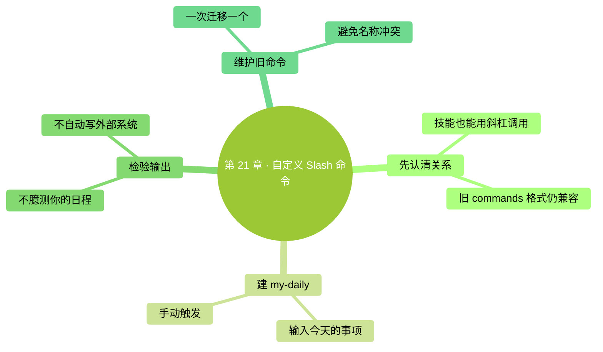

<a id="第-21-章自定义-slash-命令主动启动一份技能"></a>
# 第 21 章：自定義 Slash 命令——主動啟動一份技能

> **本章在全書的位置**：第五部分 · 第 21 章 / 主線 20–25 分鐘，支線 8 分鐘
>
> **前置章節**：第 18 章（常用命令）+ 第 20 章（Skills）
>
> **學完能做什麼**：建立 `/my-daily`，向它傳入今天的任務，並從舊命令格式平穩遷移。
>
> **核驗日期**：2026-09-24。

---

<a id="开场三问"></a>
## 開場三問

- **你會遇到什麼問題**：流程已經寫好，但你希望自己決定什麼時候執行。
- **不讀這章會踩什麼坑**：把技能和自定義命令分別維護兩份，相同規則改了一處、漏了一處。
- **讀完你會多會什麼事**：讓一個技能透過 `/名字` 啟動，連同本次材料一起傳給 Claude。

<a id="本章地图一眼看全貌"></a>
### 本章地圖（一眼看全貌）

<!-- diagram: MM-28 -->


---

> 🎯 **【主線】—— 本章必讀核心**

<a id="211-斜杠是入口不是另一种智能"></a>
## 21.1 斜槓是入口，不是另一種智慧

**Slash 就是斜槓 `/`**。第 18 章的 `/clear` 是內建命令；上一章的 `/meeting-notes` 是你安裝的技能入口。二者看起來都以斜槓開始，但前者由產品提供，後者承載你自己的任務要求。

新版 Claude Code 已把自定義命令和技能放到同一套機制裡。舊的 `.claude/commands/daily.md` 仍可使用；新建流程優先採用 `.claude/skills/my-daily/SKILL.md`，方便把模板和示例放在一起。**不能再用“技能只能自動觸發、命令只能手動觸發”來區分它們。**[官方說明](https://code.claude.com/docs/en/skills#where-skills-live)

想讓一個技能只在你明確啟動時執行，可以在檔案開頭的說明標籤中加入 `disable-model-invocation: true`。它的含義是阻止 Claude 自行呼叫這份技能。名字很長，首次使用只要記住“這份流程由我來啟動”。這項設定並不會自動給後續操作開許可權，更不是“輸入命令就同意釋出、付款或刪除”。

本章做 `/my-daily`：你給出今天的事項，它幫你列計劃。名稱加上 `my-`，是為了少和現有內建命令或別人安裝的技能撞名。不要把自定義流程叫 `/focus`、`/review` 之後，又以為它會改變產品本身的對應功能。

<a id="212-创建你的开工清单入口"></a>
## 21.2 建立你的開工清單入口

仍在練習專案中操作。按第 20 章的方法，新建 `.claude/skills/my-daily/SKILL.md`。如果需要再看一次具體操作，下面列出了兩種系統各自的命令；每組都在系統終端裡輸入。

**Mac：**

```bash
mkdir -p .claude/skills/my-daily
touch .claude/skills/my-daily/SKILL.md
open -e .claude/skills/my-daily/SKILL.md
```

**Windows PowerShell：**

```powershell
New-Item -ItemType Directory -Force .claude\skills\my-daily
New-Item -ItemType File .claude\skills\my-daily\SKILL.md
notepad .claude\skills\my-daily\SKILL.md
```

把下面這份技能文字儲存進去。`$ARGUMENTS` 是**引數佔位符**，意思是“把命令名後面這次輸入的文字放到這裡”。它不是你要設定的環境變數，也不需要另建一個同名檔案。

```markdown
---
name: my-daily
description: 根据本次提供的事项和可用时间整理今日开工清单
disable-model-invocation: true
---
本次材料：$ARGUMENTS
仅使用本次材料，输出“必须完成 / 可以推进 / 暂缓”三组，合计最多五项。
每项写下一步动作和估计用时；估时是建议，不是假装知道的事实。
没有事项或可用时间时先询问，不扫描桌面、不读取其它账户、不创建日历事件。
```

這份清單沒有偷偷掃描你的桌面，也沒有把“昨天提交過什麼”當作“今天必須做什麼”。我們把資訊來源限定在你提供的內容，是為了讓第一次試驗可檢查。以後確實需要讀專案待辦，再明確增加一個檔案路徑即可，沒必要一開始就連線所有資料。

<a id="213-传入材料检查计划是否有依据"></a>
## 21.3 傳入材料，檢查計劃是否有依據

儲存後回到 Claude Code。輸入下面的命令，觀察結果：

```text
/my-daily 今天有两小时。必须回复客户关于报价范围的三条问题；还想整理昨天的会议记录和试一个新工具。客户回复最晚今天下午发。
```

成功的計劃應當把客戶回覆放在最前面，並考慮兩小時的總預算。它可以建議把試工具暫緩，但不能擅自給客戶發訊息，也不能給會議記錄補出一個你未提供的截止日期。你是在讓它整理計劃，是否執行每個事項仍取決於實際任務。

再做一個失敗測試：只輸入 `/my-daily`，什麼材料也不附。它應該先問今天有哪些事項、能投入多久，而不是編一份看起來完整的日程。如果它直接生成內容，就把缺失輸入的處理規則寫清楚，再試一次。命令裡的步驟是模型要理解的要求，不是普通程式那樣逐行必然執行的程式碼。

這裡也要區分兩種感受：“結果看著不錯”和“流程可重複”。後者需要你用不同材料重試。例如把可用時間改成三十分鐘，看看它會不會刪減任務，而不是照搬兩小時版。能隨輸入合理調整，才值得作為你的日常入口。

<a id="214-旧命令怎样处理怎样避免误改设置"></a>
## 21.4 舊命令怎樣處理，怎樣避免誤改設定

如果你已經有 `.claude/commands/daily.md`，不必先把它刪掉。先開啟看清內容，再決定繼續使用還是遷移。對本書這種純文字清單，遷移主要是把提示詞移到技能目錄的 `SKILL.md`，補上描述，並測試新的斜槓名字；存在指令碼、檔案引用或引數時，需要逐項驗證，不能只改副檔名。

建議一次遷移一個命令。先給新版臨時起一個不同名字，用同一份虛構材料比較舊版與新版；確認新版本工作正常後，再移除舊入口。否則兩份同名配置同時存在時，你可能一直在修改未被實際呼叫的那份。想知道這次用的是誰，檢視選單中的來源和會話裡的呼叫記錄。

在 Windows PowerShell 中，個人目錄寫成 `$HOME\.claude\skills`；`%USERPROFILE%` 是另一種命令環境常見的變數寫法，不應直接塞進本章的 PowerShell 指令。最初用專案相對路徑還有一個好處：你能在練習資料夾內看到全部變化，刪除練習技能也不會碰到別的專案。

最後區分“生成計劃”和“改變軟體狀態”。一個名叫 `/my-focus` 的技能可以給出專注建議，卻不會僅憑這個名字關閉通知。要改變設定，必須實際呼叫對應能力，並遵守其許可權要求。給流程起名字，並不會創造產品沒有提供的功能。

<a id="本章小结"></a>
## 本章小結

- 自定義斜槓命令現在可以直接由技能提供。
- 新流程優先放在 `.claude/skills/`，舊 `.claude/commands/` 格式仍相容。
- `disable-model-invocation: true` 讓你決定啟動時機。
- `$ARGUMENTS` 接收命令名後面的本次材料。
- 測試正常輸入、缺失輸入和邊界輸入，比多建十個命令更有用。

<a id="动手任务"></a>
## 動手任務

**任務 1，約 15 分鐘：**建立 `/my-daily`，分別給它兩小時和三十分鐘的計劃材料。成功標誌是任務總量隨時間調整，而且沒有憑空增加你的日程。

**任務 2，約 10 分鐘：**不傳材料呼叫一次，再傳一段互相沖突的要求。成功標誌是它能指出缺失或衝突，你也知道該修改哪條規則。

<a id="如果你卡住了"></a>
## 如果你卡住了

**系統終端提示找不到命令：**`/my-daily` 要輸入在 Claude Code 的對話方塊；建資料夾的命令才在系統終端裡執行。

**修改後效果沒變：**檢查是否呼叫了同名的另一來源，確認儲存的是正確專案下的 `SKILL.md`；必要時重開會話，再檢視技能列表。

**輸出出現原樣的 `$ARGUMENTS`：**核對大小寫和美元符號，檢查檔案是否作為技能載入。如果你只是把技能正文粘進普通聊天，它不一定按技能佔位符規則處理。

---

> 🌿 **【支線】—— 可選深入（學有餘力再看）**

<a id="-支线-21a共享流程时先共享输入约定"></a>
## 🌿 支線 21.A：共享流程時，先共享輸入約定

這段講團隊怎樣使用同一入口；當你準備把技能交給同事時回來讀。

把技能放進專案版本記錄只是第一步。另一個人還需要知道：應該在哪個目錄啟動 Claude Code，命令後面該傳什麼，輸出儲存在哪裡，以及哪些動作會改變外部狀態。給 `/my-daily` 附一段不含私人資訊的示例輸入，往往比列出十個“適用場景”更有幫助。

團隊規則變化時，也不要只在聊天群裡說一句“新版改了”。把變化寫進專案說明，再用原來的示例複驗。比如有人要求輸出“負責人”，要同時決定缺少負責人時怎麼辦；否則模型可能為了補齊格式而猜一個人名。共享流程的目的，是讓相同要求被穩定執行，不是讓大家的輸出機械地看上去一樣。

<a id="-支线-21b文件引用和预先执行命令"></a>
## 🌿 支線 21.B：檔案引用和預先執行命令

這段講技能怎樣收集額外材料；等本章的純文字清單已經夠用，再考慮它。

技能支援引用檔案，也有先執行命令、再把結果交給模型的寫法。後者與正文裡普通的“請執行某命令”不同；真實執行會消耗時間，也可能訪問網路、讀取憑證或修改檔案。本書的開工清單不需要這些能力，因此沒有給出讓你照抄的動態執行片段。需要時先查[官方引數與動態上下文說明](https://code.claude.com/docs/en/skills#pass-arguments-to-skills)。

如果想根據專案待辦生成計劃，優先從一個明確的 `TODO.md` 開始：告訴技能只讀這個檔案，把其中未完成事項和本次輸入一起整理。先檢查能否找到檔案、檔案不存在時怎樣提示，再考慮更多來源。這種小步擴充套件讓失敗原因容易定位：是資料沒讀到，還是計劃邏輯不合理，不會混成一個“命令不好用”。

**下一章**：當材料太多時，讓一個子智慧體獨立完成專項工作。
