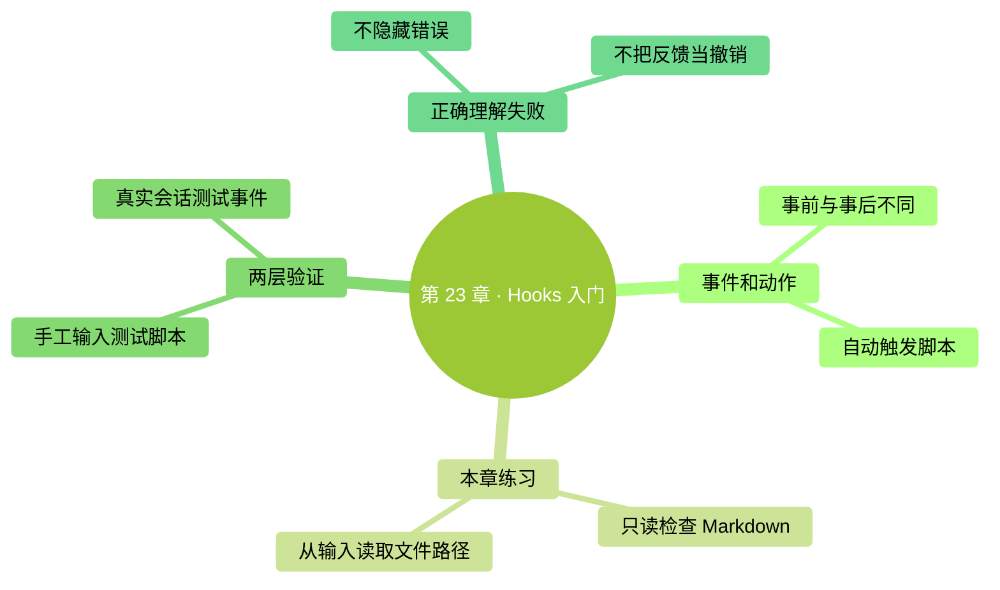

# 第 23 章：Hooks 入門——事件發生時，自動做一個小檢查

> **本章在全書的位置**：第五部分 · 第 23 章 / 主線 25–30 分鐘，支線 10 分鐘
>
> **前置章節**：第 7 章（許可權）+ 第 20–22 章（擴充套件）
>
> **學完能做什麼**：理解事件與動作的關係，使用配套的只讀檢查指令碼，並分清事前攔截和事後反饋。
>
> **核驗日期**：2026-09-24。完整配置放在配套目錄，正文不要求你手寫大段配置。

---

## 開場三問

- **你會遇到什麼問題**：某個固定檢查每次都該做，你卻總要重複提醒 Claude。
- **不讀這章會踩什麼坑**：把普通報錯當成攔截成功，或者複製了一個根本拿不到檔案路徑的命令。
- **讀完你會多會什麼事**：讓“寫完練習文件”觸發一個小檢查，並驗證它真的執行了。

### 本章地圖（一眼看全貌）

<!-- diagram: MM-30 -->

---

> 🎯 **【主線】—— 本章必讀核心**

## 23.1 先決定在哪個時刻做什麼

**Hook（鉤子）**可以理解為“事件發生時，自動執行預先配置的動作”。例如 Claude 用編輯工具成功改完檔案，這個事件發生後，執行一個檢查標題是否存在的小程式。觸發時機是固定的，不需要你每次再輸入“請檢查”。

本章只討論執行本地指令碼的 command Hook。指令碼是電腦按既定規則執行的小程式；它不像技能那樣主要依靠模型理解一段說明。Hook 本身也不是萬能保護罩：動作是否正確，取決於指令碼檢查了什麼、是否匹配了本次事件。

| 事件 | 你可以怎樣理解 | 本章要記住的邊界 |
|---|---|---|
| `PreToolUse` | 使用工具之前 | 可在符合規則時阻止尚未執行的呼叫 |
| `PostToolUse` | 工具成功完成之後 | 適合檢查結果；動作已經發生 |
| `SessionStart` | 會話開始或相應恢復時 | 可提供環境提示 |
| `UserPromptSubmit` | 你提交訊息時 | 可檢查或補充本次輸入 |

第一次練習選事後、只讀的小檢查，容易看出因果：檔案出現了，檢查讀它，反饋說明哪裡不合要求。等這個過程跑通，再考慮自動格式化或複雜阻塞。[Hook 入門](https://code.claude.com/docs/en/hooks-guide)

## 23.2 本章樣例：檢查一份 Markdown 檔案

本書提供了[配套指令碼和完整配置](../../../templates/hooks/README.md)。它只檢查專案根目錄 `hook-demo/` 下的 Markdown 練習檔案，看看有沒有一級標題、檔案末尾有沒有換行。一級標題就是以 `# ` 開始的標題行。程式不會自動改內容，也不會讀取整個專案、下載軟體或上傳結果。

這裡有箇舊教程常寫錯的關鍵點：檔案路徑來自 Claude Code 交給 Hook 的**結構化輸入**，其中欄位叫 `tool_input.file_path`；不是一個約定俗成的 `CLAUDE_FILE_PATH` 環境變數。配套 Python 指令碼讀取這份輸入，再把檢查結果按約定格式返回。你無需先學會寫 Python，只要能分清“配置負責什麼時候執行，指令碼負責具體檢查”即可。

配置中的 `Write|Edit` 表示匹配 Write 或 Edit 兩種工具。它過濾的是**工具名**，不是副檔名；是否為 `.md`，由指令碼繼續判斷。如果 Claude 用 Bash 或 PowerShell 命令寫檔案，這個匹配不會觸發。它也不會因為你用系統編輯器儲存一次，就自動捕捉那次儲存。[事件輸入與匹配規則](https://code.claude.com/docs/en/hooks)

這個小範圍是刻意設計的。你可以拿同一個檔案做成功、失敗和修復試驗，而不會讓一次試學影響整本書或工作資料。

## 23.3 分兩步驗收：指令碼能跑，事件也要能觸發

先按[配套說明](../../../templates/hooks/README.md)檢查 Python 3 是否可用，並把指令碼放到練習專案指定位置。Python 3 是執行該指令碼的工具，並不是安裝 Claude Code 的必需條件。若這臺電腦還沒有它，可以先理解本章，等有合適環境再做操作。

第一步是**手工測試指令碼**。建一份帶標題的練習文件，再給程式喂入一份虛構事件。檢查應該透過；去掉標題再執行，應提示缺少標題。兩次都開啟原檔案確認沒有被指令碼修改。這樣可以單獨證明指令碼的規則有效，不會把“Claude 沒觸發事件”和“程式寫錯”混為一談。

第二步是**連線真實事件**。把配套配置合併到專案 `.claude/settings.local.json`，保留該檔案裡原有的其它設定。退出並重開 Claude Code，用 `/hooks` 檢視條目。然後明確讓 Claude 使用 Write 或 Edit 修改 `hook-demo/notes.md`，觀察反饋；有疑問時按配套說明檢查除錯日誌。結構化反饋可能供 Claude 閱讀，而不是獨立顯示成一條聊天訊息，不能僅憑“螢幕沒彈一個框”判定失敗。

**這兩步是不同的驗收。**執行本書自動測試，只能證明樣例處理給定輸入的行為；親自完成第二步，才證明你的安裝、設定與會話事件也連通了。完成練習後，按配套說明只移除新增條目，保留其它專案設定。

## 23.4 失敗時保留線索，不要先把錯誤藏起來

舊教程常建議在末尾加 `|| true`，這樣即使檢查失敗，命令也返回成功。它確實能掩蓋報錯，但會讓“程式沒有跑起來”看起來像“檢查透過”。本章樣例不會這樣處理：輸入不合法、檔案讀不到，都保留錯誤訊號；發現缺少標題，則正常返回“檢查發現問題”的反饋。這兩種情況應分開。

**事後反饋不能阻止剛才那次寫入。**你在 PostToolUse 中發現內容不對，檔案已經寫了；應讓 Claude 或你在後續步驟修正，而不是宣稱寫入已被撤銷。需要事前阻止某個工具動作時，才研究 PreToolUse 的決策機制。

退出碼也不能統稱為“非零就攔截”。對於本章涉及的 command Hook，`0` 通常表示正常返回；用於阻塞的 `2` 有按事件規定的含義；其它報錯不能簡單當成阻塞成功。事前 Hook 返回正常狀態，也不等於自動授予工具許可權，原有許可權流程仍需執行。[退出碼與決策說明](https://code.claude.com/docs/en/hooks-guide#read-input-and-return-output)

檢查很慢時，先縮小範圍、確認命令獨立執行多快，再考慮受支援的非同步方式。不要隨手在命令尾部加一個 `&`，就假定後臺任務一定活著、結果一定會返回。一個能解釋失敗的小檢查，比十條時有時無的自動化更有價值。

## 本章小結

- Hook 把明確的事件與預先配置的動作連線起來。
- 本章樣例只讀檢查 `hook-demo/` 中的 Markdown 檔案。
- 目標路徑從結構化事件輸入讀取，不能猜環境變數名稱。
- `Write|Edit` 匹配工具，檔案型別由指令碼判斷。
- 分別驗證指令碼行為和真實會話觸發；事後反饋不等於撤銷。

## 動手任務

**任務 1，約 15 分鐘：**照配套說明完成一次有效文件和一次缺少標題文件的手工輸入測試。成功標誌是反饋改變，原檔案沒有被指令碼改寫。

**任務 2，約 15 分鐘：**在練習專案接上 Hook，讓 Claude 用 Write 或 Edit 改檔案。成功標誌是會話或除錯日誌中能確認本次指令碼執行；隨後按說明撤銷樣例設定。

## 如果你卡住了

**Python 命令找不到：**按配套說明檢查執行器，別把這誤判成 Claude Code 沒裝好。先保留練習檔案，不必繼續改設定。

**手工測試透過但會話不觸發：**核對專案、事件、實際工具名和設定是否生效。shell 寫檔案不會自動匹配 Write。

**報錯但不知道哪裡錯：**先單獨執行指令碼，看錯誤型別；再看除錯日誌。不要上傳含私人內容的完整設定或日誌到線上校驗網站。

---

> 🌿 **【支線】—— 可選深入（學有餘力再看）**

## 🌿 支線 23.A：自動格式化與檔案變更事件

這段講如何從檢查過渡到修改；當你已在專案中使用格式化工具時再讀。

自動格式化意味著 Hook 會實際修改檔案，因此需要比本章更多準備：明確支援的檔案型別，確認格式化工具已安裝，保留失敗輸出，並知道這些變化怎樣儲存或回退。不要在每次檔案修改後臨時從網路安裝“最新版”，否則同一個專案不同日期可能跑出不同結果。

也不要把所有再次修改都叫“無限遞迴”。Hook 指令碼透過系統命令寫檔案，並不因此變成一次 Claude 的 Write 工具呼叫。不同事件的觸發規則不同；新的檔案變更類事件又有自己的行為。真正需要防止的是你的自動化互相反覆觸發，或者模型收到同一條永遠無法滿足的反饋而不斷重試。先畫清楚“誰改檔案、誰收到事件、誰再修改”，再決定停止條件。

## 🌿 支線 23.B：事前攔截不能替代完整許可權邊界

這段講安全型 Hook 的邊界；當你準備保護敏感目錄時回來讀。

假設你攔截了 Write 工具寫入某個檔案，但同一會話仍允許 shell 命令或外部服務修改它，這個 Hook 就沒有覆蓋所有路徑。僅匹配命令裡某個詞也容易誤報或漏報。不要因為演示成功阻止一次操作，就宣稱專案已具備完整的安全隔離。

需要嚴格保護時，應結合許可權規則、受限執行環境和服務端許可權來設計；Hook 適合補充明確、可測試的專案規則。還要給自己留恢復辦法：保留設定副本，只改新增條目，記錄怎樣關閉失效規則。和技能不同，command Hook 是會自動執行的程式，複製陌生專案的配置前必須讀懂它實際要執行什麼。

**下一章**：連線外部服務，理解 MCP 的安裝、授權與許可權邊界。
