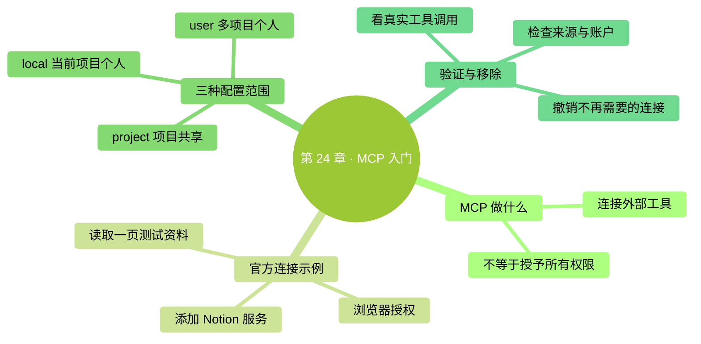

<a id="第-24-章mcp-入门连接一个确实需要的外部服务"></a>
# 第 24 章：MCP 入門——連線一個確實需要的外部服務

> **本章在全書的位置**：第五部分 · 第 24 章 / 主線 25–30 分鐘，支線 10 分鐘
>
> **前置章節**：第 7 章（許可權）+ 第 20–23 章（擴充套件）
>
> **學完能做什麼**：分清連線配置、賬戶授權和工具許可，用官方說明接入一個服務，並知道怎樣移除。
>
> **核驗日期**：2026-09-24。示例選用 Notion 官方遠端 MCP；有該服務賬戶時再操作。

---

<a id="开场三问"></a>
## 開場三問

- **你會遇到什麼問題**：任務需要雲端資料，你總在手動下載、複製和上傳。
- **不讀這章會踩什麼坑**：以為連上服務就獲得全部許可權，或照舊教程把金鑰寫進公開專案。
- **讀完你會多會什麼事**：用一個小的讀取任務驗證連線，再判斷是否值得擴大使用。

<a id="本章地图一眼看全貌"></a>
### 本章地圖（一眼看全貌）

<!-- diagram: MM-31 -->


---

> 🎯 **【主線】—— 本章必讀核心**

<a id="241-它是接口不是让助手变聪明的开关"></a>
## 24.1 它是介面，不是讓助手變聰明的開關

**MCP（Model Context Protocol，模型上下文協議）**是一套讓 AI 工具與外部服務對接的約定。你可以把它理解為擴充套件塢：Claude Code 負責理解任務，一個 MCP 服務負責提供“搜尋頁面”“讀取工單”等實際能力，外部系統仍負責儲存資料和管理賬戶許可權。

連線後能做什麼，取決於服務提供哪些工具、你的賬戶能訪問什麼，以及本次呼叫是否獲准。安裝一個 GitHub 連線，不等於它能看所有私有倉庫；連線 Notion，也不意味著你可以越過同事設定的頁面許可權。MCP 不會替服務發明它沒有開放的功能。

Claude Code 本來就有本地檔案與命令能力，也能透過其它方式使用網路服務。**為了讀當前專案檔案，不必先裝 filesystem MCP。**只是想訪問另一個自己的目錄時，可以先了解 `/add-dir`；真正需要 MCP 的理由通常是“這個服務提供了我現在缺少的介面”，而不是“所有教程都建議裝”。[Claude Code 的目錄與許可權](https://code.claude.com/docs/en/permissions#working-directories)

本章選一個現成服務做練習，而不是列出“人人必裝的三個”。你工作中不用 Notion，也可以先讀懂流程，之後用自己服務商的官方說明替換它。不要為了完成一個練習專門購買不需要的產品。

<a id="242-先把三层权限分开"></a>
## 24.2 先把三層許可權分開

接入外部服務時，至少有三件不同的事：

| 層次 | 解決的問題 | 你應該檢查什麼 |
|---|---|---|
| 連線配置 | 去哪裡找這個 MCP 服務 | 地址是否來自服務商官方說明 |
| 賬戶授權 | 外部系統允許訪問哪些資源 | 登入的賬戶、工作區、允許範圍 |
| 工具許可 | Claude 這次可否執行某個動作 | 呼叫的是讀取、修改還是傳送 |

例如連線地址寫對了，但賬戶沒授權，就可能顯示需要登入；登入成功了，但頁面不屬於這個賬戶，又可能找不到；頁面能讀，也不代表你已經同意向其中釋出新內容。遇到錯誤時按這三層排查，比一看到“許可權不足”就擴大所有許可權有效。

`OAuth` 是一種透過瀏覽器登入並確認訪問範圍的授權方式。你不必把密碼複製給 Claude。若某個服務只支援令牌，那是一段代表訪問權的秘密字串，要按服務商說明保管，不能放進公開倉庫，也不要作為聊天材料發給模型。[官方 MCP 鑑權說明](https://code.claude.com/docs/en/mcp#authenticate-with-remote-mcp-servers)

最後糾正一箇舊說法：`acceptEdits` 主要處理本地檔案編輯和相應檔案操作，**不是給所有 MCP 工具免確認的總開關**。實際呼叫還受工具規則、所選模式和組織策略影響。也不能承諾每次外部寫入必然彈框；如果曾經授予廣泛許可，需要重新檢視許可權配置。[許可權模式](https://code.claude.com/docs/en/permissions#permission-modes)

<a id="243-接上-notion再只读一页练习资料"></a>
## 24.3 接上 Notion，再只讀一頁練習資料

如果你已經使用 Notion，先建一頁不含私人資訊的“Claude 連線練習”，寫三條虛構待辦。確認你知道頁面屬於哪個工作區，並閱讀授權頁將授予的範圍。官方 Notion MCP 可以讀取和更新賬戶有權訪問的內容，不能假定瀏覽器一定提供“只讀”選項；不能接受其授權範圍時就取消，不影響繼續閱讀本章。

在**系統終端**裡進入練習專案，然後執行下面一行。Mac 與 Windows PowerShell 都使用這條命令：

```bash
claude mcp add --transport http --scope local book-notion https://mcp.notion.com/mcp
```

`book-notion` 是我們給連線起的本地名字；`http` 表示透過網址連線遠端服務；`local` 表示只對當前專案中的你可用。命令寫入的是連線定義，**執行成功還不等於已經登入、更不等於工具呼叫成功**。

重新進入 Claude Code，輸入 `/mcp`，找到 `book-notion`，按介面提示完成瀏覽器授權。核對賬戶與工作區，不要一路點選到最後才發現登入錯了。這個流程與地址可在 [Notion 官方接入指南](https://developers.notion.com/guides/mcp/get-started-with-mcp#claude-code)對照。

然後提出一個邊界明確的任務：

```text
请通过 book-notion 读取“Claude 连接练习”页面，告诉我三条待办是什么，并给出原页面链接。只读取，不修改、不创建页面。
```

核對返回的三條內容和連結，並檢視實際的 MCP 工具呼叫記錄。僅僅得到一個看起來像總結的答案不算連通證據：它也可能依據你貼在對話裡的文字回答。完成讀取之後，本章任務已經結束，不需要順手試刪除、批次修改或釋出。

<a id="244-配置放在哪里哪些可以共享"></a>
## 24.4 配置放在哪裡，哪些可以共享

Claude Code 會根據安裝時的 `scope`，也就是**配置範圍**，把資訊放到對應位置：

| 範圍 | 誰在什麼地方使用 | 儲存位置 |
|---|---|---|
| `local` | 當前專案中的你；預設範圍 | 使用者主目錄 `~/.claude.json` 中該專案的記錄 |
| `project` | 專案成員共享連線定義 | 專案根目錄 `.mcp.json` |
| `user` | 你在這臺電腦的多個專案 | 使用者主目錄 `~/.claude.json` |

不要再按舊版示例建立 `~/.claude/mcp_servers.json`，那不是這裡的配置入口。也不要把 MCP 的 local 範圍，與一般本地設定檔案 `.claude/settings.local.json` 混為一談。[配置範圍說明](https://code.claude.com/docs/en/mcp#choose-the-right-scope)

專案的 `.mcp.json` 可以用於共享**不含秘密的連線定義**，每個人仍需完成自己賬戶的授權。並不是所有 MCP 配置都禁止提交，也不是隻要叫專案配置就能放心公開。分享前開啟檔案檢查：如果裡面直接寫了令牌、密碼或個人內部地址，先處理這些內容。

平時優先透過命令管理，不必手改使用者配置大檔案。可以在系統終端執行 `claude mcp get book-notion` 檢視定義；練習結束要移除本次 local 連線，執行：

```bash
claude mcp remove book-notion --scope local
```

清理之後再看 `/mcp` 是否還存在；若來自賬戶同步或其它範圍，那是另一份來源，不能以為本次命令會把所有同名來源都刪掉。外部賬戶的授權記錄也可以到服務端連線設定中核對與撤銷。

<a id="245-根据实际任务选择连接而不是收集连接"></a>
## 24.5 根據實際任務選擇連線，而不是收集連線

選下一個服務時，先寫一句具體需求：“讀取我負責專案最近十條工單，整理阻塞原因”，比“接上所有辦公工具”更容易判斷是否值得。然後找該服務商當前維護的 MCP 或聯結器說明，確認是否支援目標動作、需要什麼賬戶、是否有管理員限制。

**遠端服務**通常使用網址和瀏覽器授權；**本地 stdio 服務**則由電腦啟動一個程式，透過輸入輸出通訊。stdio 可以理解為“本地兩個程式之間傳訊息”。後者可能需要 Node.js 或其它執行器，那是該連線自己的依賴，不是 Claude Code 安裝一律要求 Node.js。

不要照抄舊教程裡的第三方包名就執行，尤其是早期示例倉庫中已歸檔的 Google Drive、GitHub 等實現。服務商可能已經提供了新的官方遠端入口。查說明時要看維護主體、日期和實際端點，並讀清連線能改什麼。支援某個開放協議，不等於每個實現都同樣可靠。

接好一個連線後，先用測試資料完成一次讀取，並記錄成功的提示詞和許可權範圍。之後真的需要寫入，再用明確頁面、明確改動做一次小操作。訪問被拒絕時先查賬戶和目標資源，不要用“給更大的令牌許可權”作為通用修復。你需要的是完成工作所需的能力，不是工具列表越來越長。

<a id="本章小结"></a>
## 本章小結

- MCP 提供外部介面，具體能力由服務和賬戶許可權決定。
- 連線定義、賬戶授權、本次工具許可是三層不同問題。
- 首次練習使用 local 範圍，先驗證一次有來源的讀取。
- 共享配置用 `.mcp.json`，秘密不能跟著共享。
- `acceptEdits` 不會自動放行所有 MCP 工具。

<a id="动手任务"></a>
## 動手任務

**任務 1，約 20 分鐘：**有 Notion 賬戶時，按本章連線並讀取一頁虛構資料。成功標誌是內容正確、原連結可開啟，並能看到工具呼叫；無相應賬戶可換服務商官方練習，或先完成任務 2。

**任務 2，約 10 分鐘：**給你最需要的一個服務寫一張接入卡：任務、官方說明、配置範圍、需要的授權、如何移除。成功標誌是這些問題都有明確答案，而不是隻收藏了一個包名。

<a id="如果你卡住了"></a>
## 如果你卡住了

**同名服務已經存在：**先檢視既有來源和定義。不要為跑通示例覆蓋工作中正在用的連線；換一個練習名，或確認它就是你要用的服務。

**授權完成卻看不到頁面：**核對登入賬戶、工作區和頁面原有許可權，再看服務是否已連線。不要直接把賬戶升成管理員。

**答案有內容卻沒有呼叫記錄：**要求提供原頁面連結並明確透過該連線讀取；在 `/mcp` 檢視狀態。連線失敗就記錄失敗，不能用模型猜出的總結代替驗收。

---

> 🌿 **【支線】—— 可選深入（學有餘力再看）**

<a id="-支线-24a和技能子智能体组合"></a>
## 🌿 支線 24.A：和技能、子智慧體組合

這段講組合時的順序；當單獨連線已經穩定可用時再讀。

可以讓技能規定報告格式，透過 MCP 讀取資料，再把大量閱讀工作交給子智慧體。這樣每個元件承擔一個清楚的職責：技能寫流程，MCP 提供服務工具，子智慧體組織獨立處理。斜槓入口則讓你主動啟動整套任務，不是又增加一份相同流程。

組合時先保留中間結果。例如生成周報之前，列出實際讀到哪些頁面和日期範圍；發現漏頁就先補資料，不急著潤色報告。最後若要發回外部服務，把待發布內容和目標頁面寫清楚，再按真實授權執行。不要把“幫我整理”自動擴大成“替我通知團隊”。元件越多，越需要清楚知道在哪一步發生了讀取、修改或傳送。

<a id="-支线-24b没有现成连接时怎么办"></a>
## 🌿 支線 24.B：沒有現成連線時怎麼辦

這段講自建服務的邊界；只有工作確實受限於內部系統介面時才值得深入。

自己實現 MCP 服務是一項開發工作：不僅要提供幾個工具，還要處理賬戶鑑權、輸入檢查、錯誤返回、訪問範圍和日誌。演示程式能跑，不代表它能安全連線真實業務資料。零基礎階段可以先請熟悉系統的同事確認是否已有維護中的介面；沒有時，再討論是否值得投入。

學習資料從 [MCP 官方文件](https://modelcontextprotocol.io/docs/getting-started/intro)開始。社群清單適合發現候選，具體安裝仍回到專案維護者或服務商的說明。協議讓對接方式更統一，但不會消除服務差異：兩個都叫“搜尋”的工具，覆蓋範圍和返回資料仍可能不同。選工具始終圍繞真實任務，而不是因為某種協議正流行。

**第五部分到此完成。**你已經認識任務手冊、手動入口、專項助手、事件自動化和外部介面。下一部分把這些能力放進可持續的日常工作中。
