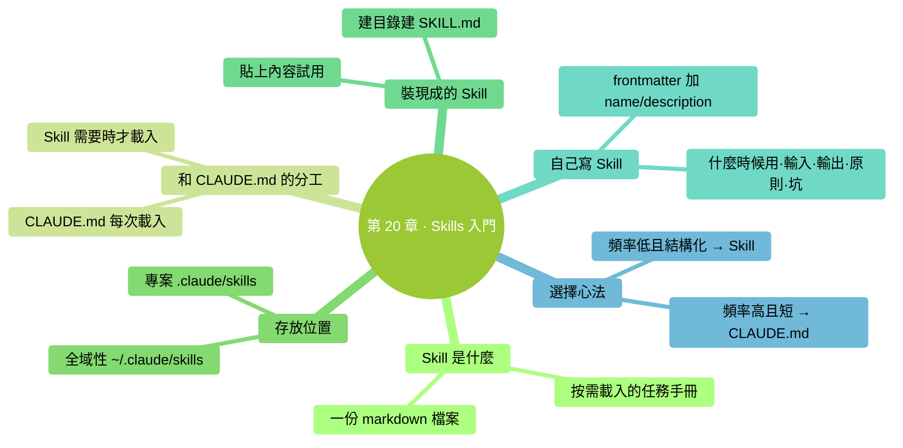

# 第 20 章：Skills 入門——可複用的操作手冊

> **本章在全書的位置**：第五部分 · 第 20 章 / 預估閱讀+動手時長：**主線 25-30 分鐘 + 支線 10 分鐘**
>
> **前置章節**：Ch 13（三層記憶）+ Ch 14（CLAUDE.md）
>
> **學完能做什麼（主線）**：理解 Skills 是什麼、它和 CLAUDE.md 有什麼分工；會**裝一個現成的 Skill**；能**寫出你第一個最簡 Skill**（一份 markdown 檔案）。

---

## 開場三問

- **你會遇到什麼問題**：有些任務你做得夠多了，每次都要給 Claude 講同一套流程——煩。
- **不讀這章會踩什麼坑**：把這些"偶爾用但要講一大通"的流程塞進 CLAUDE.md，導致 CLAUDE.md 膨脹。
- **讀完你會多會什麼事**：會寫第一個 Skill（把常用流程打包），Claude **只在需要時**才載入——省 Ctx、清爽。

### 本章地圖（一眼看全貌）

<!-- diagram: MM-27 -->


---

> 🎯 **【主線】—— 本章必讀核心**

---

## 20.1 Skill 是什麼

**Skill** = 一份**預先寫好的、針對特定任務的操作手冊**，以 Markdown 檔案的形式存在，Claude 在**需要時**自動載入進上下文，用完丟棄。

### 一句話定義

> 🔑 **Skill = 按需載入的任務手冊。**

### 和 CLAUDE.md 的關鍵區別（複習）

| | CLAUDE.md | Skill |
|---|-----------|------|
| 載入 | **每次啟動載入** | **按需載入** |
| 內容 | 全域性規則、硬約束 | 特定任務的手冊 |
| 適合什麼 | "這個專案永遠這樣" | "偶爾做 X 任務時這麼做" |

### 一個簡單例子

假設你每月做一次"專案月報"。流程是：
1. 彙總本月所有提交
2. 整理關鍵成就 3-5 條
3. 列待辦
4. 按固定模板排版

這個流程你一個月做一次——**放 CLAUDE.md 太浪費（佔 Ctx 卻 99% 時間用不到）**。

改成一個 Skill `monthly-report`：
- 平時不佔 Ctx
- 你說"做月報"或 Claude 識別到類似需求時，**它才載入進來**
- 載入之後 Claude 按手冊步驟做

### Skills 能放什麼

- **結構化的任務流程**：月報、程式碼審查、發版流程
- **有固定模板的工作**：郵件回覆、會議紀要、週報
- **多步推理的任務**：從資料到報告的完整管線

### Skills 不適合放什麼

- **所有任務都適用的通用規則** → 放 CLAUDE.md
- **一次性任務** → 直接在 prompt 裡講就行
- **太複雜、步驟上百** → 拆成多個 Skill

## 20.2 Skills 存在哪裡

兩種位置（和 CLAUDE.md 類似）：

### 全域性 Skills（只有你能用）

```
~/.claude/skills/<skill-name>/
```

### 專案 Skills（團隊共享，進 git）

```
<專案根>/.claude/skills/<skill-name>/
```

### 一個 Skill 的最簡檔案結構

```
~/.claude/skills/monthly-report/
└── SKILL.md      # 就一個檔案，其他都可選
```

**一個 Skill 的最小構成 = 一個 `SKILL.md`**——就是這麼簡單。

## 20.3 第一個 Skill：裝一個現成的（15 分鐘）

先**裝別人寫好的**——比從零寫省事。

### 第一步：建目錄

開啟終端，跑：

```
mkdir -p ~/.claude/skills
```

（只建一次，之後所有 Skills 都放這下面）

### 第二步：新建 Skill 目錄

我們做一個"會議紀要整理"Skill。

```
mkdir -p ~/.claude/skills/meeting-notes
```

### 第三步：建 SKILL.md

```
open -e ~/.claude/skills/meeting-notes/SKILL.md
```

（Windows 上用 `notepad %USERPROFILE%\.claude\skills\meeting-notes\SKILL.md`）

貼上下面的內容：

```markdown
---
name: meeting-notes
description: 把凌亂的會議錄音轉寫 / 筆記整理成結構化會議紀要
---

# 會議紀要整理

## 什麼時候用

使用者給你一段會議記錄（語音轉寫、即時筆記、碎片發言），要把它變成結構化紀要。

## 輸入

使用者通常會給你一段凌亂的文字——可能是：
- 訊飛 / 飛書會議的錄音轉寫
- 自己邊聽邊記的筆記
- 多人輪流發言的原文

## 輸出格式（固定）

```markdown
# 會議紀要：<會議主題>

- **時間**：<日期>
- **與會**：<名字列表>
- **主持**：<名字>

## 關鍵決定
1. ...
2. ...

## 討論要點
- 要點 1：...
- 要點 2：...

## 行動項
| 事項 | 負責人 | 截止 |
|-----|-------|-----|
| ... | ... | ... |

## 懸而未決
- ...
```

## 原則

- 忠於原文——不要編造沒提到的決定
- 不確定的細節（比如截止日期沒說）就標 `<待確認>`
- 參會名單如果原文沒列清楚，只寫"與會多人"，不要亂填
- 按"決定 > 討論 > 行動 > 懸而未決"排序

## 常見坑

- 原文裡有閒聊 / 跑題——**剔除**
- 同一件事多人重複講——**合併**
- 一個人說"我覺得應該 X"但沒達成共識——放"討論要點"，不放"關鍵決定"
```

儲存。

### 第四步：試一試

在 Claude Code 裡開啟一個對話，找一段會議原始記錄（隨便從郵件、聊天記錄拼一段假的也行），說：

```
你：用 meeting-notes 技能整理下面的會議記錄：

（貼上原始文字）
```

或者不指定技能，直接描述任務：

```
你：我有一段會議原始記錄要整理成紀要，整理成結構化的樣子。
（貼上）
```

Claude 會自動判斷需要用 `meeting-notes` Skill，載入進來，按手冊做。

**成功標誌**：輸出嚴格按 SKILL.md 裡的模板格式。

## 20.4 自己寫一個 Skill（15 分鐘）

寫 Skill 沒什麼神秘的——**就是一份 markdown 說明書**。

### 步驟

1. **選一個你反覆做的任務**（週報、郵件回覆、程式碼審查、截圖重新命名...）
2. 想清楚這個任務的"標準流程"—— 輸入是什麼、輸出什麼樣、有哪些規矩
3. 新建 `~/.claude/skills/<名字>/SKILL.md`
4. 按下面結構寫

### 推薦結構

```markdown
---
name: <skill-name>   # 英文、連字元連線，Claude 引用時用
description: <一句話說它幹什麼>   # 這句是 Claude 判斷"要不要用這個技能"的依據
---

# <標題，人類可讀>

## 什麼時候用
（什麼場景觸發這個 Skill —— 越具體越好，Claude 靠這個決定載入不載入）

## 輸入
（使用者會給你什麼形式的原料）

## 輸出格式
（你期望的最終產出是什麼樣——給模板）

## 原則
（不能違反的鐵律）

## 常見坑
（歷史上出過哪些錯、怎麼避免）
```

### 一個例項：週報生成

```markdown
---
name: weekly-report
description: 把本週流水賬整理成老闆喜歡的精簡週報
---

# 週報生成

## 什麼時候用
使用者說"整理週報"、"寫週報"、或丟給你一堆本週做的事讓你彙總。

## 輸入
- 一堆碎事項（多半按時間順序）
- 有些是已完成、有些在做

## 輸出格式

```markdown
# <姓名> 週報（<日期範圍>）

## 本週亮點（1-3 條）
- ...

## 已完成
- 事項 1 — 一句話結果
- ...

## 進行中
- ...（標進度百分比）

## 下週計劃
- ...

## 需要協助
- ...（沒有就寫"無"）
```

## 原則
- **亮點**永遠是"有顯著成果的事"，不是"我很努力做了 XX"
- 單項不超過 30 字，老闆掃讀友好
- "已完成"要有**結果**（"客戶接入 3 家"），不能只寫"做了對接"
- 不編造沒做的事

## 常見坑
- 把所有做過的事都寫成"亮點"—— 一條都不突出
- 用日期串起來的流水賬 —— 按"已完成 / 進行中"分類更清晰
```

寫完儲存，跑一次看看效果。

### Claude 怎麼知道什麼時候用這個 Skill

兩條路徑：

1. **使用者明說**："用 weekly-report Skill"
2. **Claude 自己判斷**：看 `description` 欄位 + `## 什麼時候用` 描述，覺得匹配就載入

**關鍵**：`description` 要寫準——這是 Claude 做決定的主要依據。

## 20.5 Skill vs CLAUDE.md 的選擇心法

遇到一條"我想讓 Claude 記住的流程"，按這張表判斷：

| 情境 | 放 CLAUDE.md | 寫 Skill |
|-----|------------|--------|
| 每次對話都相關 | ✅ | |
| 一個月才用一次 | | ✅ |
| 簡短硬規則（1-2 行） | ✅ | |
| 結構化流程（多步驟、帶模板） | | ✅ |
| 所有專案都適用 | ✅（全域性 CLAUDE.md） | ✅（全域性 Skills） |
| 步驟可能超過 50 行 | ❌（太大） | ✅ |

**核心判斷**：**頻率高 + 短 → CLAUDE.md；頻率低 + 長 → Skill**。

---

## 本章小結

- Skill = 按需載入的任務手冊，一份 markdown 檔案
- 放在 `~/.claude/skills/<名>/SKILL.md`（全域性）或 `.claude/skills/<名>/SKILL.md`（專案）
- 核心欄位：`name` + `description` +「什麼時候用 / 輸入 / 輸出 / 原則 / 常見坑」
- **頻率高 + 短 → CLAUDE.md**；**頻率低 + 結構化 → Skill**
- description 欄位是 Claude 判斷"要不要用"的主要依據——寫準它

---

## 動手任務

### 任務 1：裝 meeting-notes Skill（10 分鐘）

**步驟**：照 20.3 完整走一遍——建目錄、建檔案、貼上內容、試一段假會議記錄。

**成功標誌**：Claude 按模板整理出紀要，結構和 SKILL.md 裡定義的一致。

### 任務 2：寫你自己的第一個 Skill（20 分鐘）

**步驟**：

1. 選一個你反覆做的任務（從本書給的例子裡挑一個：週報、郵件、截圖整理、筆記歸檔）
2. 照 20.4 的結構寫
3. 放到 `~/.claude/skills/<名>/SKILL.md`
4. 做一次真實任務，用這個 Skill

**成功標誌**：你有了第一個**自己**的 Skill，下次同類任務能一句話呼叫。

### 任務 3：對照決策（5 分鐘）

看自己當前的 CLAUDE.md，有沒有內容其實更適合做 Skill？

典型訊號：
- 一整段操作流程（> 10 行）
- 用到不到每週一次的
- 帶模板 / 輸出格式的

把這類**搬出 CLAUDE.md 做成 Skill**。

**成功標誌**：CLAUDE.md 瘦下來 10 行以上。

---

## 如果你卡住了

**症狀 A：Claude 沒自動識別 Skill，每次都要我明說**
- 原因：description 太模糊，Claude 判斷不出匹配。
- 解決：description 要**說人話 + 關鍵詞**——"把會議記錄整理成紀要"比"會議相關的工具"好用。

**症狀 B：SKILL.md 裡寫的東西 Claude 沒執行到位**
- 原因：規矩寫得太軟（"儘量"、"建議"），Claude 理解有彈性。
- 解決：改成**明確指令**——"必須按這個模板"、"不得編造未提到的決定"。

**症狀 C：不知道 Skill 有沒有真的被載入**
- 原因：Claude Code 某些版本不顯式告訴你。
- 解決：**看產出格式**——如果輸出嚴格符合 SKILL.md 裡定義的結構，說明載入了；完全不像就是沒載入。

---

主線結束。下面支線講"Skill 的進階元素"和"怎麼分享 / 共享 Skill"。

---

> 🌿 **【支線】—— 可選深入（學有餘力再看）**

---

## 🌿 支線 20.A：Skill 的進階結構

> **這段講什麼**：SKILL.md 之外還能放什麼。
> **什麼時候回頭讀**：你寫了 3-5 個 Skill 後想把某個做大時。

### 多檔案 Skill

複雜 Skill 可以有多個檔案：

```
~/.claude/skills/code-review/
├── SKILL.md              # 入口 / 總覽
├── checklist.md          # 審查清單
├── common-bugs.md        # 常見 bug 庫
└── examples/             # 示例
    └── good-review.md
```

SKILL.md 裡**引用其他檔案**：

```markdown
## 審查流程

詳細清單見 [checklist.md](./checklist.md)。
常見 bug 參考見 [common-bugs.md](./common-bugs.md)。
```

Claude 載入 SKILL.md 時會注意這些指標，需要時去讀相關子檔案。

### 給 Skill 加後設資料

frontmatter 裡可以加更多欄位：

```markdown
---
name: code-review
description: 程式碼審查助手
version: 0.3
author: "我"
tags: [review, quality]
---
```

這些後設資料**Claude 也能看到**，對它判斷"這個 Skill 是不是最新版"有幫助。

### Skill 裡呼叫其他工具

SKILL.md 裡可以明確**指導 Claude 呼叫特定工具**：

```markdown
## 步驟
1. 用 `!git diff main` 獲取變更
2. 用 @ 引用被修改的所有檔案
3. ...
```

Claude 會照著做——相當於把操作流程固定住。

---

## 🌿 支線 20.B：Skill 共享 / 社群

> **這段講什麼**：你的 Skill 可以分享給團隊 / 公開。
> **什麼時候回頭讀**：你寫了好的 Skill 想讓別人用時。

### 團隊共享

把 Skill 放**專案級**目錄：`<專案>/.claude/skills/<名>/`

**進 git**，所有人 pull 下來就生效。

### 公開分享

- 發到 GitHub 單獨倉庫
- 別人 clone / 下載，放進自己的 `~/.claude/skills/` 即可

### 正在興起的 Skill 社群

Anthropic 有官方 skill 目錄、社群也在建立第三方集。搜 "claude-code skills" 或 "awesome claude skills"，找到合適的 fork 一份到本地用。

### 共享時的注意

- **不要在 Skill 裡硬編碼你的路徑**（`/Users/yourname/...`）——用相對路徑或佔位符
- **不要在 Skill 裡放金鑰或個人資訊**
- 寫清楚 Skill 需要的**前提條件**（依賴哪些工具、哪些 CLAUDE.md 配置）

---

**下一章**：第 21 章"自定義 Slash 命令"——Skill 是 **Claude 的手冊**，自定義 Slash 命令是**給你自己的快捷鍵**。兩者怎麼分工？下一章講。


---

<!-- chapter-nav -->

📖  [← 第 19 章 · 輸入技巧](../part4-避坑與判斷力/19-輸入技巧.md)  ·  [📑 返回目錄](../../README.md)  ·  [第 21 章 · 自定義 Slash 命令 →](21-自定義Slash命令.md)
