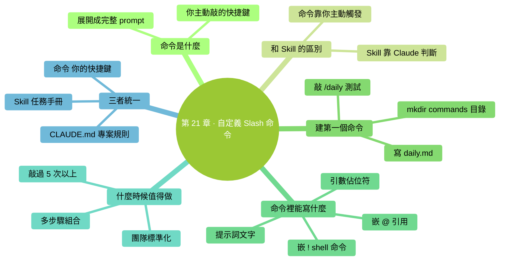

# 第 21 章：自定義 Slash 命令——給你自己的快捷鍵

> **本章在全書的位置**：第五部分 · 第 21 章 / 預估閱讀+動手時長：**主線 20-25 分鐘 + 支線 8 分鐘**
>
> **前置章節**：Ch 18（常用斜槓命令）+ Ch 20（Skills）
>
> **學完能做什麼（主線）**：理解自定義 slash 命令和 Skills 的分工；建出你**第一個 `/xxx` 命令**（10 行以內）；知道什麼時候做成命令、什麼時候做成 Skill。

---

## 開場三問

- **你會遇到什麼問題**：每次開啟任務都要敲同樣一長段 prompt——"請嚴格遵守：A、B、C，輸出格式 D"。累。
- **不讀這章會踩什麼坑**：明明可以一鍵觸發的動作，還是每次手工複製貼上 prompt。
- **讀完你會多會什麼事**：把反覆用的 prompt 變成 `/xxx` 一個命令——敲命令名 = 自動展開完整 prompt。

### 本章地圖（一眼看全貌）

<!-- diagram: MM-28 -->


---

> 🎯 **【主線】—— 本章必讀核心**

---

## 21.1 自定義 Slash 命令是什麼

Ch 18 講的 `/clear`、`/compact`、`/status` 等是 Claude Code **內建**命令。你也可以**自己建**——以 `/` 開頭，以你的自定義名字結尾：

- `/daily` — 自動生成一條今日開工清單
- `/review` — 啟動程式碼審查模板
- `/ship` — 按你的釋出流程一步步走
- `/focus` — 切換到"不打擾"模式（關掉某些提示）

### 一句話定義

> 🔑 **自定義 Slash 命令 = 你給自己起的、以斜槓開頭的、一敲就自動展開成完整 prompt（或觸發特定動作）的快捷鍵。**

### 和 Skills 的本質區別（重要）

| 維度 | Skill | Custom Slash Command |
|-----|-------|--------------------|
| 觸發方式 | **Claude 自動判斷**（看到符合場景就載入） | **你主動敲命令** |
| 本質 | 給 Claude 的**任務手冊** | 給你的**prompt 快捷鍵** |
| 存在形式 | `SKILL.md` + 相關檔案 | 一個簡短的 markdown |
| 負責"做什麼決定"的是誰 | Claude | **你** |

**最簡單的類比**：
- **Skill = Claude 的工具箱**（它自己決定啥時候拿工具）
- **Custom command = 你的鍵盤宏**（你按鍵就觸發）

兩者也可以配合——命令觸發後 prompt 裡**引用** Skill，最佳實踐。

## 21.2 建你的第一個命令（10 分鐘）

我們建一個 `/daily` 命令——"今天開工自動列清單"。

### 步驟 1：建目錄

**全域性命令**（所有專案可用）：
```
mkdir -p ~/.claude/commands
```

**專案命令**（只在這個專案可用）：
```
mkdir -p .claude/commands
```

新手**先用全域性**。

### 步驟 2：建命令檔案

檔名 = 命令名。做一個 `/daily` 命令就建 `daily.md`：

```
open -e ~/.claude/commands/daily.md
```

（Windows：`notepad %USERPROFILE%\.claude\commands\daily.md`）

### 步驟 3：寫內容

貼上：

```markdown
---
description: 今日開工清單——列出需要做的事、優先順序、大概時間預算
---

現在幫我列今天的開工清單。按以下步驟：

1. 先跑 `!git log --since="24 hours ago" --oneline` 看我昨天做到哪了
2. 跑 `!ls ~/Desktop/` 看桌面上有沒有未歸檔的檔案
3. 基於上面兩步，問我 2-3 個問題幫你搞清楚今日重點
4. 最後輸出一份今日清單：

```markdown
# <日期> 清單

## 必須完成（P0）
- [ ] ...（30-60 分鐘）

## 建議完成（P1）
- [ ] ...（15-30 分鐘）

## 可以推遲（P2）
- [ ] ...
```

原則：
- 每項帶時間預算
- 不超過 5 項
- 嚴格按優先順序排序
```

儲存。

### 步驟 4：試一試

啟動 Claude Code，在輸入框敲：

```
/daily
```

**按回車**——命令裡的內容會自動傳給 Claude，它就開始執行。

**成功標誌**：Claude 按步驟 1-4 做，最後出清單。

### 如果沒識別

- 確認檔案路徑對：`~/.claude/commands/daily.md`
- 確認檔案以 `.md` 結尾
- 重啟一次 Claude Code（某些版本要重啟才掃描新命令）

## 21.3 一個命令裡能幹什麼

自定義命令**本質上是一段 prompt 模板**。裡面可以：

### 能力 1：直接寫文字提示詞

```markdown
幫我把最後一條 commit 的變更摘要為 1 句話，用於 Slack 公告。
```

### 能力 2：嵌入 shell 命令

用 `!command` 讓 Claude 跑命令（和 Ch 19 講的一樣）：

```markdown
先跑 `!git status` 看當前狀態，然後......
```

### 能力 3：嵌入 @ 引用

```markdown
讀 @CLAUDE.md 和 @docs/release.md，按其中規則走下面步驟......
```

### 能力 4：帶引數（進階）

命令支援佔位符：

```markdown
---
description: 給指定檔案生成測試
---

為 `{{1}}` 生成一組單元測試。要求......
```

使用時：

```
/gentests src/utils.py
```

`{{1}}` 會替換成 `src/utils.py`。

**不同版本語法略有差異**——打 `/help` 或官方文件看你這版具體語法。

### 能力 5：組合 Skill

```markdown
用 meeting-notes Skill 整理我剛貼的會議記錄，要求輸出按 HR 格式。
```

Claude 會自動載入你的 `meeting-notes` Skill + 接你的追加要求。

## 21.4 什麼時候值得做成命令

不是什麼都該做成命令。**值得做**的訊號：

### ✅ 值得做成命令

- **你敲過這段 prompt 超過 5 次**
- **組合了多個步驟**（shell 命令 + @ 引用 + 說明）
- **團隊裡每個人都要用同一套流程**（放專案級 `.claude/commands/`，進 git）
- **為標準化工作流**—— 比如 `/ship` 保證每次釋出都走同一流程

### ❌ 不值得做成命令

- **一次性 prompt**——下次可能用不到
- **只寫一兩句話的提示詞**——直接敲比打命令名還快
- **引數變化很大的任務**——每次都要改命令內容不如直接寫 prompt

## 21.5 命令、Skills、CLAUDE.md 三者統一對比

三個都是"讓 Claude 行為可重用"的方式，分工如下：

| 維度 | CLAUDE.md | Skill | Custom Command |
|-----|-----------|------|---------------|
| **觸發** | 每次啟動自動載入 | Claude 判斷需要時載入 | 你主動敲 `/xxx` |
| **適合頻率** | 每次對話都用得到 | 偶爾用，有標準流程 | 反覆用同樣 prompt |
| **內容本質** | 專案規則 + 上下文 | 任務手冊 | Prompt 模板 |
| **典型例子** | "這個專案用 Python 3.11" | "做程式碼審查的完整流程" | "/daily 今日清單" |
| **維護頻率** | 專案變化時改 | 流程最佳化時改 | 使用中發現需要調時改 |

### 三者聯合的典型工作流

```
使用者：/daily
  ↓（Custom Command 展開成完整 prompt）
Claude：讀 CLAUDE.md 知道專案背景
  ↓
Claude：識別出"需要生成清單"場景 → 載入 daily-planning Skill
  ↓
Claude：按 Skill 手冊 + CLAUDE.md 規則 + Command 裡的步驟執行
  ↓
輸出：一份清單
```

三者**各司其職，互不衝突**。

---

## 本章小結

- 自定義 Slash 命令 = **你主動敲的 prompt 快捷鍵**
- 放在 `~/.claude/commands/<名>.md`（全域性）或 `.claude/commands/<名>.md`（專案）
- 檔案結構：frontmatter（description）+ 正文（prompt 模板，可帶 ! shell / @ 引用 / {{引數}}）
- **Skill vs Command**：前者 Claude 自動呼叫、後者你主動觸發
- **值得做的訊號**：敲過 5 次以上、組合多步驟、團隊標準化
- 命令、Skill、CLAUDE.md **三者聯合**是最強組合

---

## 動手任務

### 任務 1：建 `/daily` 命令（10 分鐘）

**步驟**：照 21.2 完整走一遍。改 prompt 內容適應你自己的工作習慣（例：不關心 git？就刪掉那步；關心郵件？加一步 `!mail` 或提醒檢查郵箱）。

**成功標誌**：敲 `/daily` 能跑出一份**對你真有用**的今日清單。

### 任務 2：再建一個你自己的命令（15 分鐘）

**步驟**：

1. 回顧過去一週你反覆敲過的 prompt
2. 選一個最頻繁的（至少敲過 3 次）
3. 做成一個命令——起個 3-7 字的名字（例 `/email-reply`、`/review`）
4. 試用一次，發現問題就改

**成功標誌**：你有了第二個命令，真實減少敲字量。

### 任務 3：對比三種擴充（10 分鐘）

寫出你目前**三層擴充**的分工：

```markdown
# 我的 Claude Code 擴充地圖

## CLAUDE.md（當前專案每次都用）
- ...

## Skills（按需載入，我已安裝的）
- ...

## Custom Commands（我自己的快捷鍵）
- /daily
- /...
```

**成功標誌**：看一眼這份地圖，能說清楚每層分別幹什麼。

---

## 如果你卡住了

**症狀 A：敲 `/daily` 沒反應或說"command not found"**
- 原因：(a) 檔案路徑錯了；(b) 檔名帶空格 / 特殊字元；(c) 需要重啟 Claude Code。
- 解決：重建檔案確認路徑；檔名只用英文小寫 + 連字元；關掉 Claude Code 重開。

**症狀 B：命令展開了但 Claude 沒按步驟做**
- 原因：prompt 裡的指令太軟（"最好"、"可以"）。
- 解決：改成**硬指令**（"必須先跑 X"、"不得跳過步驟 Y"）。

**症狀 C：我想做帶引數的命令但不會**
- 原因：引數語法各版本略有不同。
- 解決：先跑 `/help` 看你這版的引數語法；或**先用無引數版本**——prompt 裡留一個 "..."，Claude 會追問你具體引數。

---

主線結束。下面支線講"團隊共享命令的最佳實踐"。

---

> 🌿 **【支線】—— 可選深入（學有餘力再看）**

---

## 🌿 支線 21.A：團隊共享命令的最佳實踐

> **這段講什麼**：專案裡放一組命令，所有人 pull 下來就能用。
> **什麼時候回頭讀**：團隊有 3 人以上一起用 Claude Code 時。

### 放在 `.claude/commands/`（專案級）

團隊命令**進 git**，每個人 clone 之後就有。

```
<專案根>/
├── .claude/
│   └── commands/
│       ├── ship.md       # /ship: 發版流程
│       ├── review.md     # /review: 程式碼審查
│       └── daily.md      # /daily: 每日早會前彙總
├── CLAUDE.md
└── src/...
```

### 三類值得團隊共享的命令

#### 1. 流程類命令（保證一致性）

例：`/ship` — 釋出流程

```markdown
---
description: 標準釋出流程——保證每次發版都走同一套步驟
---

按以下步驟走：
1. 跑 `!git status` 確認無未提交
2. 跑 `!npm test` 全綠
3. 跑 `!npm run build` 成功
4. 生成 CHANGELOG 更新
5. 建立 tag
6. 推到遠端
7. 釋出到 npm

每步等我確認再進下一步。
```

**價值**：**防止人手忘步驟**——Claude 按清單推進。

#### 2. 審查類命令

例：`/review` — 程式碼審查啟動

```markdown
---
description: 審查當前改動（基於 main 分支對比）
---

對比 main 分支，審查當前所有改動：
1. 跑 `!git diff main`
2. 按這 5 個維度評估：
   - 邏輯正確性
   - 測試覆蓋
   - 邊緣情況
   - 命名和可讀性
   - 潛在效能問題
3. 輸出報告
```

#### 3. 模板化輸出命令

例：`/release-notes` — 生成發版說明

```markdown
---
description: 把上次 tag 到現在的改動生成 release notes
---

1. 跑 `!git log <上次tag>..HEAD`
2. 按以下格式生成：

```
# vX.Y.Z

## 新增
- ...

## 修復
- ...

## 破壞性變更
- ...（如有）
```

3. 語言統一、使用者視角、不要技術細節
```

### 共享時的約定

- **命名一致**：`/review`, `/ship`, `/release-notes` 這種動作化命名
- **每個命令有 description**——隊友看 `/help` 能知道命令幹啥
- **命令內容寫在 markdown**——便於 PR review
- **大改走 PR**：改命令 = 改流程，要經過討論

### 個人命令 vs 團隊命令

- **個人命令**（`~/.claude/commands/`）：你的私人快捷鍵（`/daily` 這種關你自己事）
- **團隊命令**（`.claude/commands/`）：團隊共同工作流（`/ship` `/review` 這種影響多人）

分清楚——**個人的別混進 git**。

---

**下一章**：第 22 章"Subagents 入門"——讓 Claude 派出"專業實習生"去幹活。Skill 是手冊、Command 是快捷鍵、Subagent 是**有特定崗位的 Claude**。下一章講它和前面兩者的本質區別。


---

<!-- chapter-nav -->

📖  [← 第 20 章 · Skills 入門](20-Skills入門.md)  ·  [📑 返回目錄](../../README.md)  ·  [第 22 章 · Subagents 入門 →](22-Subagents入門.md)
