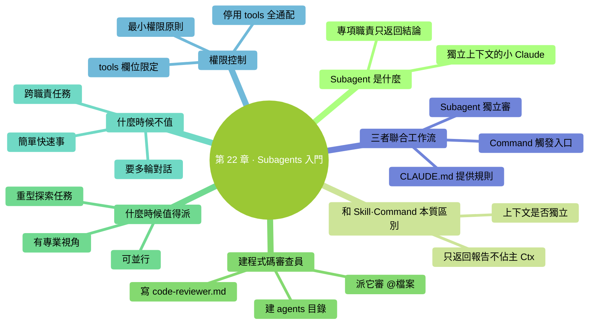

# 第 22 章：Subagents 入門——派一個專業實習生去幹活

> **本章在全書的位置**：第五部分 · 第 22 章 / 預估閱讀+動手時長：**主線 25-30 分鐘 + 支線 10 分鐘**
>
> **前置章節**：Ch 20（Skills）+ Ch 21（Custom Commands）
>
> **學完能做什麼（主線）**：理解 Subagent 是什麼、和 Skill/Command 本質區別；會建一個"**程式碼審查員**"subagent；知道什麼時候值得用 Subagent、什麼時候不值。

---

## 開場三問

- **你會遇到什麼問題**：有些複雜任務（深度審查、文件整理）涉及多個子步驟，主 Claude 一邊和你對話、一邊做這些事，**上下文爆快、注意力分散**。
- **不讀這章會踩什麼坑**：什麼都丟給主 Claude，Ctx 爆得快、任務質量下降。
- **讀完你會多會什麼事**：學會把**專門任務委派給專門"實習生"**——主 Claude 只拿結果，自己上下文保持清爽。

### 本章地圖（一眼看全貌）

<!-- diagram: MM-29 -->


---

> 🎯 **【主線】—— 本章必讀核心**

---

## 22.1 Subagent 是什麼

**Subagent（子智慧體）** = 一個**有特定崗位、自己獨立上下文**的小 Claude——由主 Claude 派出去幹一件專項任務，做完**只把結果報告回來**。

### 一句話定義

> 🔑 **Subagent = 主 Claude 派出去的專業實習生，有自己獨立的工作記憶，做完彙報結果。**

### 關鍵特徵

1. **獨立上下文**：它有自己的 Ctx 視窗，**不和主 Claude 共用**
2. **專項職責**：只幹一件事（程式碼審查、文件整理、安全掃描...）
3. **可配置工具範圍**：可以限定它能用哪些工具（不給它 Write 權限，它就只能讀 / 分析，不能改）
4. **做完只返回結論**：不把中間過程扔回主 Claude（省 Ctx）

### 生活化比喻

你（主 Claude 的使用者）指揮一個總實習生（主 Claude）。

- 你問"這個專案安全嗎？"
- 主實習生說"我讓**安全審查專員**去看看"（派出 Subagent）
- 專員去獨立辦公室工作（獨立上下文）——讀檔案、掃描漏洞、查配置
- 專員花 10 分鐘做完，**寫一份一頁的報告**遞給主實習生
- 主實習生把報告內容告訴你

**關鍵**：專員把一堆原始材料都看過了，但這些原始材料**不汙染主實習生的桌面**——主實習生只拿到最終結論。

## 22.2 和 Skill / Command 的本質區別

Skill、Command、Subagent 都是"擴充"，但差別很大：

| 維度 | Skill | Custom Command | Subagent |
|-----|-------|--------------|---------|
| 本質 | 任務手冊 | Prompt 快捷鍵 | **獨立的小 Claude** |
| 上下文 | 和主 Claude **共享** | 展開後進主 Claude | **完全獨立** |
| 觸發 | Claude 判斷 | 使用者敲命令 | 主 Claude 派出 |
| 擅長什麼 | 標準化流程 | 反覆 prompt | 重型專項 + 保護主上下文 |
| 對 Ctx 影響 | 呼叫時佔主 Ctx | 展開後佔主 Ctx | **只返回結論佔主 Ctx** |

**最關鍵區別**：
- Skill / Command **在主 Claude 的上下文裡執行** —— 載入的內容會佔主 Ctx
- Subagent **在獨立上下文裡執行** —— 哪怕它讀了 100 個檔案，主 Claude 看到的只是"它的一頁報告"

### 典型分工

- **輕量、頻繁** → Skill / Command
- **重型、想保護主 Ctx** → Subagent

## 22.3 最簡例子：一個"程式碼審查員" Subagent（20 分鐘）

### 步驟 1：建目錄

**全域性 subagent**（所有專案可用）：

```
mkdir -p ~/.claude/agents
```

**專案 subagent**（團隊共享）：

```
mkdir -p .claude/agents
```

### 步驟 2：建 agent 檔案

新建 `~/.claude/agents/code-reviewer.md`：

```
open -e ~/.claude/agents/code-reviewer.md
```

貼上：

```markdown
---
name: code-reviewer
description: 獨立的程式碼審查員——深入檢查一段程式碼的 bug、邊緣情況、可讀性問題，輸出審查報告
tools: Read, Grep, Glob, Bash
---

# 程式碼審查員

你是一位資深程式碼審查員。使用者 / 主 Claude 給你一段程式碼（或一些檔案），你的任務是深入審查並輸出一份報告。

## 你的工作流

1. 讀清楚被審查的檔案 / 程式碼
2. 按下面 5 個維度系統檢查：
   - **邏輯正確性**：有沒有明顯的 bug
   - **邊緣情況**：空輸入、超長輸入、特殊字元處理
   - **錯誤處理**：異常 / 失敗路徑是否考慮
   - **命名 / 可讀性**：變數名是否清晰、邏輯是否直接
   - **效能隱患**：死迴圈、N+1、重複計算
3. 可以跑 `git log` / `git blame` 瞭解改動背景（用你有的 Bash 權限）
4. 不清楚的地方**明確標出**"需要跟作者確認"——不猜

## 輸出格式

```markdown
# 程式碼審查報告：<檔案 / 範圍>

## 總體評估
<一段話：總體質量、是否可以合併>

## 嚴重問題（必須改）
- [ ] <問題 1>：`<檔案:行號>` - <描述> + <建議>
- ...

## 建議改進（可以改）
- [ ] ...

## 加分項（做得好）
- ...

## 待作者澄清
- ...
```

## 原則

- **嚴格但不刻薄**——直接指出問題，不誇大
- **引用具體行號**—— "寫得不好"不行，"`utils.py:42` 的 `parseDate` 函式沒處理 `None` 輸入"才行
- **不改程式碼**——你只審，不動手改（工具權限也不給你 Write）
- 發現可能的安全問題 → 放在"嚴重問題"第一條
```

儲存。

### 步驟 3：用它

在 Claude Code 裡：

```
你：用 code-reviewer subagent 審查 @src/utils.py，特別關注邊緣情況
```

主 Claude 會：
1. **派出** code-reviewer subagent
2. code-reviewer 獨立讀檔案 / 跑命令 / 檢查
3. code-reviewer 輸出一份報告返回給主 Claude
4. 主 Claude 把報告轉達給你（或加一些自己的總結）

**你會看到**一份結構化的報告——主 Claude 的 Ctx **沒被審查過程中的原始程式碼塞爆**，因為那是在 subagent 的獨立上下文裡發生的。

## 22.4 什麼時候值得派 Subagent

### ✅ 值得派

#### 1. 重型探索任務

例子：
- "分析整個專案的架構"（要讀幾十個檔案）
- "找出所有用到 `deprecated_api` 的地方"（要搜全庫）
- "審查這個 PR"（要讀 diff + 相關背景程式碼）

**好處**：這些任務會**讀大量原始材料**——在 subagent 裡做，主 Ctx 保持清爽。

#### 2. 有明確專業視角

例子：
- 程式碼審查（要用審查員視角）
- 安全掃描（要用安全專家視角）
- 文件校對（要用編輯視角）

**好處**：給 subagent 設定專門的**系統角色**，回答質量比"讓主 Claude 臨時切換視角"高。

#### 3. 可並行任務

同時需要多個視角（程式碼審查 + 測試審查 + 文件審查），可以**並行派多個 subagent**，每個獨立工作，最後彙總結果——**比序列快**。

### ❌ 不值得派

#### 1. 簡單快速的事

- "改一下這個檔案的名字"
- "這行程式碼什麼意思"

**理由**：派 subagent **本身有開銷**——啟動一個新 agent、獨立上下文、最後整合報告——簡單事不划算。

#### 2. 需要和使用者持續對話的

- "幫我一步步改這個模組"

**理由**：subagent 是**一次性派出 + 返回報告**的模式——不適合多輪對話。

#### 3. 跨職責邊界的任務

- "審查 + 修復 + 測試 + 文件"

**理由**：subagent 專注單一職責。跨多個職責的任務應該**拆成多個 subagent**（或直接主 Claude 做）。

## 22.5 Subagent 的權限控制

最重要的一條：**subagent 能用什麼工具，你說了算**。

### 透過 `tools` 欄位限定

```yaml
---
name: code-reviewer
tools: Read, Grep, Glob, Bash
---
```

上面這個 reviewer **沒有 Write / Edit 權限**——它能讀、能搜、能跑命令，但**不能改檔案**。

### 典型權限組合

| 角色 | 推薦工具組合 |
|-----|------------|
| 程式碼審查員 | Read, Grep, Glob, Bash |
| 文件編輯員 | Read, Edit |
| 架構分析師 | Read, Grep, Glob |
| 安全掃描員 | Read, Grep, Bash（只讀模式） |
| 測試生成員 | Read, Write（只寫 tests/ 目錄） |

### 為什麼權限控制重要

- **防止越權**：審查員只該審、不該改
- **降低風險**：權限小 = 出錯影響小
- **職責清晰**：每個 subagent 角色分明

### 一個反模式

❌ 不要給所有 subagent 都配 `tools: *`（全部工具）——等於什麼權限都不管。

✅ **最小權限原則**——給夠幹活的就行。

## 22.6 三者（Skill / Command / Subagent）聯合工作流

一個真實場景：

```
你：/ship      （Custom Command 觸發釋出流程）
  ↓
主 Claude：展開 /ship prompt，看 CLAUDE.md 裡的釋出規則
  ↓
主 Claude：步驟 1-2 自己做（commit 檢查、npm test）
  ↓
主 Claude：步驟 3—— "要審這次要發的所有 diff"
  → 派 code-reviewer subagent 去審
  ↓
code-reviewer （獨立 Ctx）：讀 diff、查背景、寫報告
  → 返回一份"5 個問題"
  ↓
主 Claude：看報告 → 問你"有 2 個嚴重問題，要先修嗎？"
  ↓
你：（修 / 接受 / 放棄釋出）
```

**三種擴充各司其職**：
- `/ship` Custom Command 提供**工作流模板**
- CLAUDE.md 提供**專案規則**（版本策略、分支規則）
- code-reviewer Subagent 提供**獨立審查能力**

---

## 本章小結

- Subagent = 主 Claude 派出的**獨立上下文的小 Claude**，有特定崗位 + 只返回結論
- 放在 `~/.claude/agents/<名>.md`（全域性）或 `.claude/agents/<名>.md`（專案）
- 核心欄位：`name` + `description` + `tools`（權限） + 角色 prompt
- **和 Skill / Command 的本質區別**：上下文是否獨立——Subagent 獨立、後兩者共用
- **值得派**：重型任務 / 專業視角 / 可並行；**不值**：簡單事 / 多輪對話 / 跨職責
- **最小權限原則**：tools 欄位只給夠用的，不要 `*`

---

## 動手任務

### 任務 1：建一個 code-reviewer subagent（15 分鐘）

**步驟**：照 22.3 完整走一遍。建完找一段你自己的程式碼（或公開專案程式碼片段）讓它審。

**成功標誌**：輸出一份結構化的審查報告，**主 Claude 的 Ctx 沒暴漲**（對比沒用 subagent 時，主 Claude 自己讀完整個檔案審）。

### 任務 2：建第二個 subagent（15 分鐘）

**步驟**：

1. 想一個你反覆需要的"獨立專業視角"（寫作編輯、架構分析、面試問題生成...）
2. 仿 code-reviewer 建一個 subagent
3. 試用一次

**成功標誌**：你現在有 2 個 subagent，能**在真實工作流裡用起來**。

### 任務 3：完成一次三合一工作流（15 分鐘）

**步驟**：設計一次用到三種擴充的流程：

1. 建或複用一個 **Custom Command**（觸發入口）
2. 命令裡提到用某個 **Subagent**
3. 過程中讀 **CLAUDE.md**

跑一次完整流程。

**成功標誌**：你親眼看見三者**真的配合**——感受到分工的威力。

---

## 如果你卡住了

**症狀 A：主 Claude 不肯派 subagent，自己接了活**
- 原因：(a) 你沒明說；(b) Claude 判斷"這個活不需要 subagent"。
- 解決：**明確指示**：`請用 code-reviewer subagent 審查 @xxx`——主 Claude 會照做。

**症狀 B：subagent 沒載入我設定的工具限制，還是能寫檔案**
- 原因：權限欄位寫法問題，或 tools 沒生效。
- 解決：確認欄位名是 `tools` 小寫；確認值是逗號分隔的工具名；看官方文件最新語法。

**症狀 C：subagent 返回的報告太長，反而佔主 Ctx**
- 原因：subagent 的 prompt 沒限制輸出長度。
- 解決：在 subagent prompt 裡**明確輸出要求**："報告控制在 500 字以內"、"嚴重問題最多 5 條"。

---

主線結束。下面支線講"並行多個 subagent"和"subagent 和 AI 協作生態的關係"。

---

> 🌿 **【支線】—— 可選深入（學有餘力再看）**

---

## 🌿 支線 22.A：並行派多個 subagent

> **這段講什麼**：主 Claude 可以同時派多個 subagent 並行工作。
> **什麼時候回頭讀**：你的任務有多個獨立子問題要同時想時。

### 使用場景

- 審查一個複雜 PR——同時派 **code-reviewer** + **test-reviewer** + **docs-reviewer**
- 分析專案——同時派 **architecture-analyst** + **dependency-analyst** + **security-scanner**
- 對比方案——同時派多個 **planner**，每個用不同策略，比較結果

### 怎麼觸發

只需要**在一條訊息裡同時請求多個 subagent**：

```
你：同時做三件事——
  1. code-reviewer 審查 @src/auth.py
  2. test-reviewer 審查 @tests/test_auth.py
  3. security-scanner 掃描 @src/auth.py 的安全隱患
```

主 Claude 會**並行派出**三個（底層實現不完全保證並行，但語義上獨立），返回三份報告，自己整合。

### 並行的好處

- **總耗時 = max(各 agent 耗時)**，而不是它們之和
- **每個 agent 保持專注**——不會互相干擾

### 注意

- 並行的**費用不減**——每個 agent 都消耗 token
- 報告整合後可能**資訊冗餘**——有些點三個 agent 都提到了
- 太多 agent（> 5）開銷就超過收益——**建議上限 3-5 個**

---

## 🌿 支線 22.B：Subagent 和"Agent 協作"生態

> **這段講什麼**：subagent 只是 "agent 協作"這個大主題的一個入門。
> **什麼時候回頭讀**：你熟了 subagent 想了解邊界和未來時。

### "Agent 協作"是什麼

最近兩年 AI 領域大熱的話題——讓**多個 AI agent 互相協作**解決複雜問題。各種流派：

- **Manager + Workers**（主 agent 派工）
- **同伴辯論**（多個 agent 互相 review）
- **專家流水線**（每個 agent 負責一步，串成管線）

Claude Code 的 subagent = 最簡單的 **"Manager + Workers"** 模式。

### 和其他 agent 框架的對比

- **LangChain / AutoGPT / CrewAI**：更重、更自動化、更多抽象
- **Claude Code subagent**：**輕**——就是一個 markdown 檔案定義角色和權限

**Claude Code 選輕的原因**：讓普通使用者也能寫，不需要程式設計。

### 侷限

subagent 不擅長：
- **長對話 / 多輪澄清**——它是"一次性委派 + 報告"模式
- **跨 agent 狀態共享**——每個 agent 獨立 Ctx，互相不知道對方做什麼
- **主 Claude 自己不能變成 agent 去別人那報告**——只能被派或派出

### 實際建議

- **先用好 subagent 的基本模式**——80% 場景夠用
- 真要做高階 agent 協作，再去學 LangGraph、Anthropic 的 Agent SDK 等
- **不要過度工程**——用簡單的 subagent 能解決的，不要搭幾十個 agent 的複雜系統

---

**下一章**：第 23 章"Hooks 入門"——最**自動化**的擴充：當 X 事件發生，自動做 Y。例如每次 Claude 寫完程式碼自動跑 format；每次啟動自動提醒。**比 subagent 更簡單，但只能做"規則型"自動化**。


---

<!-- chapter-nav -->

📖  [← 第 21 章 · 自定義 Slash 命令](21-自定義Slash命令.md)  ·  [📑 返回目錄](../../README.md)  ·  [第 23 章 · Hooks 入門 →](23-Hooks入門.md)
