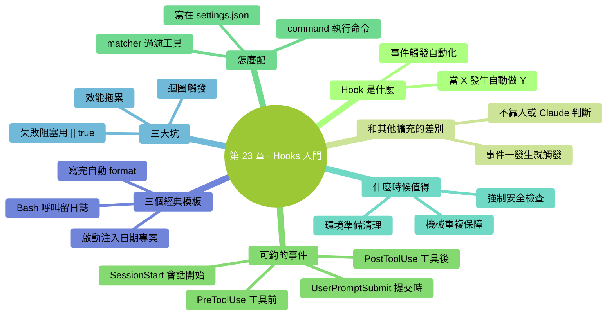

# 第 23 章：Hooks 入門——事件觸發的自動化

> **本章在全書的位置**：第五部分 · 第 23 章 / 預估閱讀+動手時長：**主線 20-25 分鐘 + 支線 8 分鐘**
>
> **前置章節**：前面 3 章擴充（Skills / Commands / Subagents）
>
> **學完能做什麼（主線）**：理解 Hooks 是什麼、和前三種擴充的分工；會配置一個**最簡單的 Hook**（每次 Claude 寫完檔案自動跑 format）；知道什麼時候值得用 Hook、什麼時候容易踩坑。

---

## 開場三問

- **你會遇到什麼問題**：每次 Claude 改完程式碼你都要手動跑 lint / format / 測試——機械、忘事、沒意思。
- **不讀這章會踩什麼坑**：這些"機械重複"本可以自動觸發，你還在手點，浪費時間。
- **讀完你會多會什麼事**：配一個"Claude 每次 Write 之後自動跑 `prettier`"——從此再不用手動 format。

### 本章地圖（一眼看全貌）

<!-- diagram: MM-30 -->


---

> 🎯 **【主線】—— 本章必讀核心**

---

## 23.1 Hook 是什麼

**Hook** = **"當 X 事件發生，自動執行 Y"** 的規則。

### 一句話定義

> 🔑 **Hook = Claude Code 的"事件→動作"自動觸發器。**

### 和前三種擴充的區別

| | 觸發者 | 典型場景 |
|--|------|--------|
| Skill | Claude 自己判斷需要 | 任務手冊 |
| Custom Command | **你敲** `/xxx` | Prompt 快捷鍵 |
| Subagent | 主 Claude 派 | 專項委派 |
| **Hook** | **事件自動** | **規則化自動響應** |

**最關鍵差別**：Hook 不靠"誰決定"——**事件一發生就自動觸發**，不問 Claude 也不問你。

### 能鉤什麼事件

Claude Code 支援的事件型別（具體名字以官方文件為準，這裡是主要幾個）：

| 事件 | 什麼時候觸發 |
|-----|------------|
| **PreToolUse** | Claude 要用某個工具（Write / Edit / Bash）之**前** |
| **PostToolUse** | Claude 用完某個工具之**後** |
| **SessionStart** | 會話開始 |
| **UserPromptSubmit** | 使用者傳送 prompt 時 |
| **SessionEnd** / 其他 | 會話結束等 |

每個事件都可以配**多條 hook**——像一串過濾器，一一跑過。

## 23.2 一個 Hook 長什麼樣

Hook 是**一條 shell 命令**或一條**簡單規則**，配在 `settings.json` 裡。

### 最簡例子：Claude 寫完 .py 檔案自動跑 black 格式化

配置（放在 `~/.claude/settings.json`）：

```json
{
  "hooks": {
    "PostToolUse": [
      {
        "matcher": "Write|Edit",
        "hooks": [
          {
            "type": "command",
            "command": "black \"$CLAUDE_FILE_PATH\" || true"
          }
        ]
      }
    ]
  }
}
```

含義：
- **事件**：`PostToolUse`（Claude 用完工具後）
- **匹配**：工具是 `Write` 或 `Edit` 時
- **做什麼**：跑 `black` 格式化那個檔案
- **`|| true`**：即使 black 報錯，也不讓 Claude Code 覺得 hook 失敗（不阻塞流程）

### 另一個例子：啟動時提醒今天日期

```json
{
  "hooks": {
    "SessionStart": [
      {
        "hooks": [
          {
            "type": "command",
            "command": "echo '今天是 $(date +%Y-%m-%d)'"
          }
        ]
      }
    ]
  }
}
```

會話啟動時自動把日期喂進 Claude 的上下文——**省得它對"今天是幾號"猜來猜去**。

### 欄位簡要解釋

- `matcher`：匹配哪些工具（可選，不寫就匹配全部）
- `type`：目前主要支援 `command`（跑 shell 命令）
- `command`：具體要跑的命令

**具體欄位可能隨版本微調**——打 `/help hooks` 或官方文件查你這版語法。

## 23.3 建你的第一個 Hook（15 分鐘）

我們建一個"Claude 寫 Markdown 檔案後自動跑 markdownlint"。

### 步驟 1：找到 settings.json

```
open ~/.claude/settings.json
```

如果檔案不存在：

```
mkdir -p ~/.claude && echo '{}' > ~/.claude/settings.json && open ~/.claude/settings.json
```

### 步驟 2：確認前置條件

確認你電腦上裝了 `markdownlint-cli`：

```
!npm install -g markdownlint-cli
```

（如果不裝也行，換成別的 lint 工具，或者改成 `echo "written: $CLAUDE_FILE_PATH"` 純提示）

### 步驟 3：編輯 settings.json

貼上：

```json
{
  "hooks": {
    "PostToolUse": [
      {
        "matcher": "Write|Edit",
        "hooks": [
          {
            "type": "command",
            "command": "[[ \"$CLAUDE_FILE_PATH\" == *.md ]] && markdownlint \"$CLAUDE_FILE_PATH\" || true"
          }
        ]
      }
    ]
  }
}
```

這條 hook 的意思：
- Claude 每次 Write / Edit 檔案後觸發
- 如果改的是 `.md` 結尾的檔案 → 跑 `markdownlint` 檢查
- 否則忽略

### 步驟 4：重啟 Claude Code，測試

讓 Claude 寫一個 markdown 檔案：

```
你：建一個 ~/Desktop/test.md，內容是一個簡單的 Markdown 列表。
```

它改完後，你會在 Claude Code 的輸出裡看到 markdownlint 的結果（如果有警告會列出來）。

### 成功標誌

- Claude 寫 `.md` 檔案時，hook 自動觸發 lint
- 寫 `.py` 或 `.txt` 檔案時，hook 不觸發（因為 matcher 過濾了）

## 23.4 什麼時候值得用 Hook

### ✅ 值得做 Hook

#### 1. 機械重複的保障動作

- 每次寫程式碼自動 format
- 每次改完自動跑特定測試
- 每次 commit 前自動檢查某些規則

**特徵**：**規則固定、每次都要做、人做容易忘**。

#### 2. 強制性的安全檢查

- 每次 Claude 想跑 `rm -rf` 時先詢問再放行（**PreToolUse 攔截**）
- 每次 Write 到敏感目錄時記錄日誌

**特徵**：安全兜底、不能遺漏的。

#### 3. 環境準備 / 清理

- SessionStart 時自動 `!cd 到專案目錄` / `!git pull`
- SessionEnd 時自動 `!git status`，提醒有沒有未提交的改動

### ❌ 不值得做 Hook

#### 1. 偶爾才做的事

一個月做一次的流程——**做成 Custom Command 即可**，不值得 hook。

#### 2. 和"任務是什麼"有關的邏輯

例如"Claude 寫測試時要用 pytest 風格"——這屬於**任務內容**，該放 CLAUDE.md / Skill，不是 hook。

#### 3. 需要人判斷的決策

"Claude 要改生產配置時問一下我"——這種**交給權限系統**（Ch 7）做，不是 hook。

## 23.5 Hook 的三大坑

### 坑 1：Hook 失敗阻塞 Claude

預設情況下，**hook 命令報錯 = Claude Code 流程中斷**。

**解決**：加 `|| true`——即使命令失敗也返回成功。除非你**就是想讓它失敗時阻塞**（比如 lint 不透過就不讓提交）。

### 坑 2：迴圈觸發

一個典型陷阱：

```json
{
  "PostToolUse": [
    {
      "matcher": "Write",
      "hooks": [{
        "type": "command",
        "command": "echo '已寫入' >> log.txt"   # ← 這一句再次觸發 Write，又觸發 hook
      }]
    }
  ]
}
```

**解決**：
- hook 命令**不要操作會再次觸發 hook 的事**
- 或加明確的**排除條件**（`[[ "$CLAUDE_FILE_PATH" != "log.txt" ]]`）

### 坑 3：Hook 吃效能

每次 Write 都跑一次 lint——如果 lint 慢（5 秒），每次 Claude 寫檔案你就等 5 秒。

**解決**：
- hook 做的事要**快**（< 1 秒最好）
- 慢的任務改成**後臺**或**定期**，不放 hook

## 23.6 Hook 的三個經典模板

給你**可以直接用的三個最常見 hook**：

### 模板 1：每次寫完 Python 檔案 auto-format

```json
{
  "hooks": {
    "PostToolUse": [{
      "matcher": "Write|Edit",
      "hooks": [{
        "type": "command",
        "command": "[[ \"$CLAUDE_FILE_PATH\" == *.py ]] && black \"$CLAUDE_FILE_PATH\" || true"
      }]
    }]
  }
}
```

### 模板 2：SessionStart 注入日期和專案狀態

```json
{
  "hooks": {
    "SessionStart": [{
      "hooks": [{
        "type": "command",
        "command": "echo '今天: '$(date +%Y-%m-%d)' | 目錄: '$(pwd)' | 分支: '$(git branch --show-current 2>/dev/null || echo 'not a git repo')"
      }]
    }]
  }
}
```

（這段文字會作為系統訊息餵給 Claude，相當於每次啟動時自動"報個家門"。）

### 模板 3：Claude 想跑高危命令時先 log

```json
{
  "hooks": {
    "PreToolUse": [{
      "matcher": "Bash",
      "hooks": [{
        "type": "command",
        "command": "echo '[$(date)] attempting: ${CLAUDE_TOOL_ARG:-no args}' >> ~/claude-bash.log"
      }]
    }]
  }
}
```

每次 Claude 要跑 Bash 命令時，先記一行日誌到 `~/claude-bash.log`——審計用。

---

## 本章小結

- Hook = 事件觸發的自動化 —— "當 X 發生，自動做 Y"
- 配置在 `~/.claude/settings.json`（全域性）或專案級設定裡
- 常用事件：**PreToolUse / PostToolUse / SessionStart / UserPromptSubmit**
- **值得做**：機械重複保障動作 / 強制安全檢查 / 環境準備清理
- **不值得**：偶爾做的事（Command）/ 任務內容（CLAUDE.md/Skill）/ 需要人決策的（權限系統）
- **三大坑**：失敗阻塞（`|| true` 兜底） / 迴圈觸發 / 效能拖累

---

## 動手任務

### 任務 1：配第一個 hook（15 分鐘）

**步驟**：照 23.3 完整走一遍。裝不了 markdownlint 的話改成簡單命令（比如 `echo "寫入了: $CLAUDE_FILE_PATH"`）。

**成功標誌**：你看見 hook **真的觸發了**，在 Claude 寫檔案後自動執行你定義的命令。

### 任務 2：配 SessionStart 報告（10 分鐘）

**步驟**：按模板 2 配一個 SessionStart hook。每次重啟 Claude Code 應該自動顯示日期、目錄、分支。

**成功標誌**：啟動就看到這行"報家門"——Claude 也拿到了這些資訊。

### 任務 3：嘗試 PreToolUse 審計日誌（10 分鐘）

**步驟**：按模板 3 配。讓 Claude 跑幾次 `ls` / `pwd` 等命令，然後查 `~/claude-bash.log`：

```
!cat ~/claude-bash.log
```

**成功標誌**：日誌檔案裡**真的記下了**每次 Bash 呼叫。

---

## 如果你卡住了

**症狀 A：hook 配完沒觸發**
- 原因：(a) settings.json 格式錯（缺逗號 / 引號不對）；(b) 需要重啟 Claude Code。
- 解決：(a) 用 JSON 校驗工具驗一下（線上 JSONLint）；(b) 退出 Claude Code 重新 `claude` 啟動。

**症狀 B：hook 觸發但命令跑錯**
- 原因：路徑變數可能名字不同（`$CLAUDE_FILE_PATH` vs `$FILE_PATH` 等）。
- 解決：**先把命令裡變數換成 echo**——`echo "path=$CLAUDE_FILE_PATH"`，看實際展開後是什麼，再調整。

**症狀 C：hook 讓 Claude 卡住 / 很慢**
- 原因：hook 命令本身太慢。
- 解決：**在 hook 命令末尾加 `&`** 讓它後臺跑（慎用，有時會被 kill）；或**改成定期任務**（用系統 cron）不放 hook。

---

主線結束。下面支線講"高階 hook：條件判斷和阻塞"。

---

> 🌿 **【支線】—— 可選深入（學有餘力再看）**

---

## 🌿 支線 23.A：阻塞型 Hook 和條件判斷

> **這段講什麼**：Hook 不只是"事後被動跑"——可以**主動阻止** Claude 的動作。
> **什麼時候回頭讀**：你想用 hook 做安全檢查時。

### 阻塞 vs 非阻塞

**非阻塞**：hook 跑什麼都不影響 Claude（預設或加 `|| true`）。

**阻塞**：hook **返回非 0 退出碼 → Claude Code 判定"hook 失敗"→ 停止那個工具呼叫**。

### 一個阻塞 hook 例子：禁止 Claude 改 .env

```json
{
  "hooks": {
    "PreToolUse": [{
      "matcher": "Write|Edit",
      "hooks": [{
        "type": "command",
        "command": "[[ \"$CLAUDE_FILE_PATH\" != *\".env\"* ]] || { echo 'ERROR: 不允許改 .env 檔案'; exit 1; }"
      }]
    }]
  }
}
```

含義：
- Claude 想 Write / Edit 時觸發
- 如果目標檔名含 `.env` → 報錯 exit 1 → **Claude 的寫入被拒絕**
- 否則返回 0，放行

這比**單純叮囑 Claude "不要改 .env"**更可靠——**直接在工具層攔截**。

### 更復雜的條件判斷

```json
{
  "command": "python3 ~/.claude/hooks/guard.py \"$CLAUDE_TOOL\" \"$CLAUDE_FILE_PATH\""
}
```

把邏輯寫進一個指令碼 `~/.claude/hooks/guard.py`——裡面自由判斷（更復雜條件、讀配置、寫日誌）。返回 0 = 放行、非 0 = 阻塞。

### 什麼時候值得用阻塞 hook

- **硬性安全紅線**：永遠不能改的目錄 / 檔案 / 命令
- **專案合規**：某些檔案必須走特定流程，不能直接改
- **防呆**：Claude 可能執行錯誤但你沒審到的情境

**注意**：阻塞 hook 是**硬攔截**——用錯了會把正常操作也擋掉。**上線前充分測試**。

### 和權限系統的關係

- **權限系統**（Ch 7）：Claude 要跑高危命令時**問你**，你人工決策
- **阻塞 hook**：**無需人工**，按規則自動阻塞

兩者互補：
- 人工判斷的 → 權限系統
- 規則明確的 → 阻塞 hook

---

**下一章**：第 24 章"MCP 入門"——**擴充能力的最後一章**。MCP 讓 Claude 能連到外部工具（Google Drive、Notion、檔案系統等），是讓 Claude 成為真正生產力工具的關鍵。


---

<!-- chapter-nav -->

📖  [← 第 22 章 · Subagents 入門](22-Subagents入門.md)  ·  [📑 返回目錄](../../README.md)  ·  [第 24 章 · MCP 入門 →](24-MCP入門.md)
