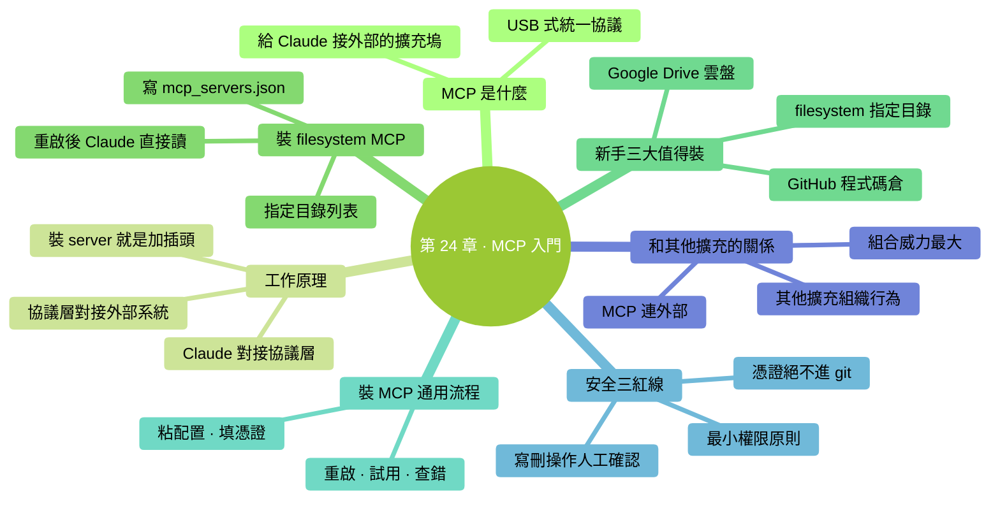

# 第 24 章：MCP 入門——給 Claude 接外部工具

> **本章在全書的位置**：第五部分 · 第 24 章 / 預估閱讀+動手時長：**主線 25-30 分鐘 + 支線 10 分鐘**
>
> **前置章節**：前面 4 章擴充（Skills / Commands / Subagents / Hooks）
>
> **學完能做什麼（主線）**：理解 MCP 是什麼、為什麼重要；會**裝一個最簡單的 MCP**（檔案系統）；知道新手最有用的 3 個 MCP 是哪些；掌握裝 MCP 的通用步驟。

---

## 開場三問

- **你會遇到什麼問題**：Claude 只能讀你電腦上的檔案——想讓它幫你整理 Google Drive 的文件、或者調出 Notion 裡的會議紀要，**做不到**。
- **不讀這章會踩什麼坑**：Claude 永遠被困在本地——**手動匯出 / 匯入**成為瓶頸。
- **讀完你會多會什麼事**：給 Claude **接上外部工具的"插座"**——它可以直接讀你的雲盤、Notion、GitHub、資料庫——辦公效率真正起飛。

### 本章地圖（一眼看全貌）

<!-- diagram: MM-31 -->


---

> 🎯 **【主線】—— 本章必讀核心**

---

## 24.1 MCP 是什麼

**MCP（Model Context Protocol，模型上下文協議）** = Anthropic 推出的**統一介面標準**——讓大模型能連線各種外部工具。

### 比喻先行

想象你的 Claude 是一個智慧實習生，坐在電腦前只能**看自己電腦裡的檔案**、**跑命令**。

MCP 像**USB 介面**—— 給電腦加一個**擴充塢**，插上不同的插頭就能連：
- 插 Google Drive 插頭 → Claude 能讀 / 寫你的雲盤
- 插 Notion 插頭 → Claude 能看你的 Notion 頁面
- 插 GitHub 插頭 → Claude 能看你所有 repo、提 PR
- 插資料庫插頭 → Claude 能直接查你的 PostgreSQL

### 一句話定義

> 🔑 **MCP = 給 Claude 接外部世界的"擴充塢"。**

### 為什麼 MCP 這麼重要

沒有 MCP：
- 想讓 Claude 看雲盤 → 手動下載到本地 → 本地 `@` 給 Claude
- 想讓 Claude 改 Notion → 從 Notion 複製 → 貼進 Claude → 改完再複製回 Notion
- **所有外部系統的資料都要人肉搬運**

有了 MCP：
- Claude **直接讀寫**外部系統
- 你只需一句"把雲盤裡的 Q1 報表總結成月報發到我 Notion 的週報頁"——它一氣呵成

**這是 AI 工具從"聊天機器人"變成"真正助手"的關鍵一步**。

## 24.2 MCP 的工作原理（概念）

不需要懂技術細節——**能讀懂這張圖就夠**：

```
┌──────────┐        ┌──────────┐        ┌──────────┐
│  Claude  │ ◄──►   │ MCP 介面 │ ◄──►   │ 外部系統  │
│   Code   │        │  (協議)  │        │ (GDrive, │
│          │        │          │        │  Notion, │
│          │        │          │        │   DB...) │
└──────────┘        └──────────┘        └──────────┘
```

- 左邊 **Claude Code**：你一直在用的
- 中間 **MCP 介面**：標準協議層
- 右邊 **外部系統**：雲盤 / Notion / 資料庫 / 任何能實現 MCP 的服務

**裝一個 "MCP server"** = 往中間"協議層"插一個插頭，讓 Claude 能和對應外部系統說話。

### 每個 MCP server 能幹的事

- **讀資料**：列檔案、讀內容、查表
- **寫資料**：新建檔案、改內容、發訊息
- **呼叫工具**：執行特定操作（提交 PR、發郵件等）

**具體能幹什麼看那個 server 實現了什麼**——和裝一個外掛一樣。

## 24.3 裝一個最簡單的 MCP：檔案系統（15 分鐘）

從最簡單的 **filesystem MCP** 開始——它讓 Claude 能訪問**你指定目錄**（比預設只能看當前專案更靈活）。

### 步驟 1：確認前置條件

你的電腦需要裝 Node.js（Ch 2 裝 Claude Code 時可能已經裝好了）。

確認：

```
!node --version
```

能看見版本號（例 `v20.x.x`）就行。

### 步驟 2：編輯 MCP 配置

MCP 配置放在 Claude Code 的設定檔案裡：

```
open ~/.claude/mcp_servers.json
```

（檔名和路徑以你這版 Claude Code 為準——打 `/help mcp` 或文件查。）

不存在就先建：

```
mkdir -p ~/.claude && echo '{}' > ~/.claude/mcp_servers.json && open ~/.claude/mcp_servers.json
```

### 步驟 3：加一段 filesystem 配置

```json
{
  "mcpServers": {
    "filesystem": {
      "command": "npx",
      "args": [
        "-y",
        "@modelcontextprotocol/server-filesystem",
        "/Users/你的使用者名稱/Desktop",
        "/Users/你的使用者名稱/Documents"
      ]
    }
  }
}
```

把 `/Users/你的使用者名稱/...` 換成你真實的路徑。這配置讓 Claude 能訪問**桌面 + 文件**兩個目錄。

### 步驟 4：重啟 Claude Code

```
/exit
```

重新啟動：

```
claude
```

### 步驟 5：試用

現在 Claude 能直接讀寫你**桌面和文件資料夾下**的檔案（包括你啟動時不在的目錄）：

```
你：列一下我桌面上所有 .md 檔案。
Claude：（用 filesystem MCP 的工具）
        找到 5 個：
        - todo.md
        - 週報.md
        - 會議紀要.md
        ...
```

**關鍵**：Claude 用的不是 `!ls` 命令，而是 MCP 協議—— 對它來說這是一個"工具"，和內建的 Read / Write 地位一樣。

### 成功標誌

Claude 能在**沒用 `@` 引用也沒 `!` 跑命令**的情況下，直接告訴你你桌面上有什麼。

## 24.4 新手最有用的三個 MCP

### 推薦 1：filesystem（你已經裝了）

**做什麼**：訪問指定目錄
**什麼時候值**：你工作檔案散落在多個目錄，不想每次都 `cd` 切換

### 推薦 2：Google Drive

**做什麼**：讀寫你的 Google Drive 檔案
**什麼時候值**：用 GDocs / GSheets 存資料，想讓 Claude 整理或更新

**裝法**：在 mcp_servers.json 加：

```json
"gdrive": {
  "command": "npx",
  "args": ["-y", "@modelcontextprotocol/server-gdrive"]
}
```

第一次跑時會彈出 OAuth 授權——登入你的 Google 賬戶，**審一下權限**（只授予"讀"還是包括"寫"）。

### 推薦 3：GitHub

**做什麼**：讀寫 GitHub repo、查 issue、提 PR
**什麼時候值**：你參與開源 / 公司程式碼在 GitHub

**裝法**：

```json
"github": {
  "command": "npx",
  "args": ["-y", "@modelcontextprotocol/server-github"],
  "env": {
    "GITHUB_PERSONAL_ACCESS_TOKEN": "ghp_xxxxxxxxxxxx"
  }
}
```

需要先去 GitHub 設定裡**建立 Personal Access Token**，貼上到 `env` 裡。**注意這裡有金鑰——配置檔案要保密**。

### 還有哪些 MCP

官方 + 社群有幾十個 MCP——常見的：

- **Notion**：讀 / 寫 Notion 頁面
- **Slack**：發訊息、讀頻道
- **PostgreSQL / SQLite / Supabase**：直接查資料庫
- **Puppeteer**：讓 Claude 控制瀏覽器
- **Linear / Jira**：工單系統
- **Brave Search / Serper**：網路搜尋

搜 `awesome-mcp-servers` 能看到完整列表。

## 24.5 裝 MCP 的通用步驟（適用所有）

不管裝哪個 MCP，**流程都一樣**：

```
1. 找到你要裝的 MCP 的"安裝說明"（官方文件 / README）
2. 把配置段粘到 ~/.claude/mcp_servers.json 的 "mcpServers" 裡
3. 如果需要認證（token / OAuth）→ 按說明拿到憑證，填進 env
4. 重啟 Claude Code
5. 試用
6. 問題排查 → 看 Claude Code 的啟動日誌，一般會顯示 MCP 載入錯誤
```

**一個你裝會的 MCP，意味著你以後能裝任何 MCP**——流程遷移。

## 24.6 MCP 的安全紅線

MCP 讓 Claude 接外部系統——**權限越大、風險越大**。三條紅線必須守：

### 紅線 1：不要給 MCP 過大權限

裝 GDrive MCP 時——問自己"要給 Claude 只讀還是讀寫"？

- **只讀**（list, read）：安全
- **讀寫**（還能 modify, delete）：一個錯誤的 prompt 就可能刪掉你重要檔案

**最小權限原則**：預設只讀。**只有實際需要寫**時才加寫權限。

### 紅線 2：MCP 配置裡的憑證算高敏感

`mcp_servers.json` 裡的 token、API key 是**全權憑證**——洩露等於賬號被接管。

- **不要進 git**（`.gitignore` 里加 `mcp_servers.json`）
- **不要截圖 / 分享配置檔案**
- 疑似洩露 → **立即 revoke** 並重新生成

### 紅線 3：MCP 呼叫也會過 Claude 的權限系統

Claude 透過 MCP 呼叫"刪除檔案"時，**仍會走權限彈窗**（Ch 7）——你會被問是否同意。

**但**：如果你用 `/permissions` 把 MCP 工具加進白名單，或用了 acceptEdits 模式——**彈窗會被跳過**。

**建議**：
- MCP 工具預設走權限彈窗
- 只對**明確安全**的只讀工具加白名單
- **寫 / 刪操作永遠人工確認**

## 24.7 和其他擴充的關係

MCP 是**給 Claude 接外部系統**，其他擴充是**組織 Claude 自己的行為**：

| 擴充 | 作用 |
|-----|------|
| CLAUDE.md | 讓 Claude **懂專案** |
| Skill | 讓 Claude **會某類任務** |
| Command | 讓**你**有快捷鍵 |
| Subagent | 讓 Claude **派獨立專員** |
| Hook | 讓**事件自動觸發動作** |
| **MCP** | 讓 Claude **連外部系統** |

五者可以**任意組合**。典型高階玩法：

```
/my-weekly      （Custom Command 觸發）
  → 主 Claude 讀 CLAUDE.md（專案背景）
  → 用 GDrive MCP 拉本週文件
  → 派 summarizer subagent 總結各文件
  → 呼叫 weekly-report Skill 生成周報
  → 用 Notion MCP 發到你的週報頁面
  → PostToolUse Hook 自動 log 到本地審計檔案
```

**看起來複雜**——但每一步是一個小元件。**堆疊的能力就是這樣來的**。

---

## 本章小結

- MCP = 給 Claude 接外部工具的"擴充塢"——USB 式的統一協議
- 配置在 `~/.claude/mcp_servers.json`；每個 server 一段配置
- 新手 3 個最值得裝：**filesystem / Google Drive / GitHub**
- **安裝通用步驟**：配置 → 填憑證 → 重啟 → 試用
- **三條紅線**：最小權限 / 憑證保密 / 寫 & 刪走人工確認
- 和其他擴充**組合威力最大**：MCP 連繫統、Skill 做任務、Command 快捷觸發、Subagent 派專員、Hook 自動審計

---

## 動手任務

### 任務 1：裝 filesystem MCP（20 分鐘）

**步驟**：照 24.3 完整走一遍。試讓 Claude 列桌面檔案、讀某個檔案。

**成功標誌**：Claude 能**無需 `@`** 就訪問你桌面 / 文件——確認 MCP 真的生效。

### 任務 2：裝你工作裡最需要的 MCP（30 分鐘）

**步驟**：

1. 想清楚"我最常從哪個外部系統搬資料"（GDrive？Notion？GitHub？）
2. 搜對應的 MCP 官方安裝指南
3. 按 24.5 的通用流程裝
4. **先只授讀權限**（保守）
5. 試一次真實任務

**成功標誌**：你真實省了一次"手動搬運"——把 Claude 和外部系統打通。

### 任務 3：做一個安全檢查（10 分鐘）

開啟你的 `mcp_servers.json`：

- [ ] 是否進了 git？（不能！加到 .gitignore）
- [ ] 每個 token 是不是**最小權限**？
- [ ] 你知不知道每個 MCP 能幹什麼？（不知道的就卸掉）

**成功標誌**：你 100% 掌握自己裝了哪些 MCP、各自權限、憑證在哪。

---

## 如果你卡住了

**症狀 A：配置後 Claude 找不到 MCP**
- 原因：(a) json 格式錯；(b) 沒重啟；(c) MCP server 本身裝失敗。
- 解決：(a) 用 JSONLint 校驗；(b) 完全退出 Claude Code 再重啟；(c) 手動跑一下 `npx -y @modelcontextprotocol/server-xxx` 看是否能啟動。

**症狀 B：OAuth 授權迴圈 / 失敗**
- 原因：瀏覽器攔截、端口占用、賬號權限不夠。
- 解決：看 Claude Code 啟動輸出裡的錯誤連結、按提示 pass；或換到官方 Wiki / Troubleshooting 頁面對照。

**症狀 C：MCP 工作但 Claude 說"沒有權限"**
- 原因：(a) token 權限範圍不夠；(b) 你裝的 MCP 沒給 Claude Code 開對應工具。
- 解決：去對應服務重新生成 token 給更大範圍；或看 MCP server 的文件確認它預設開放哪些工具。

---

主線結束。下面支線講"自己寫 MCP server"的概念和"MCP 的未來"。

---

> 🌿 **【支線】—— 可選深入（學有餘力再看）**

---

## 🌿 支線 24.A：自己寫一個 MCP server 的概念

> **這段講什麼**：市面沒現成的 MCP，你可以自己寫。
> **什麼時候回頭讀**：你有獨特的內部系統要接 Claude 時。

### 不用嚇到

MCP server **本質就是一個小程式**——實現一套標準介面（協議裡定義的）。各種語言都能寫：

- **TypeScript / Node.js**（官方最推薦，SDK 最全）
- **Python**（Anthropic 出了 Python SDK）
- 其他語言也行（協議開放）

### 寫一個最簡 MCP 需要做什麼

1. 安裝 SDK（npm 或 pip）
2. 定義你的 **tools（工具）**：比如 `list_my_products`、`search_orders`、`create_ticket`
3. 實現每個 tool 的具體邏輯（訪問你的資料庫 / API）
4. 把程式跑起來，Claude Code 透過配置連上

**5-10 行骨架就能跑起來**——官方文件有最簡 hello-world 示例。

### 典型場景

- **公司內網系統**（沒有公開 MCP，得自己寫）：讓 Claude 連你們的工單系統、CRM、OA
- **個人工具鏈**：你的本地資料庫、某個沒 MCP 的 SaaS

### 學習資源

- 官方 MCP SDK 文件
- GitHub 上的 reference 實現（`modelcontextprotocol/servers`）
- 各種社群示例

**零基礎讀者這部分先不深入**——等你真的需要時再學，有 SDK 和示例在，不會太難。

---

## 🌿 支線 24.B：MCP 生態的現狀和未來

> **這段講什麼**：為什麼 MCP 是 AI 工具大變革的一步。
> **什麼時候回頭讀**：好奇"我學的這東西有沒有前途"時。

### 為什麼 MCP 是"突破"

在 MCP 之前，**每個 AI 產品接外部工具都自己發明一套介面**——Anthropic 一套、OpenAI 一套、Google 一套，互相不通。

**MCP 是第一個開放標準**——理論上，**任何 AI 產品 + 任何外部工具**都能在 MCP 下互通。

這像 HTTP 誕生前的網際網路和誕生後——**從"封閉孤島"到"互聯互通"**。

### 現在誰在用 MCP

- **Claude Code**（Anthropic 自己的工具，MCP 一等公民）
- **Cursor / Windsurf / Cline** 等 AI 程式設計工具都在接入
- **很多企業內部工具**開始開發 MCP 適配

### 未來趨勢（預測）

- **公司提供 MCP server 成為標配**——就像現在的"REST API"
- **MCP 的"App Store"出現**——裝 MCP 像裝手機 App
- **Claude 之外的大模型**（OpenAI、Gemini 等）也逐漸原生支援 MCP

### 學 MCP 的價值

- **現在**：讓 Claude Code 用得更順
- **中期**：學會了就能接任何新出的 MCP
- **遠期**：在"AI + 外部工具"這個未來趨勢上**搶佔了兩步**

所以本章不只是"多一個技巧"——是**把你接入未來 AI 生產力的主幹道**。

---

**第五部分（擴充能力）到此完成**。

你現在掌握的五種擴充：
- **Skills**（Ch 20）——按需載入的任務手冊
- **Custom Commands**（Ch 21）——你自己的 prompt 快捷鍵
- **Subagents**（Ch 22）——獨立上下文的專業實習生
- **Hooks**（Ch 23）——事件觸發的自動化
- **MCP**（Ch 24）——接外部工具的擴充塢

**下一部分（第六部分：融入日常）**開始：團隊協作、進階速覽、下一步——把 Claude Code **真正融進你的工作流**，而不是偶爾用一下的玩具。


---

<!-- chapter-nav -->

📖  [← 第 23 章 · Hooks 入門](23-Hooks入門.md)  ·  [📑 返回目錄](../../README.md)  ·  [第 25 章 · 團隊協作基礎 →](../part6-融入日常/25-團隊協作基礎.md)
