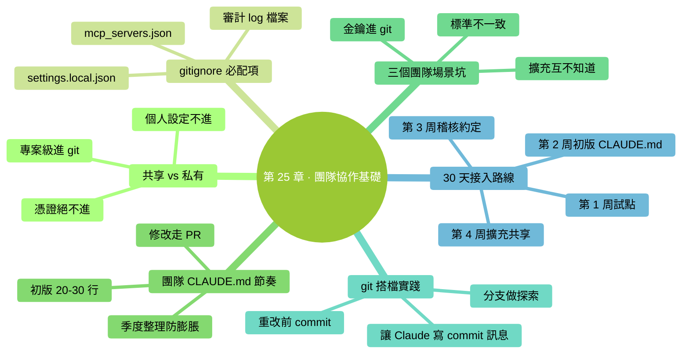

# 第 25 章：團隊協作基礎——和同事一起用 Claude Code

> **本章在全書的位置**：第六部分 · 第 25 章 / 預估閱讀+動手時長：**主線 15-20 分鐘 + 支線 8 分鐘**
>
> **前置章節**：Ch 14（CLAUDE.md）+ Ch 20-24（五種擴充）
>
> **學完能做什麼（主線）**：知道**團隊一起用** Claude Code 時哪些共享、哪些不共享；學會用 git 管理 Claude 的配置；避開團隊場景最容易踩的三個坑。

---

## 開場三問

- **你會遇到什麼問題**：同事也想用 Claude Code——每個人重新摸索一遍？CLAUDE.md 誰改了就亂套？
- **不讀這章會踩什麼坑**：配置不共享（每個人單獨摸索）、金鑰意外進 git、團隊標準不一致。
- **讀完你會多會什麼事**：知道哪些該共享（進 git）哪些不該、知道團隊約定怎麼定、避開金鑰洩露。

### 本章地圖（一眼看全貌）

<!-- diagram: MM-32 -->


---

> 🎯 **【主線】—— 本章必讀核心**

---

## 25.1 共享什麼、不共享什麼——一張表

團隊場景下，**哪些跟專案走（共享）、哪些個人私有**？記住這張表：

| 檔案 / 目錄 | 共享（進 git） | 個人（不進 git） |
|------------|-------------|---------------|
| 專案 `CLAUDE.md` | ✅ 進 | |
| `.claude/commands/`（專案級命令） | ✅ 進 | |
| `.claude/skills/`（專案級 Skills） | ✅ 進 | |
| `.claude/agents/`（專案級 Subagents） | ✅ 進 | |
| `.claude/settings.json`（專案共用 hooks） | ✅ 進 | |
| **`.claude/settings.local.json`（個人覆蓋）** | | ✅ 不進 |
| **`~/.claude/CLAUDE.md`（全域性個人偏好）** | | ✅ 不進 |
| **`~/.claude/commands/`（個人命令）** | | ✅ 不進 |
| **MCP 配置（含憑證）** | | ✅ 不進 |
| **任何包含 token / API key 的檔案** | | ✅ 絕不進 |

### 典型 `.gitignore` 示例

在專案根目錄的 `.gitignore` 里加：

```gitignore
# Claude Code 個人設定 / 金鑰
.claude/settings.local.json
.claude/mcp_servers.json       # 通常含憑證，別誤傳
.claude/*.log                  # 本地審計 log 不進 git
```

### 為什麼這樣分

- **共享**的是**團隊共同的"工作方式"**——每個成員拿來就能一致工作
- **個人**的是**你自己的偏好或敏感憑證**——別人不需要、也不該看到

## 25.2 團隊 CLAUDE.md 的維護節奏

### 初版怎麼起

**第一個人建**：按 Ch 14 的模板，先寫一個**最小版本**（20-30 行）。提 PR。

### 修改走 PR

之後任何人想改 CLAUDE.md——**走正常 PR 流程**：

- 不直接 push
- 改動**附帶為什麼**（"因為 2 月 15 日生產事故，以後禁止直接改 migration 檔案"）
- 至少 1 人 review 同意

### 定期整理

**每季度**或**版本節點**：

- 掃一遍——有沒有過時條目？
- 有沒有重複 / 衝突？
- 能不能合併 / 砍短？

### 防止膨脹的硬線

團隊 CLAUDE.md 比個人專案**更容易膨脹**——每個人都想加自己關心的規則。

**對抗方法**：
- 硬性上限（團隊商量定，比如 < 150 行）
- 達到上限後**新加一條必須刪一條**
- 爭議大的放到專門文件（`docs/testing.md` 等），CLAUDE.md 只放 pointer

## 25.3 三個團隊場景容易踩的坑

### 坑 1：金鑰進了 git

**典型場景**：某人裝了 GitHub MCP，配置檔案裡有 token，手滑 `git add .` 加上，push 了。

**後果**：
- GitHub 會自動掃描，**發現 token 會通知你**（但已經晚了）
- 壞人可能用這 token 幹壞事——刪 repo、改程式碼、發 issue

**預防**：
- **`.gitignore` 第一時間配好**（見 25.1）
- 配憑證前先**檢查檔案是不是被 git 追蹤**：`!git status` 看
- 發現洩露——**立刻 revoke + 從 git 歷史清除**（用 `git filter-repo` 等工具；簡單情況可以新建倉庫 re-import 乾淨版本）

### 坑 2：每個人標準不一致

**典型場景**：馬力覺得"vibe review 就夠"，小紅每次都細審——同一段 PR，兩人給的反饋完全不同步。

**後果**：
- 評審結論不統一
- 團隊質量波動

**預防**（參見 Ch 10 支線 B）：
- **團隊稽核約定**——哪些型別的改動必須 L3 / L4（寫進專案 CLAUDE.md）
- **定期 calibration 會議**——大家一起評一個真實 PR，對比標準差異
- **新成員入職**——把團隊 CLAUDE.md + 稽核約定作為必讀

### 坑 3：成員各自裝的擴充互不知道

**典型場景**：小明配了一個 Skill 幫他寫測試，小紅不知道——自己重頭摸一遍。

**後果**：
- 重複勞動
- Skill 質量參差不齊（每個人自己維護）

**預防**：
- **團隊 skills 進專案級 `.claude/skills/`**——進 git 共享
- 專門一個 channel / 文件**登記**誰加了什麼 Skill / Command
- 新加的擴充要 PR review——讓其他人知道

## 25.4 和 git 工作流的配合

Claude Code 和 git 是**天然搭檔**——一些最佳實踐：

### 實踐 1：重要改動前先 commit

讓 Claude 做大改動前：

```
你：先幫我跑 !git commit -am "work in progress" 儲存當前狀態
Claude：（跑 commit）
你：好，現在開始重構 @xxx
```

**好處**：重構出錯想回退——`git reset` 到剛才的 commit。**比 `/rewind` 更硬核可靠**。

### 實踐 2：分支 + Claude 探索

不確定方向時：

```
你：先切到一個新分支 claude-exploration，在這裡試改；不行再換方法
```

試完：
- 方案好 → merge 回主分支
- 不好 → 直接刪分支，什麼都沒留下

**比在主分支直接改更安全**。

### 實踐 3：讓 Claude 看 git 狀態

Claude 經常不知道你的改動上下文。**先讓它看狀態**：

```
你：!git status
    !git log -n 5 --oneline
    現在基於這些資訊，幫我 ...
```

### 實踐 4：commit message 由 Claude 生成

改完後：

```
你：看 !git diff，為這次改動寫一個 commit message
    （按我們專案的 conventional commit 風格）
Claude：（生成 `feat: ...` 風格訊息）
```

**省你敲字 + 更規範**。

### 實踐 5：標記 AI 參與的 commit

有些團隊約定——AI 生成或深度修改的 commit 加**特殊標記**：

```
feat: add user batch import [AI-assisted]
```

或在訊息里加：

```
Co-authored-by: Claude <claude@anthropic.com>
```

好處：**review 時旁人知道要多留意**。

## 25.5 團隊第一次用的"30 天接入路線"

給剛要引入 Claude Code 的團隊一個推薦節奏：

### 第 1 周：小範圍試點

- 選 1-2 個 "**AI 好感度高 + 專案不太敏感**" 的成員
- 他們各自按本書 Part 1-2 上手
- **不動專案 CLAUDE.md**，先各自體驗

### 第 2 周：建專案 CLAUDE.md v0.1

- 試點成員討論出初版 CLAUDE.md（20-30 行）
- 提 PR，全員 review
- **不建議一次性把團隊所有規矩都塞進去**——先最硬的幾條

### 第 3 周：建團隊稽核約定

- 討論哪些目錄 / 檔案 必須 L3 / L4 稽核
- 哪些絕不能讓 AI 動
- 寫進 CLAUDE.md 或單獨文件

### 第 4 周：擴充 + 共享

- 試點成員把已經好用的 Custom Commands / Skills 放到 `.claude/commands/` `.claude/skills/`（專案級）
- 全員 pull 下來就能用
- 收集反饋、微調

### 30 天后的常態

- 所有成員都用上
- CLAUDE.md 每月維護一次
- 新 Skill / Command 走 PR
- 月度回顧："哪些用得好、哪些沒人用、CLAUDE.md 要不要砍"

---

## 本章小結

- **共享 vs 私有**：專案級目錄下的所有東西共享、個人設定 + 憑證不共享
- **`.gitignore`** 第一件事配好——`.claude/settings.local.json` / `.claude/mcp_servers.json`
- **CLAUDE.md 走 PR**，每季度整理，硬性上限防膨脹
- **三個典型坑**：金鑰進 git / 標準不一致 / 擴充不共享——各有預防方法
- **git 和 Claude 搭檔**：重改前 commit / 分支試 / 先看狀態 / 讓 Claude 寫 commit message / 標記 AI 參與
- **30 天接入路線**：第 1 周試點、第 2 周初版 CLAUDE.md、第 3 周稽核約定、第 4 周擴充共享

---

## 動手任務

### 任務 1：給你的專案配 `.gitignore`（5 分鐘）

**步驟**：

1. 開啟（或新建）專案根目錄的 `.gitignore`
2. 加入 25.1 的推薦行
3. `git status` 檢查是否還有敏感檔案被追蹤；有的話用 `git rm --cached <檔案>` 移除（檔案保留本地）

**成功標誌**：`git status` 裡看不到任何含憑證或個人配置的檔案。

### 任務 2：掃一下你現在的 git 歷史（10 分鐘）

**步驟**：

1. 在專案根跑：`!git log --all --full-history -- .claude/ 2>/dev/null | head -50`
2. 看有沒有歷史 commit 涉及敏感配置
3. 如果有 → **警覺**：去對應服務 revoke 所有 token，重建

**成功標誌**：確認你的 git 歷史裡沒有未處理的敏感洩露。

### 任務 3：寫一份團隊 30 天接入計劃（15 分鐘，如你要給團隊引入）

**步驟**：照 25.5 的路線圖，**具體到人、具體到日期**寫出你團隊的計劃：

```markdown
# 團隊 Claude Code 接入計劃

## 第 1 周（4/22-4/28）試點
- 試點成員：馬力、李四
- 他們各自讀本書 Part 1-2

## 第 2 周（4/29-5/5）CLAUDE.md v0.1
- 5/2 前出初版 PR（馬力負責起草）
- 全員 5/4 前 review + 合併

...
```

**成功標誌**：你有了一份**能給老闆看的**接入路線，不是空喊"我們要用 AI"。

---

## 如果你卡住了

**症狀 A：同事不願意用，覺得 AI 靠不住**
- 原因：合理——AI 有出錯案例、別人可能聽說過。
- 解決：**低風險任務起步**——讓他們先用在"寫週報草稿"這種最安全的任務，建立信任後再擴大。**不要強推**。

**症狀 B：團隊 CLAUDE.md 改動總是引起爭吵**
- 原因：規則背後的價值觀分歧。
- 解決：爭議大的條目**先不進**——放到專門文件（`docs/style.md`）討論，達成共識再移回 CLAUDE.md。

**症狀 C：金鑰已經 push 了怎麼辦**
- 原因：手滑或 `.gitignore` 晚了。
- 解決：**兩步走**——① 立刻 revoke 洩露的 token / key；② 從 git 歷史清除（用 `git filter-repo` 或 BFG Repo-Cleaner；力量不夠就**新建一個乾淨倉庫**重新 push）。**歷史不清乾淨，洩露的憑證永遠在**。

---

主線結束。下面支線講"Claude Code 和 CI/CD 的配合"。

---

> 🌿 **【支線】—— 可選深入（學有餘力再看）**

---

## 🌿 支線 25.A：Claude Code 和 CI/CD 的邊界

> **這段講什麼**：有人問"能不能把 Claude 接到 GitHub Action 裡自動審 PR"——能，但有邊界。
> **什麼時候回頭讀**：你的團隊想把 AI 深度整合進自動化流水線時。

### 能做什麼

- **PR 自動稽核**：每次開 PR 觸發一次 Claude 審查，結果評論到 PR
- **自動生成 CHANGELOG**：每次打 tag 讓 Claude 生成發版說明
- **自動回覆 issue**：常見問題 Claude 先答，人工 review

**具體怎麼做**：用 Anthropic API + GitHub Action，或用 Claude Code 的非互動模式（`claude -p "..."`）。

### 不該做什麼

- **Claude 自動 merge PR**：永遠要人審——merge 是不可逆的
- **Claude 直接部署**：部署事故成本高，**人工批准 > 自動**
- **Claude 改生產配置**：永遠不要給自動化流程改生產權限

### 一個踏實的入口

從**低風險 + 易觀察**的開始：

- Claude 自動給 PR 打 summary 評論（只說看到了什麼，不給評判）
- 觀察幾周，調整 prompt
- 質量穩定後再加審查評判
- **永遠不自動化不可逆的事**

### 和本書定位的關係

本書是**零基礎入門**——CI/CD 整合是**進階話題**。先把互動式的 Claude Code 用熟、團隊協作建好，再考慮 CI。

---

**下一章**：第 26 章"進階能力速覽"——指路牌性質。告訴你"還有這些更深的東西存在"，但不教——你讀完本書已經達到 80% 場景需求，剩下 20% 給你**指路**。


---

<!-- chapter-nav -->

📖  [← 第 24 章 · MCP 入門](../part5-擴充能力/24-MCP入門.md)  ·  [📑 返回目錄](../../README.md)  ·  [第 26 章 · 進階能力速覽 →](26-進階能力速覽.md)
