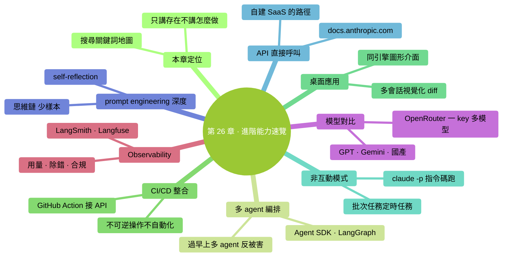

# 第 26 章：進階能力速覽——指路牌

> **本章在全書的位置**：第六部分 · 第 26 章 / 預估閱讀+動手時長：**主線 15-20 分鐘 + 支線 5 分鐘**
>
> **前置章節**：本書所有前面章節的概貌
>
> **學完能做什麼（主線）**：知道**除了本書教的之外**還有哪些進階能力存在——夠你在需要時有**搜尋關鍵詞**和**大致路徑**，不會"聽說過但不知道叫什麼"。

---

## 開場三問

- **你會遇到什麼問題**：讀完全書你已能覆蓋 80% 日常——但剩下 20% 高階場景沒碰過，連叫什麼都不知道。
- **不讀這章會踩什麼坑**：某天需要做某種進階的事——"感覺 Claude 可以做但不知道從哪查"，白走彎路。
- **讀完你會多會什麼事**：**有一張進階能力地圖**——遇到新需求能定位到對應的進階區域，搜對關鍵詞、找對文件。

### 本章地圖（一眼看全貌）

<!-- diagram: MM-33 -->


---

> 🎯 **【主線】—— 本章必讀核心**

---

## 26.1 本章不教你"怎麼做"——只告訴你"有這些"

每一小節只講 3 件事：

1. **是什麼**（1-2 句）
2. **什麼場景會想到它**
3. **想學去哪裡**

別指望本章看完你就會——這是**目錄 / 索引 / 搜尋關鍵詞庫**。

## 26.2 進階方向 1：多 Agent 編排

### 是什麼

讓多個 AI agent **協作完成複雜任務**——比 Subagent（Ch 22）更復雜的協作模式。

### 什麼場景

- 長鏈任務：需求分析 → 架構設計 → 程式碼生成 → 測試編寫 → 文件生成——每步一個專門 agent
- 對抗式 review：兩個 agent 互相挑對方的毛病
- 模擬會議：不同"人設"的 agent 討論一個方案

### 關鍵詞 / 資源

- **Claude Agent SDK**（Anthropic 官方）
- **LangGraph**（多 agent 工作流框架）
- **CrewAI**、**AutoGen**、**MetaGPT**（各種多 agent 框架）

### 本書立場

> **只有當 subagent 不夠用時才考慮多 agent 編排**。很多團隊過早上多 agent，結果是**一堆 agent 互相干擾**反而比單個 Claude 做得差。

## 26.3 進階方向 2：CI/CD 整合

### 是什麼

把 Claude 接到 GitHub Actions / GitLab CI / Jenkins 等自動化流水線——讓每次 PR / 每次部署自動觸發 Claude 做事。

### 什麼場景

- 每次 PR 自動審查、生成摘要
- 自動生成 CHANGELOG、release notes
- 自動回覆常見 issue
- 自動補充測試用例

### 關鍵詞 / 資源

- **Anthropic API**（不是 Claude Code，是底層 API）
- **Claude Code non-interactive mode** (`claude -p "..."`)
- GitHub Action 模板：搜 "claude-code-action"

### 本書立場

見 Ch 25.A——可以做，但**永遠不要讓 AI 執行不可逆的自動化**。

## 26.4 進階方向 3：Claude Code 桌面應用（2026-04 大改版）

### 是什麼

和本書教的"終端版" Claude Code **同一引擎**，但**圖形介面**——多會話側欄、拖拽面板、視覺化 diff、內嵌終端、git worktree 隔離。

### 什麼場景

- 你本質上想要 Claude Code，但**受不了終端**
- 需要**同時管理多個 Claude 會話**（比如在三個分支上並行探索）
- 需要**視覺化的 diff 稽核**（大型改動時）

### 關鍵詞 / 資源

- 下載：[claude.com/download](https://claude.com/download)
- 本書**附錄 H** 有簡明導覽

### 本書立場

你讀完本書學到的所有概念（權限、上下文、CLAUDE.md、三層記憶、五種擴充）**在桌面應用裡一樣適用**——只是介面不同。**無縫切換**。

## 26.5 進階方向 4：非互動模式 / 指令碼化

### 是什麼

Claude Code 可以**不開對話、直接跑一個任務**：

```
claude -p "用 meeting-notes Skill 整理 @~/meetings/2026-04-19.txt"
```

跑完就退出，輸出結果——**適合嵌到指令碼、自動化、批次處理**。

### 什麼場景

- 批次處理：迴圈跑 100 個檔案
- 定時任務：每天早上 7 點自動整理昨日日報
- shell 腳本里的一環

### 關鍵詞 / 資源

- `claude --help` 看所有命令列引數
- `claude -p`（print mode）
- 寫 bash 指令碼把多個 Claude 呼叫串起來

### 本書立場

**99% 零基礎讀者用不到**——但知道這種模式存在，以後想自動化時不至於懵。

## 26.6 進階方向 5：Anthropic API 直接呼叫

### 是什麼

Claude Code 是 Anthropic 基於自家 API 做的一個**工具**。你也可以**直接用 API** 寫自己的程式——把 Claude 整合進任何你自己的軟體。

### 什麼場景

- 想做一個**自己的**AI 應用（SaaS 產品、內部工具）
- 想讓**非終端使用者**也能用 Claude 能力
- 想**深度定製**互動方式

### 關鍵詞 / 資源

- [docs.anthropic.com](https://docs.anthropic.com)
- SDK：Python、TypeScript、Go、Java
- Tool use / Agent SDK

### 本書立場

這就是**程式設計師的工作**——非程式設計師用不到。但如果你未來學了程式設計，這是一條連續路徑：**Claude Code 上手 → 理解 AI → 自己調 API 做東西**。

## 26.7 進階方向 6：prompt engineering 深度

### 是什麼

**怎麼寫 prompt** 本身是一門學問。本書講了基本技巧（WHAT-WHERE-HOW-VERIFY、角色設定、明確約束等），但還有更深的：

- **Chain-of-Thought（思維鏈）**：讓模型 step-by-step 展開思考
- **Few-shot learning**（少樣本）：給幾個例子讓它模仿
- **Self-reflection**：讓它**自己審自己的答案**
- **Constitutional AI** 原則：建立"憲法式"行為約束

### 什麼場景

- Claude 在某類任務上**反覆表現不夠好**——調 prompt 可能比換模型更有效
- 做**高要求**的內容（專業寫作、精確推理）
- 做**教育 / 培訓**產品

### 關鍵詞 / 資源

- Anthropic 官方 [prompt engineering 文件](https://docs.anthropic.com/en/docs/build-with-claude/prompt-engineering/overview)
- 社群：[learnprompting.org](https://learnprompting.org/)
- 書：《The Prompt Report》等

### 本書立場

**本書 + 官方 prompt engineering 文件 ≈ 覆蓋 95% 需要**。剩下 5% 是研究性工作。

## 26.8 進階方向 7：模型對比 + 模型切換

### 是什麼

Claude 不是唯一的。其他大模型：**GPT（OpenAI）、Gemini（Google）、Grok（xAI）、Qwen / DeepSeek / Kimi（國產）**。

各有擅長——**不同任務用不同模型**可能效果更好。

### 什麼場景

- Claude 在某領域稍弱，聽說 GPT 更好——想對比
- 國內網路不穩定 → 用國產模型做備份
- 成本敏感 → 不同模型價效比不一樣

### 關鍵詞 / 資源

- **LMSYS Chatbot Arena**：模型對比排行榜
- **OpenRouter**：一個 key 調多家模型
- **Cursor / Cline 等 AI 程式設計工具**：多模型支援

### 本書立場

**本書不多評價其他模型**——但知道"有得選"，就知道**Claude 不是唯一答案**。真正的專業使用者經常**同時用多個模型**。

## 26.9 進階方向 8：Observability / 日誌追蹤

### 是什麼

把 Claude 的**每一次呼叫**都記下來——看花了多少 token、響應多久、有沒有出錯。

### 什麼場景

- 團隊用量審計
- 除錯：某次 Claude 回答奇怪，**回溯當時的完整 prompt + 回覆**
- 合規：證明"這件事是人工 review 後做的"

### 關鍵詞 / 資源

- Claude Code 的 log 目錄（`~/.claude/logs/`）
- 社群工具：**LangSmith、Langfuse、Phoenix**——AI observability 平臺
- 自建：Hook + 資料庫

### 本書立場

**個人使用者基本不需要**。企業場景合規可能要。

## 26.10 你的進階路線圖

根據你**最關心什麼**，推薦下一步：

| 你最想 | 先看哪個 |
|-------|--------|
| **把 Claude 用得更順** | 重讀 Ch 14（CLAUDE.md）+ Ch 20-24（五擴充）|
| **在團隊裡推廣** | Ch 25 + 附錄 E FAQ |
| **做自動化 / CI** | 本章 26.3（CI/CD）+ 26.5（指令碼化） |
| **做產品 / 自建應用** | 本章 26.6（API）+ 官方文件 |
| **學得更深、做研究** | 本章 26.7（prompt）+ 26.8（多模型） |
| **就是想繼續進階用** | 下一章 Ch 27 下一步——**推薦資源 + 挑戰清單**|

---

## 本章小結

- 本章是**指路牌**，不是教學
- 8 個進階方向：**多 agent 編排 / CI/CD / 桌面應用 / 非互動模式 / API 直調 / prompt engineering / 模型對比 / Observability**
- 每個方向給了**關鍵詞 + 資源 + 本書立場**
- 按**你最關心什麼**挑一個方向深入

---

## 動手任務

### 任務 1：選你的下一個"進階方向"（10 分鐘）

**步驟**：看 26.10 的表，問自己：

- 當下我最想解決的問題是什麼？
- 對應哪個方向？
- 我決定接下來花多久探索它？（1 周 / 1 月 / 3 月）

**成功標誌**：你有了一個**具體的下一步**，不是"讀完沒事做"。

### 任務 2：收藏關鍵資源（5 分鐘）

建一個書籤資料夾 "Claude Code 進階"，放入：

- [docs.anthropic.com](https://docs.anthropic.com)
- [claude.com/download](https://claude.com/download)（桌面應用）
- 你對應進階方向的主要資源（見本章每節）

**成功標誌**：需要時**不用重新搜**——直接點開。

---

## 如果你卡住了

**症狀 A：所有方向都想學**
- 原因：正常——全是新世界。
- 解決：**一次只學一個**。選最能解決**你當前問題**的那個。其他先放一邊。

**症狀 B：選不出哪個最重要**
- 原因：本書讀完後還沒真用起來。
- 解決：**先不選進階**——回去把本書教的真正用 1-2 個月，遇到瓶頸再來看進階。

**症狀 C：覺得所有進階都太技術、自己學不會**
- 原因：零基礎焦慮再次發作。
- 解決：**不是所有進階都需要程式設計**——CLAUDE.md 維護、團隊協作、擴充使用都不要求寫程式碼。**先深化你已經會的**，別勉強自己學"看起來牛"但用不到的東西。

---

主線結束。下面支線講"AI 工具格局未來 1-2 年"——讓你對趨勢有個感覺。

---

> 🌿 **【支線】—— 可選深入（學有餘力再看）**

---

## 🌿 支線 26.A：AI 工具未來 1-2 年的幾個趨勢

> **這段講什麼**：不是預測未來——是告訴你**有哪些變化正在發生**，好讓你不被突襲。
> **什麼時候回頭讀**：你想"這東西會不會很快過時"時。

### 趨勢 1：Agent 化——從"chat bot"到"能幹活的助手"

AI 從"你問一句它答一句"變成"**你說大方向它自己一步步做完**"。Claude Code 本身就是這個趨勢的代表。

**對你的影響**：
- **不要只學 prompt 技巧**——要學"**怎麼和 agent 協作**"
- 信任校準、權限管理、驗證這些能力**越來越重要**

### 趨勢 2：多模態——文本 → 圖片 → 聲音 → 影片

模型能看圖（已經能）、能看影片、能聽聲音、能生成聲音。

**對你的影響**：
- **截圖給 AI** 已經成常態——本書 Ch 19 講了
- 未來：直接對著螢幕說話讓 AI 操作
- 新場景：讓 AI 看一段影片總結、聽一段錄音整理

### 趨勢 3：本地模型 + 雲端模型混合

**本地開源模型**（Llama、Qwen、DeepSeek）越來越強。但云端模型（Claude / GPT-5 等）仍然最聰明。

**未來格局**：
- 日常簡單事 → 本地跑（隱私、免費、離線）
- 複雜深度事 → 雲端跑（最強能力）
- 自動判斷用哪個 = 下一代工具的亮點

### 趨勢 4：MCP 生態爆發

第 24 章講的 MCP——這是**跨 AI 工具的統一協議**。一旦生態起來：

- **你裝一次 MCP，在 Claude / Cursor / 任何支援 MCP 的工具裡都能用**
- **公司提供 MCP server 成標配**——就像以前提供 API
- 本書教你的 MCP 知識**跨工具遷移**

### 趨勢 5：AI 變基礎設施

像電和網際網路——早期是**稀奇玩意**，最後成了**水電煤**。

- 現在：用 AI 是"本事"
- 兩年後：**不用 AI 才是奇怪的**

**對你的影響**：
- **現在學 AI 工具 = 搶先**
- 但**別把 AI 工具本身當目的** —— 目的始終是**你要完成的工作**
- **學怎麼用好**比**追最新工具**重要

### 趨勢 6：**價格下降 + 能力提升**

AI 模型價格每年**跌一個數量級**，但能力每年**漲 1-2 倍**。

這意味著：
- 今年你覺得貴的任務，明年可能隨便跑
- 今年你覺得 AI 做不好的任務，明年可能它專門擅長

**對你的影響**：
- **不要因為"現在某任務貴 / 某任務做不好"就放棄**——明年再試
- **持續關注最新能力** ≈ 每 3-6 個月看一次 changelog

### 穩住心態的建議

- **不要為了追新而追新**——先把**現在已有的工具用熟**
- **基本功重於花樣**——本書教的 prompt、權限、上下文、記憶，未來依然有效
- **選 1-2 個核心工具**深入，不要每個都淺嘗

---

**下一章**：第 27 章"下一步路線"——本書最後一章。給你一份**持續成長的實操路線**：推薦資源 + 學習節奏 + 30 天挑戰清單，讓你讀完書不是結束而是起點。


---

<!-- chapter-nav -->

📖  [← 第 25 章 · 團隊協作基礎](25-團隊協作基礎.md)  ·  [📑 返回目錄](../../README.md)  ·  [第 27 章 · 下一步路線 →](27-下一步路線.md)
