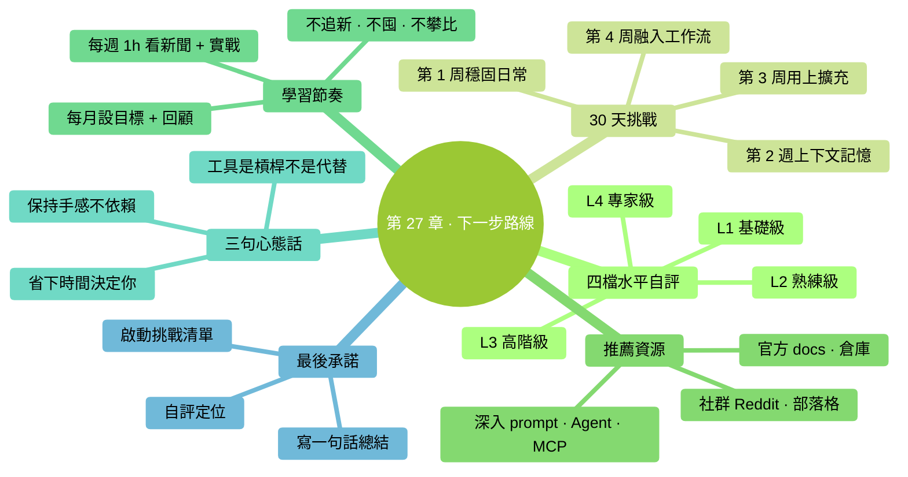

# 第 27 章：下一步路線——讀完書只是起點

> **本章在全書的位置**：第六部分 · 第 27 章 / 預估閱讀+動手時長：**主線 15-20 分鐘 + 支線 5 分鐘**
>
> **前置章節**：讀完整本書
>
> **學完能做什麼（主線）**：拿到一份可落地的**持續成長路線圖**——30 天挑戰清單 + 推薦資源 + 學習節奏——讓你讀完不會"不知道怎麼繼續"。

---

## 開場三問

- **你會遇到什麼問題**：書讀完了、技巧都會了，但**真正習慣**沒養成——用一陣又回到舊工作方式。
- **不讀這章會踩什麼坑**：所學知識沒機會"生根"——3 個月後忘光。
- **讀完你會多會什麼事**：**30 天讓 Claude Code 變成習慣**——從"每次要想起來用"到"不用就不自在"。

### 本章地圖（一眼看全貌）

<!-- diagram: MM-34 -->

---

> 🎯 **【主線】—— 本章必讀核心**

---

## 27.1 先認識自己現在的水平

把本書知識轉化成"能力檔"，簡單自評：

### L1：基礎級（讀完 Part 1-2 + 少量動手任務）

- 能獨立啟動 Claude Code
- 會 `@` 引用檔案、審 diff、基本權限決策
- 會 `/clear`、`/compact`

### L2：熟練級（完成大部分動手任務 + 日常使用 2 周以上）

- 能主動用 `/plan` `/rewind`
- 有自己的信任檔案 + 止損規則
- 寫過至少一版可用的 CLAUDE.md
- 有模型切換意識（Sonnet / Opus）

### L3：高階級（讀完全書 + 擴充能力實際用起來）

- 至少用過 1 個 Skill / Command / Subagent 之一
- 裝過至少一個 MCP
- 已經為團隊或個人工作流**節省了時間**

### L4：專家級（用 Claude Code 改變了工作方式）

- Claude Code 嵌到每日節奏裡
- 已經**幫別人入門**或**主導團隊接入**
- 對擴充 / 定製有深度實踐

**你現在大概在哪一檔？** 這決定了下面挑戰清單怎麼用。

## 27.2 30 天挑戰清單

**目標**：30 天后達到 L3（高階級）。

### 第 1 周：穩固日常（L1 → L2 過渡）

每天 20-40 分鐘，連續 7 天：

- [ ] **Day 1**：早上用 `/daily` 命令列今日任務
- [ ] **Day 2**：讓 Claude 整理至少 5 個檔案（重新命名 / 歸檔）
- [ ] **Day 3**：讓 Claude 寫一份會議紀要
- [ ] **Day 4**：改一個真實文件（日報 / 郵件 / 部落格）
- [ ] **Day 5**：用 `/plan` 做一個稍大的任務
- [ ] **Day 6**：遇到錯誤時用 `/rewind` 而不是手動修
- [ ] **Day 7**：**回顧一週——哪件事最省時？哪件事最卡？**

### 第 2 周：管理好上下文和記憶

- [ ] **Day 8**：寫你的第一版 CLAUDE.md（< 40 行）
- [ ] **Day 9**：用了 `@` Tab 自動補全至少 5 次
- [ ] **Day 10**：主動 `/compact` 了至少 2 次
- [ ] **Day 11**：每次完成任務就 `/clear`，養成習慣
- [ ] **Day 12**：截圖給 Claude 解讀一次
- [ ] **Day 13**：查一次 `/status` 和用量頁，看自己花多少錢
- [ ] **Day 14**：**回顧——CLAUDE.md 有沒有改進空間？**

### 第 3 周：用上擴充

- [ ] **Day 15**：裝一個現成 Skill（本書 20.3 的 meeting-notes 或你找的別的）
- [ ] **Day 16**：寫一個你自己的 Custom Command
- [ ] **Day 17**：寫你的第二個 Command（已經找到規律了）
- [ ] **Day 18**：建一個最簡 Subagent（按 Ch 22.3）
- [ ] **Day 19**：配一個 hook（按 Ch 23.6 模板）
- [ ] **Day 20**：裝一個 MCP（filesystem / GDrive / GitHub 擇一）
- [ ] **Day 21**：**回顧——這周哪個擴充最值？哪個沒用上？**

### 第 4 周：融入工作流

- [ ] **Day 22**：把本週至少 3 個重複任務做成模板（prompt 或 Command）
- [ ] **Day 23**：用 Claude Code 做一件"平常不會用 AI 做"的事
- [ ] **Day 24**：教一個朋友 / 同事啟動 Claude Code
- [ ] **Day 25**：在團隊群或朋友圈分享一次你的使用經驗
- [ ] **Day 26**：寫一篇自己的"Claude Code 使用心得"（200 字也行）
- [ ] **Day 27**：整理你的 CLAUDE.md、Skills、Commands——**砍掉不用的**
- [ ] **Day 28**：**大回顧——30 天用了多少次？節省了多少時間？**
- [ ] **Day 29**：設定下 30 天的**一個主目標**（進一步精通某領域 / 推廣給團隊 / 做特定工具）
- [ ] **Day 30**：**休息 + 準備下一階段**

### 回顧的三個關鍵問題

1. **這 30 天，Claude Code 幫我做成了哪件之前做不好 / 做不了的事？**
2. **還有哪類任務我沒讓 AI 碰？為什麼？**（判斷是合理 vs 是慣性）
3. **下 30 天我要在哪個方向進一步？**

## 27.3 推薦資源

### 官方

1. **Anthropic 官方文件**：[docs.anthropic.com](https://docs.anthropic.com)
   - 最權威、更新最及時
   - 英文為主，瀏覽器自帶翻譯能看懂

2. **Claude Code 官方倉庫**（GitHub）：
   - 搜 "claude-code"
   - Issue + Discussion 區有大量真實問題解答

3. **Anthropic 官方 Blog / Cookbook**：
   - Blog：產品重大更新
   - Cookbook：具體用法示例

### 社群資源

1. **英文**：
   - **Reddit r/ClaudeAI**：使用者社群、經驗分享
   - **HumanLayer 的 CLAUDE.md 文章**（本書 Ch 14 很多原則來自這裡）
   - **awesome-claude-code** 類 GitHub 倉庫：工具 / Skill / Command 合集

2. **中文**：
   - 國內開發者部落格裡的 Claude Code 實踐
   - B 站 / 微信公眾號的入門教程（注意時效——Claude Code 迭代快）
   - 群 / Discord：各大 AI 社群都有 Claude Code 相關討論

### 深入學習

1. **prompt engineering**：
   - Anthropic 官方 prompt engineering 指南
   - [learnprompting.org](https://learnprompting.org)

2. **Agent SDK**（若你想自己構建）：
   - Anthropic Agent SDK 文件
   - Tool use 示例

3. **MCP**：
   - MCP 官方文件（[modelcontextprotocol.io](https://modelcontextprotocol.io)）
   - awesome-mcp-servers

### 本書未涵蓋但值得知道

- **Claude Cowork**（如果你是非程式設計工作者，反而更適合）
- **Claude 桌面應用**（本書附錄 H 有簡介）
- **Anthropic 商業產品線**（企業版 / Enterprise）

## 27.4 學習節奏建議

### 每週節奏

- **1 小時**：刷最近一週 Anthropic 產品更新 + 1-2 個社群帖子
- **3-5 小時**：真實專案裡用 Claude Code
- **偶爾**：試一個新擴充 / 新 MCP

### 每月節奏

- **月初**：設一個"本月想提升哪方面"的目標
- **月末**：回顧——做到了嗎？用量如何？
- **季度**：整理 CLAUDE.md、清理不用的擴充

### 不要做的

- ❌ **每天刷最新功能**——工具迭代太快，天天追會焦慮
- ❌ **囤工具不用**——裝了 10 個 MCP 平時只用 1 個
- ❌ **追"最 pro"設定**——你用得順比配置好看更重要
- ❌ **和別人比**——不同角色、不同需求，不可比

## 27.5 關於 AI 時代的工作心態

最後給你三句話——超越 Claude Code 本身：

### 1. 工具是槓桿，不是代替

Claude Code 讓你做得更快更多——但**做什麼**、**要達到什麼目的**、**質量標準**仍然是你的事。

**AI 不會替你思考人生目標**。別指望工具回答"我該做什麼人"。

### 2. 保持手感

**太依賴 AI 會讓基礎能力生鏽**：
- 寫作能力
- 思考能力
- 動手的耐心

建議：**每週至少一項工作完全不用 AI**。保持"沒工具也能做"的手感。

### 3. AI 幫你省時間——但省下的時間**你怎麼用**決定你成為什麼樣的人

省下 2 小時你拿去刷短影片 → 你是"刷短影片更多的人"
省下 2 小時你拿去學習 / 鍛鍊 / 陪家人 → 你是"**更豐富**的人"

**工具放大一切**——放大你的好習慣和壞習慣。

---

## 本章小結

- 4 檔水平：L1 基礎 / L2 熟練 / L3 高階 / L4 專家——**自評你現在在哪**
- **30 天挑戰清單**：第 1 周穩固日常 → 第 2 周管理上下文記憶 → 第 3 周用擴充 → 第 4 周融入工作流
- 推薦資源：**官方優先 + 社群補充**；中文資源注意時效
- 學習節奏：每週 1 小時看新聞 + 3-5 小時實戰；每月目標 + 回顧；不要追最新 / 囤工具 / 和人比
- **工具是槓桿不是代替**；**保持手感**；**省下的時間怎麼用決定你成為什麼樣的人**

---

## 動手任務（最後一個！）

### 任務 1：自評 + 定位（5 分鐘）

照 27.1 四檔判斷你現在在哪：__________

### 任務 2：啟動 30 天挑戰（5 分鐘）

**步驟**：

1. 在日曆上標 30 天后的日期
2. 把 27.2 的 30 個 Day 任務貼到備忘錄 / Notion / 任何你每天都看的地方
3. **從明天開始**，每完成一個打勾
4. 30 天后**回來回顧**

**成功標誌**：你有了一份**可打勾**的挑戰清單——不是空喊。

### 任務 3：寫一句話總結（10 分鐘）

**步驟**：寫下一句話——

> **"我讀完這本書後，打算用 Claude Code 改變的一件事是：__________"**

可以寫得很小（"每天用它寫日報"）也可以寫得遠（"幫團隊全面接入 AI")——**只要是具體的**。

**成功標誌**：你有了一句**清晰的承諾**。每次開啟 Claude Code 前默唸一次。

---

## 如果你卡住了

**症狀 A：30 天清單做不完，覺得挫敗**
- 原因：你的節奏比清單慢——**正常**。
- 解決：**延長到 60 天甚至 90 天**——重要的是每天進步一點，不是趕進度。

**症狀 B：讀完書但沒感覺"真的學到了"**
- 原因：讀和做之間有鴻溝，你可能沒真的做動手任務。
- 解決：**回頭補動手任務**——哪怕只做每章的第一個。讀 10 章不如做 3 章。

**症狀 C：工作中沒機會用**
- 原因：工作內容沒什麼"AI 能幫上的"。
- 解決：**從個人生活開始用**——整理照片、寫旅行日記、規劃週末、改私人部落格。熟了再用到工作上。

---

## 寫在最後

你從**不知道終端是什麼**讀到**能用擴充 + MCP 打造自己的 AI 工作流**——這一路不容易。

- 你建立了一整套對**新工具的判斷力**：怎麼信、怎麼驗證、怎麼止損
- 你學會了和 AI 協作的**基本禮儀**：給上下文、審改動、管權限、防洩密
- 你有了一份**活的 CLAUDE.md、一個信任檔案、一個止損規則**——這些是你的財富

**這本書的使命到這裡結束了，你的使命正式開始**。

去做你想做的事吧——現在你有了一個永不疲倦、願意學習任何任務、每天變更聰明的夥伴。

好好用它。

---

> 🌿 **【支線】—— 可選深入（學有餘力再看）**

---

## 🌿 支線 27.A：書沒寫的那些

> **這段講什麼**：本書有意沒寫的東西，以及為什麼。
> **什麼時候回頭讀**：你好奇"本書是不是避開了某些話題"時。

### 1. 沒深入 Linux

覆蓋 Mac + Windows，但**Linux 使用者必須自行類推**。原因：
- 零基礎讀者基本沒人只用 Linux
- Linux 使用者通常有較強自學能力
- 省篇幅和認知負擔

### 2. 沒詳細講程式設計

本書假設**讀者不會程式設計**。所以：
- 示例偏日常（整理檔案、寫文件）
- 涉及程式碼的章節（Ch 22 程式碼審查 subagent）只做演示
- 不教 Python / JavaScript 任何語言

想學程式設計 → 另找教程（本書不替代）。

### 3. 沒寫 Linux / Android / iOS 平臺

只覆蓋主力桌面系統。移動端 Claude 有獨立產品線（Claude.ai App、Cowork），不在本書範圍。

### 4. 沒深入"AI 倫理"

沒展開討論：
- AI 會搶工作嗎
- AI 的偏見和公平性
- AGI / 超級智慧

這些重要，但**和"入門 Claude Code"關係不大**。想深入這些話題，去看專門的書（如《AI 超級大陸》《超越人類》等）。

### 5. 沒給"完整作業"

沒有 "用 Claude Code 做一個 Todo App" 這種端到端作業。原因：
- 零基礎讀者目標多樣，一個示例作業滿足不了所有人
- 本書重**心智模型 + 判斷力**，而不是"照抄一個專案"
- 真正的作業是**你自己的生活 / 工作任務**

### 6. 沒推薦具體付費訂閱

模糊說了"Pro / Max / API"——沒給"你應該買 X"。原因：
- 價格 / 套餐會變
- 每個人需求不同
- 本書不接受廣告，不做購買引導

---

**附錄開始**——下一部分是 9 個附錄，查閱型內容：Mac/Windows 速查、slash 命令全表、決策流程圖、FAQ、術語表、報錯自救、桌面應用導覽、延伸閱讀。用到的時候翻。

**祝你用得愉快**。

——馬力
於 2026 年春
GitHub [@mali9527](https://github.com/mali9527)

---

<!-- chapter-nav -->

📖  [← 第 26 章 · 進階能力速覽](26-進階能力速覽.md)  ·  [📑 返回目錄](../../README.md)  ·  [附錄 A · Mac 終端速查 →](../附錄/A-Mac終端速查.md)
