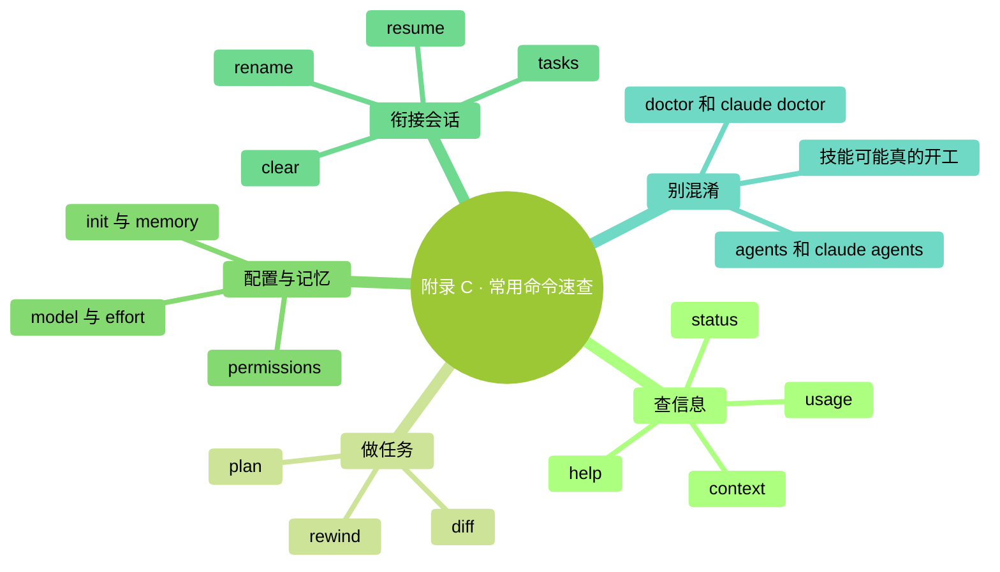

# 附錄 C：常用 Slash 命令速查

> **怎麼用**：先看左列“我想做什麼”，再選擇命令。Slash 就是斜槓；以下以 `/` 開頭的命令輸入在 **Claude Code 會話裡**。
>
> **核對日期：2026-09-24；操作基線：2.1.280 或更新版本。** 本頁選擇本書常用入口，不承諾列盡每個動態命令。賬戶、平臺、組織配置和已安裝技能會影響你看到的選項。
>
> 需要逐步練習時，先讀[第 18 章](../part4-%E9%81%BF%E5%9D%91%E4%B8%8E%E5%88%A4%E6%96%AD%E5%8A%9B/18-%E5%B8%B8%E7%94%A8%E5%BF%AB%E6%8D%B7%E5%91%BD%E4%BB%A4%E5%85%A8%E8%A7%88.md)。

### 本章地圖（一眼看全貌）

<!-- diagram: MM-37 -->

---

> 🎯 **【主線】—— 先找當前需要的入口**
> 不必把表中每一項執行一遍。檢視面板、修改設定和啟動工作，是不同的操作。

## C.1 查狀態、保留進度與管理上下文

| 我想做什麼 | 命令 | 讀結果時記住 |
|---|---|---|
| 查幫助 | `/help` | 結合當前 `/` 選單找入口，不保證列出全部隱藏命令 |
| 確認版本、模型和賬戶 | `/status` | 看環境配置，不是看最終賬單 |
| 看當前消耗和套餐用量 | `/usage` | 會話費用是估算，實際賬單到付款賬戶核對 |
| 舊教程讓查 cost | `/cost` | 當前是 `/usage` 的別名 |
| 看統計頁 | `/stats` | 同屬用量介面，開啟統計頁 |
| 看上下文空間 | `/context` | 空間佔用與套餐剩餘額度不同 |
| 總結長對話再繼續 | `/compact` | 可附上要保留的重點，不保證保留每個細節 |
| 開始無關的新任務 | `/clear` | 開新會話，不撤銷檔案，也不退還已發生用量 |
| 給這場工作起名字 | `/rename 名称` | 例如“活動安排核對”，方便以後尋找 |
| 找回一場會話 | `/resume` | 選擇會話；不是把所有檔案恢復到舊狀態 |

“名稱”表示你要自己填寫的文字，使用時不要連“名稱”兩字照抄。如果想留下長任務的重要決定，應該同時寫進專案檔案；命令能幫你找回會話，不能代替對檔案本身的儲存與核對。上下文操作見[第 12 章](../part3-%E6%B7%B1%E5%BA%A6%E6%A6%82%E5%BF%B5/12-Claude%E4%B8%BA%E4%BB%80%E4%B9%88%E4%BC%9A%E5%8F%98%E7%B3%8A%E6%B6%82.md)，用量見[第 15 章](../part3-%E6%B7%B1%E5%BA%A6%E6%A6%82%E5%BF%B5/15-%E6%A8%A1%E5%9E%8B%E4%B8%8E%E6%88%90%E6%9C%AC.md)。[官方命令參考](https://code.claude.com/docs/en/commands)、[用量說明](https://code.claude.com/docs/en/costs)

## C.2 準備修改、檢查結果與調整模型

| 我想做什麼 | 命令 | 操作邊界 |
|---|---|---|
| 先討論怎麼做 | `/plan` | 進入計劃模式；可在後面寫任務描述 |
| 看檔案前後變化 | `/diff` | 檢視工作區差異；還要判斷變化是否正確 |
| 查可用回退點 | `/rewind` | 先看恢復範圍，不覆蓋所有終端或外部操作 |
| 選擇模型 | `/model` | 正常確認會儲存預設；選擇器按 `s` 僅用於本次 |
| 調整思考投入 | `/effort` | 預設值因模型而異，詳見第 15 章 |
| 使用付費加速 | `/fast` | 不是小模型；先確認額外用量及價格 |
| 檢視或調整偏好 | `/config` | 改動可能儲存，先讀清選項 |
| 檢視操作規則 | `/permissions` | 包含允許、詢問、拒絕規則，不只是白名單 |
| 核對額外用量設定 | `/usage-credits` | 個人賬戶開啟相關網頁；組織成員可能需向管理員提出請求 |

`/rewind` 是恢復入口，`/clear` 是開始新會話，兩者不要互換。比如 Claude 透過終端命令移動了檔案，清空聊天並不能把檔案搬回去；檢查點也未必記錄那次操作。先確認變化來源，再按[第 9 章](../part2-%E6%97%A5%E5%B8%B8%E4%BD%BF%E7%94%A8/09-%E8%AE%A1%E5%88%92%E6%A8%A1%E5%BC%8F%E4%B8%8E%E6%92%A4%E9%94%80.md)處理。[檢查點範圍](https://code.claude.com/docs/en/checkpointing)

如果只是想看看模型列表，開啟後按 Esc 退出即可，不必選一個收費專案。模型選擇與 effort 見[模型配置](https://code.claude.com/docs/en/model-config)，fast 見[快速模式](https://code.claude.com/docs/en/fast-mode)，規則含義見[許可權說明](https://code.claude.com/docs/en/permissions)。

## C.3 整理專案說明、排查問題和結束會話

| 我想做什麼 | 入口 | 你需要知道的區別 |
|---|---|---|
| 建立專案說明初稿 | `/init` | 生成或建議改進 `CLAUDE.md`，之後要審閱 |
| 檢視說明與自動記憶 | `/memory` | 不只管理一個 `MEMORY.md` 檔案 |
| 檢視可用技能 | `/skills` | 同時有技能可見性設定，檢視時別隨手改 |
| 檢視外接工具連線 | `/mcp` | MCP 是連線外部工具的方式；連線狀態與操作許可權不同 |
| 診斷配置並討論修復 | `/doctor` | 當前是技能，可提出並在確認後實施修復 |
| 只做安裝診斷 | 普通終端 `claude doctor` | 不在會話裡輸入，輸出只讀診斷 |
| 看當前會話的後臺工作 | `/tasks` | 子任務可能仍在執行，別僅看主對話是否結束 |
| 退出普通前臺會話 | `/exit` | 在已連線的後臺會話中可能只斷開連線 |
| 登入或退出賬戶 | `/login` / `/logout` | 會改變認證狀態，不是無影響的檢視操作 |

`/init` 不是必須避開的命令，也不是自動生成後必須刪掉的檔案。你可以拿它做起點，核對哪些約定準確，再刪掉猜測或不適用的內容。記憶和說明的關係見[第 13 章](../part3-%E6%B7%B1%E5%BA%A6%E6%A6%82%E5%BF%B5/13-%E4%B8%89%E5%B1%82%E8%AE%B0%E5%BF%86.md)、[第 14 章](../part3-%E6%B7%B1%E5%BA%A6%E6%A6%82%E5%BF%B5/14-%E5%86%99%E5%A5%BD%E4%BD%A0%E7%9A%84CLAUDE.md.md)。[官方記憶說明](https://code.claude.com/docs/en/memory)

`/doctor` 與 `claude doctor` 的區別值得單獨記住：前者是一項可以幫助修復的工作，後者是終端診斷。不要把舊版“doctor 只會讀”的經驗套給現在的斜槓入口。[故障排查說明](https://code.claude.com/docs/en/troubleshooting)

---

## 本章小結

- 從當前問題找命令，不必背完整張表。
- 配置、用量、空間分別看 `/status`、`/usage`、`/context`。
- 恢復會話、恢復檔案、停止後臺任務是不同事情。
- 修改設定和啟動技能之前，先讀清會影響什麼。
- 當前選單、官方說明與本書操作基線一起核對。

## 動手任務

### 做一張三行速查卡（約 3 分鐘）

1. 選出你最常遇到的三個問題，例如“看額度、找舊會話、看修改”。
2. 從表裡找到對應命令，各寫一句用途。
3. 只開啟其中的檢視面板驗證一次；不要為了練習開通付費功能或修改許可權。

**成功標誌**：以後你能從問題找到入口，而不需要每次翻整張表。

## 如果你卡住了

**找不到命令。** 先核對版本和當前輸入位置；技能、平臺或賬戶條件也可能造成差異。以當前說明為準，不要猜一個相近名稱直接執行。

**介面不像書裡說的。** 看清是普通終端、Claude Code 會話，還是桌面應用；不同入口的名稱和可用範圍可能不同。

**誤改了設定或檔案。** 先看改動發生在哪裡，不要用 `/clear` 當撤銷鍵；記錄改動並按對應章節恢復。

---

> 🌿 **【支線】—— 舊教程對照與擴充套件入口**

## 🌿 支線 C.A：舊名字還在，行為可能已經不同

**什麼時候查這段**：你正照一份舊教程操作，但它讓你找的選單已經不見了。

| 舊教程常見說法 | 當前應怎樣理解 |
|---|---|
| `/agents` 開啟子代理建立嚮導 | 從 2.1.198 起不再開啟該向導；讓 Claude 建立或編輯定義 |
| `/doctor` 是隻讀面板 | 當前是體檢技能；只讀終端診斷用 `claude doctor` |
| `/model` 只換本次模型 | 正常確認會儲存；選擇器按 `s` 才僅本次 |
| `/memory` 只開啟自動記憶檔案 | 還管理 `CLAUDE.md` 與自動記憶開關 |
| 所有斜槓命令都不消耗模型 | 技能與工作流會讓 Claude 實際工作 |
| `/help` 一定展示一切 | 可用性、隱藏入口和已安裝技能會影響選單 |

子代理是分擔任務的助手，建立方式見[官方子代理說明](https://code.claude.com/docs/en/sub-agents)；技能的兩種觸發方式見[技能說明](https://code.claude.com/docs/en/skills)。遇到名稱變化，先確定你要完成的動作，再查新入口，不必為了復現舊選單降級軟體。

## 🌿 支線 C.B：進階入口先知道用途，不急著全部開啟

**什麼時候查這段**：你已經有一個穩定的小流程，準備讓它持續、並行或從其他裝置繼續時。

| 入口 | 用途與邊界 | 本書入口 |
|---|---|---|
| `/goal` | 給持續工作設完成條件；也要了解怎樣停止 | 第 26 章 |
| `/loop` | 在會話保持開啟時重複執行提示，執行會消耗用量 | 第 26 章 |
| `/schedule` | 雲端例行任務，與本機會話迴圈不同 | 第 26 章 |
| `/background` | 把當前會話放到後臺繼續 | 第 26 章 |
| `/remote-control` | 從其他裝置連線當前會話，受賬戶條件限制 | 第 26 章 |
| `/plugin` | 管理外掛，可能安裝或啟用額外能力 | 第 20—24 章 |
| `/reload-skills` | 重新發現磁碟上新增或改過的技能 | 第 20、21 章 |

這些入口不是“越多越好”的清單。先明確任務、檔案範圍和結束條件，再去[第 26 章](../part6-%E8%9E%8D%E5%85%A5%E6%97%A5%E5%B8%B8/26-%E8%BF%9B%E9%98%B6%E8%83%BD%E5%8A%9B%E9%80%9F%E8%A7%88.md)學習對應流程。當前功能名、限制及新變化統一到[官方命令參考](https://code.claude.com/docs/en/commands)核對；本頁不替你開啟後臺執行或定時任務。
