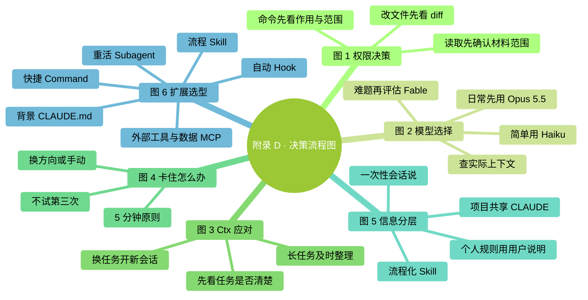
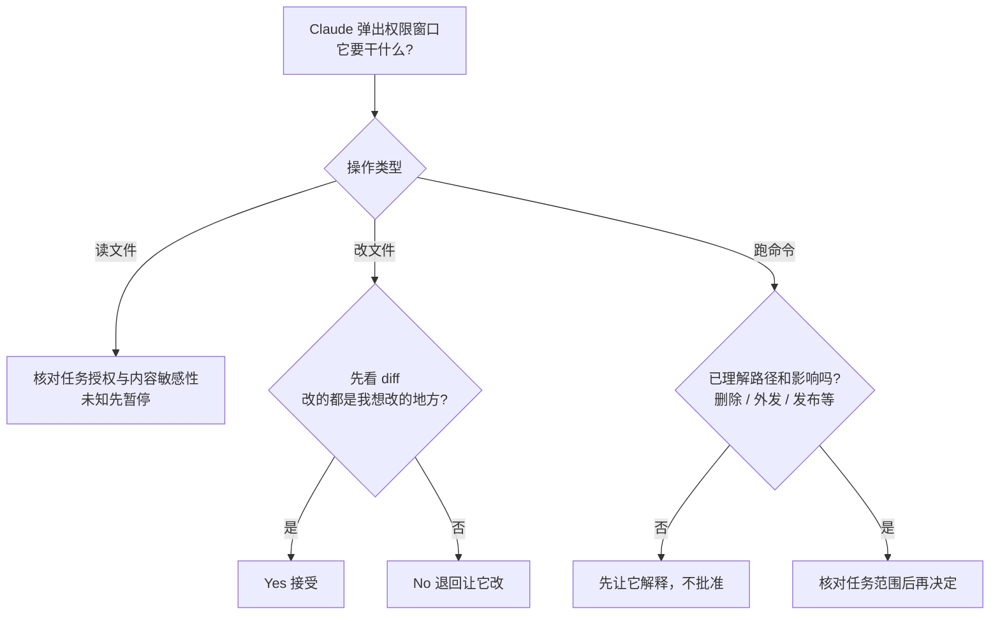
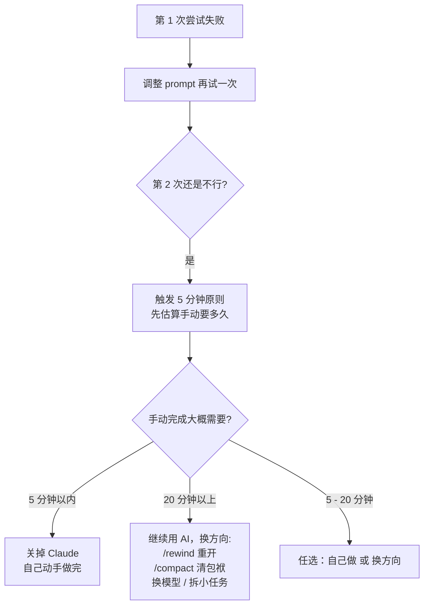
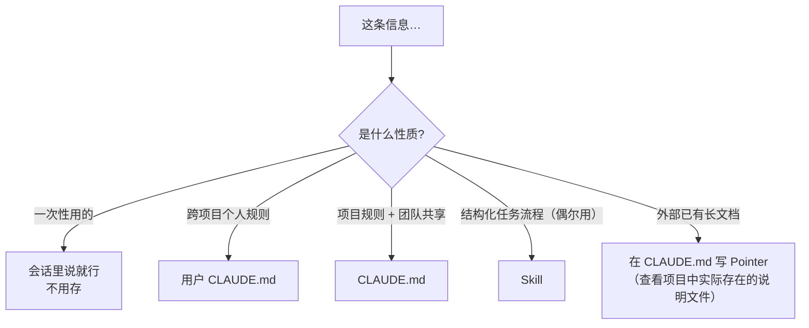
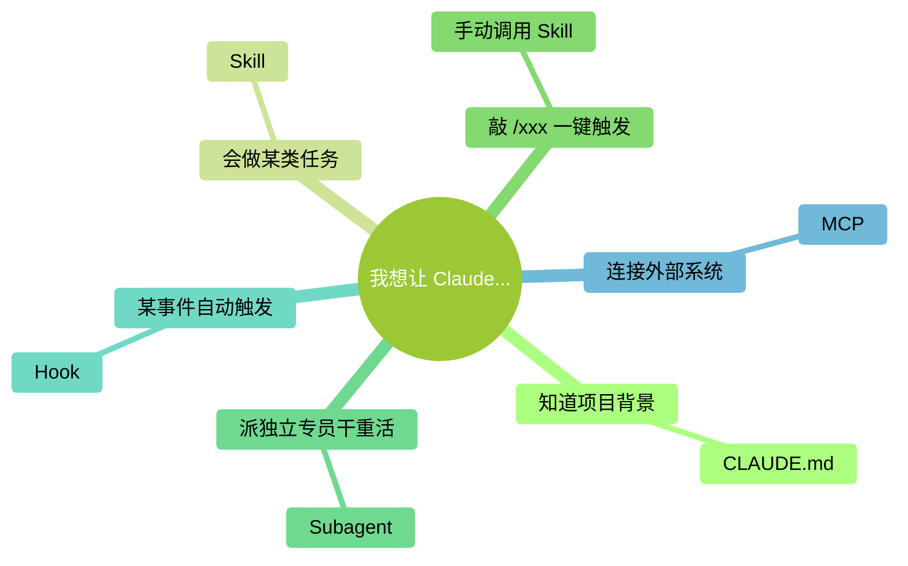

# 附錄 D：決策流程圖

> 本附錄把書裡反覆出現的幾個"該怎麼選"彙總成流程圖。圖全部用 Mermaid 手繪風格繪製，GitHub 上直接渲染，可以直接右鍵儲存圖片或截圖列印。

### 本章地圖（一眼看全貌）

<!-- diagram: MM-38 -->

## 圖 1：許可權決策流程（遇到彈窗怎麼選）

<!-- diagram: FC-legacy-01 -->

**口訣**：

- 讀檔案 → 確認屬於本次任務材料，且內容適合交給所連線的服務
- 改檔案 → **永遠看 diff**，多改了就 No
- 跑命令 → 先理解路徑、作用範圍與外部影響，不因“沒在黑名單”就批准
- 這張圖用於出現詢問時；預先允許或自動執行的結果也要檢查

## 圖 2：模型選擇，先看任務結果與預算

| 現在遇到什麼 | 下一步 |
|---|---|
| 剛開始一個日常任務 | 從賬戶提供的 Opus 5.5 等日常模型開始 |
| 結果不對 | 先檢查材料、目標、驗證標準，必要時調整 effort |
| 已說明清楚，任務仍很複雜 | 核對 Fable 5.1 的訪問資格和費用，再比較實際效果 |
| 更在意響應速度或成本 | 在可用模型中比較 Sonnet / Haiku，不假定低價必然夠用 |
| 材料很長 | 用 `/context` 看實際使用情況，整理材料；不要只根據宣傳視窗大小做決定 |

詳細定價和切換行為見第 15 章。`/fast` 是單獨的速度與費用選項，不等於換成小模型。

## 圖 3：上下文管理，先問“還在做同一件事嗎”

| 當前情況 | 處理方式 |
|---|---|
| 任務清楚、材料夠用、結果正確 | 繼續，不必為了某個百分比打斷工作 |
| 同一長任務需要減輕上下文 | 先儲存目標、進展和待辦，再用 `/compact` 整理 |
| 要開始不相關的新任務 | 儲存成果後用 `/clear` 開新對話 |
| 已出現遺漏或自相矛盾 | 先核對來源和關鍵條件，必要時重新提供任務摘要 |

沒有“90% 一定變笨”的統一規則。自動壓縮時點也會受模型與配置影響；第 12 章解釋這些差別。

## 圖 4：卡住了怎麼辦（5 分鐘原則）

<!-- diagram: FC-legacy-02 -->

這裡的兩次嘗試與五分鐘是作者的時間管理建議，不是產品限制。若失敗涉及外部副作用，先核對現狀再決定恢復方式。

## 圖 5：資訊分層決策（該放在哪一層）

<!-- diagram: FC-legacy-03 -->

專案自動記憶預設按專案儲存，不是天然的跨專案偏好庫。個人規則與團隊共享規則分開維護，任務流程放進 Skill。

## 圖 6：擴充套件機制選型

<!-- diagram: MM-01 -->

**口訣**：**CLAUDE.md 講背景，Skill 講流程，Slash 呼叫 Skill，Subagent 派替身，Hook 搞自動，MCP 連線外部工具和資料來源**。
