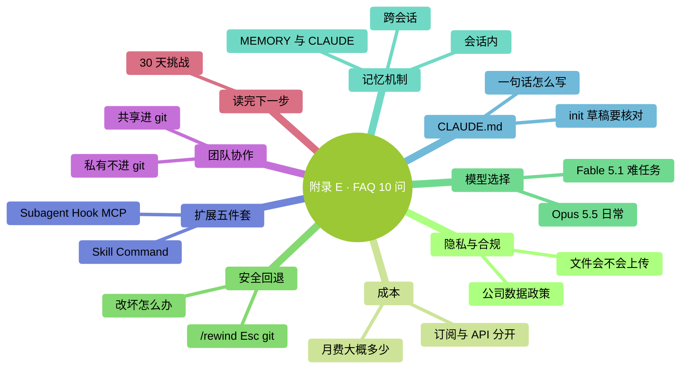

# 附錄 E：FAQ（常見問題 10 問）

> **核驗日期：2026-09-24。** 快問快答對應本版正文；賬號可用性與介面以實際為準。

### 本章地圖（一眼看全貌）

<!-- diagram: MM-39 -->

## 1. Claude 會偷看我的檔案嗎？

它會使用可用工具讀取完成任務所需的檔案，**不只限於你用 `@` 點名的那一個**。讀取範圍受工具、設定和許可權約束；其中的內容可能進入發給模型服務的請求。

個人訂閱是否允許訓練，要看隱私開關；商業/API 有不同條款。保留也不是所有路徑一律“30 天后必刪”。第三方後端按實際服務商核對。不要用 `/clear` 當刪除資料或撤回資料的辦法。

詳見第 11 章及[官方資料說明](https://code.claude.com/docs/en/data-usage)。

## 2. 用 Claude Code 大概多少錢一個月？

先分清**訂閱月費**和**API 按量費用**。每天使用多少分鐘，無法直接換算成賬單：讀取資料多少、輸出長度、模型和額外服務都會影響消耗。

截至 2026-09-24，官方 API 標準價按每百萬 token 計算：Opus 5.5 輸入 **$4**、輸出 **$20**；Fable 5.1 輸入 **$10**、輸出 **$50**。這是標準輸入輸出單價，不是“每月價格”，也沒把快取、加速等專案混在一起。[官方價格](https://platform.claude.com/docs/en/about-claude/pricing)

先用能完成你任務的賬號與模型，小範圍試做後查實際消耗。訂閱用量看 `/usage` 和賬號頁面，API 看費用統計及賬單。詳見第 15 章。

## 3. 它改壞我的檔案了怎麼辦？

先停止繼續改，檢查哪些檔案受影響。輸入 `/rewind`，或在輸入為空時按兩次 Esc，**都會開啟回退選單**；選檢查點和恢復範圍後，才會恢復被跟蹤的檔案編輯。

shell 命令修改、外部操作和多數子代理改動，不保證在這條恢復路徑內。郵件已發、軟體已裝、雲端內容已刪，都需要另外處理。

重要任務前，先複製原件或儲存一個經過檢查的 Git 版本。不要照抄一條會覆蓋當前內容的 Git 命令來“試試能不能恢復”。詳見第 9 章。

## 4. 我在公司用會不會違反資料政策？

**先查公司 AI 政策**。沒有明文政策就發郵件問 IT / 合規。

**永遠別發**：
- 金鑰、token、密碼
- 未脫敏的客戶 / 員工資訊
- NDA 覆蓋的文件

企業賬號不自動等於零保留，也不自動等於模型在公司內部執行。確認管理員批准的服務路徑和資料範圍，再開始處理。詳見第 11 章。

## 5. 有哪些模型？怎麼選？

本版的起步思路是：

- **Opus 5.5**：先用於日常資料處理、編碼和需要連續執行的任務。
- **Fable 5.1**：更難的推理或長任務值得嘗試，但先核對可用性與額外額度。
- **Sonnet 5 / Haiku 4.5**：在賬號可用且測試結果夠好的情況下，用於更看重速度和成本的任務。

在 `/model` 裡確認你實際選中的名稱。模型、思考投入、快速模式和許可權模式是不同的控制項，不要把“選更強模型”理解成“讓它隨意操作”。具體比較見第 15 章和附錄 J。

## 6. Claude 會記住我上次說的話嗎？

有三種情況要分清：

- **繼續舊會話**：用 `claude --continue`、`claude --resume` 或 `/resume` 找儲存過的記錄；退出不等於所有對話消失。
- **開新會話**：不會自動帶上所有舊對話，但會按配置載入說明和記憶。
- **自動記憶**：預設按專案存放在本機；MEMORY.md 是索引，詳細筆記可能另放檔案，不自動跨專案或跨電腦共享。

需要團隊長期遵守的約定，放專案說明；只想讓當前任務知道的細節，先放會話或任務筆記。詳見第 13 章。

## 7. 一句話：CLAUDE.md 怎麼寫？

寫清楚四件事：**專案是什麼、為什麼這樣做、合作要求、詳細資料在哪**。

可以手寫，也可以讓 `/init` 起草。關鍵是核對生成內容、補上無法從檔案推斷的約定，並持續清理重複與過期規則。幾十行通常足夠起步，行數不是質量保證。

已有 AGENTS.md 的專案，先檢查當前版本與載入設定，避免維護互相沖突的兩份規則。用 `/context` 確認實際載入的說明。詳見第 14 章。

## 8. Skill / Command / Subagent / Hook / MCP 怎麼分？

- **Skill**：Claude 按需載入的任務手冊
- **自定義斜槓入口**：你主動敲 `/xxx` 使用技能；舊 `.claude/commands/` 檔案仍相容，不必把它當另一套完全獨立的能力
- **Subagent**：派獨立小 Claude 乾重活
- **Hook**：特定事件發生時執行預設邏輯
- **MCP**：接外部工具（GDrive / Notion / DB）

這些能力可組合使用，先從一個最小例子開始。詳見第五部分（第 20–24 章）。

## 9. 我可以和同事一起用嗎？

可以。原則：
- **共享**：專案 `CLAUDE.md`、`.claude/commands/`、`.claude/skills/`、`.claude/agents/` → 進 git
- **私有**：個人設定、憑證、含敏感值的配置不要進公開倉庫；經檢查的專案 MCP 配置可以共享，金鑰另行提供
- **走 PR**：CLAUDE.md 改動都走 PR review

詳見 Ch 25。

## 10. 讀完書了，接下來幹嘛？

**30 天挑戰清單**：
- 第 1 周：穩固日常用法
- 第 2 周：管理上下文和 CLAUDE.md
- 第 3 周：用上擴充套件（至少一個 Skill / Command / MCP）
- 第 4 周：融入工作流 + 清理

**核心原則**：**選 1-2 個方向深入，不要追最新 / 囤工具 / 和人比**。詳見 Ch 27。
