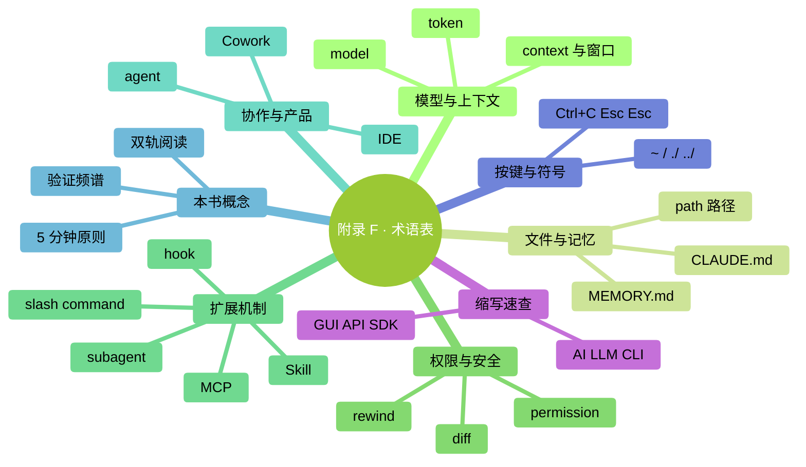

# 附錄 F：術語表

> 本書出現的所有 Claude Code / AI / 終端相關術語。跨章節查閱用。

### 本章地圖（一眼看全貌）

<!-- diagram: MM-40 -->

## A-Z 英文術語

| 術語 | 生活化翻譯 | 本書出處 |
|-----|---------|--------|
| **agent** | 有特定崗位的 Claude 實習生 | Ch 4, 22 |
| **agentic coding** | AI 主動執行任務的程式設計方式 | Ch 4 支線 |
| **API** | 應用程式介面——程式之間說話的約定 | Ch 24, 26 |
| **CLI** | 命令列介面——主要透過文字命令操作的介面 | Ch 1 |
| **CLAUDE.md** | 專案說明書——Claude 每次啟動先讀 | Ch 13, 14 |
| **command** | 命令——給電腦或 Claude 下的一條指令 | Ch 18, 21 |
| **context** | 短期工作記憶——這次對話能記住的總量 | Ch 12 |
| **context window** | 上下文視窗——context 的容量上限 | Ch 12 |
| **Cowork** | Anthropic 面向非程式設計使用者的 GUI 產品 | Ch 4 |
| **diff** | 修改對比圖——檔案改前改後兩欄 | Ch 6 |
| **directory / folder** | 資料夾（本書統一用"資料夾"） | Ch 1 |
| **hook** | 自動觸發規則——事件→動作 | Ch 23 |
| **IDE** | 程式碼編輯器 | Ch 4 |
| **install** | 安裝 | Ch 2 |
| **JSON** | 一種結構化文字格式 | Ch 23, 24 |
| **MCP** | 外接工具插座——連外部系統的協議 | Ch 24 |
| **MEMORY.md** | 專案自動記憶的入口檔案——預設按專案儲存經驗 | Ch 13 |
| **model** | 大模型——Claude 背後的大腦 | Ch 15 |
| **OAuth** | 一種第三方登入授權協議 | Ch 24 |
| **pane** | 分屏區域 | Ch 2 |
| **path** | 路徑——檔案在電腦裡的地址 | Ch 1 |
| **permission** | 許可權 | Ch 7 |
| **PowerShell** | Windows 自帶的命令列 | Ch 1, 附錄 B |
| **prompt** | 提示詞——你說給 AI 的話 | Ch 5, 19 |
| **prompt engineering** | 提示詞工程——怎麼寫好提示詞 | Ch 26 |
| **Pro / Max（Claude）** | 訂閱級別 | Ch 15 |
| **rewind** | 回退——回到之前某個狀態 | Ch 9 |
| **session** | 會話——一次啟動到關閉的完整對話 | Ch 3 |
| **shell** | 命令列——能打命令的視窗 | Ch 1 |
| **Skill** | 技能包——按需載入的任務手冊 | Ch 20 |
| **slash command** | 斜槓命令——`/` 開頭的快捷指令 | Ch 18, 21, 附錄 C |
| **subagent** | 子智慧體——派出去的專業實習生 | Ch 22 |
| **terminal** | 終端——Mac/Linux 的命令列視窗 | Ch 1 |
| **token** | 字數計費單位——約 1 個英文單詞或 0.7 漢字 | Ch 12, 15 |
| **tool use** | 工具呼叫——AI 使用外部工具的能力 | Ch 22, 26 |
| **vibe review** | 憑感覺快速審（30-60 秒） | Ch 10 |
| **workspace** | 工作區——一個工作環境 / 專案資料夾 | Ch 3 |
| **worktree** | 並行工作副本——git 的功能 | Ch 26, 附錄 H |

## 本書內建概念

| 概念 | 定義 | 本書出處 |
|-----|------|--------|
| **雙軌閱讀** | 🎯 主線（必讀）+ 🌿 支線（選讀） | Ch 0 |
| **WHAT-WHERE-HOW-VERIFY** | 提示詞結構模板 | Ch 5 |
| **驗證頻譜 L1-L4** | 按風險分檔的稽核深度 | Ch 10 |
| **信任檔案** | 你個人的"Claude 靠譜度"分級記錄 | Ch 10 |
| **止損規則** | 預設的"什麼時候該停"判斷 | Ch 17 |
| **5 分鐘原則** | 手動 < 5 分鐘就別磨 AI | Ch 17 |
| **漸進披露** | CLAUDE.md 慢慢加、不一次堆 | Ch 14 |
| **Pointers > Copies** | CLAUDE.md 裡指路優於複製內容 | Ch 14 |
| **最小許可權原則** | 擴充套件 / Subagent / MCP 只給夠用的許可權 | Ch 22, 24 |
| **三件套**（章末） | 小結 / 動手任務 / 卡住了 | Ch 0 |

## 按鍵與符號

| 符號 | 讀法 | 說明 |
|-----|-----|-----|
| `~` | 波浪號 | 使用者資料夾 |
| `~/` | 波浪號斜槓 | 從使用者資料夾開始的路徑 |
| `./` | 點斜槓 | 當前資料夾 |
| `../` | 雙點斜槓 | 上層資料夾 |
| `/` | 正斜槓 | Mac/Linux 路徑分隔 |
| `\` | 反斜槓 | Windows 路徑分隔 |
| `$` `%` | 美元 / 百分號 | Mac 終端提示符 |
| `>` | 大於號 | Windows PowerShell 提示符 |
| `|` | 豎線 / 管道符 | 命令輸出接給下一個 |
| `Ctrl+C` | — | 中斷執行 |
| `Cmd+C` | — | Mac 複製（= Windows Ctrl+C） |
| `Esc Esc` | — | 空輸入時開啟檢查點選單 |

## 縮寫速查

| 縮寫 | 全稱 | 翻譯 |
|-----|------|-----|
| **AI** | Artificial Intelligence | 人工智慧 |
| **API** | Application Programming Interface | 應用程式介面 |
| **CI/CD** | Continuous Integration / Continuous Deployment | 持續整合 / 持續部署 |
| **CLI** | Command Line Interface | 命令列介面 |
| **Ctx** | Context | 上下文（Claude Code 狀態列縮寫） |
| **DAU** | Daily Active Users | 日活使用者 |
| **GUI** | Graphical User Interface | 圖形介面 |
| **IDE** | Integrated Development Environment | 整合開發環境 |
| **LLM** | Large Language Model | 大語言模型 |
| **MCP** | Model Context Protocol | 模型上下文協議 |
| **NDA** | Non-Disclosure Agreement | 保密協議 |
| **OS** | Operating System | 作業系統 |
| **PR** | Pull Request | 合併請求 |
| **SaaS** | Software as a Service | 軟體即服務 |
| **SDK** | Software Development Kit | 軟體開發工具包 |
| **SSO** | Single Sign-On | 單點登入 |
| **VPC** | Virtual Private Cloud | 虛擬私有云 |
