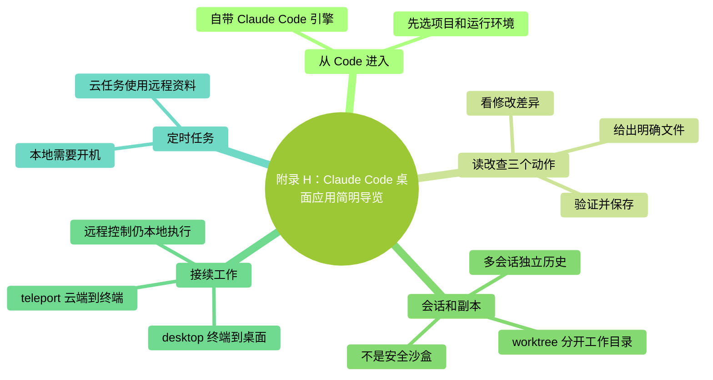

# 附錄 H：Claude Code 桌面應用簡明導覽

> **核驗日期：2026-09-24。**本附錄講 Claude 桌面應用的 **Code** 頁籤。它與 Chat、Cowork 是不同工作入口；本書的任務說明、核驗與許可權意識仍有用，但不是每個終端命令都原樣適用。

### 本章地圖（一眼看全貌）

<!-- diagram: MM-42 -->

## H.1 什麼時候值得使用桌面介面

如果你經常在幾個會話之間切換，想把對話、檔案和修改差異放在同一個視窗裡，桌面應用值得試一次。終端仍適合指令碼、管道和習慣命令列的工作；不必為了使用桌面版先放棄現有終端流程。

從 [Claude 官方下載頁](https://claude.com/download)安裝適合自己系統的版本，登入後選擇 **Code** 頁籤。桌面應用自帶 Claude Code 引擎，**不需要先安裝 Node.js 或獨立 CLI**。只有你還想在系統終端執行 `claude` 命令時，才另外安裝 CLI。看不到 Code，或點選後要求升級、登入，應按當前賬戶提示處理，不能用反覆裝 Node.js 來解決。[官方桌面入門](https://code.claude.com/docs/en/desktop-quickstart)

先選一個練習資料夾，不要把整個使用者主目錄作為首次嘗試的專案。開始前確認四件事：任務在哪裡執行、讀哪個專案、用哪個模型、採用什麼許可權模式。介面上的 **Local** 表示本機環境，**Cloud** 表示雲端；可選環境還可能受到版本和組織配置影響。你從一個桌面視窗操作，不代表每個會話都在同一臺機器上執行。

模型選擇也只是其中一項。Fable 5.1、Opus 5.5 的可用性與費用以賬戶及本書模型章節為準。不要因為一個選單項暫時沒顯示，就推斷專案檔案或安裝目錄出了問題。

## H.2 第一次只做“讀、改、查”三個動作

在練習資料夾裡放一份 `notes.md`，寫下幾句普通文字。你可以用檔案附件或可用的檔案引用功能讓 Claude 定位它，但第一次仍應明確檔名，避免依賴“那個檔案”這種含糊指代。

**先讀。**告訴它：“只讀 notes.md，用兩句話說明內容，不修改。”核對它是否讀了指定檔案，有沒有把檔案以外的資訊說成原文。這與第 5 章是同一種練習，只是換了入口。

**再改。**提出小範圍要求：“把第二段改成三條列表，保持意思，不新增事實。”觀察許可權提示和修改差異。差異檢視中，新增與刪除通常有不同標識；逐段檢查變化，再決定是否接受或繼續修訂。不要把“模型說改好了”代替對實際檔案的檢視。

**最後查。**開啟改完的檔案，確認段落和列表符合要求；如果它修改了不該改的部分，讓它只撤銷那部分。儲存版本或保留修改前副本，後續試驗才有比較基礎。

桌面應用提供側欄會話、差異檢查、終端與檔案編輯等工作區域，但佈局會變化，本附錄不把某個畫素位置寫成固定步驟。功能找不到時，查 [Desktop 官方參考](https://code.claude.com/docs/en/desktop)，並先核對你當前的環境是否支援。這裡描述的是文件核驗後的操作路線，不冒充每個平臺都已完成真人點選測試。

## H.3 多會話與 worktree：分開工作，不是獲得安全沙盒

多個會話各有自己的對話歷史，適合把“閱讀資料”和“修改文稿”分開。但如果它們指向同一個實際資料夾，有寫許可權的會話仍可能碰到同一檔案。對話歷史彼此獨立，不會自動給磁碟檔案製作副本。

Git 的 **worktree（獨立工作目錄）**能為同一個倉庫提供另一份工作副本，方便在不同分支處理任務。桌面建立會話時可按需要使用相關選項。驗收時看清修改在哪份副本和哪條分支，再決定如何合併，不能只看對話標題猜測。首次使用前最好已經理解第 25 章的分支和儲存。

**worktree 不是安全沙盒，也不是讓 Claude 看不見主倉庫。**它主要分開工作檔案和分支狀態；其它可訪問路徑、系統命令以及連線的遠端服務仍受各自許可權約束。若兩個會話都能操作同一個遠端頁面，不同工作目錄也不能防止它們改同一頁。

因此最初只開兩個邊界明確的任務，一個閱讀、一個編輯，先觀察結果怎樣定位和收攏。用完副本後按應用與 Git 的實際狀態清理，先確認重要改動已經儲存；不要把“歸檔了會話”自動當成“全部成果已經合併”。

## H.4 幾種接續方式不要弄反

| 你想怎樣繼續 | 入口和方向 | 需要記住的區別 |
|---|---|---|
| 把終端當前會話轉到桌面 | 在 CLI 裡執行 `/desktop` | **終端 → 桌面**，有平臺與登入方式限制 |
| 在桌面接著看曾經的 CLI 會話 | Desktop 中的 `/resume` | 按應用給出的本地會話列表選擇 |
| 把雲端會話帶回終端 | `/teleport` 或 `claude --teleport` | **雲端 → 本地終端**，還涉及倉庫與分支 |
| 離開電腦，從手機繼續本地任務 | Remote Control | 仍由原電腦執行，並沒有變成雲端任務 |

CLI 與 Desktop 的部分配置和專案說明可以共享，但不是所有終端互動面板都在桌面裡存在。`/desktop` 的條件與相應功能差異，檢視[CLI 與 Desktop 對照](https://code.claude.com/docs/en/desktop#coming-from-the-cli)。已有自定義技能或 MCP 時，遷移後用一個小任務確認實際來源和許可權，別一次跑完整套工作流。

`/teleport` 會從雲會話取得相關分支與對話，要求倉庫、賬戶和工作狀態滿足條件；它不是“把本地聊天發到手機”的命令。開始前處理好未提交修改，按工具提示檢查目標分支。[雲端會話接回終端](https://code.claude.com/docs/en/claude-code-on-the-web#moving-from-web-to-terminal)

Remote Control 則繼續使用原機器的檔案與工具。原程序停止、機器休眠或網路中斷，會影響遠端繼續操作；恢復連線不代表離線期間一直有人替你執行。[遠端控制](https://code.claude.com/docs/en/remote-control)

## H.5 本地計劃與雲 Routines 分開選擇

桌面應用的 Routines 頁面可以提供不同執行方式，建立時要看清 **Local** 或 **Cloud**，不要只憑“都是定時任務”判斷它們一樣。

**本地計劃**可以定期處理本機檔案，不要求原聊天一直開著，但需要桌面應用執行、電腦喚醒。如果計劃時間機器在睡眠，不能當時執行；醒來後可能補最近一次錯過的執行，並不會必然補齊所有歷史次數。第一次配置時手動執行一次，看看是否因為許可權提示而停住，並記錄結果儲存在哪裡。[桌面計劃說明](https://code.claude.com/docs/en/desktop-scheduled-tasks)

**雲 Routines**在遠端配置的環境裡執行，本機關機不影響其本來安排；但它不會自動拿到你尚未上傳的本地檔案或僅安裝在本機的全部工具。所選倉庫、聯結器和訪問範圍決定它實際能做什麼。該能力仍處於研究預覽，具體資格與限制檢視[雲端 Routines](https://code.claude.com/docs/en/routines)。

第一次試驗適合“讀取一個測試專案，生成待辦摘要”，不必直接安排自動釋出。日程儲存之後檢查下次執行時間與時區，找到暫停或刪除入口，再離開電腦。第 26 章把這兩種方式與 CLI 的 `/loop` 做了對照，需要時一起看。

## 一個可驗收的遷移練習

1. 在 Desktop 的 Code 頁籤開啟練習資料夾，確認執行環境與許可權模式。
2. 完成一次只讀說明、一處小修改和一次差異核對。
3. 若已有 CLI 配置，驗證一個技能或連線是否來自你預期的來源。
4. 記錄遇到的介面差異；不需要為了完成本練習建立遠端或定時任務。

**成功標誌**：你知道變化落在哪個資料夾、能核對具體改動，並知道怎樣停止當前操作。喜歡圖形介面就繼續用它，需要指令碼時再回到終端；學習成果不由你使用哪個視窗來決定。

## 如果介面與你看到的不一樣

先確認進入的是 Code 頁籤，並記錄桌面應用版本、作業系統、當前環境與登入方式。CLI 版本不是桌面應用版本，不能僅憑終端裡 `claude --version` 的數字判斷桌面一定有某個按鈕。

專案打不開時，檢查目錄與許可權；雲端找不到本地檔案時，檢查資料是否在該環境中；某個終端命令在桌面不可用時，先查功能對照。一次只改變一個條件，保留原來能工作的入口，不必為了追求“無縫切換”隱藏環境差異。
