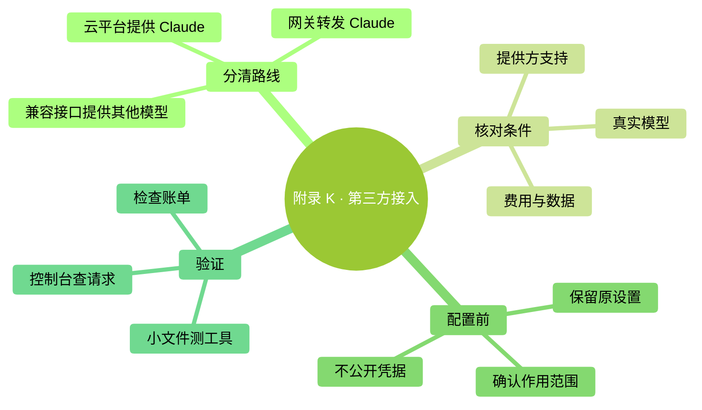

<a id="附录-k第三方接入先确认支持范围"></a>
# 附錄 K：第三方接入，先確認支援範圍

> 本附錄供已經用過 Claude Code、需要判斷其他接入方案的人閱讀。初次學習先走第 0、2 章。舊版的免費額度、價格排行與“一換地址就全相容”的說法已撤下。

<a id="本章地图"></a>
### 本章地圖

<!-- diagram: MM-45 -->


<a id="k1-第三方至少有三种意思"></a>
## K.1 “第三方”至少有三種意思

**第一種是雲平臺提供 Claude。** Amazon Bedrock、Google Cloud 的 Agent Platform、Microsoft Foundry 等有各自的接入與模型開放條件。模型仍可能是 Claude，但賬戶、結算、地區和功能支援要按對應部署說明核對，不能直接照搬個人 Pro 訂閱的待遇。

**第二種是閘道器轉發 Claude 請求。** 閘道器是夾在客戶端與模型服務之間的一層服務，組織可能用它管理認證、用量和預算。地址雖然換了，實際提供的也可能仍是 Claude。你需要知道憑據屬於誰、賬單記到哪裡，以及閘道器是否轉發所需功能。

**第三種是其他模型供應商提供相容介面。** 有些供應商釋出了在 Claude Code 中使用其模型的文件。但“供應商給出相容方案”不等於“Anthropic 官方支援所有非 Claude 模型”。Anthropic 當前[閘道器文件](https://code.claude.com/docs/en/llm-gateway)明確區分了這件事，並說明不支援透過閘道器把 Claude Code 路由到非 Claude 模型。

所以，如果你採用第三種路線，應把它視為供應商維護的相容方案，檢查其當前支援範圍。遇到新版本不相容，不能保證按照本書主線排錯就能解決。沒有確定需求時，不必為了便宜的宣傳數字先改掉已經正常工作的環境。

<a id="k2-一次接入前需要确认五项"></a>
## K.2 一次接入前，需要確認五項

| 要確認的內容 | 為什麼要看 |
|---|---|
| 官方接入文件和適用客戶端版本 | 第三方安裝說明也可能落後；Claude Code 自身安裝以第 2 章和 Anthropic 文件為準 |
| 服務端點與金鑰型別 | 國內、國際、按量 API、Coding Plan 可能不是同一地址或同一種金鑰 |
| 實際模型與別名對映 | 選單裡的 `opus` 可能被對映到另一款模型，不代表 Opus 5.5 |
| 計費與額度 | 贈送是否到期、可用模型範圍、請求速率和付費設定都可能不同 |
| 資料與工具相容 | 請求會送到哪裡，是否支援圖片、工具呼叫、快取和長任務 |

截至本版核對時，[Z.AI 的 Claude Code 接入文件](https://docs.z.ai/devpack/tool/claude)與 [MiniMax 的接入文件](https://platform.minimax.io/docs/token-plan/claude-code)仍可訪問。舊的 Kimi 連結已跳轉至[新平臺文件入口](https://platform.kimi.ai/docs/overview)。這些是查閱入口，不是價格或穩定性的排名。本次沒有替任何一家執行註冊、付費或真實模型測試。

尤其要區分供應商文件裡的兩個部分：如何安裝 Claude Code，以及如何接它自己的服務。前者可能仍寫著過時的 Node.js 前提；後者才是該供應商的配置依據。遇到衝突時，按各自負責的產品核對，不把一篇相容教程當成全套最新說明。

<a id="k3-看懂一份配置不要直接覆盖整份设置"></a>
## K.3 看懂一份配置，不要直接覆蓋整份設定

下面用 Z.AI 文件中仍列出的介面地址說明配置含義。它是**結構示例**，不是包含可用金鑰的檔案，也沒有替你驗證套餐是否開放對應模型。執行前先重新檢視該供應商的當前說明。

```json
{
  "env": {
    "ANTHROPIC_BASE_URL": "https://api.z.ai/api/anthropic",
    "ANTHROPIC_AUTH_TOKEN": "<YOUR_PROVIDER_TOKEN>",
    "ANTHROPIC_DEFAULT_OPUS_MODEL": "<MODEL_FROM_PROVIDER_DOCS>",
    "ANTHROPIC_DEFAULT_SONNET_MODEL": "<MODEL_FROM_PROVIDER_DOCS>",
    "ANTHROPIC_DEFAULT_HAIKU_MODEL": "<MODEL_FROM_PROVIDER_DOCS>"
  }
}
```

`ANTHROPIC_BASE_URL` 是服務地址；`ANTHROPIC_AUTH_TOKEN` 是服務要求的憑據；三個模型變數是別名對映。尖括號裡的內容是佔位符，不能原樣執行。不要僅因為書裡介紹了 Fable，就自行推斷第三方也存在同樣的 Fable 對映或呼叫資格。

Mac 的使用者級設定通常在 `~/.claude/settings.json`；Windows PowerShell 對應 `$env:USERPROFILE\.claude\settings.json`。先用編輯器開啟並留一份私有備份，確認是否已有 `env`、許可權或其他設定；把所需欄位合並進去，**不要用上面的整段覆蓋原檔案**。含金鑰的檔案不進入公開 Git 倉庫。企業統一管理的環境先遵照管理員方案，不自行切換服務。

環境變數還可能來自終端或系統設定，編輯這一份檔案不一定能改變最終生效值。切換時先儲存工作並退出原會話，再按供應商的官方步驟啟動一個新會話。不要用複製整份配置的別名在多個並行任務間來回覆蓋公共設定，這可能讓不同任務使用了你沒預期的賬戶。

<a id="k4-怎样判断真的接对了怎样退回原来的路线"></a>
## K.4 怎樣判斷真的接對了，怎樣退回原來的路線

驗證分三層。第一，檢視客戶端當前配置和提供方控制檯的請求記錄，確認端點、實際模型與計費賬戶。**不要把模型自稱“我是某某”當成證據**，那只是它生成的一句話。

第二，在不含私人資料的練習目錄裡測試：讀一個短文字、提出一次小修改、檢查真實檔案結果。如果你的任務需要圖片或特定外部工具，再分別驗證。普通聊天成功，不代表所有工具都相容。

第三，回控制檯檢視這次請求是否產生用量，以及用量落在哪個套餐或餘額下。只有這三層對得上，才適合逐步用於實際工作；費用比較也應以完成同類任務的真實記錄來做，不能由每百萬 token 的單價直接推斷能省多少。

要恢復原路線，先儲存現有工作與設定，再撤回這次新增的端點、憑據和模型對映，檢查終端、系統與使用者設定是否還有殘留。開啟新終端並重新啟動 `claude` 會話後，核對 `/status`、`/model` 和賬戶用量。不要為了“清乾淨”刪除整個 `.claude` 目錄，那裡面還可能有會話、規則和其他有用配置。

<a id="本章小结"></a>
## 本章小結

雲平臺、閘道器與非 Claude 相容方案不是同一回事。先查提供方支援範圍，再查實際模型和賬單；保留原設定，逐步測試小任務。若你的目的只是使用官方 Opus 5.5 或 Fable 5.1，先按第 15 章確認正式訪問路徑，不必先增加一層相容配置。
