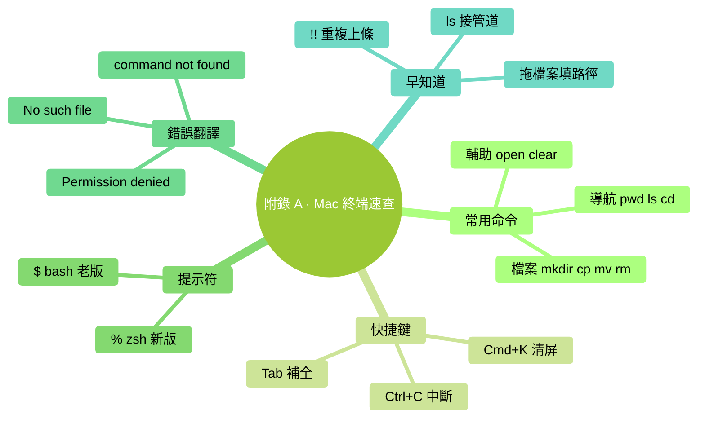

# 附錄 A：Mac 終端速查

> 用法：開啟 終端.app（Spotlight 搜 "終端"），按速查表敲命令。

### 本章地圖（一眼看全貌）

<!-- diagram: MM-35 -->

## 最常用 15 個命令

| 命令 | 幹什麼 | 例 |
|-----|-------|---|
| `pwd` | 看我現在在哪個資料夾 | `pwd` |
| `ls` | 列當前資料夾裡的東西 | `ls` |
| `ls -la` | 連隱藏檔案和詳細資訊都列 | `ls -la` |
| `cd 資料夾名` | 進入某個資料夾 | `cd Documents` |
| `cd ..` | 上一層資料夾 | `cd ..` |
| `cd ~` | 回自己的使用者資料夾（家） | `cd ~` |
| `cd -` | 回上次那個資料夾 | `cd -` |
| `mkdir 名字` | 建一個新資料夾 | `mkdir notes` |
| `touch 名字` | 建一個空檔案 | `touch todo.md` |
| `cp 源 目標` | 複製 | `cp a.txt b.txt` |
| `mv 源 目標` | 移動 / 重新命名 | `mv a.txt b.txt` |
| `rm 檔案` | 刪除（**小心**，不進回收站） | `rm old.txt` |
| `rm -rf 資料夾` | 刪資料夾及裡面所有內容（**最危險**，再三確認） | `rm -rf temp/` |
| `open .` | 在 Finder 開啟當前資料夾 | `open .` |
| `clear` | 清屏 | `clear` |

## 最常用快捷鍵

| 快捷鍵 | 作用 |
|-------|------|
| `Tab` | 自動補全檔名 / 命令 |
| `↑` / `↓` | 翻命令歷史 |
| `Ctrl+A` | 游標跳到行首 |
| `Ctrl+E` | 游標跳到行尾 |
| `Ctrl+C` | 中斷當前執行的命令 |
| `Ctrl+D` | 退出當前 shell |
| `Ctrl+L` | 清屏（等同 `clear`） |
| `Cmd+T` | 新標籤頁 |
| `Cmd+N` | 新視窗 |
| `Cmd+K` | 清屏並清歷史（徹底清） |
| `Cmd+加號 / 減號` | 字號變大 / 變小 |

## 提示符符號速讀

- `%`（zsh，新版 Mac 預設）：等著你打字
- `$`（bash，老 Mac）：一樣意思
- 看到 `~` = 你在自己的使用者資料夾

## 常見錯誤翻譯

| 看到 | 意思 | 怎麼辦 |
|-----|-----|-------|
| `command not found: xxx` | 沒裝 xxx 這個程式 | 先裝（比如 `brew install xxx`） |
| `No such file or directory` | 找不到這個檔案 / 資料夾 | `pwd` 看你在哪、`ls` 看有沒有 |
| `Permission denied` | 權限不夠 | 加 `sudo`（**慎用**）；或 `chmod +x 檔案` |
| `zsh: parse error` | 命令打錯了（缺引號 / 括號） | 仔細看命令，重新敲 |
| `Operation not permitted` | Mac 的 SIP 保護攔的 | 該目錄是系統目錄，別動 |

## 一些"我希望早點知道"

- **拖檔案進終端** → 自動填入完整路徑（省去手打）
- **`ls | less`**（帶豎線）→ 列表太長時分頁看，按 `q` 退出
- **`!!`** → 重複上一條命令（裝完 `sudo` 忘了加，敲 `sudo !!` 直接補）
- **`cd`** 單獨一個 → 等同 `cd ~`
- **`open 檔案.pdf`** → 用預設程式開啟這個檔案

---

<!-- chapter-nav -->

📖  [← 第 27 章 · 下一步路線](../part6-融入日常/27-下一步路線.md)  ·  [📑 返回目錄](../../README.md)  ·  [附錄 B · Windows PowerShell 速查 →](B-Windows-PowerShell速查.md)
