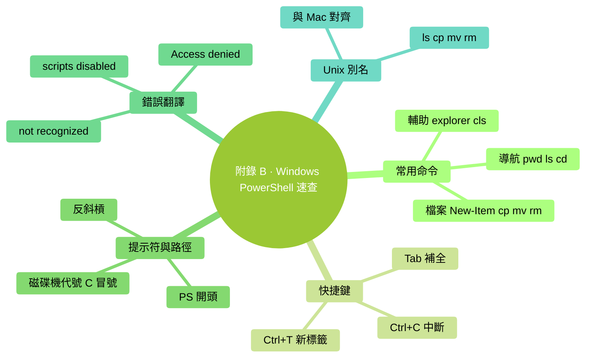

# 附錄 B：Windows PowerShell 速查

> 用法：按 `Win + X` 選 "終端"（Windows 11）或 "PowerShell"。**本書不推薦 WSL / CMD——統一用 PowerShell**。

### 本章地圖（一眼看全貌）

<!-- diagram: MM-36 -->

## 最常用 15 個命令

| 命令 | 幹什麼 | 例 |
|-----|-------|---|
| `pwd` | 看我在哪個資料夾 | `pwd` |
| `ls` | 列當前資料夾 | `ls` |
| `ls -Force` | 連隱藏檔案都列 | `ls -Force` |
| `cd 資料夾名` | 進去 | `cd Documents` |
| `cd ..` | 上一層 | `cd ..` |
| `cd ~` | 回用戶資料夾 | `cd ~` |
| `mkdir 名字` | 建資料夾 | `mkdir notes` |
| `New-Item 名字` | 建空檔案 | `New-Item todo.md` |
| `cp 源 目標` | 複製 | `cp a.txt b.txt` |
| `mv 源 目標` | 移動 / 重新命名 | `mv a.txt b.txt` |
| `rm 檔案` | 刪除（**小心**，不進回收站） | `rm old.txt` |
| `rm -r 資料夾` | 刪資料夾及內容 | `rm -r temp` |
| `explorer .` | 在資源管理器開啟當前 | `explorer .` |
| `cls` | 清屏 | `cls` |
| `notepad 檔案` | 用記事本開啟 | `notepad todo.md` |

## 最常用快捷鍵

| 快捷鍵 | 作用 |
|-------|------|
| `Tab` | 自動補全 |
| `↑` / `↓` | 翻歷史 |
| `Home` | 游標跳行首 |
| `End` | 游標跳行尾 |
| `Ctrl+C` | 中斷 |
| `Ctrl+L` 或 `cls` | 清屏 |
| `Ctrl+T` | 新標籤頁（Windows Terminal） |
| `Ctrl+Shift+N` | 新視窗 |
| `Ctrl+加號 / 減號` | 字號 |

## 提示符符號速讀

- `>`（如 `PS C:\Users\你>`）：PowerShell 等你打字
- `PS` = PowerShell
- 路徑用**反斜槓 `\`**（和 Mac 的 `/` 不一樣）

## 常見錯誤翻譯

| 看到 | 意思 | 怎麼辦 |
|-----|-----|-------|
| `The term 'xxx' is not recognized` | 沒裝或沒在 PATH 裡 | 先裝；重開終端 |
| `Cannot find path 'xxx' because it does not exist` | 路徑錯 | `pwd` 和 `ls` 核查 |
| `Access to the path 'xxx' is denied` | 權限不夠 | **以管理員身份**執行 PowerShell |
| `... is currently disabled on this system` | 指令碼執行政策限制 | 管理員 PowerShell 跑 `Set-ExecutionPolicy RemoteSigned`（理解後再做） |
| `... cannot be loaded because running scripts is disabled` | 同上 | 同上 |

## Windows 特別要注意的路徑差異

- **反斜槓** `\`（不是 `/`）
- 磁碟機代號 `C:\` `D:\`——Mac/Linux 沒有
- **空格路徑用引號**：`cd "Program Files"`
- **使用者資料夾**：`C:\Users\你的名字`（不是 `/Users/...`）

## PowerShell 的"別名"

很多 PowerShell 原本的命令有 Unix 風格別名，方便跨平臺使用者：

| PowerShell 原生 | 別名（Mac / Unix 風格） |
|---------------|----------------------|
| `Get-ChildItem` | `ls`（也支援 `dir`） |
| `Set-Location` | `cd` |
| `Copy-Item` | `cp`（也支援 `copy`） |
| `Move-Item` | `mv`（也支援 `move`） |
| `Remove-Item` | `rm`（也支援 `del`） |

**本書統一用 Unix 風格別名**——和 Mac 版速查表對應一致。

## 一些"我希望早點知道"

- **拖檔案進終端** → 自動填路徑（和 Mac 一樣）
- **以管理員身份執行**：右鍵 PowerShell 圖示 → "以管理員身份執行"——某些系統命令需要
- **`dir`** 也能用（老 CMD 風格，PowerShell 相容）
- **`clip`** 命令 → `echo "hello" | clip` 把輸出複製到剪貼簿

---

<!-- chapter-nav -->

📖  [← 附錄 A · Mac 終端速查](A-Mac終端速查.md)  ·  [📑 返回目錄](../../README.md)  ·  [附錄 C · Slash 命令全表 →](C-Slash命令全表.md)
