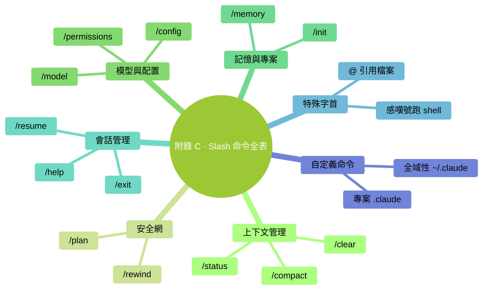

# 附錄 C：Claude Code Slash 命令全表

> 用法：Claude Code 輸入框裡輸 `/`，選命令。這裡按用途分組。

### 本章地圖（一眼看全貌）

<!-- diagram: MM-37 -->

## 上下文管理

| 命令 | 作用 | 本書哪講 |
|-----|------|--------|
| `/clear` | 清空當前會話（Ctx 歸零） | Ch 12 |
| `/compact` | 壓縮對話為摘要（大幅降低 Ctx） | Ch 12 |
| `/status` | 看當前模型、Ctx%、用量 | Ch 15 |

## 安全網

| 命令 | 作用 | 本書哪講 |
|-----|------|--------|
| `/plan` | 進計劃模式（只出方案不動手） | Ch 9 |
| `/rewind` | 精確回退到某個狀態 | Ch 9 |

## 模型與配置

| 命令 | 作用 | 本書哪講 |
|-----|------|--------|
| `/model` | 切換模型（Sonnet / Opus / Haiku / Opus 1M） | Ch 15 |
| `/config` | 看 / 改 Claude Code 配置 | Ch 18 |
| `/permissions` | 管理權限白名單 | Ch 7 |

## 記憶與專案

| 命令 | 作用 | 本書哪講 |
|-----|------|--------|
| `/memory` | 開啟 MEMORY.md 管理介面 | Ch 13 |
| `/init` | 自動生成 CLAUDE.md（**不推薦**） | Ch 14 |

## 會話管理

| 命令 | 作用 | 本書哪講 |
|-----|------|--------|
| `/help` | 所有命令說明 | Ch 18 |
| `/exit` | 退出 Claude Code | Ch 3 |
| `/resume` | 恢復上次會話 | Ch 3 |
| `/login` / `/logout` | 登入 / 登出 | Ch 2 |

## 特殊字首（非 slash 但屬於"特殊輸入"）

| 字首 | 作用 | 例 | 本書哪講 |
|-----|------|---|--------|
| `!` | 直接跑 shell 命令 | `!git status` | Ch 19 |
| `@` | 引用檔案 | `@CLAUDE.md` | Ch 5 |

## 常用組合套路

| 套路 | 步驟 |
|-----|------|
| Plan → Execute | `/plan` → 審方案 → 退出 plan → 執行 |
| Opus 規劃 + Sonnet 執行 | `/model` Opus → 出方案 → `/model` Sonnet → 執行 |
| 中段壓縮 | Ctx 50% → `/compact` → 繼續 |
| Rewind 而非修補 | Claude 出錯 → `/rewind` → 重新描述 |

## 自定義命令

自己的 `/xxx` 命令放在：
- 全域性：`~/.claude/commands/xxx.md`
- 專案：`<專案>/.claude/commands/xxx.md`

詳見 Ch 21。

## 注意

- 具體命令名和行為**可能因 Claude Code 版本而異**
- 出現新命令 / 某命令消失 → 跑 `/help` 看當前版本全表
- 自定義命令會和內建一起在 `/help` 輸出裡出現

---

<!-- chapter-nav -->

📖  [← 附錄 B · Windows PowerShell 速查](B-Windows-PowerShell速查.md)  ·  [📑 返回目錄](../../README.md)  ·  [附錄 D · 決策流程圖 →](D-決策流程圖.md)
