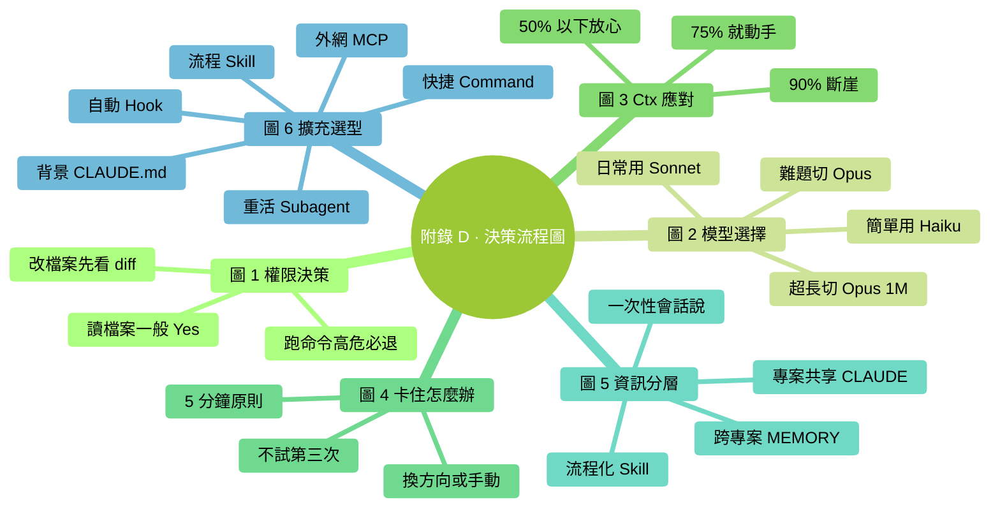
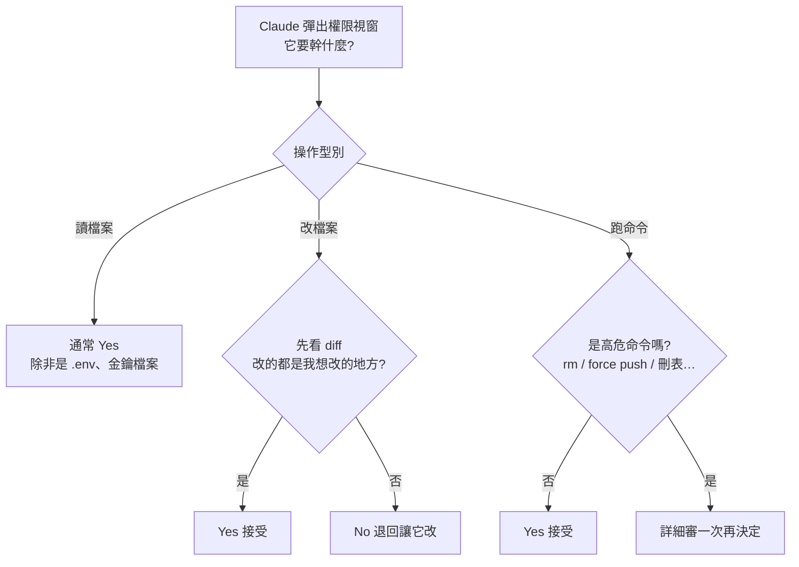
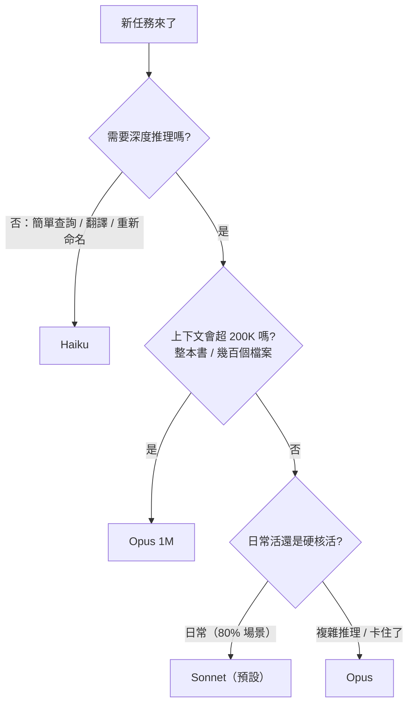
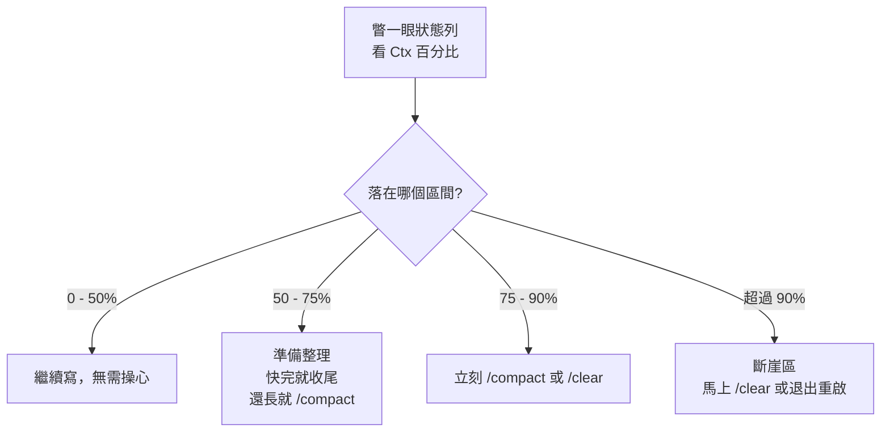
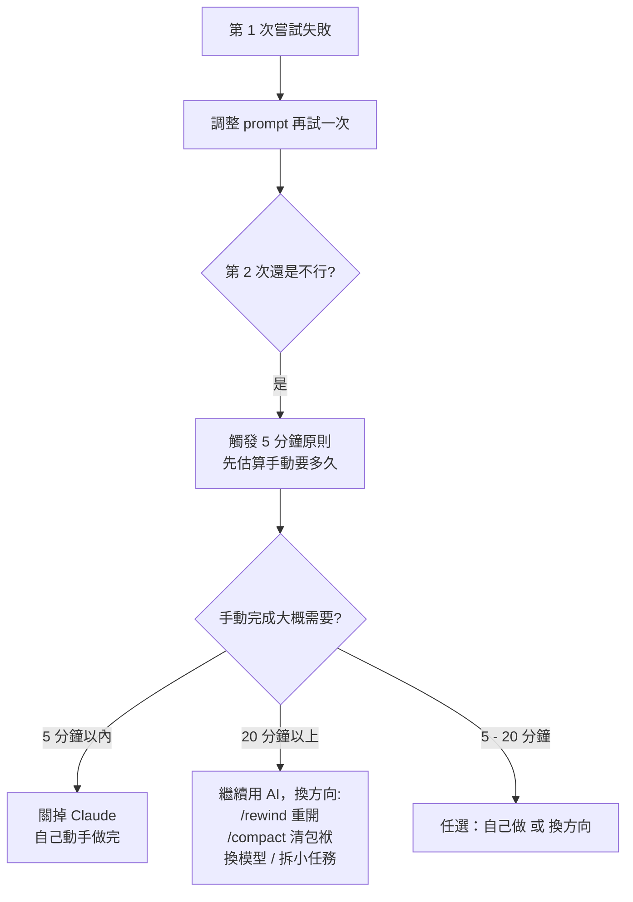
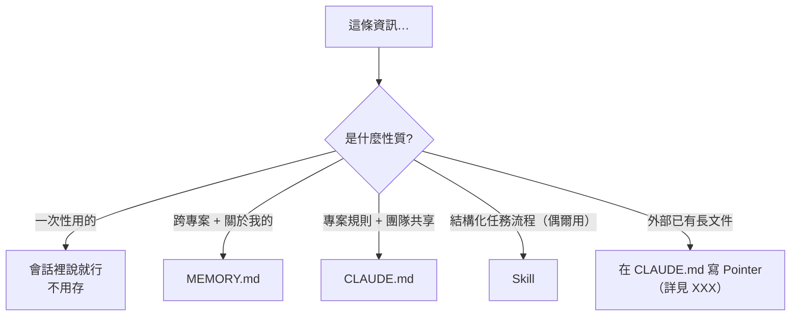
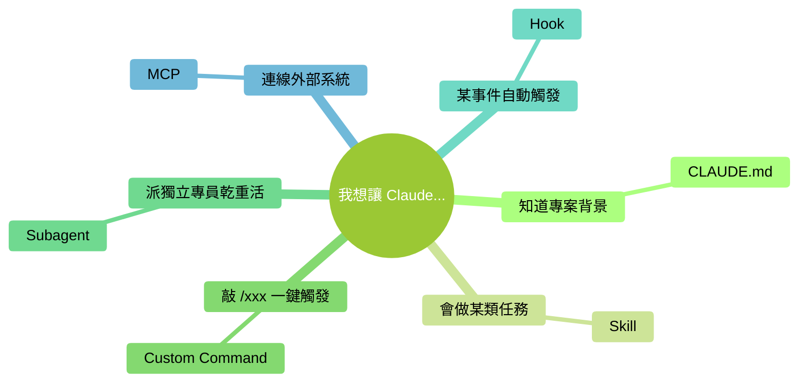

# 附錄 D：決策流程圖

> 本附錄把書裡反覆出現的幾個"該怎麼選"彙總成流程圖。圖全部用 Mermaid 手繪風格繪製，GitHub 上直接渲染，可以直接右鍵儲存圖片或截圖列印。

### 本章地圖（一眼看全貌）

<!-- diagram: MM-38 -->

## 圖 1：權限決策流程（遇到彈窗怎麼選）

**口訣**：

- 讀檔案 → 一般 Yes（除非是 `.env`、金鑰檔案）
- 改檔案 → **永遠看 diff**，多改了就 No
- 跑命令 → **高危必退**（詳見附錄 G）

## 圖 2：模型選擇流程（任務來了用哪個）

**新手一句話**：**預設 Sonnet，卡住切 Opus，簡單事用 Haiku**。

## 圖 3：Ctx% 使用率應對流程

**口訣**：**看到 75% 就動手，別等 90%**。

## 圖 4：卡住了怎麼辦（5 分鐘原則）

**口訣**：**同一個 prompt 不要試第三次**。

## 圖 5：資訊分層決策（該放在哪一層）

**口訣**：**越私人越往 MEMORY，越團隊越往 CLAUDE，越流程化越往 Skill**。

## 圖 6：擴充機制選型

<!-- diagram: MM-01 -->

**口訣**：**CLAUDE.md 講背景，Skill 講流程，Command 給快捷鍵，Subagent 派替身，Hook 搞自動，MCP 接外網**。

---

<!-- chapter-nav -->

📖  [← 附錄 C · Slash 命令全表](C-Slash命令全表.md)  ·  [📑 返回目錄](../../README.md)  ·  [附錄 E · FAQ 10 問 →](E-FAQ.md)
