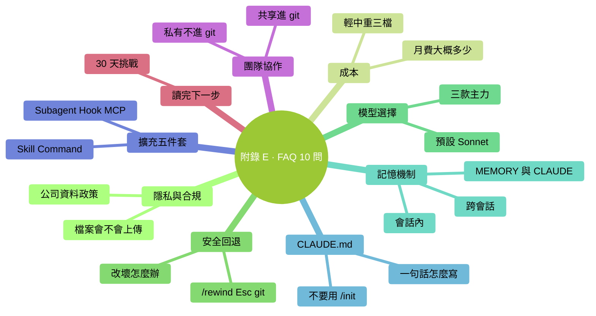

# 附錄 E：FAQ（常見問題 10 問）

### 本章地圖（一眼看全貌）

<!-- diagram: MM-39 -->

## 1. Claude 會偷看我的檔案嗎？

不會"偷"，但**你 @ 引用或讓它 `!cat` 的檔案內容**會上傳到 Anthropic 伺服器（HTTPS 加密傳輸），最多暫存 30 天后刪除，**不用於訓練**。

Claude 不會**主動**讀你沒讓它讀的檔案——它只有工具權限，權限外動不了。

詳見 Ch 11。

## 2. 用 Claude Code 大概多少錢一個月？

按使用強度粗略：
- **輕度**（每天 10-30 分鐘）：$10-20 / 月
- **中度**（每天 1-2 小時）：$50-150 / 月
- **重度**（每天 3+ 小時）：$200+ / 月

推薦訂閱 Claude Pro 起步。詳見 Ch 15。

## 3. 它改壞我的檔案了怎麼辦？

三種挽回：
1. **`/rewind`**：回退到改之前
2. **`Esc Esc`**：快速撤銷最近一步
3. **git**：`git checkout <檔案>` 恢復到上次 commit

最可靠是**重要任務前先 `!git commit -am "wip"`**——有回退錨點。

詳見 Ch 9。

## 4. 我在公司用會不會違反資料政策？

**先查公司 AI 政策**。沒有明文政策就發郵件問 IT / 合規。

**永遠別發**：
- 金鑰、token、密碼
- 未脫敏的客戶 / 員工資訊
- NDA 覆蓋的文件

合規場景 → 爭取企業版（Zero Retention、私有部署）。詳見 Ch 11。

## 5. 有哪些模型？怎麼選？

三款主力：
- **Haiku 4.5**：快 + 便宜，簡單查詢
- **Sonnet 4.6**：中堅，日常預設
- **Opus 4.7**：最強 + 最貴，複雜推理

**新手建議**：預設 Sonnet、卡了切 Opus、簡單事用 Haiku。`/model` 隨時換。詳見 Ch 15。

## 6. Claude 會記住我上次說的話嗎？

**三層記憶**：
- **會話內**：記（到 `/clear` 或退出為止）
- **跨會話**：看情況——放在 **MEMORY.md**（Claude 自動記你偏好）或 **CLAUDE.md**（你手寫的專案規則）的內容會記
- **完全無記憶**：每次新會話，你沒明確存過的就不記

詳見 Ch 13。

## 7. 一句話：CLAUDE.md 怎麼寫？

**不要用 `/init`**。手寫，< 60 行：

- **WHAT**：專案是什麼（1-2 句）
- **WHY**：關鍵決策為什麼這麼選
- **HOW**：3-5 條硬規則
- **Pointers**：指向詳細文件的連結

發現 Claude 重複犯錯時**再**補條目。詳見 Ch 14。

## 8. Skill / Command / Subagent / Hook / MCP 怎麼分？

- **Skill**：Claude 按需載入的任務手冊
- **Command**：你主動敲 `/xxx` 觸發
- **Subagent**：派獨立小 Claude 乾重活
- **Hook**：事件自動觸發
- **MCP**：接外部工具（GDrive / Notion / DB）

**五者可組合使用**。詳見 Part 5（Ch 20-24）。

## 9. 我可以和同事一起用嗎？

可以。原則：
- **共享**：專案 `CLAUDE.md`、`.claude/commands/`、`.claude/skills/`、`.claude/agents/` → 進 git
- **私有**：`settings.local.json`、個人憑證、MCP 配置 → 不進 git
- **走 PR**：CLAUDE.md 改動都走 PR review

詳見 Ch 25。

## 10. 讀完書了，接下來幹嘛？

**30 天挑戰清單**：
- 第 1 周：穩固日常用法
- 第 2 周：管理上下文和 CLAUDE.md
- 第 3 周：用上擴充（至少一個 Skill / Command / MCP）
- 第 4 周：融入工作流 + 清理

**核心原則**：**選 1-2 個方向深入，不要追最新 / 囤工具 / 和人比**。詳見 Ch 27。

---

<!-- chapter-nav -->

📖  [← 附錄 D · 決策流程圖](D-決策流程圖.md)  ·  [📑 返回目錄](../../README.md)  ·  [附錄 F · 術語表 →](F-術語表.md)
