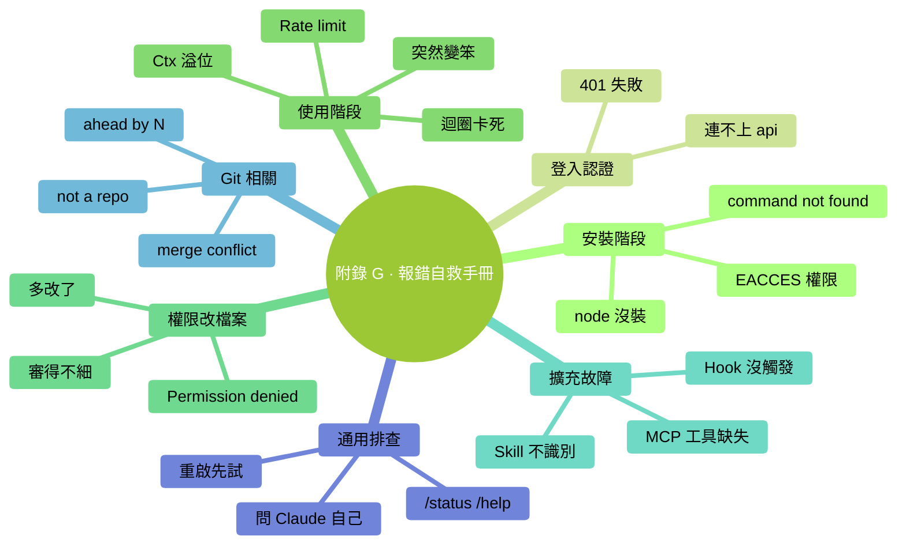

# 附錄 G：常見報錯與自救手冊

> 按關鍵詞搜。每條格式：**看到什麼 → 最可能原因 → 怎麼辦**。

### 本章地圖（一眼看全貌）

<!-- diagram: MM-41 -->

## 安裝階段

### `command not found: claude`

**原因**：Claude Code 沒裝；或裝了但 PATH 沒更新。
**怎麼辦**：
- 重灌：`npm install -g @anthropic-ai/claude-code`
- 關掉終端重開（讓 PATH 生效）
- 確認 `which claude`（Mac）/ `where claude`（Windows）能找到

### `EACCES: permission denied`（安裝時）

**原因**：npm 全域性安裝時權限不夠。
**怎麼辦**：
- Mac：用 `sudo npm install -g ...`（輸入 Mac 密碼）
- 更好：改 npm 字首到使用者目錄（避免 sudo）

### `node: command not found`

**原因**：Node.js 沒裝。
**怎麼辦**：去 [nodejs.org](https://nodejs.org) 下載 LTS 版本裝。

### `npm WARN deprecated`（裝的時候一堆警告）

**原因**：依賴庫版本提示，通常不影響功能。
**怎麼辦**：**忽略**，裝完能跑就行。

---

## 登入 / 認證

### `Authentication failed` / 401

**原因**：token 過期 / 輸錯 / 沒權限。
**怎麼辦**：
- `/logout` 然後 `/login` 重新登入
- 確認訂閱仍在有效期

### `Unable to connect to api.anthropic.com`

**原因**：網路問題（防火牆 / 代理 / 梯子）。
**怎麼辦**：
- 確認你能在瀏覽器訪問 https://anthropic.com
- 公司網路 → 問 IT 是否需要配代理
- 國內使用者可能需要特殊網路

---

## 使用階段

### `Context window exceeded` / 上下文溢位

**原因**：Ctx 爆了。
**怎麼辦**：
- `/compact` 壓縮；或 `/clear` 重啟
- 下次避免一次 @ 太多檔案

### `Rate limit exceeded`

**原因**：短時間請求過多。
**怎麼辦**：
- 等 1-5 分鐘
- 或切到 Haiku（額度獨立）
- 重度使用者 → 升 Max / 換 API key

### Claude 回答突然變笨 / 答非所問

**可能原因 A**：Ctx > 80%，模型開始糊塗
**辦法**：`/compact` 或 `/clear`

**可能原因 B**：模型換錯了（你上次切到 Haiku 忘了切回）
**辦法**：`/status` 看當前模型，`/model` 切回合適的

**可能原因 C**：prompt 太模糊
**辦法**：按 Ch 5 的 WHAT-WHERE-HOW-VERIFY 重構提示

### Claude 一直執行錯誤命令 / 迴圈中

**原因**：陷入區域性最優。
**怎麼辦**：
- **立刻 Ctrl+C 中斷**
- `/rewind` 或 `/clear`
- 用更具體的提示重來

---

## 權限 / 改檔案

### `Permission denied`（Claude 想動某檔案時）

**原因**：系統級權限不夠。
**怎麼辦**：
- 檔案 owner 是 root？→ `chmod` / `chown` 改權限（小心）
- 系統保護目錄？→ **不要改**

### diff 看著對，但改完發現錯了

**原因**：你 vibe review 不夠細。
**怎麼辦**：
- `/rewind` 回到改之前
- 重新走，這次**細審**或 `/plan` 先

### 改完檔案後發現多改了很多

**原因**：Claude "順手"多動
**怎麼辦**：
- `/rewind` 回到改前
- 重講："只改 A，不動 B、C"

---

## Hooks / 擴充

### Hook 沒觸發

**原因 A**：`settings.json` 格式錯
**辦法**：用 JSONLint 校驗

**原因 B**：需要重啟
**辦法**：完全退出 Claude Code 重開

**原因 C**：matcher 匹配不上
**辦法**：先用 `"matcher": "*"` 匹配全部試，再縮小

### Hook 讓 Claude Code 卡住

**原因**：hook 命令慢 / 卡住。
**怎麼辦**：
- hook 裡的命令加 `timeout 5` 限時（Mac/Linux）
- 暫時註釋掉 hook 看是不是它的問題

### Skill / Command 沒被識別

**原因 A**：檔案路徑錯
**辦法**：確認在 `~/.claude/skills/<名>/SKILL.md` 或 `.claude/commands/<名>.md`

**原因 B**：frontmatter 格式錯
**辦法**：確認有三條橫線包圍的 `---` 塊

**原因 C**：需要重啟
**辦法**：退出 Claude Code 重開

### MCP 裝了但 Claude 說沒有這個工具

**原因 A**：mcp_servers.json 格式錯 / 路徑錯
**辦法**：JSON 校驗 + 看啟動輸出有沒有報錯

**原因 B**：MCP server 本身沒跑起來
**辦法**：手動跑一次 `npx -y @modelcontextprotocol/server-xxx`

---

## Git 相關

### `fatal: not a git repository`

**原因**：當前目錄不是 git 專案。
**怎麼辦**：`git init` 初始化；或 `cd` 到正確的專案目錄。

### `Your branch is ahead of 'origin/main' by N commits`

**原因**：本地比遠端新。
**怎麼辦**：`git push` 推到遠端（注意確認要不要）。

### `Merge conflict`

**原因**：你和別人改了同文件。
**怎麼辦**：
- **不要亂刪**——開啟衝突檔案看 `<<<<<<<` `=======` `>>>>>>>` 標記
- 手動選擇保留哪邊
- 或讓 Claude 幫你："@<衝突檔案> 解決這裡的 merge conflict，優先保留我們本地的業務邏輯"

---

## 通用排查順序

遇到任何問題按這個順序試：

1. **重啟 Claude Code**（解決 50% 的問題）
2. **`/status` 看狀態**（模型對嗎？Ctx 高嗎？）
3. **`/help` 看命令說明**
4. **看啟動時的日誌輸出**（有錯誤提示嗎？）
5. **搜關鍵詞**（GitHub issues / Reddit）
6. **問 Claude Code 自己**："我遇到 XXX 錯誤，怎麼辦？"（Claude 知道自己的錯誤！）

---

## 還是解決不了？

- 官方 GitHub 開 issue（附**完整錯誤資訊** + **你的版本 + OS**）
- Reddit r/ClaudeAI 發帖
- 發 `/version` 看你的版本——升級到最新版可能就好了

---

<!-- chapter-nav -->

📖  [← 附錄 F · 術語表](F-術語表.md)  ·  [📑 返回目錄](../../README.md)  ·  [附錄 H · 桌面應用導覽 →](H-桌面應用導覽.md)
