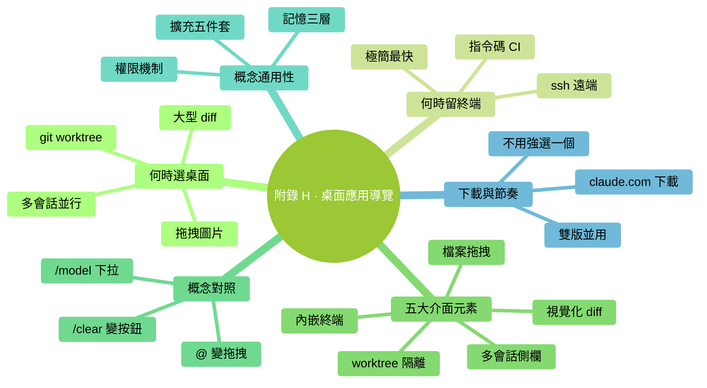

# 附錄 H：Claude Code 桌面應用簡明導覽

> **說明**：本書主講終端版 Claude Code。如果你嫌終端麻煩——**桌面應用**（2026-04 大改版）是同一引擎的圖形版本，核心能力完全通用。這份導覽讓你快速對號入座。

### 本章地圖（一眼看全貌）

<!-- diagram: MM-42 -->

---

## 什麼時候切桌面應用值

- **看多會話不方便**（終端只能一個視窗一個會話）
- **大型 diff 稽核**（圖形化的 diff 比終端強多了）
- **需要 git worktree 並行工作**（桌面應用原生支援）
- **截圖 / 圖片輸入頻繁**（圖形介面拖拽更順）
- **對純終端有牴觸** 但想要 Claude Code 能力

## 什麼時候終端版更好

- **追求極簡**（終端最快）
- **遠端伺服器 / ssh** 場景（桌面應用只在本機跑）
- **深度定製 hooks / pipe**
- **指令碼化 / CI 整合**（非互動模式）

---

## 桌面應用的五大介面元素

### 1. 多會話側欄

左側列表——**每個會話獨立 Ctx**。

好處：
- 給不同專案 / 任務開**多個會話**，互不干擾
- 切換隻需點一下，不用 `/exit` + `cd` + `claude`
- 每個會話顯示模型 / Ctx% / 名字

### 2. 視覺化 diff

Claude 要改檔案時——**左右兩欄圖形化 diff**，不是終端的 ASCII 版本。

好處：
- **顏色清晰**（刪除紅底、新增綠底）
- **行號對齊**
- **接受 / 拒絕按鈕**直接點（不用 y/n）

### 3. 內嵌終端

應用裡**內建一個終端**，隨時切。

好處：
- 不用開第二個 app
- 終端命令輸出也在同一視窗，方便對照

### 4. 拖拽面板 / 檔案瀏覽器

左側有 workspace 檔案樹，可以**拖檔案到 prompt**——自動 `@` 引用。

### 5. git worktree 隔離

高階功能——**讓 Claude 在獨立 git 分支的副本上工作**，不汙染你當前分支。

工作流程：
1. 建立 worktree（獨立副本）
2. Claude 在這個副本里改東西
3. 滿意 → merge 回主分支
4. 不滿意 → 扔掉副本，主分支毫髮無損

**比普通分支更隔離**——Claude 甚至不知道主分支存在。

---

## 概念對照表（終端 ↔ 桌面）

| 終端版 | 桌面應用對應 |
|-------|-----------|
| `claude` 啟動 | 點圖示啟動 |
| `/exit` | 關閉會話 tab |
| 新會話 | 點 "+ New Session" |
| `@檔案` | 拖檔案 / 點 @ 按鈕 |
| 看 Ctx% | 會話條顯示 |
| `/model` | 會話頂部模型下拉 |
| `/clear` | 點 Clear 按鈕 |
| `/rewind` | 點 Rewind 按鈕 / 點訊息左邊的小箭頭 |
| `/plan` | 模式切換按鈕 |

---

## 本書所有概念在桌面應用裡適用嗎？

**完全適用**：
- ✅ 三層記憶（CLAUDE.md / MEMORY.md / 會話）
- ✅ 權限機制（彈窗可能是圖形對話方塊，邏輯一樣）
- ✅ 信任校準 L1-L4
- ✅ 模型與成本
- ✅ Skills / Commands / Subagents / Hooks / MCP

**介面不同但概念一樣**：
- `@` 引用檔案 → 拖拽或點按鈕
- `/` 斜槓命令 → 大部分可用，或改用頂部按鈕

---

## 哪裡下載

官方：[claude.com/download](https://claude.com/download)

支援 Mac 和 Windows（桌面應用）。

## 一個建議的遷移節奏

**如果你已經用熟終端版**：
1. 裝桌面版
2. 開啟**同一個專案**
3. 做幾件和終端版一樣的事（讀檔案、改檔案、審 diff）
4. 對比哪邊你更順
5. **不用強迫選一個**——兩個可以並用

**如果你還沒用過終端版**：
- 終端版和桌面版**任選其一**開始都行
- 本書教的所有概念適用
- 實際上很多人**桌面版起步、終端版收尾**（熟了之後發現終端更快）

---

<!-- chapter-nav -->

📖  [← 附錄 G · 報錯自救手冊](G-報錯自救手冊.md)  ·  [📑 返回目錄](../../README.md)  ·  [附錄 I · 延伸閱讀 →](I-延伸閱讀.md)
