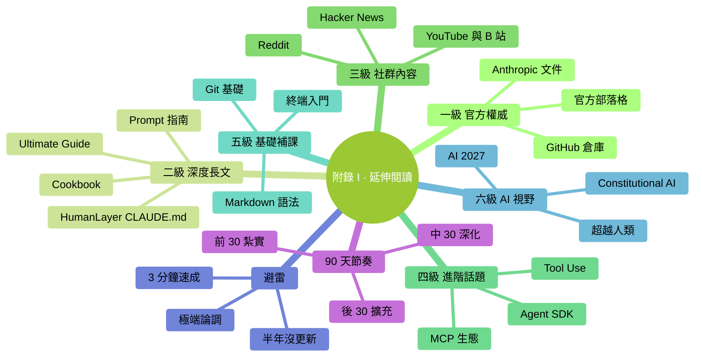

# 附錄 I：延伸閱讀

> 讀完本書後，值得進一步看的資料。**按優先順序排列**——先看前面的。

### 本章地圖（一眼看全貌）

<!-- diagram: MM-43 -->

## 一級：官方權威（最該看）

### 1. Anthropic 官方文件

- 地址：[docs.anthropic.com](https://docs.anthropic.com)
- 內容：Claude Code、API、prompt engineering 全套
- **最權威 + 更新最及時**
- 英文為主，瀏覽器翻譯能看懂

### 2. Claude Code GitHub 官方倉庫

- 搜 GitHub "claude-code" 找 Anthropic 官方
- **Issues / Discussions** 區有大量真實問題
- Changelog 跟蹤最新特性
- **裝完就加收藏**

### 3. Anthropic Blog

- 地址：[anthropic.com/news](https://www.anthropic.com/news)
- 產品大更新、研究進展、最佳實踐
- 每月 1 次瀏覽就好

---

## 二級：高質量長文（核心思想）

### 4. HumanLayer 的 CLAUDE.md 文章

- 搜 "HumanLayer CLAUDE.md"
- 本書 Ch 14（CLAUDE.md 最佳實踐）很多原則來自這裡
- 深度討論為什麼 CLAUDE.md 應該短、為什麼不用 `/init`

### 5. FlorianBruniaux 的 Claude Code Ultimate Guide

- GitHub 上的 `claude-code-ultimate-guide`（本書的靈感來源之一）
- 英文、面向有經驗的開發者
- 資訊密度極高，不適合零基礎，但**深度超過本書**

### 6. Anthropic Prompt Engineering Guide

- docs.anthropic.com 的 "Prompt engineering" 章節
- 官方最全的 prompt 技巧合集
- 學完本書後精進 prompt 必讀

### 7. Anthropic Cookbook

- GitHub `anthropics/anthropic-cookbook`
- 真實程式碼示例合集
- 覆蓋 API 呼叫、tool use、agent 等

---

## 三級：社群內容（獲取手感）

### 8. Reddit r/ClaudeAI

- 使用者社群
- 真實使用心得 / 技巧 / 踩坑
- **不要照單全收**——有時 karma 最高的不一定對

### 9. Hacker News

- 搜 "Claude" 關鍵詞
- 資深使用者討論
- 觀點獨到、也最冷峻

### 10. YouTube / B 站

- 關鍵詞："Claude Code"
- 影片教程**時效性強**——注意釋出時間（Claude Code 迭代快，半年前的影片可能過時）
- 中英文都有

---

## 四級：進階話題（有需求再看）

### 11. Agent SDK / Multi-Agent

- Anthropic Agent SDK 文件
- LangChain / LangGraph
- CrewAI、AutoGen、MetaGPT

**先問自己**：我真的需要多 agent 嗎？大多數場景 subagent 夠用。

### 12. MCP 生態

- MCP 官網：[modelcontextprotocol.io](https://modelcontextprotocol.io)
- GitHub `modelcontextprotocol/servers`（官方 MCP 集合）
- `awesome-mcp-servers`（社群集合）

### 13. Tool Use / Function Calling

- Anthropic 文件的 "Tool use" 章節
- 如何讓 AI 呼叫外部工具
- 想自己寫 Agent 必讀

---

## 五級：基礎知識補課（零基礎補充）

### 14. 終端 / 命令列入門

- Mac：Apple 官方 "Terminal User Guide"
- Windows：Microsoft Learn "PowerShell 快速入門"
- 本書附錄 A、B 也有速查

### 15. Git 基礎（如果你想更深入用 Claude Code 處理程式碼）

- [pro git](https://git-scm.com/book/zh/v2) 中文版線上免費
- 只需前 3 章（安裝、基礎、分支）

### 16. Markdown 語法

- CLAUDE.md / Skill / Command 都用 markdown
- [Markdown 語法速查](https://www.markdownguide.org/cheat-sheet/)（15 分鐘學完）

---

## 六級：AI 全景視野（大方向思考）

### 17. 《AI 2027》（非虛構報告）

- 關於 AI 未來 1-2 年的詳細推演
- 幫你理解"為什麼 Claude Code 這種工具會出現"

### 18. 《超越人類：AI 浪潮下我們如何生存》

- 非技術視角討論 AI 對工作 / 生活的影響
- 適合讀完本書覺得"我好像需要更大視野"時讀

### 19. Anthropic 的 Constitutional AI 論文

- 關於 Claude 為什麼比較"守規矩"的技術原理
- 學術向，但理解 AI 背後設計哲學有幫助

---

## 不推薦（避雷）

- **所有標題"Claude Code 終極速成"的 3 分鐘影片** —— 太淺
- **超過 6 個月沒更新的 GitHub 倉庫 / 教程** —— Claude Code 變化快
- **和你工作無關的炫技專案** —— 學了沒用
- **鼓吹"Claude 能代替程式設計師"** 或 **"AI 只是玩具"** 的極端內容 —— 都不對

---

## 一份推薦的 90 天學習節奏

### Day 1-30：基礎紮實

- 本書（優先） + 官方文件關鍵章節
- 30 天挑戰清單（Ch 27）
- 每天真實場景用

### Day 31-60：深化一個方向

- 選你最關心的一個（CLAUDE.md / Skills / MCP / prompt engineering / ...）
- 讀對應的深度資源（見上面二級、三級）
- 動手做 3-5 個實際專案

### Day 61-90：橫向擴充 + 分享

- 瞭解其他 AI 工具（Cursor、Windsurf、GPT、Gemini 等）
- 在團隊 / 社群分享你的經驗
- 開始嘗試更復雜場景（多 agent、MCP 定製、CI 整合等）

**90 天后**：你會是**身邊人裡最懂 Claude Code 的**。

---

**祝閱讀愉快，用得順手**。

> 本書作者：**馬力** · [@mali9527](https://github.com/mali9527)
> 版權所有 © 2026 馬力（Ma Li），以 [CC BY-NC-SA 4.0](../../LICENSE) 協議開源。轉載 / 翻譯 / 引用請保留本署名。

---

<!-- chapter-nav -->

📖  [← 附錄 H · 桌面應用導覽](H-桌面應用導覽.md)  ·  [📑 返回目錄](../../README.md)  ·  [附錄 J · Claude Opus 4.7 新手指南 →](J-Opus-4.7新手指南.md)
