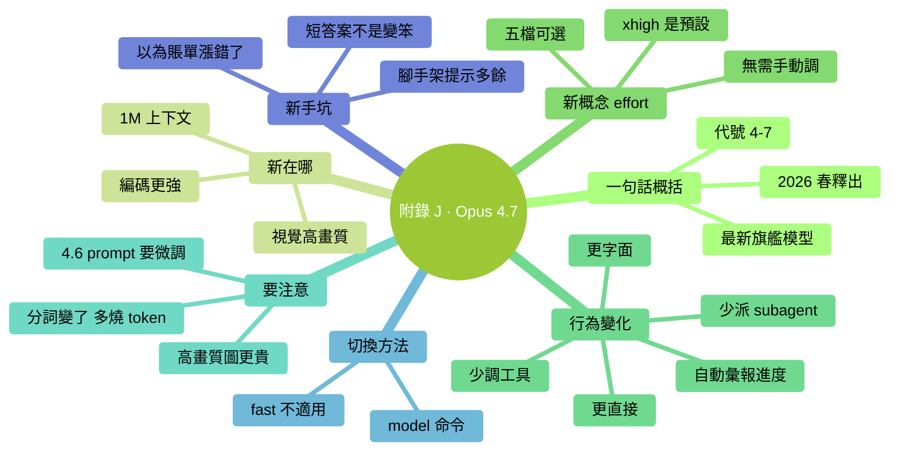

# 附錄 J：Claude Opus 4.7 新手指南

> **2026-04-16** Anthropic 釋出 **Claude Opus 4.7**，是當前 Claude Code 預設推薦使用的模型。本書預設以 Opus 4.7 為基線寫作。這一篇把 4.7 相對 Opus 4.6 的變化、行為差異、新概念、新手坑集中講一遍——**你只需要讀這一附錄，就能知道"Opus 4.7 到底帶來了什麼"**。

### 本章地圖（一眼看全貌）

<!-- diagram: MM-44 -->


---

## J.1 一句話概括 Opus 4.7

Anthropic 於 **2026 年 4 月 16 日** 釋出的旗艦模型，API 代號 `claude-opus-4-7`——**當前 Claude Code 在付費使用者那裡使用的預設 Opus 版本**。

它的定位：

- **當下最強的通用可用模型**（官方原話："our most capable generally available model"）
- 專門為**複雜編碼 + 長期自主工作 + 視覺理解** 場景最佳化
- 價格和 Opus 4.6 **相同**——升級不加價
- 原生支援 **100 萬 token 上下文**（1M），且**無長上下文溢價**

相比 Opus 4.6，它的核心變化可以歸成三句話：

1. **更聰明**——尤其是程式設計、視覺、長任務自主執行
2. **更直接**——回覆更短、更像工程師少客套、emoji 少
3. **更字面**——你說一，它就做一，不自作主張推廣到二

---

## J.2 你會直接感受到的差異

這一節給**從 Opus 4.6 切過來的人**。如果你是第一次用 Claude Code，可以跳到 J.3。

### 差異 1：回答變短了

4.7 **根據任務複雜度動態調整回覆長度**——簡單問題給簡短答案，不再"I'd be happy to help you..."開場。

❌ 別誤以為：AI 是不是變笨了 / 是不是罷工了
✅ 正確理解：這就是新版本的預設風格

### 差異 2：更"照字面辦事"

例子：你說"把 `user.email` 欄位改成 `user.contact_email`"。

- **4.6 行為**：可能順手把鄰近的 `user.phone` 也重新命名成 `user.contact_phone`（它覺得"你大概想統一"）
- **4.7 行為**：只改你說的那一個欄位。如果要連帶別的，**你得明說**

### 差異 3：預設調更少工具、派更少 subagent

4.7 會**更多用推理，更少用工具呼叫**。如果你之前習慣讓它"讀 10 個檔案再判斷"，現在可能只讀 3 個它就開始下結論。

**應對**：需要它一次並行讀多檔案時明確說——
> "請同時讀取 `src/auth/*.py` 裡所有檔案後再判斷"

### 差異 4：長任務中會主動彙報進度

以前（4.6）你得問"現在到哪一步了"，4.7 會**自己在合適的節點告訴你**。如果你之前在 CLAUDE.md / prompt 里加過"每完成一步告訴我"，可以試著**拿掉**看看還需不需要。

### 差異 5：同樣一段話，可能多燒 35% token

**4.7 用了新分詞器**——同樣的中文或程式碼內容，可能用 **1.0~1.35 倍** 的 token（最多多 35%）。

這不是 bug，是設計上的權衡（新分詞器對模型能力有幫助）。但**月賬單可能因此上漲**——見 J.6 坑 3。

---

## J.3 新概念：effort 檔位

Opus 4.7 引入了 **5 檔 effort**（思考投入檔位），在"聰明 vs 成本/速度"之間切換：

| 檔位 | 速度 | 智力 | 適合 |
|------|-----|-----|------|
| `low` | 最快 | 一般 | 成本敏感、簡單批次 |
| `medium` | 快 | 中等 | 日常輕量問題 |
| `high` | 中 | 強 | 併發多會話、想省一點 |
| **`xhigh`** | 中慢 | **很強** | **Claude Code 官方預設** |
| `max` | 慢 | 最強 | 極難問題（可能過度思考，建議剋制使用） |

### 對零基礎最重要的一句話

**你不用手動調。** Claude Code 已經把 Opus 4.7 的預設檔位設成 `xhigh`——這是官方推薦的最佳值。

> 💡 只有在你用 Anthropic API 直接寫程式碼（見 Ch 26）時，effort 才是你要關心的 API 引數。Claude Code 使用者保持預設即可。

---

## J.4 在 Claude Code 裡用 Opus 4.7

### 切到 Opus 4.7

和 Ch 15 講的 `/model` 命令完全一致：

```
/model
```

在彈出的選單裡選 **Claude Opus 4.7**（或者你看到的版本號可能顯示成 "Opus" 簡寫）。

### 現在預設就是 4.7 了嗎？

- **2026-04-23 起**，Enterprise 和 API 使用者的預設 Claude Code 模型切到 Opus 4.7
- Pro / Max 訂閱使用者在 `/model` 選單裡點 "Opus" 時，指向的就是 4.7

你可以隨時 `/model` 看當前是哪個版本——**如果顯示 Opus 4.7，就是它**。

### `/fast` 在 4.7 下失效了

Claude Code 的 `/fast`（快速模式）**是 Opus 4.6 專用的加速通路**——Anthropic 透過更快的伺服器路徑響應請求。

切到 Opus 4.7 後：

- `/fast` 不起作用或不顯示（取決於具體 Claude Code 版本）
- 這不是 bug，是正常行為
- **如果你非常在意響應速度**，可以回切 Opus 4.6 + `/fast`

### 1M 上下文——該用嗎？

Opus 4.7 原生支援 100 萬 token 上下文（5 倍於傳統 200K）。好訊息：**按標準 API 價格，沒有長上下文溢價**。

但——上下文越長，**每輪輸入越燒 token**。除非你真的需要（比如讓它讀整個大型程式碼庫），**日常用預設上下文就夠**（見 Ch 12 講上下文原理）。

---

## J.5 prompt 寫法的幾個微調

如果你之前用過 4.6（或抄過 4.6 的教程），4.7 下可以試試這幾個調整：

### 調整 1：第一輪就說清楚

官方推薦"把 Claude 當作受委託的工程師"——意圖、約束、驗收標準、檔案路徑一次性給全。這和 Ch 19（輸入技巧）講的 **WHAT / WHERE / HOW / VERIFY** 模板完全一致。

### 調整 2：要更深思熟慮時顯式要求

```
Think carefully and step-by-step before responding; this problem is harder than it looks.
```

（中文等效："**請仔細、一步一步地思考再回答；這個問題比看起來更難**"）

### 調整 3：要快速響應時也顯式要求

```
Prioritize responding quickly rather than thinking deeply.
```

（中文等效："**優先快速回復，不必深度思考**"）

### 調整 4：需要並行子任務時明確說

4.7 預設會派更少 subagent。如果你明確需要並行——

> "請在同一輪內啟動多個 subagent 分別處理這些檔案"

### 調整 5：把 4.6 的"腳手架提醒"拿掉

- "記得檢查一下幻燈片佈局"
- "記得複審一下程式碼"
- "輸出前請確認格式正確"

這類加在 prompt 末尾的提醒，給 4.7 可能**多餘**——它預設就會做這些。**試著去掉**，看質量是否還穩。如果沒降，以後就不用寫了。

---

## J.6 新手最容易踩的 5 個坑

### 坑 1：以為回答短就是 AI 變笨

**事實**：4.7 的簡短回答是**主動設計**——任務簡單就不寫長文。

**別做**：反覆"你能詳細說說嗎 / 多舉幾個例子嗎"——除非你真的需要。

### 坑 2：沿用 4.6 的 prompt 感覺"變味了"

你熟悉的某個 4.6 prompt 在 4.7 下結果不對勁？可能是因為：

- 4.7 更字面，不會自作主張泛化
- 4.7 預設少調工具/少派 subagent
- 以前"隱含"的指令，現在要顯式寫

**解法**：把指令拆得更明確 + 把驗收標準寫出來。

### 坑 3：賬單突然漲了——兩個原因疊加

- **分詞器換了**：同文本可能多 1.0~1.35 倍 token
- **預設檔位 `xhigh`**：比 4.6 的預設更高檔

**如果成本敏感**，兩種辦法：

1. 切回 Sonnet 4.6 做日常任務（見 Ch 15 的選型建議）
2. API 模式下可手動把 effort 調成 `high`（Claude Code 使用者一般不需要）

### 坑 4：粘高畫質截圖一次燒幾千 token

Opus 4.7 最大支援 **2576px（≈3.75MP）** 的影像（舊版只到 1568px）。清晰度大升級，但**單張高畫質圖消耗成倍增長**。

**建議**：

- 截圖先壓縮到 1000~1500px（一般夠用）
- 只有在需要 OCR、看清設計稿細節、驗證畫素級內容時用高畫質原圖

### 坑 5：`/fast` 找不到了，以為功能被刪了

如前所述，`/fast` 是 **Opus 4.6 的快速通路**。切到 4.7 後它不起作用是正常的。

**如果你特別想要 `/fast`**：回切 Opus 4.6（`/model` → Opus 4.6）。

---

## J.7 什麼時候該用 Opus 4.7？

這一節是 Ch 15（模型與成本）"選型原則"的 4.7 補丁版：

| 場景 | 推薦 |
|------|------|
| 複雜重構、架構設計、長任務（30 min+）自主執行 | **Opus 4.7（預設 xhigh）** |
| 看截圖 / 分析設計稿 / 看清圖表細節 / OCR | **Opus 4.7**（視覺升級最大） |
| 需要跨很多檔案的程式碼審查 | **Opus 4.7** |
| 日常檔案讀寫、寫文件草稿、普通修改 | **Sonnet 4.6 夠用**（便宜 + 快） |
| 簡單批次任務（改格式、翻譯、速查） | **Haiku 4.5**（最便宜） |

**90% 使用者的經驗法則**：

- **預設 Sonnet 4.6**——成本和速度的甜區
- **複雜任務切 Opus 4.7**——深度推理一次值回票價
- **超簡單的切 Haiku**——不要浪費

---

## J.8 官方權威資源

以下是學完本附錄後可以深入讀的官方原文（優先順序從高到低）：

1. **釋出公告**（瀏覽 5 分鐘）：[anthropic.com/news/claude-opus-4-7](https://www.anthropic.com/news/claude-opus-4-7)
2. **Opus 4.7 Claude Code 最佳實踐**（核心 + 實用，瀏覽 15 分鐘）：[claude.com/blog/best-practices-for-using-claude-opus-4-7-with-claude-code](https://claude.com/blog/best-practices-for-using-claude-opus-4-7-with-claude-code)
3. **新特性完整清單**：[platform.claude.com/docs/en/about-claude/models/whats-new-claude-4-7](https://platform.claude.com/docs/en/about-claude/models/whats-new-claude-4-7)
4. **4.6 → 4.7 遷移指南**：[platform.claude.com/docs/en/about-claude/models/migration-guide](https://platform.claude.com/docs/en/about-claude/models/migration-guide)
5. **effort 檔位官方建議**：[platform.claude.com/docs/en/build-with-claude/effort](https://platform.claude.com/docs/en/build-with-claude/effort)

---

## 本節小結

- Opus 4.7 是 **2026-04-16 釋出的旗艦模型**，Claude Code 預設推薦
- 相比 4.6：**更聰明、更直接、更字面**，但**分詞器換了，會多燒 10~35% token**
- 新增 5 檔 **effort**（low / medium / high / **xhigh（預設）** / max），Claude Code 使用者**不用手動調**
- `/model` 切換、`/fast` 只對 4.6 有效
- 4.6 的 prompt 在 4.7 下可能需要**寫更明確 + 去掉腳手架提醒**
- 視覺升級最大（支援 2576px），適合看截圖 / 設計稿——但燒 token
- 成本敏感**回切 Sonnet 4.6** 或 **Haiku 4.5** 沒有任何問題

---

> 本附錄隨 Anthropic 新版本釋出持續更新。
> **任何時候想知道當前用的哪個版本**：在 Claude Code 裡敲 `/model`。
>
> 如果未來出現 Opus 4.8 / 5.x，本附錄會第一時間補寫差異。


---

<!-- chapter-nav -->

📖  [← 附錄 I · 延伸閱讀](I-延伸閱讀.md)  ·  [📑 返回目錄](../../README.md)  ·  [附錄 K · 接入第三方模型 →](K-第三方模型接入.md)
