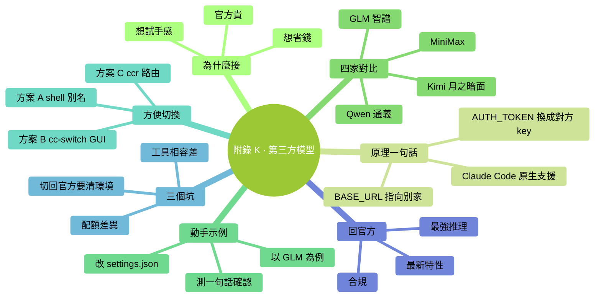

# 附錄 K：接入第三方模型（GLM / 通義 / Kimi / MiniMax）

> Claude Code 是 Anthropic 的官方客戶端，但它**不是只能連 Claude 模型**。因為它接入方式是標準的 Anthropic Messages API，任何提供這個協議的服務商都能當後端——國內主流的 **GLM / 通義千問 / Kimi / MiniMax** 都已經官方相容。這意味著：你可以把 Claude Code 的順手體驗，配上國產模型的價格。這一篇講**怎麼接入、怎麼切換**——實用為主，不挖太深。

### 本章地圖（一眼看全貌）

<!-- diagram: MM-45 -->


---

## K.1 為什麼你可能會想接

**一句話**：Claude 貴，國產便宜一大截，體驗幾乎一樣。

具體對比（2026 年 4 月的公開報價，僅供參考）：

| 模型 | 輸入 ¥/M token | 輸出 ¥/M token | 備註 |
|---|---|---|---|
| Claude Sonnet 4.6 | ≈ $3 | ≈ $15 | 官方基準 |
| GLM-4.7 | 包月套餐 ≈ $3 起 | 同 | "GLM Coding Plan"訂閱制 |
| Qwen3-Coder | 按量，遠低於 Claude | 同 | 阿里雲百鍊平臺 |
| Kimi K2.6 | $0.60 | $2.50 | 月之暗面，比 Sonnet 便宜 5-6× |
| MiniMax M2.7 | $0.30 | $1.20 | 比 Sonnet 便宜 ~90% |

常見三種觸發場景：
- 官方配額用完了，月底前想接著幹活
- 日常任務（改個註釋、生成測試、翻譯）其實用國產就夠了，想省著點
- 想親自感受一下"國產模型在 coding 場景上到底怎麼樣"

---

## K.2 原理：一行 URL 的事

Claude Code 原生就認兩個環境變數：

- `ANTHROPIC_BASE_URL`——把"預設指向 Anthropic"換成"指向別家"
- `ANTHROPIC_AUTH_TOKEN`——把 Anthropic API Key 換成對方的

**就這兩行**。Claude Code 不會問你"到底連的是誰"，它只管按 Anthropic Messages API 發請求，對方按協議回就行。

> 為什麼國產能接？因為 GLM / 通義 / Kimi / MiniMax 四家**都官方提供了 Anthropic 相容端點**。這不是社群 hack，是廠商主動做的——他們知道 Claude Code 的入口價值。

---

## K.3 四家主力一張表

| 服務商 | `ANTHROPIC_BASE_URL` | 推薦模型（2026-04） | 拿 API Key |
|---|---|---|---|
| **智譜 GLM** | `https://api.z.ai/api/anthropic` | `glm-4.7` | [z.ai/model-api](https://z.ai/model-api) |
| **通義千問** | `https://dashscope-intl.aliyuncs.com/api/v2/apps/claude-code-proxy` | `qwen3-coder-plus` | [阿里雲百鍊](https://bailian.console.aliyun.com) |
| **Kimi（月之暗面）** | `https://api.moonshot.ai/anthropic` | `kimi-k2-turbo-preview` | [platform.moonshot.ai](https://platform.moonshot.ai) |
| **MiniMax（國際）** | `https://api.minimax.io/anthropic` | `MiniMax-M2` | [platform.minimax.io](https://platform.minimax.io) |
| **MiniMax（國內）** | `https://api.minimaxi.com/anthropic` | `MiniMax-M2` | [platform.minimaxi.com](https://platform.minimaxi.com) |

> "推薦模型"是各家當下 coding 場景的主力。各家都在快速迭代，具體以官方文件為準。

---

## K.4 動手接一下（以 GLM 為例）

以 **GLM** 為例走一遍，其他三家是同樣流程、只換 URL + Key。

**第 1 步**：去 [z.ai/model-api](https://z.ai/model-api) 註冊賬號，進"API Keys"頁，建立一個 Key，複製下來（形如 `<YOUR_ZAI_KEY>`）。

**第 2 步**：開啟你的 Claude Code 全域性配置 `~/.claude/settings.json`（沒有就新建），加一段 `env`：

```json
{
  "env": {
    "ANTHROPIC_BASE_URL": "https://api.z.ai/api/anthropic",
    "ANTHROPIC_AUTH_TOKEN": "<貼上你的 GLM Key>",
    "ANTHROPIC_DEFAULT_SONNET_MODEL": "glm-4.7",
    "ANTHROPIC_DEFAULT_OPUS_MODEL": "glm-4.7",
    "ANTHROPIC_DEFAULT_HAIKU_MODEL": "glm-4.5-air"
  }
}
```

> 最後三行是把 Claude 內部的 Haiku/Sonnet/Opus 三個 tier，分別對映到 GLM 的哪個模型。**不改也行**——廠商都有預設對映——但顯式寫出來更放心。

**第 3 步**：重啟 Claude Code（退出再進）。隨便問一句：

```
你現在連的是哪個後端？回我一句就行。
```

**預期**：回覆會顯示"我是 GLM-4.7"或類似提示——說明接上了。

**第 4 步**（可選）：驗證能正常讀檔案、跑命令。讓它讀 README 前 10 行並總結，測一下工具呼叫是否正常。

---

## K.5 其他三家的配置

通義、Kimi、MiniMax 三家，配法和上面完全一樣——**只換 `ANTHROPIC_BASE_URL`、`ANTHROPIC_AUTH_TOKEN`、三個模型名**（參考 K.3 的表）。

---

## K.6 怎麼"方便地切換"

一個 `settings.json` 只能配一家。但你大機率要在"Claude 官方 / 國產便宜檔"之間來回切。三種方案，按懶的程度排：

### 方案 A：shell 別名 + 多份配置（最樸素）

把 settings.json 複製三份：`settings.claude.json`、`settings.glm.json`、`settings.kimi.json`，放在 `~/.claude/` 下。

在 `~/.zshrc` 或 `~/.bashrc` 里加：

```bash
alias cc-claude='cp ~/.claude/settings.claude.json ~/.claude/settings.json'
alias cc-glm='cp ~/.claude/settings.glm.json ~/.claude/settings.json'
alias cc-kimi='cp ~/.claude/settings.kimi.json ~/.claude/settings.json'
```

用之前敲一下對應別名，再啟動 `claude`。**零依賴、永遠不會壞**。

### 方案 B：cc-switch（圖形介面）

[cc-switch](https://github.com/farion1231/cc-switch)——開源桌面工具，選單欄裡掛著，點一下換配置。適合不喜歡命令列配來配去的人。

裝好後新增每家的配置（BASE_URL + Key + 預設模型），下次要換後端直接在選單欄點一下。

### 方案 C：claude-code-router（按場景自動路由）

[claude-code-router](https://github.com/musistudio/claude-code-router)（簡稱 `ccr`）——一個本地代理。用它你可以定規則：**預設 Claude Sonnet；程式碼生成用 GLM；長對話用 Kimi**——按 prompt 特徵自動挑模型。

適合：**一天內密集用幾家、想省事也想省錢**的進階使用者。新手建議先用方案 A 熟悉原理。

---

## K.7 三個真·新手坑

**坑 1：請求配額（RPM / TPM）差異大**

Claude 官方的 rate limit 對日常用是松的。國產有些平臺免費 tier 限制比較嚴——比如每分鐘 2 次請求、每分鐘 20k token。遇到 429 報錯去服務商控制台看當前檔。

**坑 2：工具呼叫 / 提示快取相容度參差**

所有四家都"相容 Anthropic 協議"，但協議裡的**細枝末節**（比如 `anthropic-beta` header、prompt caching、併發 tool_use、超長 thinking）——相容程度不一樣。

你在 Claude 上跑得很順的複雜任務，切到國產有時會報 tool_use 異常 / 上下文截斷。**碰到就切回官方看是不是後端問題**，別怪自己 prompt 寫錯了。

**坑 3：切回 Claude 官方，記得清環境**

設過 `ANTHROPIC_BASE_URL` 後，如果你只是**刪掉 settings.json 的 env 段**，有些情況下還有殘留（shell 環境變數優先順序更高）。如果回官方還連不上：

```bash
unset ANTHROPIC_BASE_URL
unset ANTHROPIC_AUTH_TOKEN
echo $ANTHROPIC_BASE_URL  # 確認是空的
claude  # 再啟動
```

---

## K.8 什麼時候該回 Claude 官方

國產便宜，但**不是所有場景都適合**。下面三種情況建議回官方：

- **需要最新能力**——比如本書附錄 J 講的 Opus 4.7、effort 檔位、1M 上下文、adaptive thinking。國產目前還沒有等價產品。
- **極長 / 極複雜任務鏈**——幾十次連續工具呼叫、跨檔案深度重構、多 subagent 協作。Claude 在長工具鏈穩定性上依然領先。
- **企業合規 / 資料策略有要求**——有些公司只允許走 Anthropic / Bedrock / Vertex 合規通道。這種場景別自作主張切後端。

---

## 小結：三條最實用的結論

1. **Claude Code 連什麼模型**只是一個 `ANTHROPIC_BASE_URL` 的事，不是魔法
2. **日常任務先用國產**能省 80%+ 成本，複雜任務再回 Claude——一臺機器跑兩檔，最划算
3. **切換方案按你懶的程度挑**：方案 A shell 別名夠 90% 的人用；圖形黨用 cc-switch；想搞"一天多家自動路由"再折騰 ccr


---

<!-- chapter-nav -->

📖  [← 附錄 J · Claude Opus 4.7 新手指南](J-Opus-4.7新手指南.md)  ·  [📑 返回目錄](../../README.md)  ·  （全書完）
